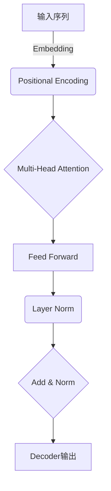
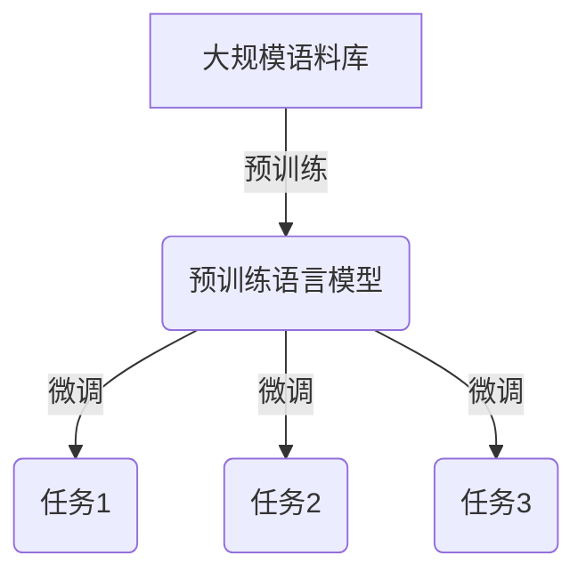

# 从GPT到ChatGPT

## 1. 背景介绍

### 1.1 人工智能的发展历程

人工智能(Artificial Intelligence, AI)是当代科技发展的前沿领域之一,旨在创建出能够模拟人类智能的机器系统。自20世纪50年代人工智能概念被正式提出以来,经历了几个重要的发展阶段。

- **第一次AI热潮(1956-1974年)**: 人工智能作为一个独立的学科被正式确立,涌现出逻辑推理、机器学习、计算机视觉等基础理论和方法。
- **第一次AI寒冬(1974-1980年)**: 由于计算能力有限、缺乏足够的训练数据等原因,人工智能研究进入停滞期。
- **第二次AI热潮(1980-1987年)**: 专家系统、神经网络等新技术的出现,推动了人工智能的发展。
- **第二次AI寒冬(1987-1993年)**: 人工智能系统难以解决实际复杂问题,研究资金短缺,再次进入低谷期。
- **第三次AI热潮(1993至今)**: 大数据、深度学习、GPU计算等新技术的兴起,使得人工智能取得了突破性进展。

### 1.2 自然语言处理(NLP)的重要性

自然语言处理(Natural Language Processing, NLP)是人工智能的重要分支,旨在使计算机能够理解和生成人类语言。随着互联网和移动设备的普及,NLP技术在智能助手、机器翻译、文本挖掘等领域发挥着越来越重要的作用。

### 1.3 GPT与ChatGPT的诞生

在第三次AI热潮中,transformer模型和大规模预训练语言模型的出现,为NLP领域带来了革命性的进展。2018年,OpenAI发布了GPT(Generative Pre-trained Transformer)模型,首次展示了大型语言模型在多种NLP任务上的强大能力。2022年11月,OpenAI再次推出了ChatGPT,一种基于GPT-3.5架构的对话式AI助手,引起了全球关注和热议。

## 2. 核心概念与联系

### 2.1 Transformer模型

Transformer是一种全新的基于注意力机制(Attention Mechanism)的神经网络架构,可以有效捕捉序列数据中的长程依赖关系。与传统的循环神经网络(RNN)相比,Transformer具有并行计算的优势,能够更好地利用GPU等硬件资源进行训练。



### 2.2 预训练语言模型

预训练语言模型(Pre-trained Language Model, PLM)是一种先在大规模无标注语料库上进行预训练,再在特定任务上进行微调的范式。这种方法可以有效地捕获语言的通用知识,并将其迁移到下游任务中,大幅提高了模型的性能和泛化能力。



### 2.3 GPT与ChatGPT

GPT(Generative Pre-trained Transformer)是OpenAI基于Transformer架构训练的一系列大型语言模型。GPT-1(2018年)首次展示了大型语言模型在多种NLP任务上的强大能力。GPT-2(2019年)进一步扩大了模型规模,并探讨了语言模型的潜在风险。GPT-3(2020年)是迄今为止最大的语言模型,包含1750亿个参数,展现出惊人的文本生成能力。

ChatGPT是基于GPT-3.5架构训练的对话式AI助手,在自然语言理解、多轮对话、知识推理等方面表现出色。它能够根据上下文生成连贯、有见地的回复,并在一定程度上具备常识推理和因果推理能力。

## 3. 核心算法原理具体操作步骤

### 3.1 Transformer编码器(Encoder)

Transformer编码器的核心是Multi-Head Attention机制,它能够捕捉输入序列中的长程依赖关系。具体操作步骤如下:

1. 对输入序列进行Embedding和Positional Encoding,将其映射到向量空间。
2. 计算Query、Key和Value矩阵,它们分别用于计算注意力权重、注意力值和值的线性变换。
3. 进行Multi-Head Attention计算,得到每个位置关注其他位置的注意力分数。
4. 对注意力分数进行softmax归一化,得到注意力权重。
5. 将注意力权重与Value矩阵相乘,得到加权和表示。
6. 对加权和表示进行线性变换和层归一化,得到编码器的输出。

### 3.2 Transformer解码器(Decoder)

Transformer解码器在编码器的基础上,增加了Masked Multi-Head Attention机制,用于处理序列到序列的生成任务。具体操作步骤如下:

1. 对目标序列进行Embedding和Positional Encoding。
2. 进行Masked Multi-Head Attention计算,预测当前位置的词只能关注之前的位置。
3. 进行Multi-Head Attention计算,将解码器的输出与编码器的输出进行注意力计算。
4. 进行前馈神经网络(Feed Forward Network)计算,对注意力输出进行线性变换。
5. 对前馈网络的输出进行层归一化,得到解码器的输出。
6. 将解码器的输出输入到分类器(Classifier),预测下一个词的概率分布。

### 3.3 GPT的训练过程

GPT采用了自回归语言模型(Autoregressive Language Model)的训练方式,目标是最大化下一个词的条件概率。具体步骤如下:

1. 从大规模语料库中采样一个长度为n的序列$X = (x_1, x_2, ..., x_n)$。
2. 将序列$X$输入到GPT模型,得到每个位置的词的概率分布$P(x_i|x_1, ..., x_{i-1})$。
3. 计算序列$X$的损失函数(一般为交叉熵损失)。
4. 使用梯度下降算法,反向传播更新GPT模型的参数。
5. 重复上述过程,直到模型收敛或达到指定的训练步数。

通过上述无监督的预训练过程,GPT模型能够捕获语言的统计规律和语义知识,为下游任务的微调奠定基础。

## 4. 数学模型和公式详细讲解举例说明

### 4.1 Self-Attention机制

Self-Attention是Transformer模型的核心机制,它能够捕捉序列中任意两个位置之间的依赖关系。给定一个长度为$n$的序列$X = (x_1, x_2, ..., x_n)$,Self-Attention的计算过程如下:

1. 将序列$X$分别线性映射到Query、Key和Value矩阵:

$$
\begin{aligned}
Q &= XW^Q\\
K &= XW^K\\
V &= XW^V
\end{aligned}
$$

其中$W^Q, W^K, W^V$分别是可学习的权重矩阵。

2. 计算Query与Key的点积,得到注意力分数矩阵:

$$
\text{Attention}(Q, K, V) = \text{softmax}\left(\frac{QK^T}{\sqrt{d_k}}\right)V
$$

其中$d_k$是缩放因子,用于防止内积过大导致梯度消失。

3. 对注意力分数矩阵进行行归一化(softmax操作),得到注意力权重矩阵。
4. 将注意力权重矩阵与Value矩阵相乘,得到加权和表示。

Self-Attention机制能够自动捕捉序列中任意两个位置之间的依赖关系,是Transformer模型取得巨大成功的关键所在。

### 4.2 Multi-Head Attention

Multi-Head Attention是Self-Attention的扩展版本,它将注意力机制分成多个子空间,分别进行注意力计算,最后将结果拼接起来。具体计算过程如下:

1. 将Query、Key和Value矩阵分别线性映射到$h$个子空间:

$$
\begin{aligned}
\text{head}_i &= \text{Attention}(QW_i^Q, KW_i^K, VW_i^V)\\
\text{MultiHead}(Q, K, V) &= \text{Concat}(\text{head}_1, ..., \text{head}_h)W^O
\end{aligned}
$$

其中$W_i^Q, W_i^K, W_i^V$和$W^O$都是可学习的权重矩阵。

2. 对每个子空间的注意力输出进行拼接,并经过一个线性变换得到最终的Multi-Head Attention输出。

Multi-Head Attention能够从不同的子空间捕捉序列的不同依赖关系,提高了模型的表示能力。

### 4.3 GPT的损失函数

GPT采用了自回归语言模型的训练方式,目标是最大化下一个词的条件概率。给定一个长度为$n$的序列$X = (x_1, x_2, ..., x_n)$,GPT的损失函数定义为:

$$
L = -\sum_{i=1}^n \log P(x_i|x_1, ..., x_{i-1}; \theta)
$$

其中$\theta$是GPT模型的参数。

在实际训练中,通常会采用教师强制(Teacher Forcing)策略,即在预测第$i$个词时,将前$i-1$个词作为输入,而不是使用模型自己预测的词。这种策略能够加快训练收敛,但也可能导致exposure bias问题。

为了缓解exposure bias,GPT的训练过程中还会采用序列级别的损失函数,如序列级交叉熵损失(Sequence Cross-Entropy Loss)等。

## 5. 项目实践:代码实例和详细解释说明

以下是一个使用PyTorch实现Transformer编码器的简单示例:

```python
import torch
import torch.nn as nn

class TransformerEncoder(nn.Module):
    def __init__(self, input_dim, hid_dim, n_heads, n_layers, dropout):
        super().__init__()

        self.tok_embedding = nn.Embedding(input_dim, hid_dim)
        self.pos_embedding = nn.Embedding(1000, hid_dim)
        
        self.layers = nn.ModuleList([TransformerEncoderLayer(hid_dim, n_heads, hid_dim*2, dropout) 
                                     for _ in range(n_layers)])
        
        self.dropout = nn.Dropout(dropout)
        
    def forward(self, src, src_mask):
        
        #src = [batch_size, src_len]
        
        batch_size = src.shape[0]
        src_len = src.shape[1]
        
        #create position tensor
        pos = torch.arange(0, src_len).unsqueeze(0).repeat(batch_size, 1).to(src.device)
        
        #embed tokens and positions
        tok_embedded = self.tok_embedding(src)
        pos_embedded = self.pos_embedding(pos)
        
        #combine embeddings by summing
        embedded = self.dropout(tok_embedded + pos_embedded)
        
        #compute masks
        src_padding_mask = src.eq(0)
        
        for layer in self.layers:
            embedded = layer(embedded, src_mask=src_mask, src_key_padding_mask=src_padding_mask)
            
        #embedded = [batch_size, src_len, hid_dim]
            
        return embedded
```

上述代码实现了Transformer编码器的核心功能,包括Token Embedding、Positional Encoding、Multi-Head Attention和前馈神经网络等。值得注意的是:

1. `TransformerEncoder`模块包含一个Token Embedding层、一个Positional Encoding层和多个`TransformerEncoderLayer`层。
2. `TransformerEncoderLayer`是Transformer编码器层的实现,包含两个子层:Multi-Head Attention和前馈神经网络。
3. `forward`函数首先计算Token Embedding和Positional Encoding,并将它们相加得到输入的嵌入表示。
4. 然后,嵌入表示通过一系列`TransformerEncoderLayer`层进行处理,每一层都会应用Multi-Head Attention和前馈神经网络操作。
5. 最后,编码器的输出是经过所有层处理后的嵌入表示。

通过上述代码示例,我们可以更好地理解Transformer编码器的工作原理和实现细节。

## 6. 实际应用场景

### 6.1 智能对话系统

ChatGPT作为一种对话式AI助手,能够与人类进行自然、流畅的对话交互。它可以应用于各种场景,如:

- 