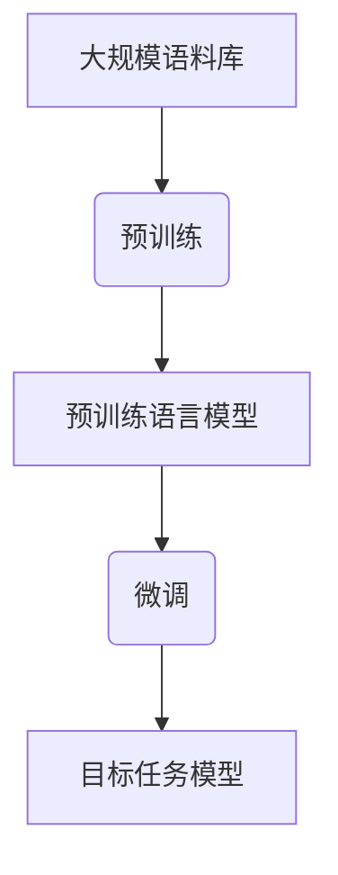
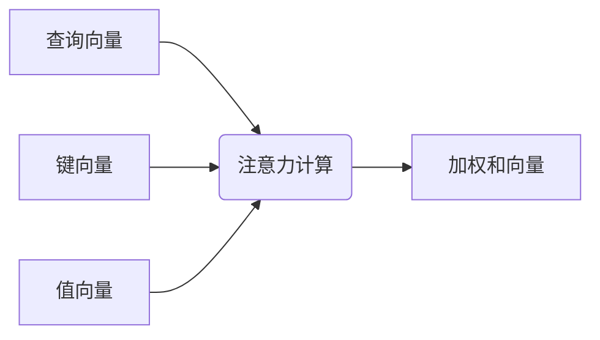

# 从关键概念到应用：深入了解大规模语言模型（LLM）

## 1.背景介绍

### 1.1 语言模型的重要性

语言是人类交流和表达思想的重要工具。随着人工智能技术的快速发展,自然语言处理(NLP)领域取得了长足进步,其中语言模型扮演着关键角色。语言模型旨在学习和捕捉人类语言的统计规律,为下游任务提供有力支持。

### 1.2 大规模语言模型(LLM)的兴起

传统的语言模型通常基于统计方法或浅层神经网络,其表现能力受到严重限制。随着深度学习技术的兴起,研究人员开始探索利用大规模神经网络来构建语言模型。这种新型语言模型被称为大规模语言模型(Large Language Model, LLM),具有参数量巨大、训练数据规模庞大的特点。

### 1.3 LLM的重要意义

大规模语言模型展现出了令人惊叹的语言理解和生成能力,在多个自然语言处理任务上取得了突破性进展。它们不仅能够完成传统的文本生成、机器翻译等任务,还能够回答开放性问题、进行推理和决策等高级认知功能。LLM被视为通用人工智能(AGI)的重要里程碑,对于推动人工智能技术的发展具有重大意义。

## 2.核心概念与联系

### 2.1 自回归语言模型

大规模语言模型通常采用自回归(Autoregressive)架构,即模型根据前面的词来预测下一个词。这种架构能够很好地捕捉语言的顺序性和上下文信息。常见的自回归模型包括:

- **RNN(Recurrent Neural Network,循环神经网络)**: 利用循环结构对序列数据建模。
- **LSTM(Long Short-Term Memory,长短期记忆网络)**: 改进的RNN,能够更好地捕捉长期依赖关系。
- **Transformer(变换器)**: 基于注意力机制的序列建模架构,在许多任务上表现优异。


### 2.2 预训练与微调

大规模语言模型通常采用两阶段训练策略:

1. **预训练(Pretraining)**: 在大规模无标注语料库上进行自监督学习,获得通用的语言表示能力。
2. **微调(Finetuning)**: 将预训练模型在特定任务的标注数据上进行进一步调整,使其适应目标任务。

预训练和微调的分离使得大规模语言模型可以在通用语料库上学习丰富的语言知识,并在下游任务中快速收敛,提高了训练效率和泛化性能。



### 2.3 注意力机制

注意力机制是大规模语言模型中的关键创新,它允许模型动态地关注输入序列中的不同部分,捕捉长距离依赖关系。Transformer模型中的多头注意力机制尤其成功,它将注意力分布在多个子空间中,提高了模型的表示能力。



### 2.4 模型规模

大规模语言模型的"大规模"体现在两个方面:参数量巨大和训练数据规模庞大。例如,GPT-3模型拥有1750亿个参数,训练语料库高达几百GB。大规模模型能够捕捉更丰富的语言现象,但也带来了更高的计算开销和存储需求。

## 3.核心算法原理具体操作步骤

大规模语言模型的训练过程可以分为以下几个关键步骤:

### 3.1 数据预处理

1. **语料库构建**: 从网络、书籍、维基百科等多种来源收集大规模无标注语料库。
2. **数据清洗**: 去除语料库中的噪声数据,如HTML标签、垃圾信息等。
3. **词元化(Tokenization)**: 将文本切分为词元(token)序列,作为模型的输入。
4. **子词分词(Subword Segmentation)**: 采用字节对编码(BPE)等算法将词元进一步分割为子词,处理未见词元。

### 3.2 模型构建

1. **嵌入层(Embedding Layer)**: 将词元映射为连续的向量表示。
2. **编码器/解码器(Encoder/Decoder)**: 构建基于自注意力或卷积的编码器和解码器网络。
3. **位置编码(Positional Encoding)**: 注入序列位置信息,让模型能够捕捉词序关系。
4. **层归一化(Layer Normalization)**: 加速训练收敛,提高模型性能。

### 3.3 模型训练

1. **自监督目标**: 常见目标包括掩码语言模型(Masked LM)、下一句预测(Next Sentence Prediction)等。
2. **优化算法**: 采用自适应优化算法如AdamW,结合学习率warmup等策略。
3. **训练加速**: 利用模型并行、数据并行、梯度累积等技术加速训练。
4. **模型并行**: 将大型模型分割到多个GPU/TPU上进行并行计算。

### 3.4 微调和评估

1. **微调数据**: 针对目标任务构建标注数据集,如文本分类、阅读理解等。
2. **微调策略**: 对预训练模型的部分层或全部层进行微调,结合特定任务的优化策略。
3. **评估指标**: 根据任务类型选择合适的评估指标,如精确率、F1分数、BLEU分数等。
4. **模型选择**: 在验证集上评估模型,选择表现最佳的模型用于部署。

## 4.数学模型和公式详细讲解举例说明

### 4.1 自注意力机制

自注意力机制是Transformer模型的核心,它允许模型动态地关注输入序列中的不同部分。给定查询向量$\boldsymbol{q}$、键向量$\boldsymbol{K}$和值向量$\boldsymbol{V}$,自注意力计算如下:

$$\begin{aligned}
\text{Attention}(\boldsymbol{Q}, \boldsymbol{K}, \boldsymbol{V}) &= \text{softmax}\left(\frac{\boldsymbol{Q}\boldsymbol{K}^\top}{\sqrt{d_k}}\right)\boldsymbol{V} \\
&= \sum_{i=1}^n \alpha_i \boldsymbol{v}_i
\end{aligned}$$

其中,$\alpha_i$表示查询向量对第$i$个值向量的注意力权重,由查询向量和键向量的相似度决定。$d_k$是缩放因子,用于防止点积过大导致softmax梯度饱和。

在多头注意力中,查询、键、值向量被线性投影到不同的子空间,并在各个子空间中并行计算注意力,最后将结果拼接:

$$\text{MultiHead}(\boldsymbol{Q}, \boldsymbol{K}, \boldsymbol{V}) = \text{Concat}(\text{head}_1, \dots, \text{head}_h)\boldsymbol{W}^O$$
$$\text{where } \text{head}_i = \text{Attention}(\boldsymbol{Q}\boldsymbol{W}_i^Q, \boldsymbol{K}\boldsymbol{W}_i^K, \boldsymbol{V}\boldsymbol{W}_i^V)$$

其中,$\boldsymbol{W}_i^Q$、$\boldsymbol{W}_i^K$、$\boldsymbol{W}_i^V$和$\boldsymbol{W}^O$是可学习的线性变换矩阵。

### 4.2 掩码语言模型

掩码语言模型(Masked Language Model, MLM)是一种常用的自监督预训练目标。它的思想是在输入序列中随机掩码部分词元,然后让模型基于上下文预测被掩码的词元。

对于输入序列$\boldsymbol{x} = (x_1, x_2, \dots, x_n)$,我们随机选择一些位置$\mathcal{M}$进行掩码,得到掩码后的序列$\boldsymbol{\hat{x}}$。模型的目标是最大化被掩码位置的条件概率:

$$\mathcal{L}_\text{MLM} = -\mathbb{E}_{\boldsymbol{x}} \left[ \sum_{i \in \mathcal{M}} \log P(x_i | \boldsymbol{\hat{x}}) \right]$$

在实践中,通常采用两种掩码策略:

1. **Token Masking**: 将被选择的词元替换为特殊的[MASK]标记。
2. **Token Replacement**: 将被选择的词元随机替换为其他词元。

### 4.3 下一句预测

除了掩码语言模型,另一种常见的自监督预训练目标是下一句预测(Next Sentence Prediction, NSP)。它的思想是判断两个句子是否为连续的句子对。

给定两个句子$\boldsymbol{s}_1$和$\boldsymbol{s}_2$,模型需要预测它们是否为连续的句子对,即最大化:

$$\mathcal{L}_\text{NSP} = -\mathbb{E}_{(\boldsymbol{s}_1, \boldsymbol{s}_2)} \left[ \log P(\text{IsNext} | \boldsymbol{s}_1, \boldsymbol{s}_2) \right]$$

其中,$\text{IsNext}$是一个二值标签,表示$\boldsymbol{s}_1$和$\boldsymbol{s}_2$是否为连续的句子对。在预训练时,一半的输入是连续的句子对,另一半是随机构造的句子对。

## 5.项目实践:代码实例和详细解释说明

为了更好地理解大规模语言模型的实现细节,我们将基于PyTorch和Hugging Face Transformers库,构建一个简化版的BERT模型。

### 5.1 导入必要的库

```python
import torch
import torch.nn as nn
from transformers import BertTokenizer, BertModel
```

### 5.2 定义BERT模型

```python
class BertForMaskedLM(nn.Module):
    def __init__(self):
        super().__init__()
        self.bert = BertModel.from_pretrained('bert-base-uncased')
        self.lm_head = nn.Linear(768, 30522)

    def forward(self, input_ids, attention_mask):
        outputs = self.bert(input_ids, attention_mask=attention_mask)
        sequence_output = outputs.last_hidden_state
        prediction_scores = self.lm_head(sequence_output)
        return prediction_scores
```

在这个简化版本中,我们使用预训练的BERT模型,并在顶层添加一个线性层作为掩码语言模型的输出头。

### 5.3 数据预处理

```python
tokenizer = BertTokenizer.from_pretrained('bert-base-uncased')

text = "This is a [MASK] sentence."
encoded = tokenizer.encode_plus(
    text,
    add_special_tokens=True,
    return_tensors='pt'
)

input_ids = encoded['input_ids']
attention_mask = encoded['attention_mask']
```

我们使用BERT tokenizer对输入文本进行编码,得到输入id和注意力掩码张量。

### 5.4 模型推理

```python
model = BertForMaskedLM()
outputs = model(input_ids, attention_mask)

masked_index = torch.where(input_ids[0] == tokenizer.mask_token_id)[1].item()
predicted_token_id = outputs[0, masked_index].argmax().item()
predicted_token = tokenizer.decode([predicted_token_id])

print(f"Predicted token: {predicted_token}")
```

我们实例化模型,进行推理,并解码预测的词元id,得到预测的词元。

通过这个简单的示例,你可以更好地理解大规模语言模型的核心组件和工作流程。在实际应用中,你需要根据具体任务和需求进行调整和扩展。

## 6.实际应用场景

大规模语言模型在自然语言处理领域展现出了广泛的应用前景,包括但不限于:

### 6.1 文本生成

利用LLM的强大语言生成能力,可以生成高质量的文本内容,如新闻报道、小说故事、营销文案等。一些著名的文本生成模型包括GPT-3、PALM等。

### 6.2 问答系统

LLM能够从大量文本中学习知识,并基于上下文信息回答开放性问题。这使得构建智能问答系统成为