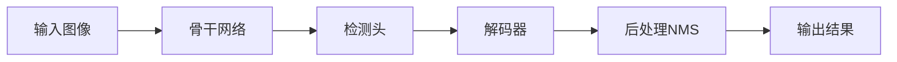

# 从零开始:YOLOv8项目实战入门指南

## 1. 背景介绍

### 1.1 计算机视觉的发展历程

计算机视觉是人工智能领域的一个重要分支,其目标是让计算机能够像人一样"看"和"理解"这个世界。自20世纪60年代以来,计算机视觉经历了从模式识别到深度学习的发展历程。近年来,随着深度学习技术的突破,计算机视觉取得了长足的进步,在图像分类、目标检测、语义分割等任务上达到甚至超越人类的水平。

### 1.2 目标检测任务概述 

目标检测是计算机视觉的一项基础任务,旨在从图像或视频中检测出感兴趣的目标,并给出其类别和位置信息。目标检测广泛应用于自动驾驶、智慧城市、工业质检等领域。传统的目标检测方法主要基于手工设计的特征,如HOG、SIFT等。近年来,基于深度学习的目标检测方法如R-CNN、YOLO、SSD等取得了显著的性能提升,成为目标检测任务的主流方法。

### 1.3 YOLO系列算法简介

YOLO (You Only Look Once)是一种高效的实时目标检测算法,由Joseph Redmon等人于2015年提出。相比基于区域建议的方法如R-CNN,YOLO将目标检测看作一个端到端的回归问题,直接在整张图上预测目标的类别和位置,大大提高了检测速度。此后,YOLO经历了多个版本的迭代更新,不断在精度和速度上取得新的突破。目前最新的版本是YOLOv8,由Ultralytics公司开源,进一步优化了骨干网络和训练策略,在精度和速度上都有显著提升。

## 2. 核心概念与联系

### 2.1 目标检测的基本概念

- 边界框(Bounding Box):用矩形框表示目标在图像中的位置,通常用(x,y,w,h)四个参数表示,其中(x,y)为矩形框左上角坐标,w和h分别为宽度和高度。
- 置信度(Confidence):模型对检测结果的置信程度,取值范围为[0,1]。置信度越高,表示模型越确信检测结果的正确性。  
- 非极大值抑制(Non-Maximum Suppression,NMS):一种后处理算法,用于去除重叠的检测框,保留置信度最高的检测结果。
- 平均精度(Average Precision,AP):评估目标检测算法性能的常用指标,表示在不同召回率下的平均精度。
- 交并比(Intersection over Union,IoU):衡量两个矩形框重叠程度的指标,定义为两个矩形框的交集面积除以并集面积。

### 2.2 YOLO算法的核心思想

YOLO算法的核心思想是将目标检测问题转化为一个回归问题。具体来说:

1. 将输入图像划分为S×S个网格(grid cell)。
2. 每个网格负责检测落在该网格中的目标,预测B个边界框及其置信度。
3. 每个边界框除了预测位置坐标(x,y,w,h)外,还预测C个类别概率。
4. 将网络输出的预测结果进行解码,得到最终的检测结果。

通过这种方式,YOLO可以在一次前向传播中同时预测多个目标的位置和类别,实现实时检测。同时,由于YOLO是在整张图上进行预测,因此可以很好地利用图像的全局信息,对目标的位置和尺度有更好的理解。

### 2.3 YOLO算法的发展历程

YOLO算法经历了多个版本的迭代优化:

- YOLOv1 (2015):最早的YOLO版本,实现了实时目标检测,但精度还有待提高。
- YOLOv2 (2016):引入了anchor box,改进了骨干网络,提高了小目标的检测精度。 
- YOLOv3 (2018):使用了多尺度预测,进一步提高了检测精度,同时保持了较高的速度。
- YOLOv4 (2020):对骨干网络、数据增强、损失函数等方面进行了优化,在精度和速度上取得新的平衡。
- YOLOv5 (2020):由Ultralytics团队开源,进一步简化了网络结构,优化了训练流程,使得模型更易于训练和部署。
- YOLOv6 (2022):使用了更大的骨干网络,引入了一些新的训练技巧,在精度上有进一步提升。
- YOLOv7 (2022):对骨干网络、检测头、损失函数等进行了全面升级,在COCO数据集上达到了55.0% AP。
- YOLOv8 (2023):最新的YOLO版本,进一步优化了骨干网络和训练策略,速度和精度再创新高。

总的来说,YOLO算法在保持实时性的同时,不断提高检测精度,已经成为工业界和学术界广泛使用的目标检测算法之一。

## 3. 核心算法原理与具体操作步骤

### 3.1 YOLOv8的整体架构

YOLOv8的整体架构如下图所示:

1. 骨干网络:YOLOv8使用了一个全新设计的骨干网络,称为YOLO-Backbone,包括CSP、Focus、Concat等模块,可以高效地提取图像特征。

2. 检测头:在骨干网络的输出特征图上,通过一系列卷积层得到最终的预测结果,包括目标的位置、置信度和类别概率。YOLOv8使用了一个轻量级的检测头,称为YOLO-Head。

3. 解码器:将网络输出的预测结果解码为最终的检测框坐标和类别。YOLOv8使用了一个高效的解码器,可以在GPU上实现并行计算。  

4. 后处理:对预测结果进行非极大值抑制,去除重叠的检测框,得到最终的检测结果。

### 3.2 YOLOv8的训练流程

YOLOv8的训练流程如下:

1. 数据准备:将标注好的数据集划分为训练集和验证集,并进行数据增强,如随机缩放、裁剪、翻转等。

2. 模型构建:根据任务需求,选择合适的YOLOv8模型,如YOLOv8n、YOLOv8s、YOLOv8m等,并加载预训练权重。

3. 超参数设置:设置训练的超参数,如学习率、批大小、迭代次数等。YOLOv8使用了一种自适应的学习率调度策略,可以自动调整学习率。

4. 模型训练:使用训练集数据对模型进行训练,并在每个epoch结束后在验证集上评估模型性能。YOLOv8支持单卡和多卡分布式训练。

5. 模型评估:在验证集上评估训练好的模型,计算mAP等指标。可以使用TensorBoard等工具实时监控训练过程。

6. 模型导出:将训练好的模型导出为ONNX、TorchScript等格式,方便后续的部署和应用。

### 3.3 YOLOv8的推理流程

YOLOv8的推理流程如下:

1. 图像预处理:将输入图像缩放到指定大小,并进行归一化。

2. 模型前向传播:将预处理后的图像输入到YOLOv8模型中,经过骨干网络、检测头得到预测结果。

3. 结果解码:将网络输出的预测结果解码为检测框坐标和类别概率。

4. 后处理:对预测结果进行非极大值抑制,去除重叠的检测框。

5. 可视化:将检测结果绘制到原始图像上,并保存或显示结果。

YOLOv8提供了一个简洁的推理API,可以方便地进行单张图像或视频流的实时检测。同时,YOLOv8还支持各种部署环境,如CPU、GPU、移动端等。

## 4. 数学模型和公式详细讲解举例说明

### 4.1 边界框回归

在YOLO算法中,每个网格预测B个边界框,每个边界框除了预测位置坐标(x,y,w,h)外,还预测一个置信度$c$。边界框的位置坐标是相对于网格的偏移量,可以表示为:

$$
\begin{aligned}
b_x &= \sigma(t_x) + c_x \\
b_y &= \sigma(t_y) + c_y \\
b_w &= p_w e^{t_w} \\
b_h &= p_h e^{t_h}
\end{aligned}
$$

其中,$t_x$,$t_y$,$t_w$,$t_h$是网络预测的偏移量,$c_x$,$c_y$是网格的坐标,$p_w$,$p_h$是先验框的宽度和高度,$\sigma$是sigmoid函数,用于将$t_x$,$t_y$映射到[0,1]范围内。

例如,假设一个网格的坐标为(3,4),先验框的宽度和高度为(0.5,0.3),网络预测的偏移量为(0.1,0.2,0.3,0.4),则最终预测的边界框坐标为:

$$
\begin{aligned}
b_x &= \sigma(0.1) + 3 = 0.525 + 3 = 3.525 \\
b_y &= \sigma(0.2) + 4 = 0.550 + 4 = 4.550 \\
b_w &= 0.5 \cdot e^{0.3} = 0.5 \cdot 1.350 = 0.675 \\
b_h &= 0.3 \cdot e^{0.4} = 0.3 \cdot 1.492 = 0.448
\end{aligned}
$$

### 4.2 置信度预测

每个边界框除了预测位置坐标外,还预测一个置信度$c$,表示该边界框内是否包含目标以及定位的准确性。置信度的定义为:

$$
c = Pr(Object) \cdot IoU(b, object)
$$

其中,$Pr(Object)$表示边界框内包含目标的概率,$IoU(b, object)$表示预测边界框$b$与真实目标边界框之间的交并比。

在训练时,如果一个边界框与真实目标的IoU大于某个阈值(如0.5),则认为该边界框负责检测该目标,其置信度目标值为IoU值;否则置信度目标值为0。

例如,假设一个边界框的预测置信度为0.8,与真实目标的IoU为0.7,则其置信度损失为:

$$
L_{conf} = (0.8 - 0.7)^2 = 0.01
$$

### 4.3 类别概率预测

除了位置和置信度外,每个边界框还预测C个类别概率,表示该边界框所属的类别。类别概率通过一个softmax层得到,保证了所有类别概率之和为1。

在训练时,如果一个边界框负责检测一个目标,则其类别概率目标值为one-hot形式,即真实类别概率为1,其他类别概率为0;如果一个边界框不负责检测任何目标,则其类别概率目标值全为0。

例如,假设一个边界框负责检测一个狗,总共有10个类别,则其类别概率目标值为:

$$
p_i = 
\begin{cases}
1, & i=\text{dog} \\
0, & i\neq\text{dog}
\end{cases}
$$

假设网络预测的类别概率为$(0.1,0.2,0.05,0.05,0.4,0.02,0.03,0.02,0.08,0.05)$,则其类别概率损失为:

$$
L_{cls} = -\log(0.4) = 0.916
$$

### 4.4 损失函数

YOLO算法的损失函数由三部分组成:位置损失、置信度损失和类别概率损失。总的损失函数定义为:

$$
L = \lambda_{coord} \sum_{i=0}^{S^2} \sum_{j=0}^B \mathbb{1}_{ij}^{obj} [(x_i-\hat{x}_i)^2 + (y_i-\hat{y}_i)^2] \\
+ \lambda_{coord} \sum_{i=0}^{S^2} \sum_{j=0}^B \mathbb{1}_{ij}^{obj} [(\