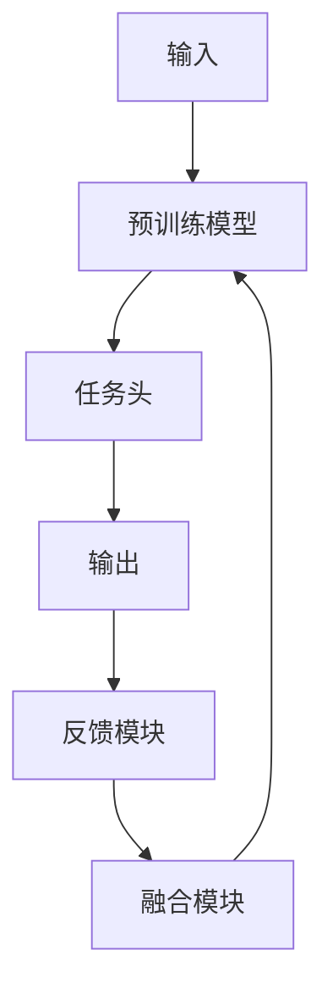

# 从零开始大模型开发与微调：反馈神经网络的原理与公式推导

## 1. 背景介绍

### 1.1 大模型的兴起与重要性

近年来,大型神经网络模型在自然语言处理、计算机视觉、语音识别等多个领域展现出了令人惊叹的性能。这些大模型通过在海量数据上进行预训练,学习到了丰富的知识表示,并能够通过微调等方式迅速适应下游任务。典型的大模型包括 GPT(Generative Pre-trained Transformer)、BERT(Bidirectional Encoder Representations from Transformers)、ViT(Vision Transformer)等,它们在各自领域取得了state-of-the-art的表现。

### 1.2 微调技术的关键作用

虽然大模型具有强大的能力,但直接将其应用于特定任务通常效果并不理想。这是因为预训练阶段学习到的知识仍然过于通用,无法完全满足下游任务的需求。因此,需要通过在目标任务的数据上进行微调(fine-tuning),使模型适应特定的领域和任务。微调技术的关键是在保留大模型已学习到的通用知识表示的同时,对模型的部分参数进行调整,使其能够更好地适应目标任务。

### 1.3 反馈神经网络(FeedbackNet)

反馈神经网络(FeedbackNet)是一种新型的微调方法,通过引入反馈机制来增强模型的学习能力。与传统的微调方法相比,FeedbackNet在每一个训练步骤中都会根据当前的预测结果产生反馈信号,并将这些反馈信号融合到模型的计算过程中,从而更好地捕捉任务相关的模式。FeedbackNet已经在多个领域取得了优异的表现,展现出了巨大的应用潜力。

## 2. 核心概念与联系

### 2.1 注意力机制与Transformer

注意力机制是近年来在自然语言处理和计算机视觉等领域取得突破性进展的关键技术之一。它允许模型在处理序列数据时,动态地关注与当前子任务最相关的部分,而不是简单地按顺序处理整个序列。Transformer是第一个将注意力机制应用于序列建模的模型,它完全抛弃了传统的循环神经网络和卷积神经网络结构,使用了全注意力的架构。Transformer不仅在机器翻译等自然语言处理任务上表现出色,而且在计算机视觉、语音识别等领域也取得了优异的成绩。

### 2.2 预训练与微调

预训练(Pre-training)是指在大规模通用数据集上训练模型,使其学习到通用的知识表示。而微调(Fine-tuning)则是在特定任务的数据集上,基于预训练模型进行进一步的训练,使模型适应该任务的特征。这种预训练+微调的范式已经成为了当前大模型发展的主流方向。通过预训练,模型可以学习到丰富的语义和世界知识;而微调则使模型能够灵活地适应各种下游任务,避免了从头开始训练的巨大计算开销。

### 2.3 反馈机制与FeedbackNet

反馈机制是生物神经系统中一种普遍存在的机制,它允许神经元根据当前的输出状态来调节自身的活动。在人工神经网络中,反馈机制可以通过引入反馈连接来实现,即将模型的输出反馈回输入,形成一个闭环系统。FeedbackNet就是一种利用反馈机制的微调方法,它在每个训练步骤中都会根据当前的预测结果产生反馈信号,并将这些反馈信号融合到模型的计算过程中,从而增强模型的学习能力。

## 3. 核心算法原理具体操作步骤

### 3.1 FeedbackNet的整体架构

FeedbackNet的整体架构如下图所示:



其中:

1. 输入数据首先被送入预训练模型(如BERT、GPT等)进行编码。
2. 编码后的表示被送入任务头(Task Head)进行特定任务的预测,得到初始输出。
3. 初始输出被送入反馈模块(Feedback Module),产生反馈信号。
4. 反馈信号与预训练模型的输出在融合模块(Fusion Module)中进行融合。
5. 融合后的表示被再次送入预训练模型,进行下一轮的计算。

通过上述循环的方式,FeedbackNet可以不断地根据当前的预测结果进行调整,从而增强模型的学习能力。

### 3.2 反馈模块

反馈模块的作用是根据当前的预测结果产生反馈信号。常见的反馈模块包括:

1. **残差连接**:将预测结果直接作为反馈信号,与预训练模型的输出相加。
2. **注意力反馈**:利用注意力机制,根据预测结果动态地调整对输入的关注程度,产生反馈信号。
3. **门控反馈**:使用门控机制,根据预测结果控制哪些部分的信息应该被保留或抑制,从而产生反馈信号。

不同的反馈模块对应着不同的反馈策略,可以根据具体任务的特点进行选择和设计。

### 3.3 融合模块

融合模块的作用是将反馈信号与预训练模型的输出进行融合,得到更丰富的表示。常见的融合模块包括:

1. **元素wise相加**:将反馈信号与预训练模型的输出直接相加。
2. **门控融合**:使用门控机制,动态地控制反馈信号与预训练模型输出的融合比例。
3. **注意力融合**:利用注意力机制,根据反馈信号和预训练模型输出的相关性动态地分配权重,进行加权融合。

不同的融合模块对应着不同的融合策略,可以根据具体任务的特点进行选择和设计。

### 3.4 训练过程

FeedbackNet的训练过程可以概括为以下步骤:

1. 初始化预训练模型和任务头的参数。
2. 对每个训练样本:
    a. 将输入送入预训练模型,得到初始表示。
    b. 将初始表示送入任务头,得到初始预测结果。
    c. 将初始预测结果送入反馈模块,产生反馈信号。
    d. 将反馈信号与预训练模型的输出在融合模块中进行融合,得到融合后的表示。
    e. 将融合后的表示送回预训练模型,进行下一轮的计算。
    f. 根据最终的预测结果计算损失,并进行参数更新。
3. 重复步骤2,直至模型收敛或达到最大训练轮数。

通过上述训练过程,FeedbackNet可以不断地根据当前的预测结果进行调整,从而增强模型的学习能力。

## 4. 数学模型和公式详细讲解举例说明

### 4.1 注意力机制

注意力机制是Transformer及其变体的核心,它允许模型在处理序列数据时动态地关注与当前子任务最相关的部分。对于一个查询向量 $\mathbf{q}$ 和一系列键值对 $(\mathbf{k}_i, \mathbf{v}_i)$,注意力机制的计算过程如下:

$$\begin{aligned}
\alpha_i &= \frac{\exp(\mathbf{q} \cdot \mathbf{k}_i)}{\sum_j \exp(\mathbf{q} \cdot \mathbf{k}_j)} \\
\mathbf{o} &= \sum_i \alpha_i \mathbf{v}_i
\end{aligned}$$

其中, $\alpha_i$ 表示查询向量对第 $i$ 个键值对的注意力权重,通过对查询向量和键向量进行点积运算得到。最终的输出 $\mathbf{o}$ 是所有值向量的加权和,权重由注意力权重 $\alpha_i$ 决定。

注意力机制允许模型动态地分配不同的注意力权重,从而聚焦于与当前子任务最相关的信息。这种灵活的机制是Transformer取得巨大成功的关键所在。

### 4.2 FeedbackNet中的注意力反馈

在FeedbackNet中,注意力机制不仅被用于编码输入序列,还被用于产生反馈信号。具体来说,对于一个输入序列 $\mathbf{X} = (\mathbf{x}_1, \mathbf{x}_2, \ldots, \mathbf{x}_n)$ 和当前的预测结果 $\mathbf{y}$,注意力反馈模块的计算过程如下:

$$\begin{aligned}
\beta_i &= \frac{\exp(\mathbf{y} \cdot \mathbf{x}_i)}{\sum_j \exp(\mathbf{y} \cdot \mathbf{x}_j)} \\
\mathbf{f} &= \sum_i \beta_i \mathbf{x}_i
\end{aligned}$$

其中, $\beta_i$ 表示预测结果 $\mathbf{y}$ 对第 $i$ 个输入向量 $\mathbf{x}_i$ 的注意力权重,通过对预测结果和输入向量进行点积运算得到。最终的反馈信号 $\mathbf{f}$ 是所有输入向量的加权和,权重由注意力权重 $\beta_i$ 决定。

通过注意力反馈机制,FeedbackNet可以根据当前的预测结果动态地调整对输入的关注程度,从而产生更加有针对性的反馈信号,提高模型的学习能力。

### 4.3 门控融合

在FeedbackNet中,门控融合是一种常见的融合模块,它使用门控机制动态地控制反馈信号与预训练模型输出的融合比例。具体来说,对于预训练模型的输出 $\mathbf{h}$ 和反馈信号 $\mathbf{f}$,门控融合模块的计算过程如下:

$$\begin{aligned}
\mathbf{g} &= \sigma(\mathbf{W}_g [\mathbf{h}; \mathbf{f}] + \mathbf{b}_g) \\
\mathbf{o} &= \mathbf{g} \odot \mathbf{h} + (1 - \mathbf{g}) \odot \mathbf{f}
\end{aligned}$$

其中, $\mathbf{W}_g$ 和 $\mathbf{b}_g$ 是可学习的参数, $\sigma$ 是sigmoid激活函数, $[\cdot; \cdot]$ 表示向量拼接操作, $\odot$ 表示元素wise乘积。

门控向量 $\mathbf{g}$ 的每个元素都介于 $[0, 1]$ 之间,它控制了对应位置上预训练模型输出 $\mathbf{h}$ 和反馈信号 $\mathbf{f}$ 的融合比例。最终的融合输出 $\mathbf{o}$ 是 $\mathbf{h}$ 和 $\mathbf{f}$ 的加权和,权重由门控向量 $\mathbf{g}$ 决定。

通过门控融合机制,FeedbackNet可以动态地调整反馈信号与预训练模型输出的融合比例,从而更好地捕捉任务相关的模式,提高模型的学习能力。

## 5. 项目实践:代码实例和详细解释说明

为了更好地理解FeedbackNet的原理和实现细节,我们提供了一个基于PyTorch的代码示例,实现了一个简单的FeedbackNet模型,用于文本分类任务。

### 5.1 数据准备

我们使用了一个小型的文本分类数据集,包含了10000条新闻标题及其对应的类别标签。数据集已经被划分为训练集、验证集和测试集。

```python
from torchtext.datasets import AG_NEWS

train_iter = AG_NEWS(split='train')
val_iter = AG_NEWS(split='val')
test_iter = AG_NEWS(split='test')
```

### 5.2 模型定义

我们定义了一个简单的FeedbackNet模型,包括以下几个主要组件:

- `Encoder`模块:使用预训练的BERT模型对输入文本进行编码,得到文本表示向量。
- `TaskHead`模块:将文本表示向量映射到类别空间,得到初始预测结果。
- `FeedbackModule`模块:根据初始预测结果产生反馈信号。我们使用了注意力反馈机制。
- `Fus