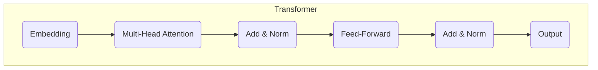
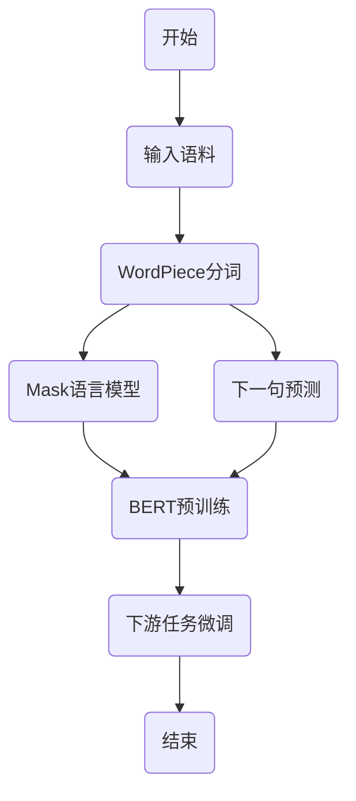
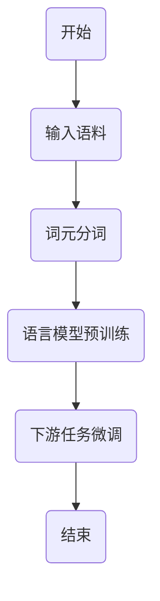
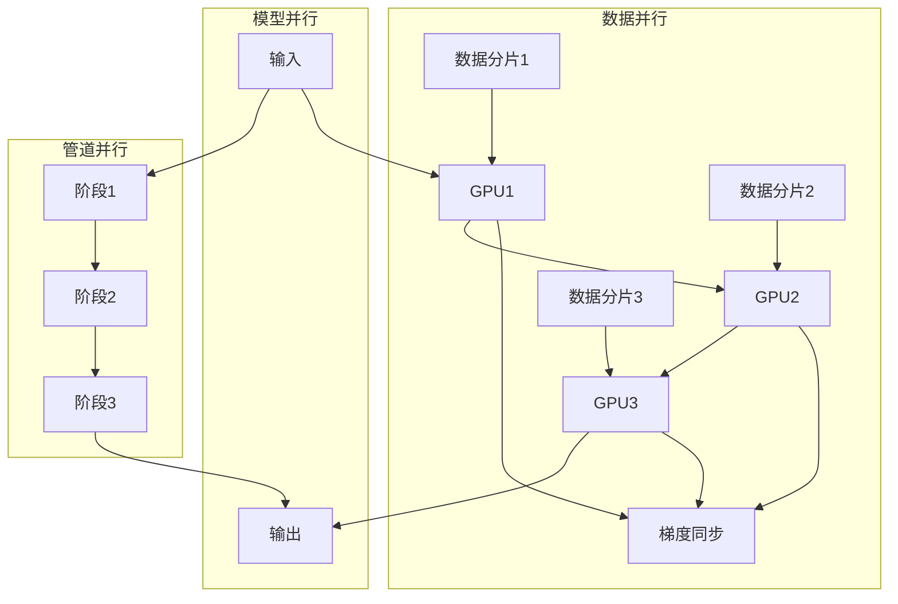

# 从零开始大模型开发与微调：基于深度学习的模型训练

## 1.背景介绍

### 1.1 大模型的兴起

近年来,大型神经网络模型(俗称"大模型")在自然语言处理、计算机视觉等多个领域取得了令人瞩目的成就。随着算力和数据的不断增长,训练大规模深度学习模型成为可能。这些大模型通过在海量数据上预训练,学习到丰富的知识表示,在下游任务上表现出强大的泛化能力。

代表性的大模型有:

- GPT(Generative Pre-trained Transformer)系列:GPT、GPT-2、GPT-3
- BERT(Bidirectional Encoder Representations from Transformers)
- T5(Text-to-Text Transfer Transformer)
- PaLM(Pathways Language Model)
- ...

这些大模型在自然语言生成、理解、推理、问答等任务上展现出人类水平的能力,引发了人工智能领域的新一轮热潮。

### 1.2 大模型训练的挑战

尽管大模型取得了巨大成功,但训练如此庞大的神经网络模型也面临着诸多挑战:

- **计算资源**:训练大模型需要大量算力,通常需要数十甚至数百张GPU并行训练,耗费巨大的算力和能源。
- **数据需求**:大模型需要在海量高质量数据上预训练才能学习到有效的知识表示,数据采集和标注成本高昂。
- **模型优化**:大规模深度模型的优化过程容易陷入梯度消失/爆炸、不稳定等问题,需要精心设计优化策略。
- **微调挑战**:如何高效地将大模型知识迁移到下游任务上,是一个需要探索的课题。

因此,从零开发和训练大模型,对算力、数据、算法优化等方面都提出了极高的要求,是一个极具挑战的系统工程。

## 2.核心概念与联系  

### 2.1 迁移学习与微调

迁移学习(Transfer Learning)是机器学习中的一个重要概念。传统的机器学习算法往往需要针对每个任务从头开始训练模型,这在数据和算力资源有限的情况下效率低下。迁移学习的思想是:首先在源域(如大规模无标注数据)上训练一个通用的模型,获取一些基础的知识表示能力;然后将这个模型的参数迁移到目标域的下游任务上,并在目标任务数据上进行微调(fine-tune),使模型适应新的任务。

在大模型场景下,通常先在通用的大规模无标注语料(如网页数据、书籍等)上预训练一个大规模的基础模型(如BERT、GPT等),捕获自然语言的一般知识表示;然后将这个大模型作为下游任务(如文本分类、阅读理解等)的初始化参数,在任务数据上进行进一步微调,使模型适应特定的任务需求。

这种预训练+微调的范式,利用了大模型在无监督数据上学习的泛化能力,可以在下游任务上取得很好的效果,同时也大大减少了每个任务所需的标注数据量。因此,高效的微调策略是训练大模型的关键一环。

### 2.2 自监督学习

大模型之所以能在通用数据上有效地预训练,很大程度上归功于自监督学习(Self-Supervised Learning)的预训练目标和策略。与监督学习需要大量人工标注的数据不同,自监督学习可以利用原始数据本身的某些属性(如邻近性、上下文等)自动构建出预训练目标,在无需人工标注的情况下训练出有效的表示。

常见的自监督学习预训练目标包括:

- **Mask语言模型**(Masked Language Model, MLM):随机掩蔽部分词,预测被掩蔽词的目标。
- **下一句预测**(Next Sentence Prediction, NSP):预测两个句子是否为连续句子。
- **自回归语言模型**(Autoregressive Language Model):给定前缀,预测下一个词的概率分布。
- **序列到序列模型**(Sequence-to-Sequence Model):将输入序列映射为输出序列。

通过在大规模无标注语料上优化这些自监督预训练目标,模型可以学习到丰富的语义和上下文知识表示,为后续的任务微调提供良好的初始化参数。

### 2.3 模型压缩

大模型往往包含数十亿甚至上百亿的参数,在推理部署时会占用大量内存和算力资源。为了在资源受限的场景(如移动端、边缘计算等)高效部署大模型,需要对模型进行压缩。常见的模型压缩技术包括:

- **量化**(Quantization):将原本使用32位或16位浮点数表示的参数和中间计算,压缩到8位或更低的定点数表示,减少模型大小和计算量。
- **知识蒸馏**(Knowledge Distillation):使用一个小模型(student)去学习一个大教师模型(teacher)的行为,在保持较高精度的同时大幅减小模型规模。
- **剪枝**(Pruning):将模型中不重要的权重设置为0,减少参数量。
- **低秩分解**(Low-Rank Decomposition):将权重矩阵分解为若干低秩矩阵的乘积形式,减少参数冗余。

通过以上技术,可以将大模型压缩至原始大小的10%以下,在降低推理资源占用的同时,尽可能保持模型的性能水平。

## 3.核心算法原理具体操作步骤

### 3.1 Transformer模型

Transformer是一种全新的基于注意力机制(Attention Mechanism)的序列建模架构,自2017年被提出以来,已经成为构建大模型的主流选择。相比传统的RNN和CNN,Transformer完全基于注意力机制对序列进行建模,避免了RNN的梯度消失问题,并且可以高效并行计算,非常适合大规模训练。

Transformer的核心组件包括:

1. **嵌入层**(Embedding Layer):将输入序列(如词、子词等)映射到连续的向量空间。
2. **多头注意力**(Multi-Head Attention):通过计算查询(Query)与键(Key)的相关性,获取与之对应的值(Value)的加权和作为注意力表示。
3. **前馈网络**(Feed-Forward Network):对注意力表示进行进一步的非线性变换。
4. **规范化与残差连接**(Normalization & Residual Connection):加速模型收敛,增强梯度传播。

Transformer的编码器(Encoder)通过多层注意力和前馈网络对输入序列建模;解码器(Decoder)在编码器的基础上,增加了注意力掩码,使其可以生成序列输出。Transformer的自注意力机制赋予了模型强大的长程依赖建模能力。

### 3.2 BERT模型

BERT(Bidirectional Encoder Representations from Transformers)是一种基于Transformer编码器的预训练语言模型,通过Mask语言模型和下一句预测两个自监督任务在大规模语料上进行预训练,学习到了深层次的上下文语义表示。

BERT预训练的关键步骤包括:

1. **构建预训练语料**:通常使用大规模的网页数据、书籍等无标注语料。
2. **词元分词**:使用WordPiece等分词算法将文本分割成子词序列。
3. **Mask语言模型**:随机遮蔽部分输入词元,目标是预测被遮蔽词元的标识。
4. **下一句预测**:给定两个句子A和B,判断B是否为A的下一句。
5. **预训练优化**:使用自监督目标函数和大规模语料对BERT模型进行预训练。

预训练完成后,BERT可直接应用于下游的NLP任务,如文本分类、命名实体识别等,通过在任务数据上微调最后一层,即可获得显著的性能提升。

### 3.3 GPT模型

GPT(Generative Pre-trained Transformer)是一种基于Transformer解码器的自回归语言模型。与BERT的Mask语言模型不同,GPT采用标准的语言模型目标:给定前缀文本,预测下一个词元的概率分布。

GPT预训练的关键步骤包括:

1. **构建预训练语料**:使用网页、书籍等大规模文本数据。
2. **词元分词**:使用BPE等算法将文本序列化为词元序列。
3. **语言模型目标**:给定前缀文本,预测下一个词元的概率分布。
4. **预训练优化**:使用自回归语言模型目标函数对GPT进行预训练。

预训练后的GPT不仅具备强大的文本生成能力,而且其内部也学习到了丰富的语义知识表示,可以通过在下游任务上微调进行迁移。GPT-2和GPT-3进一步扩大了模型规模,展现出惊人的文本生成质量。

### 3.4 模型并行与数据并行

由于大模型包含数十亿甚至上百亿的参数,需要采用并行化策略来加速训练。主要的并行方式包括:

1. **数据并行**(Data Parallelism):将训练数据分批并行送入多个加速器(如GPU)进行前向和反向计算,然后汇总梯度进行参数更新。
2. **模型并行**(Model Parallelism):将模型切分到多个加速器上,每个加速器只计算模型的一部分,通过通信合并中间结果。
3. **管道并行**(Pipeline Parallelism):将模型切分成多个阶段,不同阶段分配到不同的加速器,形成流水线并行执行。

数据并行相对简单,主要受限于单机内存大小。模型并行和管道并行则能支持更大规模的模型,但需要复杂的通信机制,对训练框架提出了更高要求。常见的分布式训练框架包括PyTorch DDP、TensorFlow Distributed等。

### 3.5 优化器与学习率策略

训练大规模深度模型需要精心设计优化器和学习率策略,以确保模型稳定收敛并达到最佳性能。常用的优化器包括:

- **SGD**(Stochastic Gradient Descent):经典的随机梯度下降算法。
- **Momentum**:在SGD基础上增加动量项,加速收敛。
- **AdaGrad**:自适应调整每个参数的学习率。
- **RMSProp**:对AdaGrad进行改进,降低学习率下降过快的问题。
- **Adam**:结合动量和RMSProp,是目前最常用的自适应学习率优化器。

此外,还需要合理设置学习率策略,如:

- **热身学习率**(Warm-up Learning Rate):在训练初期使用较小的学习率,防止梯度爆炸。
- **分层解耦学习率**(Decoupled Weight Decay):对不同层次的权重使用不同的正则化