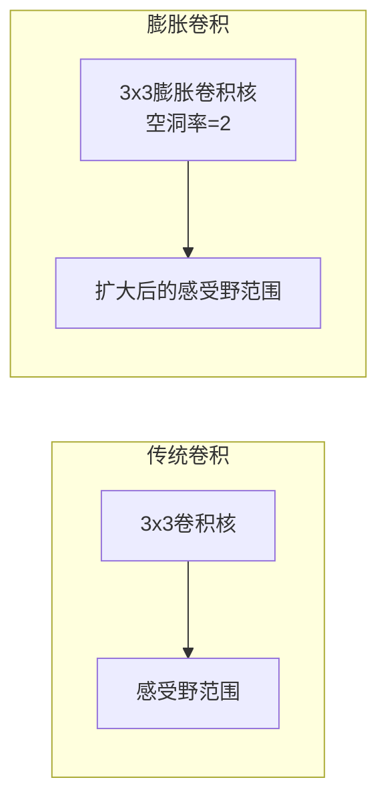

# 从零开始大模型开发与微调：膨胀卷积详解

## 1.背景介绍

### 1.1 深度学习模型的发展历程
随着深度学习技术的不断发展和计算能力的提升,神经网络模型在计算机视觉、自然语言处理等领域取得了令人瞩目的成就。然而,传统的卷积神经网络(CNN)在处理高分辨率图像或长序列数据时,往往会遇到计算资源受限、梯度消失等问题,难以充分发挥其潜力。为了解决这些挑战,研究人员提出了一种新型的卷积操作——膨胀卷积(Dilated Convolution),旨在提高模型的感受野,增强对长程依赖关系的建模能力。

### 1.2 膨胀卷积的重要性
膨胀卷积作为一种高效的卷积操作,已被广泛应用于图像分割、目标检测、语音识别等任务中。它能够在保持参数量相对较小的情况下,显著扩大感受野范围,从而捕捉到更多的上下文信息。这种特性使得膨胀卷积在处理高分辨率图像和长序列数据时表现出色,成为了构建大型深度学习模型的关键组件之一。

### 1.3 大模型开发与微调的重要性
随着计算能力的不断提升,开发和训练大型深度学习模型成为可能。然而,从头开始训练这些庞大的模型通常需要大量的计算资源和时间。因此,微调预训练模型(Transfer Learning)成为了一种高效的方法,可以利用已有的模型权重作为初始化,在新的数据集上进行进一步的训练,从而显著缩短训练时间,提高模型性能。

在本文中,我们将深入探讨膨胀卷积的原理和实现细节,并介绍如何将其应用于大型深度学习模型的开发和微调过程中。我们将提供实用的代码示例和最佳实践,帮助读者掌握这项关键技术,并为构建更加强大和高效的深度学习模型奠定基础。

## 2.核心概念与联系

### 2.1 卷积神经网络概述
卷积神经网络(CNN)是一种专门用于处理网格结构数据(如图像、序列等)的深度神经网络架构。它由多个卷积层和池化层组成,通过学习局部特征和空间关系,逐步提取出更高级的抽象特征表示。CNN在计算机视觉、自然语言处理等领域取得了巨大成功,成为了深度学习最重要的基础模型之一。

### 2.2 传统卷积操作的局限性
尽管CNN取得了卓越的成绩,但传统的卷积操作在处理高分辨率图像或长序列数据时仍存在一些局限性。具体来说:

1. **感受野有限**:传统卷积核的感受野范围有限,难以捕捉到足够的上下文信息,影响了模型的表现。
2. **参数量庞大**:为了获取更大的感受野,需要堆叠更多的卷积层,导致模型参数量急剧增加,增大了计算和存储开销。
3. **信息流失**:在卷积层与池化层的交替操作中,部分有用的信息可能会被丢失,影响了模型的性能。

### 2.3 膨胀卷积的核心思想
为了解决传统卷积操作的局限性,膨胀卷积(Dilated Convolution)被提出。它的核心思想是在卷积核内引入"空洞"(dilated rates),从而使卷积核覆盖更大的感受野范围,而无需增加更多的参数。通过调节空洞率的大小,可以灵活地控制感受野的范围,实现对长程依赖关系的有效建模。

下面是一个示意图,展示了膨胀卷积与传统卷积的区别:



可以看到,虽然卷积核的大小相同,但膨胀卷积能够覆盖更大的感受野范围,从而捕捉到更多的上下文信息。

### 2.4 膨胀卷积与其他技术的联系
膨胀卷积与其他一些技术存在密切的联系,如下所示:

- **空洞卷积(Atrous Convolution)**:膨胀卷积也被称为空洞卷积,两者是同一个概念。
- **可分离卷积(Separable Convolution)**:可分离卷积通过分解卷积核,降低了计算复杂度。膨胀卷积可以与可分离卷积相结合,进一步提高计算效率。
- **金字塔池化(Pyramid Pooling)**:金字塔池化通过多尺度池化,捕捉不同尺度的上下文信息。膨胀卷积可以看作是一种特殊的金字塔池化方式。
- **注意力机制(Attention Mechanism)**:注意力机制通过动态调整权重,关注输入数据中的重要部分。膨胀卷积可以与注意力机制相结合,提高模型的表现。

通过与其他技术的有机结合,膨胀卷积在深度学习模型中发挥着越来越重要的作用。

## 3.核心算法原理具体操作步骤

### 3.1 膨胀卷积的数学定义
在正式介绍膨胀卷积的具体操作步骤之前,我们先来了解一下它的数学定义。

对于一个二维输入特征图 $X$ 和一个二维卷积核 $K$,传统的卷积操作可以表示为:

$$
Y[i, j] = \sum_{m} \sum_{n} X[i+m, j+n] K[m, n]
$$

而膨胀卷积则引入了一个新的参数 $r$,称为空洞率(dilation rate),用于控制卷积核中元素之间的间隔。膨胀卷积的数学表达式如下:

$$
Y[i, j] = \sum_{m} \sum_{n} X[i+r \cdot m, j+r \cdot n] K[m, n]
$$

其中, $r=1$ 时,膨胀卷积就等价于传统的卷积操作。当 $r>1$ 时,卷积核中元素之间的间隔就会增大,从而扩大了感受野的范围。

### 3.2 膨胀卷积的具体操作步骤
现在,我们来详细介绍一下膨胀卷积的具体操作步骤:

1. **确定输入和卷积核**:给定一个二维输入特征图 $X$ 和一个二维卷积核 $K$。
2. **设置空洞率**:选择一个合适的空洞率 $r$,用于控制卷积核中元素之间的间隔。
3. **执行膨胀卷积**:对于输入特征图 $X$ 上的每个位置 $(i, j)$,计算膨胀卷积的输出 $Y[i, j]$ 如下:

   $$
   Y[i, j] = \sum_{m} \sum_{n} X[i+r \cdot m, j+r \cdot n] K[m, n]
   $$

   其中,卷积核 $K$ 在输入特征图 $X$ 上滑动,但是每次滑动的步长为 $r$,而不是传统卷积中的 $1$。这样就可以覆盖更大的感受野范围,而无需增加更多的参数。

4. **边界处理**:由于膨胀卷积会导致输出特征图的大小发生变化,因此需要采取适当的边界处理策略,如零填充(zero-padding)或有效区域裁剪(valid convolution)等。
5. **可选步骤**:根据具体需求,可以对膨胀卷积的输出进行进一步的处理,如添加激活函数、批归一化等。

下面是一个简单的示例,展示了膨胀卷积的具体操作过程:

```mermaid
graph TD
    subgraph 输入特征图
        A1[1] --- A2[2] --- A3[3]
        A4[4] --- A5[5] --- A6[6]
        A7[7] --- A8[8] --- A9[9]
    end

    subgraph 卷积核
        B1[ ] --- B2[1] --- B3[ ]
        B4[1] --- B5[1] --- B6[1]
        B7[ ] --- B8[1] --- B9[ ]
    end

    subgraph 空洞率r=1
        C1[1*1+2*1+3*0] --- C2[1*2+2*5+3*1] --- C3[1*3+2*6+3*0]
        C4[4*1+5*1+6*0] --- C5[4*2+5*5+6*1] --- C6[4*3+5*6+6*0]
        C7[7*1+8*1+9*0] --- C8[7*2+8*5+9*1] --- C9[7*3+8*6+9*0]
    end

    subgraph 空洞率r=2
        D1[1*1+2*0+3*0] --- D2[1*0+2*5+3*0] --- D3[1*0+2*6+3*0]
        D4[4*1+5*0+6*0] --- D5[4*0+5*5+6*0] --- D6[4*0+5*6+6*0]
        D7[7*1+8*0+9*0] --- D8[7*0+8*5+9*0] --- D9[7*0+8*6+9*0]
    end

    A1 --> B1
    A2 --> B2
    A3 --> B3
    A4 --> B4
    A5 --> B5
    A6 --> B6
    A7 --> B7
    A8 --> B8
    A9 --> B9

    B1 --> C1
    B2 --> C2
    B3 --> C3
    B4 --> C4
    B5 --> C5
    B6 --> C6
    B7 --> C7
    B8 --> C8
    B9 --> C9

    B1 --> D1
    B2 --> D2
    B3 --> D3
    B4 --> D4
    B5 --> D5
    B6 --> D6
    B7 --> D7
    B8 --> D8
    B9 --> D9
```

在这个示例中,我们可以看到,当空洞率 $r=1$ 时,膨胀卷积等价于传统的卷积操作;而当空洞率 $r=2$ 时,卷积核中元素之间的间隔增大,从而扩大了感受野的范围。通过调节空洞率的大小,我们可以灵活地控制感受野的范围,以满足不同任务的需求。

### 3.3 膨胀卷积的优缺点分析
膨胀卷积作为一种高效的卷积操作,具有以下优点:

- **扩大感受野**:通过引入空洞率,膨胀卷积可以显著扩大卷积核的感受野范围,从而捕捉到更多的上下文信息,提高模型的表现。
- **参数高效**:与传统的卷积操作相比,膨胀卷积可以在保持参数量相对较小的情况下,获得更大的感受野范围,提高了计算效率。
- **灵活性强**:通过调节空洞率的大小,膨胀卷积可以灵活地控制感受野的范围,适应不同任务的需求。
- **信息保留**:与池化操作不同,膨胀卷积在扩大感受野的同时,保留了输入特征图的分辨率,减少了信息流失。

然而,膨胀卷积也存在一些潜在的缺点和挑战:

- **网格效应**:当空洞率较大时,膨胀卷积可能会产生网格效应(gridding artifacts),导致特征图出现棋盘状的伪影。
- **边界处理**:膨胀卷积会导致输出特征图的大小发生变化,需要采取适当的边界处理策略,如零填充或有效区域裁剪。
- **参数调整**:选择合适的空洞率需要一定的经验和实践,不同的任务和数据集可能需要不同的空洞率设置。
- **计算复杂度**:虽然参数量相对较小,但膨胀卷积的计算复杂度仍然较高,需要更强大的计算资源来支持。

总的来说,膨胀卷积是一种非常有前景的卷积操作,它为构建更加强大和高效的深度学习模型提供了新的可能性。通过合理地应用膨胀卷积,并结合其他