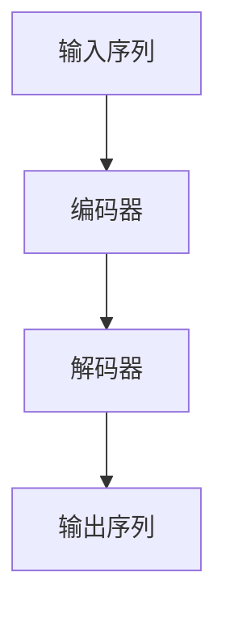

# 从零开始大模型开发与微调：解码器的输入和交互注意力层的掩码

## 1.背景介绍

### 1.1 大模型的兴起

近年来,大型语言模型在自然语言处理(NLP)领域取得了令人瞩目的成就。这些模型通过在海量文本数据上进行预训练,学习到了丰富的语言知识和上下文表示能力。代表性模型包括GPT-3、BERT、T5等,它们在各种NLP任务上展现出了出色的性能,推动了人工智能的发展。

### 1.2 微调的重要性

尽管大模型具有强大的语言理解和生成能力,但直接将其应用于特定任务往往会导致性能下降。为了充分发挥大模型的潜力,需要对其进行针对性的微调(fine-tuning)。微调是指在大模型预训练的基础上,利用特定任务的数据对模型进行进一步训练,使其适应目标任务的特征和需求。

### 1.3 Transformer模型

Transformer是当前主流的大模型架构,其核心是自注意力(Self-Attention)机制。自注意力允许模型捕捉输入序列中任意两个位置之间的关系,从而更好地建模长距离依赖。Transformer模型通常由编码器(Encoder)和解码器(Decoder)两部分组成,用于不同的任务场景。

## 2.核心概念与联系

### 2.1 解码器(Decoder)

在生成式任务(如机器翻译、文本摘要等)中,Transformer的解码器部分负责根据编码器的输出生成目标序列。解码器本身也是一个Transformer模型,包含多层解码器层(Decoder Layer)。



### 2.2 解码器的输入

解码器的输入由两部分组成:

1. **输入嵌入(Input Embeddings)**: 将输入序列(如前一个时间步的生成token)映射为向量表示。
2. **位置编码(Positional Encodings)**: 因为Transformer没有递归或卷积结构,无法直接获取序列的位置信息。位置编码通过将位置信息编码为向量,并与输入嵌入相加,从而让模型学习到序列的位置信息。

### 2.3 交互注意力层(Cross-Attention Layer)

在每个解码器层中,存在一个交互注意力层,用于捕捉输入序列(编码器输出)和当前生成序列之间的关系。交互注意力层的输入包括:

1. **查询(Query)**: 来自前一层的解码器输出,代表当前生成的序列。
2. **键(Key)和值(Value)**: 来自编码器的输出,代表输入序列的表示。

通过注意力机制,交互注意力层可以关注输入序列中与当前生成序列相关的部分,从而更好地捕捉输入和输出之间的依赖关系。

### 2.4 掩码(Masking)

在自回归(Auto-Regressive)生成过程中,解码器的输入和输出是逐步生成的。为了避免模型利用了不应获取的未来信息,需要对输入和交互注意力层进行掩码操作。

1. **输入掩码**: 在生成第t个token时,将输入序列中位置大于t的token掩码,使模型无法看到未来的信息。
2. **交互注意力掩码**: 在计算交互注意力时,将查询中位置大于t的部分掩码,使模型无法关注未来生成的token。

掩码操作确保了模型只能利用当前和过去的信息进行预测,保证了生成过程的自回归性质。

## 3.核心算法原理具体操作步骤

### 3.1 输入嵌入和位置编码

1. 将输入序列(如前一时间步生成的token)映射为嵌入向量。
2. 为每个位置生成位置编码向量,并与对应位置的输入嵌入相加,得到最终的输入表示。

### 3.2 解码器层计算

对于每一个解码器层:

1. 将上一层的输出作为当前层的输入。
2. 计算自注意力(Self-Attention):
   - 查询、键和值均来自当前层的输入。
   - 对查询中位置大于当前位置的部分进行掩码,防止模型利用未来信息。
3. 计算交互注意力(Cross-Attention):
   - 查询来自当前层的自注意力输出。
   - 键和值来自编码器的输出。
   - 对查询中位置大于当前位置的部分进行掩码,防止模型利用未来信息。
4. 将自注意力和交互注意力的输出进行残差连接和层归一化,得到当前层的输出。
5. 将当前层的输出通过前馈网络(Feed-Forward Network),再进行残差连接和层归一化,得到最终的当前层输出。

### 3.3 生成输出

1. 将最后一个解码器层的输出通过线性层和softmax层,得到每个位置的词汇概率分布。
2. 从概率分布中采样或选择概率最大的token作为当前时间步的输出。
3. 将当前输出token连接到输入序列,重复上述步骤,直到生成完整序列或达到最大长度。

## 4.数学模型和公式详细讲解举例说明

### 4.1 注意力机制(Attention Mechanism)

注意力机制是Transformer模型的核心,它允许模型动态地关注输入序列中与当前任务相关的部分。给定查询(Query) $\boldsymbol{q}$、键(Key) $\boldsymbol{K}$和值(Value) $\boldsymbol{V}$,注意力计算过程如下:

$$\begin{aligned}
\text{Attention}(\boldsymbol{q}, \boldsymbol{K}, \boldsymbol{V}) &= \text{softmax}\left(\frac{\boldsymbol{q}\boldsymbol{K}^\top}{\sqrt{d_k}}\right)\boldsymbol{V} \\
&= \sum_{i=1}^n \alpha_i \boldsymbol{v}_i
\end{aligned}$$

其中:

- $\boldsymbol{q}$、$\boldsymbol{K}$和$\boldsymbol{V}$分别是查询、键和值的矩阵表示。
- $d_k$是缩放因子,用于防止点积过大导致梯度饱和。
- $\alpha_i$是注意力权重,表示模型对第$i$个值向量$\boldsymbol{v}_i$的关注程度。

通过计算查询与每个键的相似性,并对相似性进行softmax归一化,模型可以自适应地分配注意力权重,从而关注与当前任务相关的输入部分。

### 4.2 多头注意力(Multi-Head Attention)

为了捕捉不同的关系子空间,Transformer采用了多头注意力机制。多头注意力将查询、键和值先通过线性变换进行投影,然后并行计算多个注意力头,最后将所有头的输出拼接:

$$\begin{aligned}
\text{MultiHead}(\boldsymbol{Q}, \boldsymbol{K}, \boldsymbol{V}) &= \text{Concat}(\text{head}_1, \dots, \text{head}_h)\boldsymbol{W}^O \\
\text{where}\quad \text{head}_i &= \text{Attention}(\boldsymbol{Q}\boldsymbol{W}_i^Q, \boldsymbol{K}\boldsymbol{W}_i^K, \boldsymbol{V}\boldsymbol{W}_i^V)
\end{aligned}$$

其中$\boldsymbol{W}_i^Q$、$\boldsymbol{W}_i^K$和$\boldsymbol{W}_i^V$是不同头的线性变换矩阵,$\boldsymbol{W}^O$是最终的输出线性变换矩阵。

通过多头注意力,模型可以从不同的子空间捕捉不同的关系,提高了模型的表示能力。

### 4.3 掩码操作

在自回归生成过程中,需要对输入和交互注意力进行掩码操作,以防止模型利用未来信息。对于输入掩码,我们可以构造一个掩码矩阵$\boldsymbol{M}$,其中$M_{ij}=0$表示第$i$个位置可以关注第$j$个位置,否则为$-\infty$。将掩码矩阵与注意力分数相加,即可实现掩码操作:

$$\text{Masked\_Attention}(\boldsymbol{q}, \boldsymbol{K}, \boldsymbol{V}) = \text{softmax}\left(\frac{\boldsymbol{q}\boldsymbol{K}^\top + \boldsymbol{M}}{\sqrt{d_k}}\right)\boldsymbol{V}$$

对于交互注意力掩码,我们可以构造一个三角形掩码矩阵$\boldsymbol{M}^\text{tri}$,其中$M^\text{tri}_{ij}=0$当$i \geq j$,否则为$-\infty$。这样可以防止模型关注未来生成的token。

## 5.项目实践:代码实例和详细解释说明

以下是使用PyTorch实现Transformer解码器的示例代码,包括输入嵌入、位置编码、解码器层和掩码操作。

```python
import torch
import torch.nn as nn
import math

class PositionalEncoding(nn.Module):
    def __init__(self, d_model, max_len=5000):
        super(PositionalEncoding, self).__init__()
        pe = torch.zeros(max_len, d_model)
        position = torch.arange(0, max_len, dtype=torch.float).unsqueeze(1)
        div_term = torch.exp(torch.arange(0, d_model, 2).float() * (-math.log(10000.0) / d_model))
        pe[:, 0::2] = torch.sin(position * div_term)
        pe[:, 1::2] = torch.cos(position * div_term)
        pe = pe.unsqueeze(0)
        self.register_buffer('pe', pe)

    def forward(self, x):
        return x + self.pe[:, :x.size(1), :]

class DecoderLayer(nn.Module):
    def __init__(self, d_model, num_heads, dff, rate=0.1):
        super(DecoderLayer, self).__init__()
        self.mha1 = nn.MultiheadAttention(d_model, num_heads)
        self.mha2 = nn.MultiheadAttention(d_model, num_heads)
        self.ffn = nn.Sequential(
            nn.Linear(d_model, dff),
            nn.ReLU(),
            nn.Linear(dff, d_model)
        )
        self.layernorm1 = nn.LayerNorm(d_model)
        self.layernorm2 = nn.LayerNorm(d_model)
        self.layernorm3 = nn.LayerNorm(d_model)
        self.dropout1 = nn.Dropout(rate)
        self.dropout2 = nn.Dropout(rate)
        self.dropout3 = nn.Dropout(rate)

    def forward(self, x, enc_output, look_ahead_mask, padding_mask):
        attn1, _ = self.mha1(x, x, x, look_ahead_mask)
        attn1 = self.dropout1(attn1)
        out1 = self.layernorm1(x + attn1)

        attn2, attn_weights = self.mha2(enc_output, enc_output, out1, padding_mask)
        attn2 = self.dropout2(attn2)
        out2 = self.layernorm2(out1 + attn2)

        ffn_output = self.ffn(out2)
        ffn_output = self.dropout3(ffn_output)
        out3 = self.layernorm3(out2 + ffn_output)
        return out3, attn_weights

class Decoder(nn.Module):
    def __init__(self, num_layers, d_model, num_heads, dff, target_vocab_size,
                 max_length=100):
        super(Decoder, self).__init__()
        self.d_model = d_model
        self.num_layers = num_layers

        self.embedding = nn.Embedding(target_vocab_size, d_model)
        self.pos_encoding = PositionalEncoding(d_model, max_length)

        self.layers = nn.ModuleList([DecoderLayer(d_model, num_heads, dff)
                                     for _ in range(num_layers)])

        self.fc = nn.Linear(d_model, target_vocab_size)

    def forward(self, x, enc_output, look_ahead_mask, padding_mask):
        seq_len = x.shape[1]
        attention_weights = {}

        x = self.embedding(x)
        x = self.pos_encoding(x)

        for i in range(self.num_layers):
            x, block_weight = self.layers[i](x, enc_output, look_ahead_mask, padding_mask)
            attention_weights[f'decoder_layer{i+1}_block2'] = block_weight

        x = self.fc(x)
        return x, attention_weights
```

以上代码实现了以下核心组件:

1. `PositionalEncoding`类: 生成位置编码,并将其与输入嵌入相加。
2. `DecoderLayer`类: 实现单个解码器