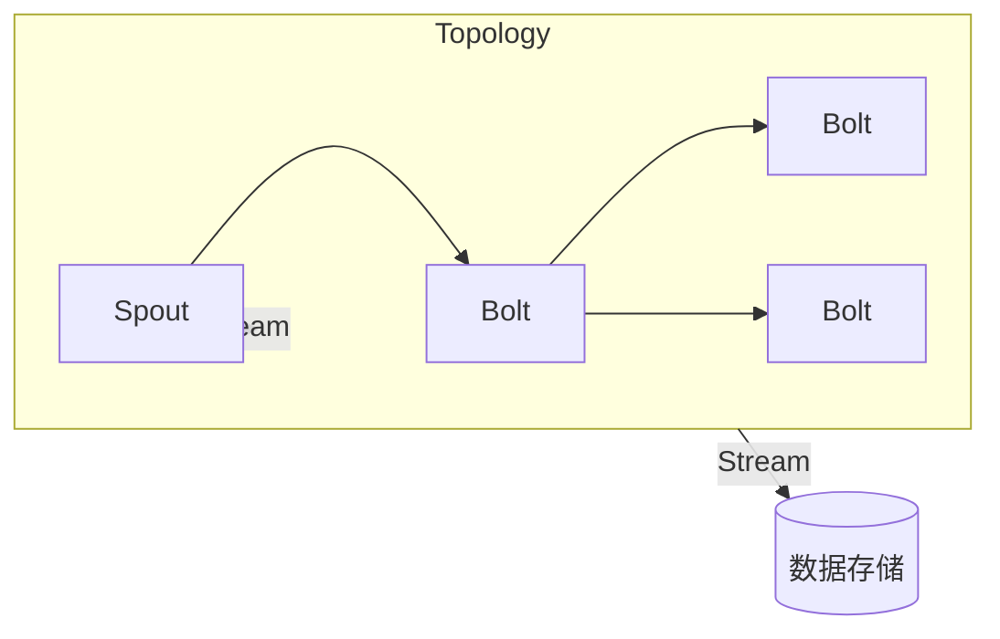
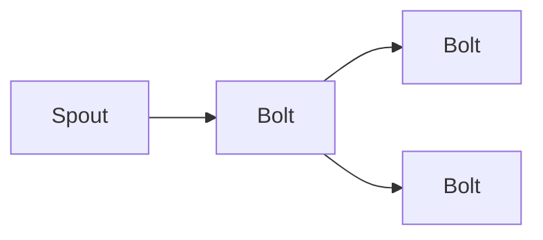

# **从零开始构建StormBolt系统**

## 1.背景介绍

### 1.1 大数据时代的到来

随着互联网、物联网、移动互联网等新兴技术的快速发展,数据呈现出爆炸式增长。根据IDC(国际数据公司)的预测,到2025年,全球数据总量将达到175ZB(1ZB=1万亿TB)。这些海量的数据来源于各个领域,包括社交媒体、电子商务、物联网设备等。传统的数据处理系统已经无法满足实时处理这些大数据的需求。

### 1.2 实时流数据处理的需求

在当今快节奏的商业环境中,企业需要从不断产生的大量数据中及时获取有价值的信息,以支持实时决策和快速响应。传统的批处理系统无法满足这种实时性的要求。因此,实时流数据处理应运而生,成为解决大数据处理挑战的关键技术之一。

### 1.3 Storm简介

Apache Storm是一个分布式、开源的实时计算系统,旨在可靠地处理大量的高速数据流。它具有高度的容错性、水平可扩展性和高吞吐量的特点,广泛应用于实时分析、在线机器学习、持续计算等场景。Storm的核心概念是流(Stream)和拓扑(Topology),其中拓扑由多个Bolt(数据处理单元)和Spout(数据源)组成。

## 2.核心概念与联系

### 2.1 Topology(拓扑)

Topology是Storm中最核心的概念,它定义了数据流的传输路径和处理逻辑。一个Topology由无向循环图(DAG)组成,包含了Spout和Bolt节点,以及它们之间的数据流关系。

### 2.2 Spout

Spout是Topology中的数据源,它从外部系统(如Kafka、数据库等)读取数据,并将数据流注入到Topology中。Spout可以是可靠的(Reliable)或不可靠的(Unreliable),可靠的Spout能够保证数据不会丢失。

### 2.3 Bolt

Bolt是Topology中的数据处理单元,它从Spout或上游Bolt接收数据流,对数据进行处理(过滤、转换、聚合等),并将处理后的数据发送给下游Bolt或最终的目的地(如HDFS、数据库等)。Bolt可以执行任何复杂的流数据处理逻辑。

### 2.4 Stream Grouping(流分组)

Stream Grouping定义了Bolt如何从上游组件(Spout或Bolt)接收数据流的策略。Storm提供了多种Stream Grouping策略,如Shuffle Grouping(随机分组)、Fields Grouping(按字段分组)、Global Grouping(全局分组)等。

### 2.5 Worker进程

Storm在每个工作节点(Worker Node)上启动一个或多个Worker进程,每个Worker进程执行一部分Topology的任务。Worker进程包含了执行组件(Spout或Bolt)的任务,以及它们之间传输数据的线程。

### 2.6 Mermaid流程图



上图展示了一个简单的Storm Topology结构。Spout从外部数据源读取数据,并将数据流注入Topology。数据流经过一系列Bolt进行处理,最终将处理结果发送到数据存储(如HDFS、数据库等)。

## 3.核心算法原理具体操作步骤

### 3.1 Storm集群架构

Storm采用了主从架构,其中包含一个Nimbus节点(主控节点)和多个Supervisor节点(工作节点)。

1. **Nimbus节点**

Nimbus节点负责管理整个Storm集群,包括分配代码、分配任务、监控故障等。它主要执行以下任务:

- 将代码分发到各个Supervisor节点
- 为每个Topology分配任务到工作节点
- 监控各个工作节点的状态,并在发生故障时重新分配任务
- 通过Zookeeper集群来监控整个Storm集群的状态

2. **Supervisor节点**

Supervisor节点是Storm集群的工作节点,负责执行实际的数据处理任务。每个Supervisor节点上运行着一个或多个Worker进程,每个Worker进程执行一部分Topology的任务。Supervisor节点主要执行以下任务:

- 启动或停止Worker进程
- 向Nimbus节点汇报Worker进程的心跳和状态信息
-启动或停止指定的Topology

3. **Zookeeper集群**

Storm使用Zookeeper集群来协调和管理整个集群的状态。Nimbus节点和Supervisor节点都会向Zookeeper集群注册自己的状态信息,并通过Zookeeper进行协调和通信。

### 3.2 Storm流数据处理流程

Storm的流数据处理流程如下:

1. **提交Topology**

开发人员编写Topology代码(包括Spout和Bolt),并将其提交到Nimbus节点。

2. **分发代码**

Nimbus节点将Topology代码分发到各个Supervisor节点。

3. **启动Topology**

Nimbus节点为Topology分配任务到各个Supervisor节点上的Worker进程。

4. **数据处理**

Spout从外部数据源读取数据,并将数据流注入Topology。数据流经过一系列Bolt进行处理,最终将处理结果发送到数据存储(如HDFS、数据库等)。

5. **故障恢复**

如果某个Worker进程或Supervisor节点发生故障,Nimbus节点会自动将失败的任务重新分配到其他节点上,以确保数据处理的持续性和可靠性。

6. **监控和管理**

Nimbus节点和Supervisor节点会持续向Zookeeper集群汇报自身的状态信息,以便于监控和管理整个Storm集群。

## 4.数学模型和公式详细讲解举例说明

在Storm中,流数据处理的核心算法之一是基于有向无环图(DAG)的拓扑结构。每个Topology可以看作是一个DAG,其中节点表示Spout或Bolt,边表示数据流。

### 4.1 DAG表示

我们可以使用邻接矩阵或邻接表来表示一个DAG。对于一个包含$n$个节点的DAG,其邻接矩阵$A$是一个$n \times n$的矩阵,其中$A_{ij}=1$表示存在一条从节点$i$到节点$j$的边,否则$A_{ij}=0$。

例如,对于下面这个简单的Topology:



它的邻接矩阵表示为:

$$
A = \begin{bmatrix}
0 & 1 & 0 & 0\\
0 & 0 & 1 & 1\\
0 & 0 & 0 & 0\\
0 & 0 & 0 & 0
\end{bmatrix}
$$

其中第一行表示Spout1,第二行表示Bolt1,第三行表示Bolt2,第四行表示Bolt3。

### 4.2 数据流路径

在Storm中,数据流从Spout开始,经过一系列Bolt处理后,最终到达目的地(如HDFS、数据库等)。我们可以使用图论中的路径概念来表示数据流的传输路径。

对于一个DAG $G=(V,E)$,其中$V$表示节点集合,$E$表示边集合,路径$P$是一个节点序列$\{v_1, v_2, \dots, v_k\}$,满足对于任意$1 \leq i < k$,都存在一条边$(v_i, v_{i+1}) \in E$。

在上面的Topology示例中,一条可能的数据流路径是:

$$
P = \{\text{Spout1}, \text{Bolt1}, \text{Bolt2}\}
$$

我们可以通过计算路径长度来评估数据处理的复杂度。路径长度$l(P)$定义为路径$P$中边的数量,即:

$$
l(P) = |\{(v_i, v_{i+1}) \in E \mid 1 \leq i < k\}|
$$

对于上面的路径$P$,其长度为$l(P) = 2$。

### 4.3 数据分区策略

在Storm中,每个Bolt可以有多个任务实例(Task)并行执行,以提高数据处理的吞吐量。数据分区策略决定了上游组件(Spout或Bolt)如何将数据流分发给下游Bolt的不同任务实例。

Storm提供了多种数据分区策略,包括:

1. **Shuffle Grouping**

Shuffle Grouping将数据随机分发给下游Bolt的所有任务实例,可以实现良好的负载均衡。

2. **Fields Grouping**

Fields Grouping根据元组(Tuple)中的某些字段值,将相同字段值的元组分发到同一个任务实例中。这种策略常用于基于字段的聚合操作。

3. **Global Grouping**

Global Grouping将所有的元组都发送到同一个任务实例中,适用于需要全局视图的操作,如计数、去重等。

4. **Direct Grouping**

Direct Grouping允许开发人员自定义数据分发策略,将元组直接发送到指定的任务实例中。

我们可以使用概率模型来分析不同分区策略的性能。假设上游组件有$m$个任务实例,下游Bolt有$n$个任务实例,并且每个任务实例的处理能力相同。

对于Shuffle Grouping,每个下游任务实例接收到元组的概率为$\frac{1}{n}$,因此期望每个任务实例处理的负载为$\frac{m}{n}$。

对于Fields Grouping,假设字段值的分布是均匀的,那么每个下游任务实例接收到元组的概率也为$\frac{1}{n}$,期望负载与Shuffle Grouping相同。

对于Global Grouping,只有一个下游任务实例处理所有元组,因此该任务实例的负载为$m$,而其他任务实例的负载为0。

通过分析不同分区策略的期望负载分布,我们可以评估它们的负载均衡性能,并根据具体场景选择合适的策略。

## 5.项目实践：代码实例和详细解释说明

在本节中,我们将通过一个实际项目案例,展示如何从零开始构建一个Storm Topology,并详细解释相关代码。

### 5.1 项目概述

假设我们需要构建一个实时日志分析系统,从Kafka队列中消费日志数据,对日志进行解析、过滤和统计,最终将结果存储到HBase数据库中。

### 5.2 项目结构

```
storm-log-analyzer
├── pom.xml
├── src
│   ├── main
│   │   ├── java
│   │   │   └── com
│   │   │       └── example
│   │   │           ├── bolt
│   │   │           │   ├── FilterBolt.java
│   │   │           │   ├── ParseBolt.java
│   │   │           │   └── StatisticsBolt.java
│   │   │           ├── spout
│   │   │           │   └── KafkaSpout.java
│   │   │           └── topology
│   │   │               └── LogAnalyzerTopology.java
│   │   └── resources
│   │       └── log4j2.xml
└── ...
```

- `bolt`包含三个Bolt类,分别用于解析日志、过滤日志和统计日志。
- `spout`包含从Kafka队列读取日志数据的Spout。
- `topology`包含定义Topology结构的主类。

### 5.3 KafkaSpout

`KafkaSpout`是一个可靠的Spout,它从Kafka队列中读取日志数据,并将数据注入到Topology中。

```java
public class KafkaSpout extends BaseRichSpout {
    private SpoutOutputCollector collector;
    private KafkaConsumer<String, String> consumer;

    @Override
    public void open(Map conf, TopologyContext context, SpoutOutputCollector collector) {
        this.collector = collector;
        // 配置Kafka消费者
        Properties props = new Properties();
        props.put("bootstrap.servers", "kafka-broker:9092");
        props.put("group.id", "storm-log-analyzer");
        props.put("key.deserializer", StringDeserializer.class);
        props.put("value.deserializer", StringDeserializer.class);
        consumer = new KafkaConsumer<>(props);
        consumer.subscribe(Collections.singletonList("log-topic"));
    }

    @Override
    public void nextTuple() {
        ConsumerRecords<String, String> records = consumer.poll(Duration.ofMillis(