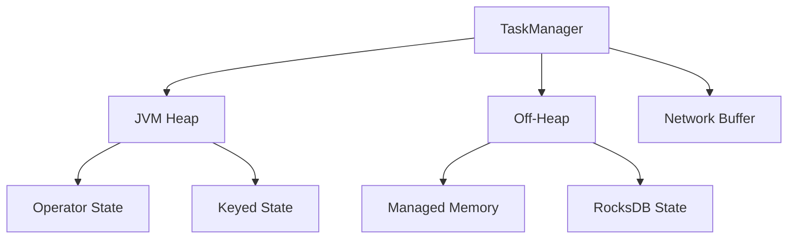

# 优化Flink作业内存利用率:编码实践和调优技巧

## 1. 背景介绍
### 1.1 Flink简介
Apache Flink是一个开源的分布式流处理和批处理框架,旨在提供高吞吐、低延迟、高可用的数据处理能力。Flink以其卓越的性能、灵活的APIs和强大的状态管理能力在业界广受欢迎,被应用于实时数据处理、机器学习、图计算等诸多领域。

### 1.2 Flink作业内存管理的重要性
在Flink作业中,内存是非常宝贵的资源。高效利用内存不仅可以提升系统吞吐量,降低延迟,还能节约成本。然而,如果内存使用不当,就会引发频繁的GC(垃圾回收)、OOM(内存溢出)等问题,严重影响作业的性能和稳定性。因此,深入理解Flink的内存模型,掌握内存优化的最佳实践,对于开发和运维Flink应用至关重要。

### 1.3 本文的主要内容
本文将重点探讨Flink作业内存利用率优化的相关话题,内容涵盖:

- Flink内存管理的核心概念
- 常见的内存问题分析
- 编码实践:数据结构优化、算子优化、序列化优化等
- 内存调优:堆内存、堆外内存、GC参数等
- 监控工具使用
- 典型应用场景最佳实践

通过学习本文,你将对Flink如何管理和优化内存有更加全面和深入的认识,并掌握诸多实用的优化技巧,从而更好地开发和维护高性能的Flink应用。

## 2. 核心概念与联系
### 2.1 TaskManager内存模型
TaskManager是Flink中的工作进程,负责执行具体的计算任务。一个TaskManager通常包含多个插槽(slot),每个插槽运行一个或多个子任务。TaskManager的内存主要由以下几部分组成:

- JVM堆内存:用于存储算子的数据结构、中间结果等。
- 堆外内存:包括Direct Memory(JVM直接内存)和Native Memory(本地内存),用于执行计算、缓存数据、与外部系统交互等。
- Network Buffer:用于数据在算子和TaskManager之间的传输。

### 2.2 StateBackend与状态管理
StateBackend是Flink管理状态的核心组件。Flink提供了3种StateBackend:

- MemoryStateBackend:基于JVM堆内存,适合用于调试或小状态的场景。
- FsStateBackend:将状态数据持久化到文件系统(本地或HDFS),适合状态比较大的场景。
- RocksDBStateBackend:将状态数据维护在RocksDB(内嵌的key-value存储)中,利用堆外内存,适合超大状态的场景。

### 2.3 Flink的内存管理机制
Flink采用了一套复杂的内存管理机制来提高内存利用率,主要包括:

- 对象重用:通过对象池等方式尽量重用对象,减少创建和GC的开销。
- 堆外内存:使用堆外内存(Off-Heap)来存储中间数据,降低GC压力。
- 内存预分配:在作业启动时就预先分配好内存,减少动态分配的开销。
- 缓存友好:算法和数据结构考虑了缓存局部性,尽量减少缓存miss。

下图描述了Flink TaskManager内存模型的核心组成部分:



## 3. 核心算法原理具体操作步骤
优化Flink作业内存利用率需要从多个方面入手,下面我们重点介绍几种核心的优化算法和操作步骤。

### 3.1 数据结构优化
选择合适的数据结构是提高内存利用率的关键。以下是一些常用的优化方法:

1. 使用原始类型(Primitive Type):尽量使用long、int、double等原始类型,避免不必要的封装类型,如Long、Integer等,因为封装类型会带来额外的内存开销。

2. 字符串拼接:在进行大量字符串拼接时,使用StringBuilder或StringBuffer,避免产生大量的中间String对象。

3. 集合类型:
   - 尽量使用ArrayList而不是LinkedList,除非需要频繁的插入删除操作。
   - 对于Map,根据key的类型和数量选择HashMap、TreeMap或EnumMap。
   - 对于Set,尽量使用HashSet或EnumSet。
   - 对于固定长度的列表,使用Array而不是ArrayList。

4. 对象重用:对于会被频繁创建和销毁的对象,可以使用对象池来重用对象,避免不断地创建和GC。典型的例子有:
   - 字符串常量
   - 缓冲区
   - 大对象如自定义的POJO类

5. 位运算:使用位运算代替算术运算,如用`>>1`代替`/2`,用`&`代替`%`等。

6. 数据压缩:对于某些可以接受数据损失的场景,可以使用压缩算法如LZ4、Snappy等对数据进行压缩,节约内存。

### 3.2 算子优化
Flink提供了丰富的算子(Operator),合理使用算子可以显著提升作业的性能和内存利用率。

1. 过滤器(Filter):尽早地过滤掉不需要的数据,减少后续算子的数据量。

2. 投影(Map):仅选择需要的字段,去除无用字段,减小数据宽度。

3. 分区(Partition):根据数据特点选择合适的分区策略,如Hash、Range、Custom等,提高并行度和负载均衡。

4. 广播变量(Broadcast Variable):对于一些需要在所有任务中共享且不太大的数据集,可以使用广播变量来避免Task之间的数据复制。

5. 异步IO(Async IO):对于一些耗时的IO操作,如访问外部服务、读写数据库等,可以使用异步IO来避免阻塞,提高吞吐。

6. 流批一体(Streaming Batch Unification):合理利用流批一体API,如Table/SQL API,简化编程复杂度的同时,获得更好的性能。

### 3.3 序列化优化
序列化(Serialization)在分布式计算中扮演着重要角色,高效的序列化机制可以大幅减少数据传输和存储的开销。Flink支持多种序列化框架,如Kryo、Avro、Protobuf等。

1. Kryo:Flink默认使用Kryo进行序列化,相比Java自带的序列化机制,Kryo拥有更高的性能和更小的序列化结果。在使用Kryo时需要注意以下几点:
   - 对于自定义的类,最好是无状态的,只包含public的属性,并且有一个无参的构造函数。
   - 可以对经常使用的自定义类进行预注册,提高序列化性能。
   - 尽量避免在反序列化时重新分配内存,可以通过`Kryo.setReferences(false)`关闭引用追踪。

2. Avro:Avro是一个面向Schema的序列化系统,使用JSON定义数据结构,可以实现语言无关的序列化。Avro的特点是:
   - 序列化后的数据可读性强,方便调试。
   - 可以支持Schema的演进,增强了数据兼容性。
   - 压缩率高,可以显著减小数据体积。

3. Protobuf:Protobuf是Google开发的一种数据交换格式,以.proto文件定义数据结构,然后通过代码生成器生成各种语言的实现。Protobuf的优势有:
   - 性能非常高,序列化和反序列化速度快。
   - 数据压缩率高,减少传输和存储开销。
   - 支持向前兼容和向后兼容,适合服务升级等场景。

不同的场景可以选择不同的序列化机制,在性能、可读性、兼容性等方面进行权衡。

## 4. 数学模型和公式详细讲解举例说明
在Flink作业调优中,我们经常需要估算内存使用量,为任务分配合适的资源。这里给出几个常用的内存估算公式。

### 4.1 算子内存
对于一个算子,它的内存使用量主要由以下几部分组成:
- 操作员本身的内存
- 输入数据缓存
- 输出数据缓存
- 用户自定义函数(UDF)对象
- 第三方库

我们可以用下面的公式来估算一个算子的内存使用量:

$OperatorMem = C_{op} + MaxInput \times InputRowSize + MaxOutput \times OutputRowSize + C_{udf} + C_{lib}$

其中:
- $C_{op}$表示算子本身的内存开销,如算法中使用的数据结构。
- $MaxInput$表示算子输入数据缓存的最大行数。
- $InputRowSize$表示输入数据每行的平均大小。 
- $MaxOutput$表示算子输出数据缓存的最大行数。
- $OutputRowSize$表示输出数据每行的平均大小。
- $C_{udf}$表示用户自定义函数的内存开销。
- $C_{lib}$表示算子使用的第三方库的内存开销。

举例说明:假设我们有一个Map算子,它将输入的整数翻倍后输出。假设输入和输出的缓存都不超过1000行,每个整数占4字节,算子本身使用一个ArrayList存储中间结果,UDF和第三方库的开销可以忽略不计。那么这个算子的内存使用量可以估算为:

$OperatorMem = 1000 \times 4 \times 2 + 1000 \times 4 \times 2 = 16000 \text{ Bytes} = 16 \text{ KB}$

可以看出,对于这个简单的Map算子,16KB的内存就足够了。但在实际生产中,数据量往往很大,中间结果可能需要缓存在内存中,这时就需要仔细评估内存的使用量,以免发生OOM。

### 4.2 状态内存
上面的公式只考虑了算子本身的内存开销,但在实际作业中,很多算子需要维护状态,如WindowOperator、JoinOperator等。状态的内存开销取决于状态的大小和状态后端(StateBackend)的实现。

对于MemoryStateBackend和FsStateBackend,状态存储在JVM堆上,我们可以用下面的公式来估算状态内存:

$StateMem = \sum_i (NumKeys_i \times KeySize_i + NumValues_i \times ValueSize_i)$

其中:
- $NumKeys_i$表示第i个状态的key数量。
- $KeySize_i$表示第i个状态的平均key大小。
- $NumValues_i$表示第i个状态的value数量。
- $ValueSize_i$表示第i个状态的平均value大小。

举例说明:假设我们有一个EventTimeWindow算子,它按照用户ID和5分钟的窗口进行统计,每个窗口保存累加的点击次数。假设我们预期有10万用户,每个用户平均每小时产生100个事件,窗口长度为5分钟,统计的时间范围为1小时。那么总共需要维护的窗口数量为:

$NumWindows = 100000 \times 12 = 1200000$

每个窗口只需要保存一个整数,占用4字节。用户ID作为key,假设平均占用8字节。那么这个算子的状态内存可以估算为:

$StateMem = 1200000 \times (8 + 4) = 14400000 \text{ Bytes} \approx 13.7 \text{ MB}$

可以看出,即使对于这样一个简单的统计,状态内存的消耗也不容小觑。如果窗口长度更长或统计维度更多,状态量会进一步膨胀。这时就需要考虑更高级的StateBackend,如RocksDBStateBackend,它使用RocksDB管理状态,大部分状态数据可以存储在堆外内存乃至磁盘上,而不占用宝贵的JVM堆内存。

## 5. 项目实践：代码实例和详细解释说明
下面我们用一个实际的Flink作业代码示例来说明如何进行内存优化。这个作业从Kafka读取用户点击事件,按照用户ID和5分钟的EventTime窗口进行统计,然后将结果写入MySQL。

### 5.1 未优化的代码
```java
public class Click