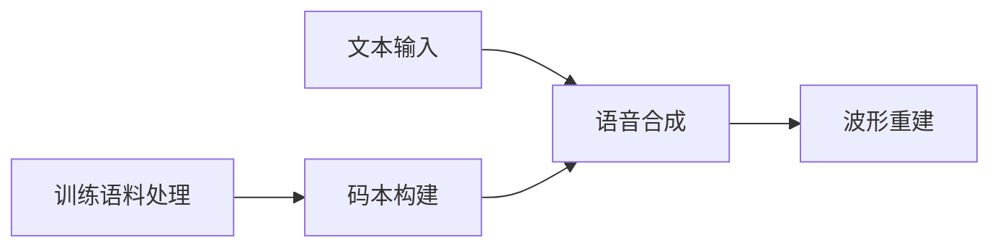

# 低资源场景下的语音合成技术

## 1.背景介绍

语音合成技术是指利用计算机系统将文本转换为人工语音的技术。随着人工智能和语音技术的不断发展,语音合成已经广泛应用于虚拟助手、导航系统、无障碍辅助等多个领域。然而,在低资源场景下(如嵌入式设备、边缘计算等),由于计算能力、存储空间和功耗等方面的限制,传统的语音合成方法往往难以满足实际需求。因此,开发适用于低资源场景的高效语音合成技术就显得尤为重要。

## 2.核心概念与联系

### 2.1 语音合成基本流程

语音合成的基本流程包括三个主要步骤:

1. **文本分析**:将输入文本转换为语音符号序列,包括词法分析、句法分析、语义分析等。
2. **语音建模**:根据语音符号序列,选择对应的语音单元(如音素、双音、三音节等),并进行连接和平滑处理。
3. **波形合成**:将语音单元序列合成为连续的语音波形信号。


### 2.2 低资源场景的挑战

在低资源场景下,语音合成技术面临以下主要挑战:

- **计算资源有限**:嵌入式设备和边缘计算设备通常具有有限的CPU和GPU计算能力,无法承担复杂的语音合成算法。
- **存储空间受限**:语音合成系统需要存储大量的语音单元数据,而低资源设备的存储空间往往较小。
- **实时性要求高**:某些应用场景(如对话系统)要求语音合成具有低延迟和高实时性。
- **功耗约束严格**:移动设备和物联网设备对功耗有严格的限制,需要高效的语音合成算法。

## 3.核心算法原理具体操作步骤

为了满足低资源场景的需求,研究人员提出了多种高效的语音合成算法,包括:

### 3.1 参数化语音合成

参数化语音合成(如STRAIGHT、WORLD等)是一种基于源滤波模型的语音合成方法。它将语音信号分解为激励源(如声源)和滤波器(如声道)两个部分,分别对它们进行编码和建模,从而大幅降低了存储和计算开销。

参数化语音合成的基本步骤如下:

1. **语音分析**:将训练语音分解为激励源参数和滤波器参数。
2. **参数编码**:对分解得到的参数进行有损压缩编码,以减小存储空间。
3. **语音合成**:根据输入文本,从编码参数中选择对应的语音单元参数,并进行连接和平滑处理。
4. **波形重建**:利用合成的激励源参数和滤波器参数,重建出最终的语音波形。


### 3.2 码书驱动语音合成

码书驱动语音合成(Codebook-driven)是另一种常用的低资源语音合成方法。它的核心思想是将语音单元(如音素、双音等)量化为有限的码本条目,大幅压缩了语音单元数据的存储空间。

码书驱动语音合成的基本步骤如下:

1. **训练语料处理**:将训练语料分割为语音单元序列。
2. **码本构建**:对语音单元进行矢量量化,构建码本(即语音单元的量化集合)。
3. **语音合成**:根据输入文本,从码本中选择对应的语音单元码本条目,并进行连接和平滑处理。
4. **波形重建**:利用码本条目对应的语音单元波形数据,重建出最终的语音波形。



### 3.3 统计参数化语音合成

统计参数化语音合成(Statistical Parametric Speech Synthesis,SPSS)是一种结合了参数化语音合成和统计建模方法的新型语音合成技术。它利用隐马尔可夫模型(HMM)或深度神经网络(DNN)等统计模型,对语音参数(如频谱包络、基频等)进行建模和生成。

统计参数化语音合成的基本步骤如下:

1. **训练语料处理**:将训练语料分割为语音单元序列,并提取相应的语音参数。
2. **统计建模**:利用HMM、DNN等模型,对语音参数进行统计建模。
3. **语音合成**:根据输入文本,利用统计模型生成对应的语音参数序列。
4. **波形重建**:利用生成的语音参数,重建出最终的语音波形。


### 3.4 端到端神经语音合成

近年来,随着深度学习技术的快速发展,端到端神经语音合成(End-to-End Neural TTS)成为了一种新兴的低资源语音合成方法。它利用序列到序列(Seq2Seq)模型等深度神经网络,直接将文本转换为语音波形或语音参数,避免了中间的语音建模过程。

端到端神经语音合成的基本步骤如下:

1. **训练语料处理**:准备文本和对应的语音波形数据作为训练集。
2. **模型训练**:使用Seq2Seq、Transformer等深度学习模型,在训练集上进行端到端的模型训练。
3. **语音合成**:将输入文本送入训练好的模型,直接生成对应的语音波形或语音参数。
4. **波形重建(可选)**:如果模型输出为语音参数,则需要进一步重建语音波形。

```mermaid
graph LR
    A[训练语料处理] --> B[模型训练]
    C[文本输入] --> D[语音合成]
    B --> D
    D --> E[波形重建(可选)]
```

## 4.数学模型和公式详细讲解举例说明

### 4.1 参数化语音合成中的源滤波模型

在参数化语音合成中,常用的源滤波模型是STRAIGHT(Speech Transformation and Representation using Adaptive Interpolation of weiGHTed spectrogram)模型。它将语音信号 $s(t)$ 分解为激励源 $e(t)$ 和滤波器 $h(t)$ 两部分:

$$s(t) = e(t) * h(t)$$

其中,激励源 $e(t)$ 表示声源信息(如基频、声门脉冲等),滤波器 $h(t)$ 表示声道信息(如共振峰等)。

在STRAIGHT模型中,激励源和滤波器的参数化表示分别为:

- 激励源参数:基频 $F_0$、时间轴扭曲参数 $\alpha_p$。
- 滤波器参数:平滑的频谱包络 $c(t, \omega)$、非平滑的频谱包络 $a(t, \omega)$。

通过对这些参数进行编码和解码,可以实现高效的语音合成和重建。

### 4.2 码书驱动语音合成中的矢量量化

在码书驱动语音合成中,常用的矢量量化(Vector Quantization,VQ)算法是 $k$-means 聚类算法。它的目标是将 $N$ 个 $D$ 维语音单元矢量 $\{x_1, x_2, \dots, x_N\}$ 划分为 $K$ 个簇,每个簇由一个码本矢量 $\{c_1, c_2, \dots, c_K\}$ 代表。

$k$-means 算法的目标函数为:

$$J = \sum_{n=1}^N \min_{1 \leq k \leq K} \|x_n - c_k\|^2$$

算法通过迭代优化,最小化目标函数 $J$,从而得到最优的码本矢量集合。

在语音合成时,每个输入的语音单元矢量将被量化为最近的码本矢量,从而大幅减小了语音单元数据的存储空间。

### 4.3 统计参数化语音合成中的隐马尔可夫模型

在统计参数化语音合成中,常用的统计模型是隐马尔可夫模型(Hidden Markov Model,HMM)。HMM可以有效地对时序数据(如语音参数序列)进行建模和生成。

设 $O = \{o_1, o_2, \dots, o_T\}$ 为观测序列(如频谱参数序列), $Q = \{q_1, q_2, \dots, q_T\}$ 为隐状态序列(如音素状态序列),HMM的目标是最大化观测序列的概率 $P(O|\lambda)$,其中 $\lambda$ 是HMM的参数集合。

HMM的三个基本问题及解决方法如下:

1. **评估问题**:给定模型 $\lambda$ 和观测序列 $O$,计算 $P(O|\lambda)$,可使用前向算法。
2. **学习问题**:给定观测序列 $O$,估计模型参数 $\lambda$,可使用 Baum-Welch 算法。
3. **解码问题**:给定模型 $\lambda$ 和观测序列 $O$,找到最优隐状态序列 $Q^*$,可使用 Viterbi 算法。

通过在大量训练语料上训练 HMM,可以得到能够生成任意语音参数序列的统计模型,从而实现高效的语音合成。

### 4.4 端到端神经语音合成中的注意力机制

在端到端神经语音合成中,常用的模型架构是基于注意力机制(Attention Mechanism)的 Seq2Seq 模型。注意力机制能够有效地捕捉输入序列和输出序列之间的长程依赖关系,从而提高了模型的性能。

设输入序列为 $X = \{x_1, x_2, \dots, x_T\}$(如字符序列),输出序列为 $Y = \{y_1, y_2, \dots, y_U\}$(如语音参数序列或波形序列)。注意力机制的计算过程如下:

1. 计算查询向量 $q_t$、键向量 $k_s$ 和值向量 $v_s$:

$$q_t = W_q h_t, \quad k_s = W_k x_s, \quad v_s = W_v x_s$$

2. 计算注意力权重 $\alpha_{ts}$:

$$\alpha_{ts} = \text{softmax}(q_t^T k_s / \sqrt{d_k})$$

3. 计算注意力向量 $a_t$:

$$a_t = \sum_{s=1}^T \alpha_{ts} v_s$$

4. 将注意力向量 $a_t$ 与解码器隐状态 $h_t$ 结合,生成输出 $y_t$。

通过端到端的训练,模型可以自动学习输入文本和输出语音之间的映射关系,实现高效且高质量的语音合成。

## 5.项目实践:代码实例和详细解释说明

为了更好地理解低资源语音合成技术,我们以 TensorFlow 实现的统计参数化语音合成系统为例,介绍具体的代码实现和运行流程。

### 5.1 数据准备

首先,我们需要准备训练语料,包括文本transcript和对应的语音参数序列。这里我们使用 CMU Arctic 语音数据集,并提取STRAIGHT频谱参数作为语音参数。

```python
import numpy as np
import os

# 读取文本transcript
transcript_dir = 'data/transcript'
transcripts = []
for file in os.listdir(transcript_dir):
    with open(os.path.join(transcript_dir, file), 'r') as f:
        transcripts.append(f.read().strip())

# 读取语音参数序列
param_dir = 'data/param'
param_seqs = []
for file in os.listdir(param_dir):
    param_seq = np.load(os.path.join(param_dir, file))
    param_seqs.append(param_seq)
```

### 5.2 HMM 训练

接下来,我们使用 hmmlearn 库构建和训练 HMM 模型。我们将每个音素状态建模为一个 HMM 状态,并使用