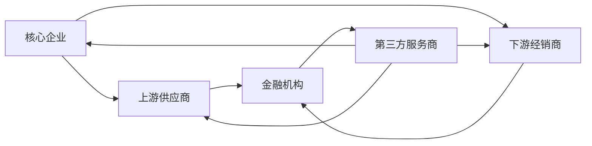

# 供应链金融的创新模式

## 1. 背景介绍

### 1.1 供应链金融的定义与特点

供应链金融是指银行等金融机构为供应链上下游企业提供的一系列金融服务，旨在优化资金流动，提高供应链整体效率。它以真实贸易为基础，利用供应链上下游企业之间的信用关系，为企业提供融资、结算、理财等综合性金融服务。

供应链金融具有以下特点：
1. 以真实贸易为基础，风险可控
2. 融资方式灵活多样，满足企业不同需求
3. 利用供应链上下游信用，降低融资成本
4. 优化资金流动，提高供应链效率

### 1.2 供应链金融的发展现状

近年来，随着互联网技术的发展，供应链金融迎来了新的发展机遇。越来越多的金融机构和科技公司开始探索供应链金融的创新模式，利用大数据、区块链等新兴技术，为中小企业提供更加便捷、高效的金融服务。

目前，供应链金融的主要模式包括：
1. 应收账款融资
2. 存货质押融资 
3. 预付款融资
4. 保理融资
5. 供应链协同平台融资

这些模式在帮助中小企业缓解融资难题的同时，也推动了供应链的数字化转型和升级。

## 2. 核心概念与联系

### 2.1 供应链金融生态系统

供应链金融是一个多方参与的生态系统，主要涉及以下角色：

1. 核心企业：供应链中的龙头企业，信用等级高，在供应链中处于主导地位。
2. 上游供应商：为核心企业提供原材料、零部件等产品和服务的中小企业。
3. 下游经销商：从核心企业采购产品，并销售给终端客户的中小企业。
4. 金融机构：为供应链上下游企业提供金融服务的银行、保理公司等。
5. 物流公司：为供应链上下游企业提供仓储、运输等物流服务的企业。
6. 第三方服务商：为供应链金融提供技术支持、风控服务等的科技公司、征信机构等。

这些角色之间通过贸易往来、信息共享、风险分担等方式，形成了一个紧密联系、互利共赢的生态系统。

### 2.2 供应链金融的运作机制

供应链金融的运作机制可以用下面这张流程图来表示：



1. 核心企业与上游供应商、下游经销商开展贸易往来，形成应收账款、预付款等金融资产。
2. 上游供应商和下游经销商将这些金融资产转让给金融机构，申请融资。
3. 金融机构对融资申请进行审核，通过后为企业发放贷款。
4. 第三方服务商为金融机构提供尽职调查、风险评估等服务，帮助其控制风险。
5. 第三方服务商也为核心企业、上下游企业提供供应链管理、信息共享等服务，提高供应链效率。

通过这种运作机制，供应链上的资金流、信息流、物流得以高效整合，形成了风险可控、多方共赢的金融生态。

## 3. 核心算法原理具体操作步骤

### 3.1 基于区块链的供应链金融平台

区块链技术以其去中心化、不可篡改、可追溯等特点，为供应链金融提供了新的解决方案。基于区块链的供应链金融平台，可以实现贸易数据的可信共享、自动化合约执行、实时动态风控等功能，大大提高了供应链金融的效率和安全性。

其核心算法原理可以概括为以下步骤：

1. 数字身份验证：参与方通过数字证书等方式，在区块链上建立可信数字身份。
2. 贸易数据上链：将贸易合同、发票、物流单据等数据，以加密的方式存储到区块链上。  
3. 智能合约执行：根据预设条件，自动执行付款、融资等操作，确保资金安全。
4. 实时风控监测：通过对链上数据的分析，实时监测贸易风险，触发预警和处置机制。
5. 隐私保护机制：采用零知识证明、同态加密等技术，在共享数据的同时保护商业秘密。

### 3.2 基于大数据的供应链金融风控

大数据分析技术可以帮助金融机构从海量的贸易数据中，挖掘企业信用状况、经营风险等有价值的信息，从而做出更加精准的风控决策。

其核心算法原理可以概括为以下步骤：

1. 数据采集：从ERP系统、物流系统、行业数据库等渠道，采集企业的结构化和非结构化数据。
2. 数据清洗：对采集到的数据进行去重、去噪、归一化等预处理，提高数据质量。
3. 特征工程：从原始数据中提取有业务价值的特征，如企业资产负债率、应收账款周转率等。
4. 模型训练：采用机器学习算法，如决策树、神经网络等，基于历史数据训练风控模型。
5. 模型评估：采用交叉验证等方法，评估模型的准确率、召回率、F1值等指标，优化模型参数。
6. 模型应用：将训练好的模型部署到生产环境，对新申请的融资进行风险评分和授信额度判断。

通过机器学习算法从数据中自动学习风控规则，可以弥补传统专家经验的局限性，提高风控的效率和准确性。

## 4. 数学模型和公式详细讲解举例说明

### 4.1 应收账款融资的贴现模型

应收账款融资是供应链金融的重要模式之一，其核心是对应收账款进行贴现，提前获得资金。

假设某企业持有一笔应收账款，面值为$M$，到期日为$T$，贴现日为$t$，贴现率为$r$，则贴现金额$P$的计算公式为：

$$
P = \frac{M}{(1+r)^{\frac{T-t}{365}}}
$$

其中，$\frac{T-t}{365}$表示贴现期限，以年为单位。

举例说明：某企业持有一笔面值为100万元的应收账款，到期日为90天后，现在需要贴现融资，贴现率为6%，则贴现金额为：

$$
P = \frac{1,000,000}{(1+6\%)^{\frac{90}{365}}} \approx 985,049元
$$

企业可以通过应收账款贴现，提前获得985,049元的资金，缓解流动性压力。

### 4.2 供应链协同平台的收益分配模型

供应链协同平台通过整合供应链上下游企业的资源，提高整体效率，实现收益共享。

假设平台的总收益为$R$，上游企业的投入成本为$C_1$，下游企业的投入成本为$C_2$，平台的运营成本为$C_p$，则平台的净收益$NR$为：

$$
NR = R - C_1 - C_2 - C_p
$$

进一步，假设上游企业的收益分配比例为$\alpha$，下游企业的收益分配比例为$\beta$，平台的收益分配比例为$1-\alpha-\beta$，则各方的收益分别为：

$$
R_1 = \alpha \times NR + C_1 \\
R_2 = \beta \times NR + C_2 \\
R_p = (1-\alpha-\beta) \times NR + C_p
$$

通过调整$\alpha$和$\beta$的取值，可以实现平台收益的合理分配，激励各方积极参与协同。

举例说明：某供应链协同平台的总收益为1000万元，上游企业的投入成本为200万元，下游企业的投入成本为300万元，平台的运营成本为100万元，则平台的净收益为：

$$
NR = 10,000,000 - 2,000,000 - 3,000,000 - 1,000,000 = 4,000,000元
$$

假设上游企业的收益分配比例为30%，下游企业的收益分配比例为40%，平台的收益分配比例为30%，则各方的收益分别为：

$$
R_1 = 30\% \times 4,000,000 + 2,000,000 = 3,200,000元 \\
R_2 = 40\% \times 4,000,000 + 3,000,000 = 4,600,000元 \\
R_p = 30\% \times 4,000,000 + 1,000,000 = 2,200,000元
$$

通过合理的收益分配，可以调动各方的积极性，实现协同共赢。

## 5. 项目实践：代码实例和详细解释说明

下面是一个基于区块链的供应链金融平台的核心代码实例，采用Solidity语言编写智能合约：

```solidity
pragma solidity ^0.8.0;

contract SupplyChainFinance {
    
    struct Invoice {
        uint256 invoiceId;
        address seller;
        address buyer;
        uint256 amount;
        uint256 dueDate;
        bool isPaid;
    }
    
    mapping(uint256 => Invoice) public invoices;
    uint256 public invoiceCount;
    
    event InvoiceCreated(uint256 invoiceId, address seller, address buyer, uint256 amount, uint256 dueDate);
    event InvoicePaid(uint256 invoiceId);
    
    function createInvoice(address buyer, uint256 amount, uint256 dueDate) public {
        invoiceCount++;
        invoices[invoiceCount] = Invoice(invoiceCount, msg.sender, buyer, amount, dueDate, false);
        emit InvoiceCreated(invoiceCount, msg.sender, buyer, amount, dueDate);
    }
    
    function payInvoice(uint256 invoiceId) public payable {
        Invoice storage invoice = invoices[invoiceId];
        require(msg.value == invoice.amount, "Incorrect payment amount");
        require(msg.sender == invoice.buyer, "Only buyer can pay the invoice");
        require(!invoice.isPaid, "Invoice already paid");
        require(block.timestamp <= invoice.dueDate, "Payment is overdue");
        
        invoice.isPaid = true;
        payable(invoice.seller).transfer(msg.value);
        emit InvoicePaid(invoiceId);
    }
}
```

代码详细解释：

1. 定义了一个`Invoice`结构体，包含发票ID、卖方地址、买方地址、金额、到期日、是否已付款等字段。
2. 定义了一个`invoices`映射，用于根据发票ID存储发票信息。
3. 定义了一个`invoiceCount`变量，用于记录发票的总数。
4. 定义了两个事件`InvoiceCreated`和`InvoicePaid`，分别在创建发票和支付发票时触发。
5. `createInvoice`函数用于创建新的发票，将发票信息存储到`invoices`映射中，并触发`InvoiceCreated`事件。
6. `payInvoice`函数用于买方支付发票，需要传入发票ID和支付金额，合约会检查支付金额、支付者身份、发票状态和到期日等条件，如果满足条件，则将发票标记为已付款，并将资金转给卖方，最后触发`InvoicePaid`事件。

这个智能合约实现了发票的创建和支付功能，通过将发票信息存储到区块链上，确保了数据的不可篡改和可追溯性，同时利用智能合约自动执行付款，提高了供应链金融的效率和安全性。

## 6. 实际应用场景

供应链金融的创新模式在多个行业得到了广泛应用，下面是几个典型的应用场景：

### 6.1 汽车行业

在汽车行业，核心企业（整车厂）与上游零部件供应商、下游经销商之间存在大量的应收账款和预付款。通过供应链金融，可以盘活这些资金，提高资金周转效率。

例如，整车厂可以将对经销商的应收账款，打包成资产支持证券（ABS），出售给投资者，提前回笼资金。而零部件供应商可以将对整车厂的应收账款，转让给银行等金融机构，申请保理融资。

### 6.2 电子制造业

电子制造业的供应链非常复杂，涉及原材料供应商、元器件供应商、代工厂、品牌商等多个环节。这些企业普遍面临资