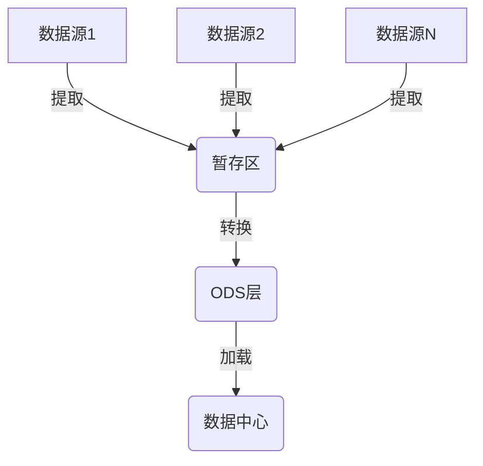
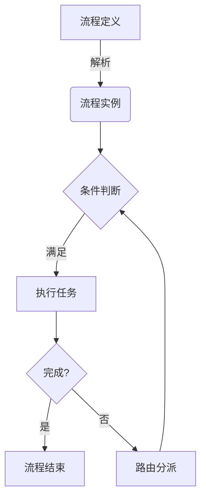
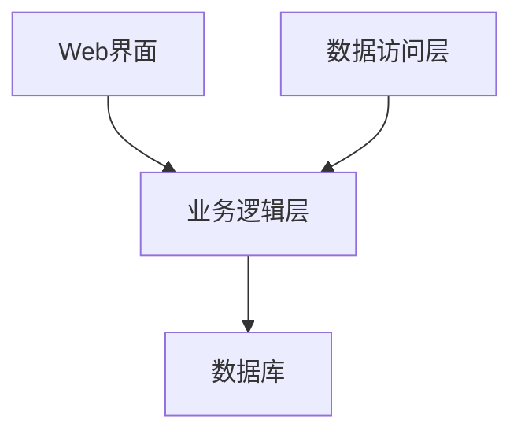

# 公司事务管理系统详细设计与具体代码实现

## 1.背景介绍

随着企业规模的不断扩大和业务复杂度的增加,有效的公司事务管理系统变得越来越重要。公司事务涵盖了人力资源、财务、采购、销售、客户关系等多个方面,需要对海量数据进行高效处理和分析,以支持企业的决策和运营。传统的手工处理方式已经无法满足现代企业对效率和准确性的需求,因此开发一个集成化、智能化的公司事务管理系统势在必行。

## 2.核心概念与联系

公司事务管理系统的核心概念包括:

1. **数据集成**: 将来自不同部门和系统的数据整合到统一的数据中心,实现数据的共享和交互。

2. **业务流程自动化**: 通过建模和执行工作流程,自动完成各项事务的审批、分派和监控,提高效率。

3. **决策支持**: 利用数据分析和商业智能技术,为管理层提供决策依据和预测分析。

4. **权限管理**: 根据职责和级别,控制不同用户对系统功能和数据的访问权限。

5. **报表生成**: 定期生成各类报表,用于呈现关键业务指标和运营情况。

这些核心概念相互关联,共同构建了一个完整的企业事务管理体系。

## 3.核心算法原理具体操作步骤

### 3.1 数据集成算法

数据集成算法负责从不同数据源提取、转换和加载数据到统一的数据中心。常用的ETL(Extract-Transform-Load)流程如下:



1. **提取(Extract)**: 从各个异构数据源读取数据,可以是关系型数据库、NoSQL数据库、文件等。

2. **转换(Transform)**: 对提取的数据执行清洗、转换、合并等操作,使其符合统一的数据格式。

3. **加载(Load)**: 将转换后的数据加载到目标数据中心,可分为ODS(操作数据存储)、DW(数据仓库)等层次。

### 3.2 业务流程自动化算法

业务流程自动化算法通过对流程进行建模和执行,实现事务的自动化处理。常用的工作流模型是有向无环图,节点表示任务,边表示执行顺序,算法流程如下:



1. **流程定义**: 根据业务需求,使用流程建模工具定义流程模型。

2. **解析执行**: 系统解析流程定义,生成流程实例并执行。

3. **条件判断**: 根据流程节点的条件,判断是否满足执行要求。

4. **任务执行**: 满足条件后,执行对应的任务,可由系统自动执行或人工介入。

5. **路由分派**: 根据任务执行结果,判断下一步执行路径,分派到对应的节点。

6. **流程结束**: 所有任务执行完毕后,结束整个流程实例。

### 3.3 决策支持算法

决策支持算法通过数据挖掘和机器学习技术,从海量数据中发现有价值的模式和知识,为企业决策提供依据。常用的算法包括:

- **关联规则挖掘**: 发现数据集中的频繁项集和相关性规则,如购物篮分析。

- **聚类分析**: 将数据划分为多个簇,发现数据内在的分组结构,如客户细分。

- **分类预测**: 构建分类模型,对未知数据进行分类预测,如信用评分。

- **回归分析**: 建立自变量和因变量之间的数学关系模型,用于预测数值型目标变量,如销量预测。

- **时序预测**: 分析时间序列数据的模式和趋势,预测未来的发展情况,如库存预测。

这些算法可以与可视化技术相结合,为决策者提供直观的数据报表和分析结果。

## 4.数学模型和公式详细讲解举例说明

### 4.1 关联规则挖掘

关联规则挖掘旨在发现数据集中的频繁项集和相关性规则,常用于购物篮分析、网页推荐等场景。

定义:
- 设 $I = \{i_1, i_2, ..., i_m\}$ 为项集,数据集 $D$ 是 $I$ 上的交易记录集合。
- 项集 $X \subseteq I$ 在数据集 $D$ 中的支持度为:
$$
support(X) = \frac{|\\{t \in D | X \subseteq t\\}|}{|D|}
$$

- 对于关联规则 $X \Rightarrow Y$,其支持度为 $support(X \cup Y)$,置信度为:
$$
confidence(X \Rightarrow Y) = \frac{support(X \cup Y)}{support(X)}
$$

算法步骤:

1. **频繁项集发现**: 使用Apriori算法或FP-Growth算法发现满足最小支持度阈值的频繁项集。

2. **规则生成**: 对于每个频繁项集 $X$,生成所有非空子集 $Y \subset X$,计算关联规则 $Y \Rightarrow (X - Y)$ 的置信度,保留满足最小置信度阈值的规则。

3. **规则评估**: 根据支持度、置信度等指标,评估和筛选有价值的关联规则。

### 4.2 聚类分析

聚类分析旨在将数据划分为多个簇,使得同一簇内的对象相似度高,不同簇之间的对象相似度低。常用于客户细分、图像分割等场景。

定义:
- 设数据集 $D = \\{x_1, x_2, ..., x_n\\}$,其中 $x_i$ 是 $d$ 维向量。
- 聚类目标是将 $D$ 划分为 $k$ 个簇 $C = \\{C_1, C_2, ..., C_k\\}$,使得目标函数 $J(C)$ 最小化。

常用的聚类算法包括:

- **K-Means**: 基于距离的划分聚类算法,目标函数为:
$$
J(C) = \sum_{i=1}^{k}\sum_{x \in C_i}||x - \mu_i||^2
$$
其中 $\mu_i$ 为第 $i$ 个簇的质心。算法通过迭代优化簇划分和质心位置。

- **层次聚类**: 通过递归的聚合或分裂操作构建层次聚类树。常用的聚合策略包括单链接、完全链接、平均链接等。

- **密度聚类**: 基于密度的聚类算法,如DBSCAN,将高密度区域视为簇,低密度区域视为噪声。

- **模糊聚类**: 每个对象都具有不同簇的隶属度,如FCM(Fuzzy C-Means)算法。

聚类算法的性能评估通常使用轮廓系数、DB指数等指标。

## 5.项目实践:代码实例和详细解释说明

本节将通过一个基于Python的公司人力资源管理系统示例,展示系统的具体设计和实现。

### 5.1 系统架构

该系统采用三层架构设计,包括表示层、业务逻辑层和数据访问层。



- **表示层**: 基于Flask Web框架,提供用户界面和交互功能。
- **业务逻辑层**: 实现核心业务逻辑,如员工管理、薪资计算、考勤统计等。
- **数据访问层**: 使用SQLAlchemy ORM框架,负责与数据库的交互。

### 5.2 数据模型

使用SQLAlchemy定义数据模型,核心模型包括:

```python
from sqlalchemy import Column, Integer, String, Date, ForeignKey
from sqlalchemy.orm import relationship
from sqlalchemy.ext.declarative import declarative_base

Base = declarative_base()

class Department(Base):
    __tablename__ = 'department'
    id = Column(Integer, primary_key=True)
    name = Column(String)
    employees = relationship('Employee', back_populates='department')

class Employee(Base):
    __tablename__ = 'employee'
    id = Column(Integer, primary_key=True)
    name = Column(String)
    hire_date = Column(Date)
    department_id = Column(Integer, ForeignKey('department.id'))
    department = relationship('Department', back_populates='employees')
    salaries = relationship('Salary', back_populates='employee')

class Salary(Base):
    __tablename__ = 'salary'
    id = Column(Integer, primary_key=True)
    amount = Column(Integer)
    date = Column(Date)
    employee_id = Column(Integer, ForeignKey('employee.id'))
    employee = relationship('Employee', back_populates='salaries')
```

### 5.3 业务逻辑层

实现核心业务逻辑,如员工管理、薪资计算等。

```python
from sqlalchemy.orm import sessionmaker
from models import Department, Employee, Salary

# 创建会话
engine = create_engine('sqlite:///company.db')
Session = sessionmaker(bind=engine)
session = Session()

# 部门管理
def add_department(name):
    dept = Department(name=name)
    session.add(dept)
    session.commit()

# 员工管理
def add_employee(name, department_id, hire_date):
    dept = session.query(Department).get(department_id)
    emp = Employee(name=name, department=dept, hire_date=hire_date)
    session.add(emp)
    session.commit()

# 薪资管理
def add_salary(employee_id, amount, date):
    emp = session.query(Employee).get(employee_id)
    salary = Salary(amount=amount, date=date, employee=emp)
    session.add(salary)
    session.commit()

# 统计报表
def report_salaries(department_id, year):
    dept = session.query(Department).get(department_id)
    salaries = session.query(Salary).join(Employee).filter(
        Employee.department == dept,
        extract('year', Salary.date) == year
    ).all()
    # 生成报表...
```

### 5.4 Web界面

使用Flask框架构建Web界面,提供员工、部门、薪资等功能的CRUD操作。

```python
from flask import Flask, render_template, request, redirect, url_for
import logic

app = Flask(__name__)

@app.route('/')
def index():
    departments = logic.get_departments()
    return render_template('index.html', departments=departments)

@app.route('/add_department', methods=['POST'])
def add_department():
    name = request.form['name']
    logic.add_department(name)
    return redirect(url_for('index'))

# 其他路由和视图函数...

if __name__ == '__main__':
    app.run(debug=True)
```

对应的HTML模板文件:

```html
<!DOCTYPE html>
<html>
<head>
    <title>公司人力资源管理系统</title>
</head>
<body>
    <h1>部门列表</h1>
    <ul>
        
        <li>{{ dept.name }}</li>
        
    </ul>

    <h2>添加新部门</h2>
    <form action="{{ url_for('add_department') }}" method="post">
        <label for="name">部门名称:</label>
        <input type="text" id="name" name="name" required>
        <button type="submit">添加</button>
    </form>
</body>
</html>
```

以上代码展示了如何使用Python、Flask、SQLAlchemy等技术构建一个简单的公司人力资源管理系统。在实际项目中,还需要考虑权限控制、数据验证、异常处理等方面的设计和实现。

## 6.实际应用场景

公司事务管理系统在各行业的企业中都有广泛的应用场景,可以提高工作效率,优化业务流程,支持决策制定。以下是一些典型的应用案例:

1. **制造业**: 管理原材料采购、生产计划、库存控制、质量检测等环节,实现精益生产。

2. **金融业**: 处理贷款审批、风险评估、投资组合管理、反洗钱监控等业务。

3. **医疗健康**: 电子病历管理、医疗器械追踪、药品供应链管理、诊疗流程自动化等。

4. **零售业**: 商品订购、库存管理、供应链优化、客户关系管理、营销活动策划等。

5. **政府机构**: 