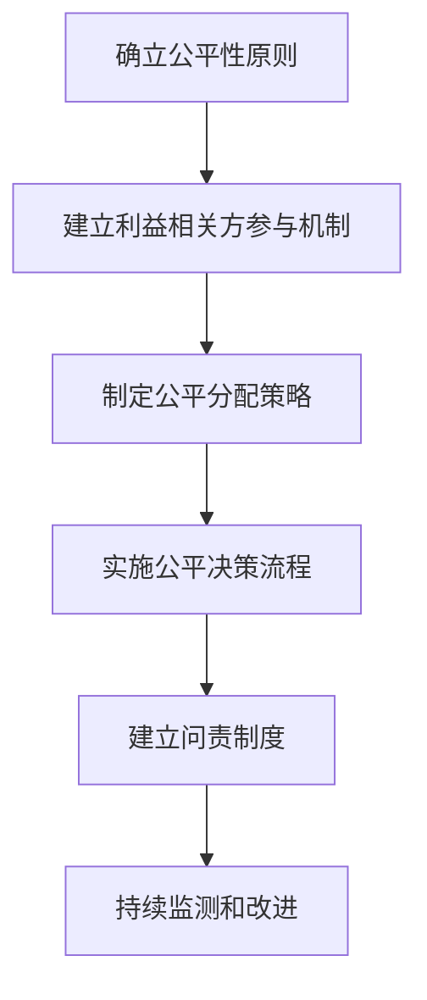

以下是标题为《公平性在循环经济中的实践》的技术博客文章正文内容：

# **公平性在循环经济中的实践**

## 1. 背景介绍

### 1.1 循环经济的兴起

随着资源日益匮乏和环境问题日益严峻,传统的"取、制造、消费、丢弃"的线性经济模式已经难以为继。为了实现可持续发展,循环经济应运而生。循环经济是一种旨在通过产品和材料的高效利用来减少浪费和环境影响的经济模式。

### 1.2 公平性的重要性

在推进循环经济的过程中,公平性是一个不可忽视的关键因素。公平性不仅涉及到资源和机会的公平分配,还包括了决策过程的公平性和利益相关方的平等参与。只有确保了公平性,循环经济才能真正实现可持续发展。

## 2. 核心概念与联系

### 2.1 循环经济的核心概念

循环经济的核心概念包括:

- 3R原则(Reduce、Reuse、Recycle):减少资源使用、重复利用产品和材料、回收利用废弃物。
- 产品服务系统(Product-Service Systems):将产品转变为服务,以延长产品寿命和提高资源利用效率。
- 工业生态学(Industrial Ecology):通过模拟自然界的物质循环,实现产业间的物质和能量的循环利用。

### 2.2 公平性的核心概念

公平性的核心概念包括:

- 程序公平(Procedural Fairness):决策过程中的公平性,包括透明度、参与度和问责制。
- 分配公平(Distributive Fairness):资源和机会的公平分配,尤其是对弱势群体的关注。
- 互惠公平(Reciprocal Fairness):各利益相关方之间的权利和义务的平衡。

### 2.3 循环经济与公平性的联系

循环经济和公平性之间存在着密切的联系。循环经济旨在实现资源的高效利用和环境的可持续发展,而公平性则确保了这一过程中的公正性和包容性。只有在公平的基础上,循环经济才能真正发挥其潜力,实现经济、社会和环境的协调发展。

## 3. 核心算法原理具体操作步骤

为了在循环经济中实现公平性,我们需要采取一系列具体的操作步骤。这些步骤可以概括为以下几个方面:



### 3.1 确立公平性原则

首先,我们需要确立循环经济中的公平性原则。这些原则应该涵盖程序公平、分配公平和互惠公平等方面,为后续的实践提供指导。

### 3.2 建立利益相关方参与机制

其次,我们需要建立一种有效的利益相关方参与机制,确保所有相关方都能够参与到循环经济的决策和实施过程中。这可以通过举行公众咨询会、建立利益相关方论坛等方式来实现。

### 3.3 制定公平分配策略

在循环经济中,我们需要制定公平的资源和机会分配策略。这可能涉及到对弱势群体的优先考虑、建立补偿机制等措施,以确保分配的公平性。

### 3.4 实施公平决策流程

在制定和实施循环经济相关政策和项目时,我们需要确保决策过程的公平性。这包括提高决策透明度、允许利益相关方参与、建立申诉机制等。

### 3.5 建立问责制度

为了确保公平性原则得以贯彻执行,我们需要建立一套问责制度。这可以包括定期审计、第三方监督等措施,以确保相关主体遵守公平性原则。

### 3.6 持续监测和改进

最后,我们需要持续监测公平性实践的效果,并根据实际情况不断进行调整和改进。这是一个循环反馈的过程,旨在不断优化公平性实践。

## 4. 数学模型和公式详细讲解举例说明

在评估和实现循环经济中的公平性时,我们可以借助一些数学模型和公式。这些模型和公式可以帮助我们量化和优化公平性。

### 4.1 基尼系数(Gini Coefficient)

基尼系数是衡量收入或资源分配不平等程度的常用指标。它的取值范围为0到1,值越小表示分配越均等。基尼系数的计算公式如下:

$$G = \frac{\sum_{i=1}^{n}\sum_{j=1}^{n}|x_i-x_j|}{2n^2\bar{x}}$$

其中,n是个体数量,$x_i$和$x_j$分别表示第i个和第j个个体的收入或资源量,$\bar{x}$是平均收入或资源量。

在循环经济中,我们可以使用基尼系数来评估资源分配的公平性。例如,我们可以计算不同地区或群体在获取再生资源方面的基尼系数,并采取相应措施缩小差距。

### 4.2 阿特金森指数(Atkinson Index)

阿特金森指数是另一种衡量收入或资源分配不平等程度的指标。它不仅考虑了分配的不平等程度,还考虑了人们对不平等的厌恶程度。阿特金森指数的计算公式如下:

$$A(\epsilon) = 1 - \frac{1}{\mu}\left(\frac{1}{n}\sum_{i=1}^{n}x_i^{1-\epsilon}\right)^{\frac{1}{1-\epsilon}}$$

其中,$\epsilon$是不平等厌恶参数(通常取值为0.5或1),$\mu$是平均收入或资源量,$x_i$是第i个个体的收入或资源量。

在循环经济中,我们可以使用阿特金森指数来评估资源分配的公平性,并根据不同的不平等厌恶程度进行调整。例如,如果社会对不平等有较高的厌恶程度,我们可以采取更加积极的措施来缩小差距。

### 4.3 公平分配优化模型

除了评估公平性外,我们还可以使用数学模型来优化公平分配。一种常见的模型是基于效用理论的公平分配优化模型。

假设有n个个体,每个个体i的效用函数为$u_i(x_i)$,其中$x_i$是分配给个体i的资源量。我们的目标是最大化社会总效用,同时满足资源约束和公平性约束。这可以表示为以下优化问题:

$$\max \sum_{i=1}^{n}u_i(x_i)$$
$$\text{s.t. } \sum_{i=1}^{n}x_i \leq R$$
$$\frac{x_i}{x_j} \leq \alpha, \forall i,j$$

其中,R是总资源量,$\alpha$是公平性约束参数,用于控制分配的不平等程度。

通过求解这个优化问题,我们可以得到在给定资源约束和公平性约束下的最优资源分配方案。这种模型可以应用于循环经济中的各种资源分配场景,如再生资源的分配、补贴和奖励的分配等。

## 5. 项目实践:代码实例和详细解释说明

为了更好地理解如何在实践中实现循环经济中的公平性,我们可以通过一个具体的代码实例来进行说明。这个实例将展示如何使用Python编程语言来计算基尼系数和阿特金森指数,并优化公平分配。

### 5.1 计算基尼系数

```python
import numpy as np

def gini(array):
    """
    计算一个数组的基尼系数
    """
    # 基于公式:基尼系数 = \frac{\sum_{i=1}^{n}\sum_{j=1}^{n}|x_i-x_j|}{2n^2\bar{x}}
    # 其中,
    #   n是个体数量
    #   x_i和x_j分别表示第i个和第j个个体的收入或资源量
    #   \bar{x}是平均收入或资源量
    
    # 对数组进行排序
    array = np.array(array)
    array = np.sort(array)
    
    # 计算n和\bar{x}
    n = len(array)
    mean_value = np.mean(array)
    
    # 计算基尼系数的分子部分
    numerator = 0
    for i in range(n):
        for j in range(n):
            numerator += abs(array[i] - array[j])
    
    # 计算基尼系数
    gini_coefficient = numerator / (2 * n * n * mean_value)
    
    return gini_coefficient

# 示例用法
income = [10000, 15000, 20000, 25000, 30000]
gini_coef = gini(income)
print(f"基尼系数为: {gini_coef:.4f}")
```

在这个示例中,我们定义了一个`gini`函数,用于计算给定数组的基尼系数。该函数首先对数组进行排序,然后根据基尼系数的公式计算分子部分,最后得到基尼系数的值。

我们可以使用这个函数来计算不同群体或地区的收入或资源分配的基尼系数,从而评估分配的公平性。

### 5.2 计算阿特金森指数

```python
import numpy as np

def atkinson(array, epsilon=0.5):
    """
    计算一个数组的阿特金森指数
    """
    # 基于公式:阿特金森指数 = 1 - \frac{1}{\mu}\left(\frac{1}{n}\sum_{i=1}^{n}x_i^{1-\epsilon}\right)^{\frac{1}{1-\epsilon}}
    # 其中,
    #   \epsilon是不平等厌恶参数(通常取值为0.5或1)
    #   \mu是平均收入或资源量
    #   x_i是第i个个体的收入或资源量
    
    array = np.array(array)
    n = len(array)
    mean_value = np.mean(array)
    
    # 计算分母部分
    denominator = (1 / n * sum([(x / mean_value) ** (1 - epsilon) for x in array])) ** (1 / (1 - epsilon))
    
    # 计算阿特金森指数
    atkinson_index = 1 - denominator
    
    return atkinson_index

# 示例用法
income = [10000, 15000, 20000, 25000, 30000]
atkinson_coef = atkinson(income)
print(f"阿特金森指数为: {atkinson_coef:.4f}")
```

在这个示例中,我们定义了一个`atkinson`函数,用于计算给定数组的阿特金森指数。该函数首先计算分母部分,然后根据阿特金森指数的公式得到指数值。

我们可以使用这个函数来计算不同群体或地区的收入或资源分配的阿特金森指数,从而评估分配的公平性。同时,我们还可以通过调整不平等厌恶参数`epsilon`来反映社会对不平等的不同偏好。

### 5.3 公平分配优化

```python
import cvxpy as cp

def fair_allocation(utilities, resources, total_resources, alpha):
    """
    使用凸优化求解公平分配问题
    """
    n = len(utilities)
    x = cp.Variable(n)  # 分配量
    
    # 定义目标函数和约束条件
    objective = cp.Maximize(sum([utilities[i](x[i]) for i in range(n)]))
    constraints = [sum(x) <= total_resources,
                   x >= 0,
                   cp.max(x) / cp.min(x) <= alpha]
    
    # 求解优化问题
    problem = cp.Problem(objective, constraints)
    problem.solve()
    
    # 返回最优分配方案
    return x.value

# 示例用法
def utility(x):
    return x ** 0.5  # 效用函数

utilities = [utility] * 5  # 5个个体,效用函数相同
resources = [1] * 5  # 每个个体的资源需求相同
total_resources = 100  # 总资源量
alpha = 2  # 公平性约束参数

allocation = fair_allocation(utilities, resources, total_resources, alpha)
print(f"最优分配方案为: {allocation}")
```

在这个示例中,我们使用了CVXPY库来求解公平分配优化问题。我们定义了一个`fair_allocation`函数,该函数接受效用函数列表、资源需求列表、总资源量和公平性约束参数作为输入,并返回最优分配方案。

在函数内部,我们首先定义