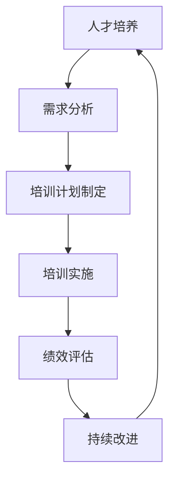

# 关注人才培养:打造可持续发展的IT团队

## 1.背景介绍

在当今快节奏的数字时代,信息技术(IT)已成为推动商业创新和增长的核心动力。然而,要保持IT团队的持续竞争力并非易事。技术的快速迭代、人才短缺和保留挑战等因素,都给IT团队的可持续发展带来了巨大压力。因此,关注人才培养,打造一支高素质的IT团队,已成为确保企业长期成功的关键。

## 2.核心概念与联系

### 2.1 人才培养的重要性

人才是企业最宝贵的资源,尤其是在知识密集型行业中。IT行业的快速发展需要大量具备专业技能和创新思维的人才。通过有效的人才培养,企业可以:

1. 提高员工的技能和知识水平,确保团队与时俱进。
2. 培养员工的领导力和管理能力,为团队的可持续发展做好准备。
3. 增强员工的归属感和忠诚度,降低人员流失率。
4. 吸引优秀人才,提高企业的竞争力。

### 2.2 可持续发展的IT团队

可持续发展的IT团队需要具备以下几个关键特征:

1. **技术实力雄厚**: 团队成员拥有扎实的技术基础和专业知识,能够应对不断变化的技术挑战。
2. **创新能力强大**: 团队鼓励创新思维,能够开发出创新的解决方案,满足不断变化的业务需求。
3. **学习能力卓越**: 团队成员拥有强大的学习能力,能够快速掌握新技术和新知识。
4. **协作高效**: 团队内部协作顺畅,能够充分发挥每个成员的长处,提高工作效率。
5. **人才储备充足**: 团队拥有完善的人才培养机制,能够持续输送高素质人才,确保团队的可持续发展。

### 2.3 人才培养与可持续发展的关系

人才培养是打造可持续发展IT团队的基石。通过系统化的培训和发展机会,企业可以:

1. 提升员工的专业技能,确保团队拥有足够的技术实力。
2. 培养员工的创新思维,激发团队的创新能力。
3. 鼓励员工持续学习,提高团队的学习能力。
4. 培养员工的领导力和管理能力,为团队的可持续发展做好人才储备。
5. 增强员工的归属感和忠诚度,降低人员流失率,维护团队的稳定性。

因此,人才培养与可持续发展的IT团队密不可分,是确保企业长期竞争力的关键因素。

## 3.核心算法原理具体操作步骤

人才培养是一个系统化的过程,需要遵循一定的原理和步骤。以下是人才培养的核心算法原理和具体操作步骤:



### 3.1 需求分析

需求分析是人才培养的第一步,包括以下内容:

1. 确定组织的战略目标和发展方向。
2. 分析现有人才的知识和技能缺口。
3. 预测未来所需的人才结构和能力。
4. 确定培训的重点领域和目标群体。

### 3.2 培训计划制定

根据需求分析的结果,制定详细的培训计划,包括:

1. 设置培训目标和预期效果。
2. 确定培训内容和方式(如课堂培训、在线学习、项目实践等)。
3. 选择合适的培训资源和供应商。
4. 制定培训时间表和预算。
5. 确定参与对象和报名流程。

### 3.3 培训实施

按照培训计划有序实施各项培训活动,包括:

1. 组织课程安排和师资调度。
2. 准备培训材料和学习资源。
3. 开展培训活动,确保高质量的学习体验。
4. 跟踪学员的学习进度和表现。
5. 提供必要的辅导和支持。

### 3.4 绩效评估

培训结束后,需要对培训效果进行评估,包括:

1. 设计评估指标和方法(如考试、项目评审、绩效考核等)。
2. 收集和分析学员的学习数据和反馈。
3. 评估培训对个人和组织的影响。
4. 识别培训过程中的不足和改进空间。

### 3.5 持续改进

根据绩效评估的结果,持续改进人才培养流程,包括:

1. 调整培训内容和方式,满足不断变化的需求。
2. 优化培训资源和供应商选择。
3. 完善培训管理和质量控制机制。
4. 鼓励员工的持续学习和自我发展。

通过不断的改进,人才培养能够与组织的发展需求保持同步,为可持续发展的IT团队提供持续的动力。

## 4.数学模型和公式详细讲解举例说明

在人才培养过程中,我们可以借助一些数学模型和公式来量化和优化培训效果。以下是一些常见的模型和公式:

### 4.1 员工技能矩阵模型

员工技能矩阵模型用于评估员工的技能水平,并确定培训需求。该模型将员工的技能分为多个层次,每个层次对应一个数值。通过计算员工在各个技能领域的平均值,我们可以得到员工的整体技能水平。

设有 $n$ 个员工,每个员工有 $m$ 个技能领域,员工 $i$ 在技能领域 $j$ 的技能等级为 $s_{ij}$,则员工 $i$ 的整体技能水平 $S_i$ 可以表示为:

$$S_i = \frac{1}{m}\sum_{j=1}^{m}s_{ij}$$

通过比较员工的整体技能水平与预期水平的差距,我们可以确定培训的重点领域。

### 4.2 培训投资回报率模型

培训投资回报率(Training ROI)模型用于评估培训活动的经济效益。它将培训带来的收益与培训成本进行比较,计算投资回报率。

设培训活动的总成本为 $C$,培训后员工的工作效率提高了 $\alpha\%$,员工年薪为 $S$,则培训带来的年收益为 $\alpha S$。如果将收益折算为 $n$ 年,则培训投资回报率 $R$ 可以表示为:

$$R = \frac{\alpha S\sum_{i=1}^{n}\frac{1}{(1+r)^i}}{C}$$

其中 $r$ 为折现率。通过设置合理的期望回报率,我们可以评估培训活动的经济价值,并优化培训投入。

### 4.3 员工留任模型

员工留任模型用于预测员工的留任率,从而制定相应的人才保留策略。该模型考虑了多个影响员工留任的因素,如薪酬、发展机会、工作环境等。

设有 $k$ 个影响因素,员工 $i$ 对第 $j$ 个因素的满意度为 $x_{ij}$,则员工 $i$ 的留任概率 $P_i$ 可以表示为:

$$P_i = \frac{1}{1+e^{-(\beta_0+\sum_{j=1}^{k}\beta_jx_{ij})}}$$

其中 $\beta_0,\beta_1,\ldots,\beta_k$ 为模型参数,可以通过历史数据拟合得到。通过分析员工的留任概率,我们可以制定有针对性的人才保留措施,如提供培训和发展机会、优化薪酬福利等。

以上数学模型和公式为人才培养提供了量化和优化的工具,有助于提高培训效果和人才管理水平。但是,在实际应用中,我们还需要结合具体情况进行调整和改进。

## 5.项目实践:代码实例和详细解释说明

为了更好地理解人才培养的核心算法原理,我们可以通过一个简单的Python项目来实践。该项目包括员工技能矩阵模型和培训投资回报率模型的实现。

### 5.1 员工技能矩阵模型实现

```python
class Employee:
    def __init__(self, name, skills):
        self.name = name
        self.skills = skills

    def get_overall_skill_level(self):
        total_score = sum(self.skills.values())
        num_skills = len(self.skills)
        return total_score / num_skills

employees = [
    Employee("Alice", {"Python": 4, "Java": 3, "SQL": 5}),
    Employee("Bob", {"Python": 3, "JavaScript": 4, "DevOps": 2}),
    Employee("Charlie", {"C++": 5, "Docker": 4, "AWS": 3})
]

for employee in employees:
    overall_skill_level = employee.get_overall_skill_level()
    print(f"{employee.name}'s overall skill level: {overall_skill_level}")
```

在这个示例中,我们定义了一个 `Employee` 类,用于表示员工及其技能水平。每个员工都有一个名字和一个技能字典,其中键为技能名称,值为技能等级(1-5分)。

`get_overall_skill_level()` 方法计算员工的整体技能水平,即所有技能等级的平均值。

我们创建了三个员工实例,并打印出每个员工的整体技能水平。通过比较员工的技能水平,我们可以确定培训的重点领域。

### 5.2 培训投资回报率模型实现

```python
def calculate_training_roi(training_cost, salary, efficiency_improvement, discount_rate, years):
    annual_benefit = salary * efficiency_improvement
    present_value_factor = sum([(1 / (1 + discount_rate)) ** i for i in range(1, years + 1)])
    total_benefit = annual_benefit * present_value_factor
    roi = (total_benefit - training_cost) / training_cost
    return roi

# Example usage
training_cost = 50000
salary = 80000
efficiency_improvement = 0.1  # 10% improvement
discount_rate = 0.08
years = 5

roi = calculate_training_roi(training_cost, salary, efficiency_improvement, discount_rate, years)
print(f"Training ROI: {roi * 100}%")
```

在这个示例中,我们定义了一个 `calculate_training_roi()` 函数,用于计算培训投资回报率。该函数接受以下参数:

- `training_cost`: 培训总成本
- `salary`: 员工年薪
- `efficiency_improvement`: 培训后员工的工作效率提高百分比
- `discount_rate`: 折现率
- `years`: 收益计算的年数

函数首先计算培训带来的年收益,即员工年薪乘以效率提高百分比。然后,它计算未来 `years` 年收益的现值总和,使用折现率进行折现。最后,它计算培训投资回报率,即(总收益 - 培训成本) / 培训成本。

我们提供了一个示例用例,计算了一个具体的培训投资回报率。通过调整输入参数,我们可以评估不同培训方案的经济效益,从而优化培训投入。

这些代码示例旨在帮助读者更好地理解人才培养的核心算法原理,并提供一些实践经验。在实际应用中,我们可能需要根据具体情况进行调整和扩展。

## 6.实际应用场景

人才培养在各行各业都扮演着重要角色,尤其是在快速发展的IT行业。以下是一些典型的应用场景:

### 6.1 技术培训

技术培训是IT行业人才培养的核心内容。随着新技术的不断涌现,IT团队需要持续学习和提升技能,以保持竞争力。常见的技术培训包括:

- 编程语言和框架培训(如Python、Java、React等)
- 数据库和大数据技术培训(如SQL、Hadoop、Spark等)
- 云计算和DevOps培训(如AWS、Azure、Kubernetes等)
- 人工智能和机器学习培训(如深度学习、自然语言处理等)
- 网络安全和渗透测试培训

通过有针对性的技术培训,IT团队可以掌握最新的技术知识和实践经验,为企业的数字化转型提供坚实的技术保障。

### 6.2 管理培训

除了技术培训,管理培训也是IT团队人才培养的重要组成部分。随着团队规模的扩大和项目复杂度的增加,IT团队需要具备出色的管理能