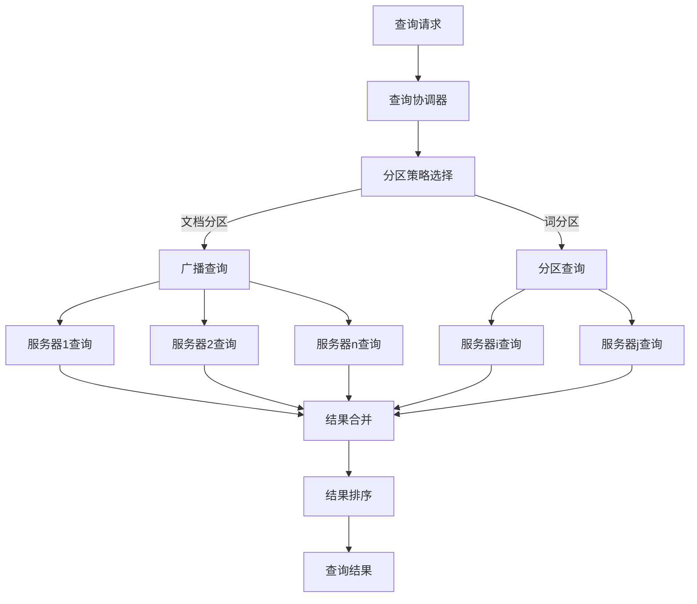

# 分布式搜索 原理与代码实例讲解

## 1.背景介绍

在当今大数据时代，海量的数据已经成为了一种常态。无论是网络上的网页内容、社交媒体上的用户信息,还是企业内部的业务数据,数据的规模都在不断增长。这种数据爆炸式的增长给传统的集中式搜索系统带来了巨大的挑战,单个服务器已经无法承载如此庞大的数据量和查询压力。

为了解决这一问题,分布式搜索系统(Distributed Search System)应运而生。分布式搜索系统将海量数据分散存储在多台服务器上,并通过分布式索引和查询技术实现高效的数据检索。它具有高可扩展性、高可用性和高性能等优点,能够满足大规模数据搜索的需求。

分布式搜索系统的核心思想是将整个搜索过程分解为多个子任务,并在多台服务器上并行执行。这种分布式架构不仅能够提高系统的处理能力,还能够提高系统的容错性和可靠性。

## 2.核心概念与联系

在深入探讨分布式搜索系统的原理和实现之前,我们需要先了解一些核心概念。

### 2.1 倒排索引(Inverted Index)

倒排索引是搜索引擎中最常用的数据结构,它将文档中的每个词及其出现位置记录下来,从而实现快速的关键词查找。倒排索引由两个核心部分组成:词典(Lexicon)和倒排列表(Postings List)。

- 词典存储了所有唯一的词及其对应的倒排列表的位置。
- 倒排列表记录了每个词在哪些文档中出现过,以及出现的位置。

```
词典:
    词1 -> 倒排列表1的位置
    词2 -> 倒排列表2的位置
    ...

倒排列表1:
    文档ID1: 位置1, 位置2, ...
    文档ID2: 位置3, 位置4, ...
    ...
```

### 2.2 分布式索引

在分布式搜索系统中,索引被分散存储在多台服务器上。常见的分布式索引策略有:

1. **文档分区(Document Partitioning)**: 将文档集合划分为多个子集,每个子集在一台服务器上构建本地索引。查询时需要将请求发送到所有服务器,并合并结果。

2. **词分区(Term Partitioning)**: 将词典划分为多个子集,每个子集在一台服务器上构建本地索引。查询时只需要将请求发送到存储相关词的服务器。

### 2.3 分布式查询

分布式查询是指将一个查询分解为多个子查询,并在多台服务器上并行执行,最后将结果合并。常见的分布式查询策略有:

1. **广播查询(Broadcast Query)**: 将查询广播到所有服务器,每台服务器在本地索引上执行查询,并将结果返回给查询协调器。

2. **分区查询(Partitioned Query)**: 根据索引分区策略,将查询发送到相关的服务器,每台服务器在本地索引上执行查询,并将结果返回给查询协调器。

3. **层次查询(Hierarchical Query)**: 将查询分为两个阶段执行。第一阶段在所有服务器上执行,获取每个服务器上的文档数量;第二阶段根据文档数量,选择最相关的服务器执行详细查询。

### 2.4 查询结果合并

由于查询被分散到多台服务器上执行,因此需要将各个服务器返回的结果进行合并。常见的结果合并策略有:

1. **排序合并(Sorted Merge)**: 将各个服务器返回的结果列表按照相关性分数排序,然后合并为一个有序列表。

2. **分数归一化(Score Normalization)**: 由于每台服务器的索引不同,相关性分数可能存在偏差。因此需要对分数进行归一化,使得不同服务器返回的分数可以直接比较。

3. **重排序(Re-Ranking)**: 在合并结果后,可以根据其他特征(如点击率、用户偏好等)对结果进行重新排序,以提高结果的相关性。

## 3.核心算法原理具体操作步骤

### 3.1 倒排索引构建

构建倒排索引的基本步骤如下:

1. **收集文档**: 从数据源(如网页、文件系统等)收集待索引的文档。

2. **文本处理**: 对文档进行分词、去停用词、词干提取等文本预处理操作。

3. **词典构建**: 遍历所有文档,统计出现的唯一词,构建词典。

4. **倒排列表构建**: 对于每个词,记录它出现的文档ID和位置信息,构建倒排列表。

5. **索引存储**: 将构建好的词典和倒排列表持久化存储,以供后续查询使用。

在分布式环境下,上述步骤可以在多台服务器上并行执行,每台服务器负责一部分文档的索引构建。

### 3.2 分布式查询执行

分布式查询的基本执行流程如下:



1. **查询请求**: 用户发出查询请求。

2. **查询协调器**: 接收查询请求,根据索引分区策略选择合适的查询执行方式。

3. **分区策略选择**: 
    - 如果采用文档分区,则执行广播查询; 
    - 如果采用词分区,则执行分区查询。

4. **广播查询/分区查询**: 将查询分发到相关的服务器。

5. **服务器查询**: 每台服务器在本地索引上执行查询,并返回结果。

6. **结果合并**: 查询协调器将各个服务器返回的结果进行合并。

7. **结果排序**: 对合并后的结果进行排序,生成最终的查询结果。

8. **查询结果**: 将排序后的查询结果返回给用户。

### 3.3 查询结果合并算法

查询结果合并是分布式搜索系统中一个关键的环节。常见的结果合并算法包括:

1. **加权求和(Weighted Sum)**: 将各个服务器返回的相关性分数进行加权求和,得到最终的综合分数。权重可以根据服务器的重要性、索引质量等因素确定。

2. **加权乘积(Weighted Product)**: 将各个服务器返回的相关性分数进行加权乘积,得到最终的综合分数。这种方法可以更好地体现各个分数之间的相关性。

3. **Borda Count**: 对每个服务器返回的结果进行排名,然后将每个文档的排名求和,排名越小的文档综合得分越高。这种方法可以避免分数归一化的问题。

4. **Reciprocal Rank Fusion**: 对每个服务器返回的结果进行排名,然后将每个文档的倒数排名求和,倒数排名越小的文档综合得分越高。这种方法可以更好地体现排名前几位文档的重要性。

5. **机器学习模型**: 利用机器学习模型(如LambdaMART、RankNet等)对各个服务器返回的特征进行综合,得到最终的排序结果。这种方法可以更好地捕捉不同特征之间的复杂关系。

## 4.数学模型和公式详细讲解举例说明

在分布式搜索系统中,常常需要使用一些数学模型和公式来量化文档与查询的相关性,以及对查询结果进行排序和评估。

### 4.1 TF-IDF

TF-IDF(Term Frequency-Inverse Document Frequency)是一种常用的文本相似度计算方法,它将文档中每个词的重要性与其在整个文档集合中的普遍程度相结合。TF-IDF的计算公式如下:

$$
\mathrm{tfidf}(t, d, D) = \mathrm{tf}(t, d) \times \mathrm{idf}(t, D)
$$

其中:

- $\mathrm{tf}(t, d)$ 表示词 $t$ 在文档 $d$ 中出现的频率,常用的计算方式有:
    - 词频(Term Frequency): $\mathrm{tf}(t, d) = f_{t, d}$
    - 归一化词频(Normalized Term Frequency): $\mathrm{tf}(t, d) = \frac{f_{t, d}}{\max_{t' \in d}\{f_{t', d}\}}$
    - 对数归一化词频(Log-normalized Term Frequency): $\mathrm{tf}(t, d) = 1 + \log(f_{t, d})$

- $\mathrm{idf}(t, D)$ 表示词 $t$ 在文档集合 $D$ 中的逆文档频率,计算公式为:
    $$
    \mathrm{idf}(t, D) = \log \frac{|D|}{|\{d \in D : t \in d\}|}
    $$
    其中 $|D|$ 表示文档集合的总数,分母表示包含词 $t$ 的文档数量。

通过将 TF 和 IDF 相乘,可以平衡一个词在文档中的重要程度和在整个文档集合中的普遍程度。TF-IDF 值越高,表示该词对该文档越重要。

在分布式搜索系统中,可以在每台服务器上计算本地索引的 TF-IDF 值,然后在查询结果合并阶段将这些值综合起来,得到全局的 TF-IDF 值。

### 4.2 BM25

BM25 是一种常用的文本相似度排序函数,它是 TF-IDF 的改进版本,考虑了更多的因素,如文档长度、查询词频率等。BM25 的计算公式如下:

$$
\mathrm{score}(D, Q) = \sum_{q \in Q} \mathrm{idf}(q) \cdot \frac{f(q, D) \cdot (k_1 + 1)}{f(q, D) + k_1 \cdot \left(1 - b + b \cdot \frac{|D|}{avgdl}\right)}
$$

其中:

- $f(q, D)$ 表示查询词 $q$ 在文档 $D$ 中出现的频率
- $|D|$ 表示文档 $D$ 的长度(词数)
- $avgdl$ 表示文档集合的平均文档长度
- $k_1$ 和 $b$ 是两个调节参数,通常取值为:
    - $k_1 \in [1.2, 2.0]$
    - $b = 0.75$

BM25 考虑了以下几个因素:

1. 查询词频率 $f(q, D)$: 与 TF 类似,查询词在文档中出现的频率越高,得分越高。
2. 文档长度归一化: 通过 $\frac{|D|}{avgdl}$ 对文档长度进行归一化,避免过长文档得分过高。
3. 查询词重要性 $\mathrm{idf}(q)$: 与 TF-IDF 类似,考虑了查询词在整个文档集合中的重要程度。

在分布式搜索系统中,可以在每台服务器上计算本地索引的 BM25 分数,然后在查询结果合并阶段将这些分数综合起来,得到全局的 BM25 分数。

### 4.3 评估指标

为了评估分布式搜索系统的性能,我们需要一些量化指标。常用的评估指标包括:

1. **精确率(Precision)**: 表示系统返回的结果中有多少是相关的。
    $$
    \mathrm{Precision} = \frac{\text{相关文档数}}{\text{返回文档数}}
    $$

2. **召回率(Recall)**: 表示系统能够返回多少相关文档。
    $$
    \mathrm{Recall} = \frac{\text{相关文档数}}{\text{总相关文档数}}
    $$

3. **F1 分数(F1 Score)**: 精确率和召回率的调和平均数。
    $$
    \mathrm{F1} = 2 \cdot \frac{\mathrm{Precision}