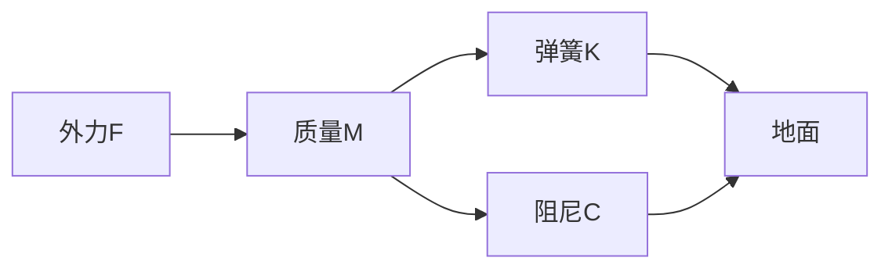

# **动力系统中的故障检测与诊断**

## 1. 背景介绍

### 1.1 动力系统概述

动力系统是指能够提供机械功率的装置或系统，广泛应用于航空航天、汽车、船舶、发电厂等领域。这些系统通常由多个相互关联的部件组成,如发动机、传动系统、控制系统等。由于长期运行和恶劣环境等因素,动力系统中的故障时有发生,可能导致性能下降、效率降低,甚至造成严重事故。因此,及时发现和诊断动力系统中的故障对于确保系统安全、可靠运行至关重要。

### 1.2 故障检测与诊断的重要性

故障检测与诊断(Fault Detection and Diagnosis, FDD)是一种监测动力系统运行状态,识别潜在故障并确定故障原因的过程。及时有效的FDD可以:

1. 提高系统可靠性和安全性
2. 减少维护成本
3. 延长设备使用寿命
4. 避免次生故障和严重事故

因此,FDD已成为现代动力系统不可或缺的一个重要组成部分。

## 2. 核心概念与联系

### 2.1 故障检测

故障检测是FDD的第一步,旨在确定系统是否存在故障。常用的故障检测方法包括:

1. **基于模型的方法**: 建立系统数学模型,通过残差(实际输出与模型输出的差值)分析检测故障。
2. **基于信号的方法**: 直接分析系统测量信号(如振动、温度等),利用信号处理技术提取故障特征。
3. **基于知识的方法**: 构建故障树或专家系统,根据已有知识和经验进行推理诊断。

### 2.2 故障隔离

故障隔离是在检测到故障后,确定故障发生的精确位置和原因。常用的故障隔离方法包括:

1. **参数估计法**: 估计系统参数的偏差,将偏差与特定故障模式相关联。
2. **结构化残差法**: 构造特殊的残差向量,使其对某些故障敏感而对其他故障则不敏感。
3. **人工智能方法**: 利用机器学习、模糊逻辑等技术,从历史数据中学习故障模式。

### 2.3 核心概念关联

故障检测和故障隔离是FDD的两个核心环节,相互关联且重要性并重。准确的故障检测是故障隔离的前提,而精确的故障隔离则有助于采取针对性的维修措施,从而提高FDD的整体效果。

## 3. 核心算法原理具体操作步骤

FDD涉及多种算法和方法,本节重点介绍两种广泛应用的核心算法:基于观测器的残差生成方法和基于主成分分析(PCA)的故障检测方法。

### 3.1 基于观测器的残差生成方法

#### 3.1.1 原理

该方法的核心思想是设计一个观测器(observer),使其能够根据系统输入和输出估计系统状态。当系统没有故障时,观测器的估计值与实际状态值应该一致;一旦发生故障,两者之间就会产生残差。通过分析残差的大小和性质,可以检测和隔离故障。

观测器的设计可以采用多种方式,如卢恩伯格观测器(Luenberger observer)、扩展卡尔曼滤波器(Extended Kalman Filter, EKF)等。以卢恩伯格观测器为例,其设计步骤如下:

1) 建立系统状态空间模型:
   $$
   \begin{cases}
   \dot{\mathbf{x}}(t) = \mathbf{A}\mathbf{x}(t) + \mathbf{B}\mathbf{u}(t) \\
   \mathbf{y}(t) = \mathbf{C}\mathbf{x}(t)
   \end{cases}
   $$
   其中 $\mathbf{x}(t)$ 为状态向量, $\mathbf{u}(t)$ 为输入向量, $\mathbf{y}(t)$ 为输出向量, $\mathbf{A}$、$\mathbf{B}$、$\mathbf{C}$ 为系统矩阵。

2) 设计观测器:
   $$
   \dot{\hat{\mathbf{x}}}(t) = \mathbf{A}\hat{\mathbf{x}}(t) + \mathbf{B}\mathbf{u}(t) + \mathbf{L}(\mathbf{y}(t) - \hat{\mathbf{y}}(t))
   $$
   其中 $\hat{\mathbf{x}}(t)$ 为估计状态, $\hat{\mathbf{y}}(t) = \mathbf{C}\hat{\mathbf{x}}(t)$ 为估计输出, $\mathbf{L}$ 为观测器增益矩阵。

3) 计算残差:
   $$
   \mathbf{r}(t) = \mathbf{y}(t) - \hat{\mathbf{y}}(t)
   $$

4) 设置残差阈值,当残差超过阈值时,判定系统发生故障。

5) 进一步分析残差的性质(如幅值、频率特征等),以隔离特定故障。

#### 3.1.2 具体步骤

1) 获取系统数学模型,包括状态方程、输出方程等。

2) 离散化连续时间模型,获得离散状态空间模型:
   $$
   \begin{cases}
   \mathbf{x}(k+1) = \mathbf{A}_d\mathbf{x}(k) + \mathbf{B}_d\mathbf{u}(k) \\
   \mathbf{y}(k) = \mathbf{C}_d\mathbf{x}(k)
   \end{cases}
   $$

3) 设计离散观测器:
   $$
   \begin{aligned}
   \hat{\mathbf{x}}(k+1) &= \mathbf{A}_d\hat{\mathbf{x}}(k) + \mathbf{B}_d\mathbf{u}(k) + \mathbf{L}(\mathbf{y}(k) - \mathbf{C}_d\hat{\mathbf{x}}(k)) \\
   \hat{\mathbf{y}}(k) &= \mathbf{C}_d\hat{\mathbf{x}}(k)
   \end{aligned}
   $$

4) 计算残差 $\mathbf{r}(k) = \mathbf{y}(k) - \hat{\mathbf{y}}(k)$。

5) 设置残差评价函数 $J(\mathbf{r}(k))$,当 $J(\mathbf{r}(k)) > J_\text{th}$ 时,判定发生故障。

6) 分析残差的性质,如幅值、频率特征等,以隔离特定故障。

7) 可视化残差,绘制残差时间响应曲线、频谱图等,辅助故障诊断。

### 3.2 基于主成分分析(PCA)的故障检测方法

#### 3.2.1 原理

PCA是一种常用的多变量统计分析方法,能够从高维数据中提取主要的变化模式,常应用于数据压缩、特征提取等领域。在故障检测中,PCA可用于构建系统正常工作状态的主元件模型,将测量数据投影到模型的残余子空间,残差的大小就可以反映系统是否偏离正常状态。

具体来说,假设系统有 $m$ 个测量变量,每个变量有 $N$ 个样本,可构造数据矩阵 $\mathbf{X} \in \mathbb{R}^{N \times m}$。PCA的目标是找到一个投影矩阵 $\mathbf{P} \in \mathbb{R}^{m \times l}$,使得:

$$
\mathbf{T} = \mathbf{X}\mathbf{P}
$$

其中 $\mathbf{T} \in \mathbb{R}^{N \times l}$ 为主元件得分矩阵,表示原始数据在主元件空间的投影,且 $l < m$,即实现了降维。

对于新的测量数据 $\mathbf{x}_\text{new} \in \mathbb{R}^{1 \times m}$,可以计算其在残余子空间的投影:

$$
\mathbf{x}_\text{new}^\text{res} = \mathbf{x}_\text{new}(I - \mathbf{P}\mathbf{P}^\top)
$$

当系统正常时,残差 $\mathbf{x}_\text{new}^\text{res}$ 应该很小;一旦发生故障,残差就会显著增大。因此,可以设置残差阈值,当残差超过阈值时,判定系统发生故障。

#### 3.2.2 具体步骤

1) 获取系统正常工作状态下的测量数据矩阵 $\mathbf{X} \in \mathbb{R}^{N \times m}$。

2) 对数据矩阵进行标准化或归一化预处理。

3) 对数据矩阵 $\mathbf{X}$ 进行 SVD 分解:
   $$
   \mathbf{X} = \mathbf{U}\mathbf{\Sigma}\mathbf{V}^\top
   $$
   其中 $\mathbf{U} \in \mathbb{R}^{N \times N}$、$\mathbf{V} \in \mathbb{R}^{m \times m}$ 为正交矩阵,
   $\mathbf{\Sigma} \in \mathbb{R}^{N \times m}$ 为对角矩阵,对角线元素为 $\mathbf{X}$ 的奇异值。

4) 选取前 $l$ 个主元件,构造投影矩阵:
   $$
   \mathbf{P} = \mathbf{V}(:,1:l)
   $$
   其中 $\mathbf{V}(:,1:l)$ 表示 $\mathbf{V}$ 的前 $l$ 列。

5) 对新的测量数据 $\mathbf{x}_\text{new}$ 计算残差:
   $$
   \mathbf{x}_\text{new}^\text{res} = \mathbf{x}_\text{new}(I - \mathbf{P}\mathbf{P}^\top)
   $$

6) 设置残差评价统计量,如 $Q$ 统计量或 $T^2$ 统计量:

   - $Q$ 统计量:
     $$
     Q = \mathbf{x}_\text{new}^\text{res}(\mathbf{x}_\text{new}^\text{res})^\top
     $$
   - $T^2$ 统计量:
     $$
     T^2 = \mathbf{x}_\text{new}^\text{res}\mathbf{\Lambda}^{-1}(\mathbf{x}_\text{new}^\text{res})^\top
     $$
     其中 $\mathbf{\Lambda}$ 为 $\mathbf{\Sigma}$ 的对角线元素向量。

7) 确定统计量的控制极限(如 95% 或 99% 分位数),当统计量超过控制极限时,判定发生故障。

8) 可结合贡献图等工具,分析各测量变量对残差的贡献大小,从而隔离故障变量。

## 4. 数学模型和公式详细讲解举例说明

本节将通过一个简单的质量-弹簧-阻尼系统的例子,详细讲解基于观测器的残差生成方法中所涉及的数学模型和公式。

### 4.1 系统模型

考虑如下质量-弹簧-阻尼系统:

该系统的运动方程为:

$$
M\ddot{x}(t) + C\dot{x}(t) + Kx(t) = F(t)
$$

其中 $x(t)$ 为质量位移, $\dot{x}(t)$ 和 $\ddot{x}(t)$ 分别为速度和加速度。

为了构建状态空间模型,令:

$$
\begin{aligned}
x_1(t) &= x(t) \\
x_2(t) &= \dot{x}(t)
\end{aligned}
$$

则状态方程为:

$$
\begin{aligned}
\dot{x}_1(t) &= x_2(t) \\
\dot{x}_2(t) &= -\frac{C}{M}x_2(t) - \frac{K}{M}x_1(t) + \frac{1}{M}F(t)
\end{aligned}
$$

输出方程为:

$$
y(t) = x_1(t)
$$

可写成矩阵形式:

$$
\begin{aligned}
\begin{bmatrix}
\dot{x}_1(t) \\ \dot{x}_2(t)
\end{bmatrix} &= \begin{bmatrix}
0 & 1 \\ -\frac{K}{M} & -\frac{C}{M}