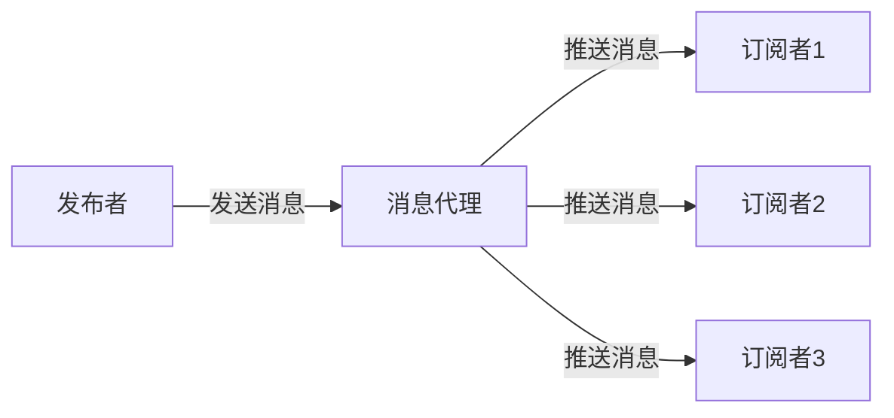
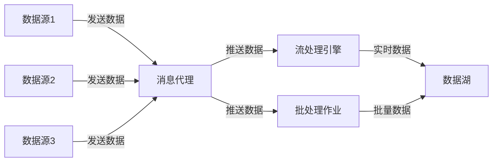

# 发布订阅模式与数据湖：构建数据分析平台

## 1.背景介绍

### 1.1 数据驱动时代的到来

在当今时代,数据已经成为了企业和组织的关键资产。随着数据的快速增长和多样化,有效地管理和利用数据对于获取洞见、做出明智决策和保持竞争优势至关重要。这种数据驱动的方法已经渗透到了各个行业,包括金融、医疗、制造、零售等领域。

### 1.2 数据湖的兴起

为了应对日益增长的数据量和多样化的数据类型,传统的数据仓库架构已经无法满足现代数据处理的需求。这促使了数据湖(Data Lake)概念的兴起。数据湖是一种新型的数据存储和处理架构,旨在以高度可扩展和经济高效的方式存储和处理各种类型的数据。

### 1.3 发布订阅模式的重要性

在构建数据分析平台时,发布订阅(Pub/Sub)模式扮演着关键角色。它提供了一种松散耦合的异步消息传递机制,使得数据生产者和消费者可以独立地发布和订阅数据,从而实现高度的可扩展性和灵活性。发布订阅模式在数据湖架构中发挥着重要作用,促进了数据的实时流动和处理。

## 2.核心概念与联系

### 2.1 数据湖

数据湖是一种高度可扩展的数据存储和处理架构,旨在存储各种类型的原始数据,包括结构化、半结构化和非结构化数据。与传统的数据仓库不同,数据湖不需要预先定义数据模式,而是以原始格式存储数据,并在需要时再进行处理和分析。

数据湖通常建立在分布式文件系统之上,如Apache Hadoop的HDFS(Hadoop分布式文件系统)或Amazon S3(简单存储服务)。它们提供了高度的可扩展性、容错性和成本效益,能够存储和处理大量的数据。

### 2.2 发布订阅模式

发布订阅(Pub/Sub)模式是一种异步消息传递范式,它将发布者(生产者)和订阅者(消费者)解耦。发布者将消息发送到主题(Topic)或队列(Queue),而订阅者则订阅感兴趣的主题或队列,以接收相关的消息。

发布订阅模式提供了以下关键优势:

1. **解耦**: 发布者和订阅者之间是完全解耦的,它们不需要彼此了解对方的存在。
2. **可扩展性**: 发布订阅系统可以轻松地添加新的发布者或订阅者,而不会影响现有的组件。
3. **异步通信**: 发布者和订阅者可以独立运行,不需要同步等待对方的响应。
4. **广播能力**: 一条消息可以被多个订阅者接收,实现广播或者扇出功能。

在数据湖架构中,发布订阅模式通常用于实现数据的实时流动和处理。数据源(如应用程序、传感器等)将数据发布到主题或队列中,而数据消费者(如流处理引擎、批处理作业等)则订阅相关的主题或队列,以获取和处理数据。

### 2.3 数据分析平台

数据分析平台是一个综合的系统,旨在支持数据的收集、存储、处理和分析。它通常包括以下关键组件:

1. **数据湖**: 用于存储原始数据。
2. **数据管道**: 用于从各种数据源收集和传输数据到数据湖。
3. **数据处理引擎**: 用于对数据进行转换、清理和加工,以准备用于分析。
4. **数据分析工具**: 用于对处理后的数据进行探索性分析、建模和可视化。
5. **元数据管理**: 用于管理和跟踪数据的元数据(数据关于数据的信息)。
6. **安全和治理**: 用于确保数据的安全性、隐私性和合规性。

发布订阅模式和数据湖在数据分析平台中扮演着关键角色。数据湖为数据提供了一个集中的存储位置,而发布订阅模式则促进了数据的实时流动和处理,使得数据可以及时地被消费和分析。

## 3.核心算法原理具体操作步骤

### 3.1 发布订阅模式的工作原理

发布订阅模式的核心算法原理可以概括为以下几个步骤:

1. **发布者发送消息**:发布者将消息发送到主题或队列中。
2. **消息代理接收消息**:消息代理(如Apache Kafka、RabbitMQ等)接收并存储发布者发送的消息。
3. **订阅者订阅主题或队列**:订阅者向消息代理表示对特定主题或队列的兴趣。
4. **消息代理向订阅者推送消息**:当有新的消息到达时,消息代理会将消息推送给所有订阅了相关主题或队列的订阅者。
5. **订阅者处理消息**:订阅者接收到消息后,根据需要进行处理。

这个过程可以用一个简单的流程图来表示:

发布订阅模式的关键在于消息代理,它充当了发布者和订阅者之间的中介。发布者只需将消息发送到消息代理,而不需要关心谁在订阅这些消息。同样,订阅者也只需从消息代理接收感兴趣的消息,而不需要知道消息的来源。这种解耦设计提高了系统的灵活性和可扩展性。

### 3.2 数据湖中的发布订阅模式

在数据湖架构中,发布订阅模式通常用于实现数据的实时流动和处理。数据源(如应用程序、传感器等)将数据发布到主题或队列中,而数据消费者(如流处理引擎、批处理作业等)则订阅相关的主题或队列,以获取和处理数据。

这个过程可以用以下流程图来表示:

在这个架构中,数据源将数据发布到消息代理(如Apache Kafka)。流处理引擎(如Apache Spark Streaming或Apache Flink)订阅相关主题,从消息代理获取实时数据流,并对数据进行实时处理。同时,批处理作业(如Apache Spark或Apache Hive)也订阅相关主题,从消息代理获取数据,并进行批量处理。处理后的数据最终被存储在数据湖中,供下游的分析和查询使用。

这种架构具有以下优势:

1. **实时数据处理**: 通过发布订阅模式,数据可以实时地从源头流向处理引擎,实现近乎实时的数据处理。
2. **解耦和可扩展性**: 发布订阅模式将数据源和消费者解耦,使得系统更加灵活和可扩展。
3. **容错和重播能力**: 消息代理可以保证消息的持久化和重播,提高了系统的容错能力。
4. **多种处理模式**: 同一数据可以被多个消费者订阅,支持实时处理和批量处理等多种处理模式。

## 4.数学模型和公式详细讲解举例说明

在发布订阅模式和数据湖架构中,有一些重要的数学模型和公式需要了解。

### 4.1 消息队列模型

消息队列是发布订阅模式中的一种常见实现方式。它可以用一个简单的数学模型来表示:

$$
Q = \{m_1, m_2, \ldots, m_n\}
$$

其中,Q表示消息队列,而$m_i$表示第i条消息。消息按照先进先出(FIFO)的顺序被处理。

对于一个消息队列,我们可以定义以下操作:

- **Enqueue(m)**: 将消息m添加到队列尾部。
- **Dequeue()**: 从队列头部移除并返回一条消息。

这些操作满足以下性质:

$$
\begin{align*}
&\text{Enqueue}(m_i, Q) = Q \cup \{m_i\} \\
&\text{Dequeue}(Q) = \begin{cases}
(m_1, Q \setminus \{m_1\}), & \text{if } Q \neq \emptyset \\
\text{error}, & \text{if } Q = \emptyset
\end{cases}
\end{align*}
$$

在实际应用中,消息队列通常被用于实现任务调度、异步处理和解耦等功能。

### 4.2 流处理模型

在数据湖架构中,流处理引擎(如Apache Spark Streaming或Apache Flink)通常采用窗口(Window)模型来处理实时数据流。

假设我们有一个无限的数据流$S = \{e_1, e_2, \ldots\}$,其中$e_i$表示第i个事件或数据记录。我们可以将这个无限流划分为有限的窗口,每个窗口包含一定时间范围内的事件。

常见的窗口类型包括:

- **滚动窗口(Tumbling Window)**: 窗口之间没有重叠,每个事件只属于一个窗口。
- **滑动窗口(Sliding Window)**: 窗口之间存在重叠,一个事件可能属于多个窗口。
- **会话窗口(Session Window)**: 根据事件之间的时间间隔动态划分窗口。

对于一个窗口$W_i$,我们可以定义一个函数$f$来对窗口内的事件进行聚合或转换:

$$
r_i = f(W_i) = f(\{e_j | t_i \leq t_j < t_{i+1}\})
$$

其中,$r_i$表示窗口$W_i$的计算结果,$t_j$表示事件$e_j$的时间戳,而$t_i$和$t_{i+1}$分别表示窗口的开始和结束时间。

通过对窗口进行聚合或转换,流处理引擎可以从无限的数据流中提取有价值的信息,并将结果输出到下游系统(如数据湖)进行持久化和进一步分析。

### 4.3 批处理模型

在数据湖架构中,批处理作业(如Apache Spark或Apache Hive)通常采用Map-Reduce模型来处理大规模数据集。

Map-Reduce模型由两个主要阶段组成:Map阶段和Reduce阶段。

在Map阶段,输入数据集被划分为多个分片,每个分片由一个Map任务处理。Map任务将输入记录转换为键值对形式:

$$
\text{Map}(k_1, v_1) \rightarrow \langle k_2, v_2 \rangle
$$

其中,$k_1$和$v_1$分别表示输入记录的键和值,$k_2$和$v_2$表示输出的键值对。

在Reduce阶段,具有相同键的值被合并,并由一个Reduce任务处理:

$$
\text{Reduce}(k_2, \langle v_2, v_2', \ldots \rangle) \rightarrow \langle k_3, v_3 \rangle
$$

其中,$\langle v_2, v_2', \ldots \rangle$表示具有相同键$k_2$的所有值的集合,$k_3$和$v_3$表示Reduce任务的输出。

Map-Reduce模型的优势在于它可以自动并行化和分布式执行,从而高效地处理大规模数据集。在数据湖架构中,批处理作业通常用于对历史数据进行ETL(提取、转换、加载)和分析,以支持决策和报告等应用场景。

通过理解这些数学模型和公式,我们可以更好地掌握发布订阅模式和数据湖架构的核心原理,并设计出高效、可扩展的数据处理系统。

## 5.项目实践：代码实例和详细解