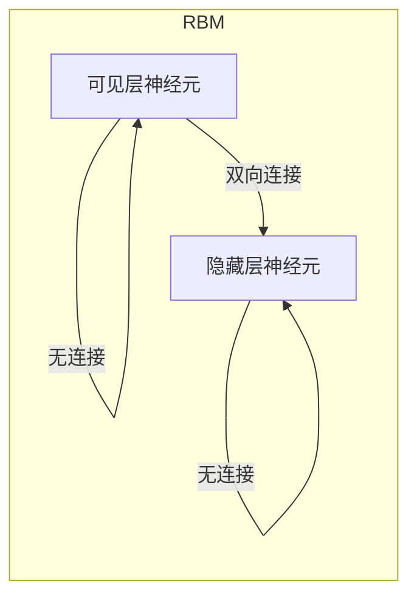
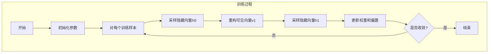

# 受限玻尔兹曼机(RBM)原理与代码实战案例讲解

## 1.背景介绍

### 1.1 什么是受限玻尔兹曼机?

受限玻尔兹曼机(Restricted Boltzmann Machine, RBM)是一种无监督神经网络模型,属于能量基础模型的一种。它由两层神经元组成:一个可见层(visible layer)和一个隐藏层(hidden layer)。可见层用于接收输入数据,隐藏层则用于捕捉输入数据的特征。RBM的独特之处在于,同一层内的神经元之间没有连接,只有不同层之间的神经元相互连接。

### 1.2 RBM的应用

RBM最初被提出用于提取输入数据的特征,并将其作为更高层神经网络的输入。近年来,RBM在诸多领域得到了广泛应用,例如:

- 维数约减(Dimensionality Reduction)
- 协同过滤(Collaborative Filtering)
- 计算机视觉(Computer Vision)
- 信息检索(Information Retrieval)
- 自然语言处理(Natural Language Processing)

### 1.3 RBM的优势

RBM具有以下优势:

- 无监督学习,无需标记数据
- 能够学习输入数据的概率分布
- 具有良好的生成能力,可生成类似于训练数据的新样本
- 可堆叠形成深层网络,提取更高层次的特征

## 2.核心概念与联系

### 2.1 能量函数

RBM的核心概念是能量函数(Energy Function)。给定一个可见向量 $\vec{v}$ 和一个隐藏向量 $\vec{h}$,RBM的能量函数定义为:

$$E(\vec{v}, \vec{h}) = -\vec{a}^T\vec{v} - \vec{b}^T\vec{h} - \vec{v}^T\vec{W}\vec{h}$$

其中:
- $\vec{a}$ 是可见层的偏置向量(bias vector)
- $\vec{b}$ 是隐藏层的偏置向量
- $\vec{W}$ 是可见层与隐藏层之间的权重矩阵(weight matrix)

能量函数measure了一个特定的可见向量 $\vec{v}$ 和隐藏向量 $\vec{h}$ 的配对的相容程度。较低的能量值意味着该配对更有可能出现。

### 2.2 联合概率分布

基于能量函数,RBM定义了可见向量 $\vec{v}$ 和隐藏向量 $\vec{h}$ 的联合概率分布:

$$P(\vec{v}, \vec{h}) = \frac{e^{-E(\vec{v}, \vec{h})}}{Z}$$

其中 $Z$ 是配分函数(partition function),用于确保概率之和为1:

$$Z = \sum_{\vec{v}}\sum_{\vec{h}}e^{-E(\vec{v}, \vec{h})}$$

由于RBM的特殊结构,可见向量 $\vec{v}$ 与隐藏向量 $\vec{h}$ 在给定另一向量时是条件独立的。因此,我们可以高效地计算出条件概率分布:

$$P(\vec{h}|\vec{v}) = \prod_j P(h_j|\vec{v})$$
$$P(\vec{v}|\vec{h}) = \prod_i P(v_i|\vec{h})$$

其中 $P(h_j|\vec{v})$ 和 $P(v_i|\vec{h})$ 可以高效计算。

### 2.3 Mermaid流程图



上图展示了RBM的基本结构。可见层和隐藏层之间存在双向连接,但同一层内的神经元之间没有连接。

## 3.核心算法原理具体操作步骤

### 3.1 对比分歧算法

RBM的训练过程使用对比分歧算法(Contrastive Divergence, CD),它是一种近似最大似然估计的方法。CD算法的基本思想是:

1. 初始化RBM的权重矩阵 $\vec{W}$ 和偏置向量 $\vec{a}$, $\vec{b}$
2. 对于每个训练样本 $\vec{v}^{(0)}$:
    - 采样隐藏向量: $\vec{h}^{(0)} \sim P(\vec{h}|\vec{v}^{(0)})$
    - 重构可见向量: $\vec{v}^{(1)} \sim P(\vec{v}|\vec{h}^{(0)})$
    - 采样重构隐藏向量: $\vec{h}^{(1)} \sim P(\vec{h}|\vec{v}^{(1)})$
3. 更新权重和偏置:
    $$\Delta W = \epsilon(\langle\vec{v}^{(0)}\vec{h}^{(0)T}\rangle_{\text{data}} - \langle\vec{v}^{(1)}\vec{h}^{(1)T}\rangle_{\text{model}})$$
    $$\Delta a = \epsilon(\langle\vec{v}^{(0)}\rangle_{\text{data}} - \langle\vec{v}^{(1)}\rangle_{\text{model}})$$
    $$\Delta b = \epsilon(\langle\vec{h}^{(0)}\rangle_{\text{data}} - \langle\vec{h}^{(1)}\rangle_{\text{model}})$$

其中 $\epsilon$ 是学习率,尖括号 $\langle\cdot\rangle$ 表示对所有训练样本求平均。

上述过程反复迭代,直到模型收敛。CD算法通过对比数据分布与模型分布的差异,不断调整RBM的参数,使模型分布逐渐逼近真实数据分布。

### 3.2 Mermaid流程图



上图展示了CD算法的训练过程流程。重点步骤包括:采样隐藏向量、重构可见向量、更新参数,并重复该过程直至收敛。

## 4.数学模型和公式详细讲解举例说明

### 4.1 能量函数和联合概率分布

我们已经知道,RBM的能量函数定义为:

$$E(\vec{v}, \vec{h}) = -\vec{a}^T\vec{v} - \vec{b}^T\vec{h} - \vec{v}^T\vec{W}\vec{h}$$

其中:
- $\vec{v}$ 是可见向量,维度为 $n_v$
- $\vec{h}$ 是隐藏向量,维度为 $n_h$
- $\vec{a}$ 是可见层偏置向量,维度为 $n_v$
- $\vec{b}$ 是隐藏层偏置向量,维度为 $n_h$
- $\vec{W}$ 是权重矩阵,维度为 $n_v \times n_h$

能量函数measure了一个特定的可见向量 $\vec{v}$ 和隐藏向量 $\vec{h}$ 的配对的相容程度。较低的能量值意味着该配对更有可能出现。

基于能量函数,RBM定义了可见向量 $\vec{v}$ 和隐藏向量 $\vec{h}$ 的联合概率分布:

$$P(\vec{v}, \vec{h}) = \frac{e^{-E(\vec{v}, \vec{h})}}{Z}$$

其中 $Z$ 是配分函数,用于确保概率之和为1:

$$Z = \sum_{\vec{v}}\sum_{\vec{h}}e^{-E(\vec{v}, \vec{h})}$$

配分函数 $Z$ 的计算是非常困难的,因为它需要对所有可能的可见向量和隐藏向量进行求和。但是,由于RBM的特殊结构,我们可以高效地计算出条件概率分布,而不需要计算 $Z$。

### 4.2 条件概率分布

由于RBM的限制性质,可见向量 $\vec{v}$ 与隐藏向量 $\vec{h}$ 在给定另一向量时是条件独立的。因此,我们可以高效地计算出条件概率分布:

$$P(\vec{h}|\vec{v}) = \prod_j P(h_j|\vec{v})$$
$$P(\vec{v}|\vec{h}) = \prod_i P(v_i|\vec{h})$$

其中,单个隐藏神经元 $h_j$ 的条件概率为:

$$P(h_j=1|\vec{v}) = \sigma(b_j + \vec{w}_j^T\vec{v})$$

单个可见神经元 $v_i$ 的条件概率取决于其类型:

- 对于二值可见神经元:
$$P(v_i=1|\vec{h}) = \sigma(a_i + \vec{W}_{i:}^T\vec{h})$$

- 对于高斯可见神经元:
$$P(v_i|\vec{h}) = \mathcal{N}(v_i; a_i + \vec{W}_{i:}^T\vec{h}, \sigma_i^2)$$

其中 $\sigma(\cdot)$ 是 Sigmoid 函数, $\mathcal{N}(\cdot)$ 是高斯分布。

通过上述高效的条件概率计算,我们可以在CD算法中有效地对隐藏向量和可见向量进行采样。

### 4.3 举例说明

假设我们有一个RBM,其中可见层有3个神经元,隐藏层有2个神经元。设可见向量为 $\vec{v} = (1, 0, 1)^T$,权重矩阵为:

$$\vec{W} = \begin{pmatrix}
0.1 & 0.4\\
0.2 & -0.3\\
0.3 & 0.1
\end{pmatrix}$$

可见层偏置向量为 $\vec{a} = (-0.2, 0.1, -0.3)^T$,隐藏层偏置向量为 $\vec{b} = (0.2, -0.1)^T$。

我们可以计算出该RBM的能量函数值:

$$\begin{aligned}
E(\vec{v}, \vec{h}) &= -\vec{a}^T\vec{v} - \vec{b}^T\vec{h} - \vec{v}^T\vec{W}\vec{h}\\
&= -(-0.2 \times 1 + 0.1 \times 0 + -0.3 \times 1) - (0.2 \times 1 + -0.1 \times 0) \\
&\quad - (1 \times 0.1 + 0 \times 0.2 + 1 \times 0.3) \times 1 \\
&\quad + (1 \times 0.4 + 0 \times -0.3 + 1 \times 0.1) \times 0\\
&= -0.5 - 0.2 - 0.4 + 0\\
&= -1.1
\end{aligned}$$

根据能量函数值,我们可以计算出该可见向量 $\vec{v}$ 和任意一个隐藏向量 $\vec{h}$ 的联合概率分布 $P(\vec{v}, \vec{h})$。

此外,我们还可以计算出隐藏神经元的条件概率:

$$\begin{aligned}
P(h_1=1|\vec{v}) &= \sigma(b_1 + \vec{w}_1^T\vec{v})\\
&= \sigma(0.2 + (0.1 \times 1 + 0.2 \times 0 + 0.3 \times 1))\\
&= \sigma(0.6) \approx 0.645
\end{aligned}$$

$$\begin{aligned}
P(h_2=1|\vec{v}) &= \sigma(b_2 + \vec{w}_2^T\vec{v})\\
&= \sigma(-0.1 + (0.4 \times 1 + -0.3 \times 0 + 0.1 \times 1))\\
&= \sigma(0.4) \approx 0.598
\end{aligned}$$

通过这个例子,我们可以更好地理解RBM的数学模型和公式。

## 5.项目实践：代码实例和详细解释说明

在这一节,我们将使用Python和TensorFlow库实现一个简单的RBM模型,并在MNIST手写数字数据集上进行训练和测试。

### 5.1 导入所需库

```python
import tensorflow as tf
import numpy as np
import matplotlib.pyplot as plt
```

### 5.2 加载MNIST数据集

```python
# 加载MNIST数据集
mnist