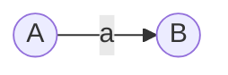
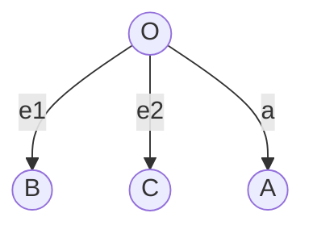

# 向量在二维空间中的表示与操作

## 1.背景介绍
### 1.1 向量的概念
向量是一个基本的数学概念,在物理学、工程学和计算机科学等领域有着广泛的应用。从几何角度看,向量表示一个有大小和方向的量,可以用来描述物体的位移、速度、加速度等物理量。从代数角度看,向量是一组有序数,通常写成列向量或行向量的形式。

### 1.2 向量在二维空间中的重要性
在二维空间中,向量扮演着至关重要的角色。很多物理问题和几何问题都可以用二维向量来建模和求解,比如:
- 描述平面上点的位置
- 表示平面图形的边和法向量  
- 分析物体在平面内的运动
- 求解平面内的力的合成与分解
- 进行图形的几何变换,如平移、旋转、缩放等

掌握二维向量的表示方法和运算法则,是学习线性代数、计算机图形学、物理模拟等领域的基础。

## 2.核心概念与联系
### 2.1 向量的坐标表示
在二维笛卡尔坐标系中,向量 $\vec{a}$ 可以用有序实数对 $(x,y)$ 来表示,其中 $x$ 和 $y$ 分别是向量在 $x$ 轴和 $y$ 轴上的分量。向量 $\vec{a}$ 也可以写成列向量的形式:

$$\vec{a}=\begin{pmatrix}
x \\ y
\end{pmatrix}$$

这种列向量表示法在进行矩阵运算时非常方便。

### 2.2 向量的几何表示
从几何角度看,向量可以用有向线段来表示。设向量 $\vec{a}$ 的起点为 $A(x_1,y_1)$,终点为 $B(x_2,y_2)$,则向量 $\vec{a}$ 的几何表示为:



向量 $\vec{a}$ 的长度(模)等于线段 $\overline{AB}$ 的长度,方向为从 $A$ 指向 $B$。向量的坐标表示与几何表示之间有如下关系:

$$\vec{a}=\overrightarrow{AB}=\begin{pmatrix}
x_2-x_1 \\ y_2-y_1  
\end{pmatrix}$$

### 2.3 向量的线性运算
向量的一个重要性质是可以进行加、减、数乘等线性运算。设有两个向量 $\vec{a}=(x_1,y_1)$, $\vec{b}=(x_2,y_2)$ 和实数 $k$,则:

1. 向量加法:
$\vec{a}+\vec{b}=(x_1+x_2,y_1+y_2)$

2. 向量减法:  
$\vec{a}-\vec{b}=(x_1-x_2,y_1-y_2)$

3. 数乘向量:
$k\vec{a}=(kx_1,ky_1)$

这些运算在几何上也有直观的意义,如向量加法对应平行四边形法则,数乘向量改变向量的长度但保持方向不变。

### 2.4 向量的点积(内积)
向量的点积是两个向量的一种代数运算,对应着向量在几何上的投影关系。设有两个向量 $\vec{a}=(x_1,y_1)$, $\vec{b}=(x_2,y_2)$,则它们的点积定义为:

$$\vec{a}\cdot\vec{b}=x_1x_2+y_1y_2$$

点积满足交换律、结合律、对数乘的分配律,是一种重要的双线性形式。几何上,点积等于两个向量长度与它们夹角余弦的乘积:

$$\vec{a}\cdot\vec{b}=|\vec{a}||\vec{b}|\cos\theta$$

其中 $\theta$ 是向量 $\vec{a}$ 和 $\vec{b}$ 的夹角。由此可知,两个向量垂直的充要条件是它们的点积为0。

## 3.核心算法原理具体操作步骤
### 3.1 向量的坐标运算
已知两个向量 $\vec{a}=(x_1,y_1)$, $\vec{b}=(x_2,y_2)$,求它们的和、差以及数乘向量的坐标表示。

解:
1. 向量加法:
$\vec{a}+\vec{b}=(x_1+x_2,y_1+y_2)$

2. 向量减法:
$\vec{a}-\vec{b}=(x_1-x_2,y_1-y_2)$  

3. 数乘向量 $k\vec{a}$:
$k\vec{a}=(kx_1,ky_1)$

只需将对应坐标分量进行加减或乘以实数即可。

### 3.2 求向量的模长
已知向量 $\vec{a}=(x,y)$ 的坐标表示,求其模长 $|\vec{a}|$。

解:
由勾股定理,向量的模等于其坐标分量平方和的平方根:

$$|\vec{a}|=\sqrt{x^2+y^2}$$

### 3.3 向量的单位化
已知非零向量 $\vec{a}$,求其单位向量(方向向量) $\hat{a}$。

解:
向量的单位向量与其同方向,模长为1,可以通过除以向量的模得到:

$$\hat{a}=\frac{\vec{a}}{|\vec{a}|}=\frac{1}{\sqrt{x^2+y^2}}\begin{pmatrix}
x \\ y
\end{pmatrix}$$

### 3.4 求两个向量的夹角
已知两个非零向量 $\vec{a}$ 和 $\vec{b}$,求它们的夹角 $\theta$。

解:
由向量点积的几何意义,可得:

$$\cos\theta=\frac{\vec{a}\cdot\vec{b}}{|\vec{a}||\vec{b}|}$$

因此,

$$\theta=\arccos(\frac{\vec{a}\cdot\vec{b}}{|\vec{a}||\vec{b}|})$$

其中 $\arccos$ 表示反余弦函数。

### 3.5 判断两个向量的垂直关系
已知两个向量 $\vec{a}$ 和 $\vec{b}$,判断它们是否垂直。

解:
两个向量垂直的充要条件是它们的点积为0,即:

$$\vec{a}\cdot\vec{b}=0$$

## 4.数学模型和公式详细讲解举例说明
### 4.1 平面向量基本定理
**定理:** 设 $\vec{e_1}=(1,0)$, $\vec{e_2}=(0,1)$ 是平面直角坐标系的两个单位坐标向量,则平面上任意向量 $\vec{a}$ 都可以唯一地表示成 $\vec{e_1}$ 和 $\vec{e_2}$ 的线性组合,即存在唯一的实数 $x$, $y$ 使得:

$$\vec{a}=x\vec{e_1}+y\vec{e_2}$$

其中 $x$, $y$ 就是向量 $\vec{a}$ 的坐标。

**证明:**
设向量 $\vec{a}$ 的起点为原点 $O(0,0)$,终点为 $A(x,y)$,则 $\overrightarrow{OA}=\vec{a}$。作 $A$ 点向 $x$ 轴和 $y$ 轴的垂线,设垂足分别为 $B$, $C$,则:



由几何意义可知,
$\overrightarrow{OB}=x\vec{e_1}$, $\overrightarrow{OC}=y\vec{e_2}$,而 $\overrightarrow{OA}=\overrightarrow{OB}+\overrightarrow{BA}=\overrightarrow{OB}+\overrightarrow{OC}$,代入即得:

$$\vec{a}=\overrightarrow{OA}=x\vec{e_1}+y\vec{e_2}$$

**说明:**
这个定理说明了平面向量与坐标系的关系,任何一个平面向量都可以用两个不共线的向量(如单位坐标向量)的线性组合唯一表示,这为平面向量的坐标运算提供了理论基础。同时,平面向量加法的几何意义也可以从平面向量基本定理得到直观的解释。

### 4.2 向量点积的坐标表示
**公式:**
设 $\vec{a}=(x_1,y_1)$, $\vec{b}=(x_2,y_2)$,则:

$$\vec{a}\cdot\vec{b}=x_1x_2+y_1y_2$$

**推导:**
设 $\vec{a}=x_1\vec{e_1}+y_1\vec{e_2}$, $\vec{b}=x_2\vec{e_1}+y_2\vec{e_2}$,其中 $\vec{e_1}$, $\vec{e_2}$ 是单位坐标向量,则:

$$
\begin{aligned}
\vec{a}\cdot\vec{b} &=(x_1\vec{e_1}+y_1\vec{e_2})\cdot(x_2\vec{e_1}+y_2\vec{e_2})\\
&=x_1x_2(\vec{e_1}\cdot\vec{e_1})+x_1y_2(\vec{e_1}\cdot\vec{e_2})+y_1x_2(\vec{e_2}\cdot\vec{e_1})+y_1y_2(\vec{e_2}\cdot\vec{e_2})\\
&=x_1x_2+y_1y_2
\end{aligned}
$$

其中利用了点积的分配律,以及 $\vec{e_1}\cdot\vec{e_1}=\vec{e_2}\cdot\vec{e_2}=1$, $\vec{e_1}\cdot\vec{e_2}=\vec{e_2}\cdot\vec{e_1}=0$。

**说明:**
这个公式表明,向量的点积可以通过向量坐标的代数运算直接计算,无需考虑向量的几何关系。这大大简化了向量点积的计算过程,特别是在高维空间中更为方便。同时,通过坐标表示我们可以发现,向量点积是一个双线性函数,这为向量点积的性质的推导提供了代数工具。

## 5.项目实践：代码实例和详细解释说明
下面我们用Python代码来实现二维向量的基本运算。

```python
import math

class Vec2d:
    """二维向量类"""
    def __init__(self, x, y):
        self.x = x
        self.y = y
    
    def __add__(self, other):
        """向量加法"""
        return Vec2d(self.x + other.x, self.y + other.y)
    
    def __sub__(self, other):
        """向量减法"""
        return Vec2d(self.x - other.x, self.y - other.y)
    
    def __mul__(self, k):
        """数乘向量"""
        return Vec2d(k * self.x, k * self.y)
    
    def __rmul__(self, k):
        """右乘数乘向量"""
        return self * k
    
    def __truediv__(self, k):
        """数除向量"""
        return Vec2d(self.x / k, self.y / k)
    
    def dot(self, other):
        """向量点积"""
        return self.x * other.x + self.y * other.y
    
    def norm(self):
        """向量模长"""
        return math.sqrt(self.x**2 + self.y**2)
    
    def normalize(self):
        """向量单位化"""
        return self / self.norm()
    
    def angle(self, other):
        """向量夹角(弧度制)"""
        return math.acos(self.dot(other) / (self.norm() * other.norm()))
    
    def is_perpendicular(self, other):
        """判断两个向量是否垂直"""
        return abs(self.dot(other)) < 1e-8
    
    def __str__(self):
        """向量的字符串表示"""
        return f"({self.x}, {self.y})"
```

**代码说明:**
- `Vec2d`类表示二维向量,构造函数接受向量的两个坐标分量。
- `__add__`, `__sub__`, `__mul__`, `__truediv__`方法重载了向量的加、减、数乘、数除运算,实现了向量的坐标运算。
- `dot`方法计算两个向量的点积,对应公式 $\vec{a}\cdot\vec{b}=x_1x_2+y_1y_2$。
- `norm`方法计算向量的模长,对应公式 $|\vec{a}|=\sqrt{x^2+y^2}$。
- `normalize`方法将向量单位化,得到其单位