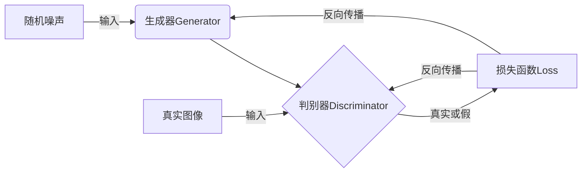
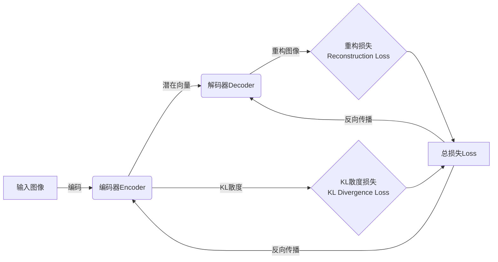
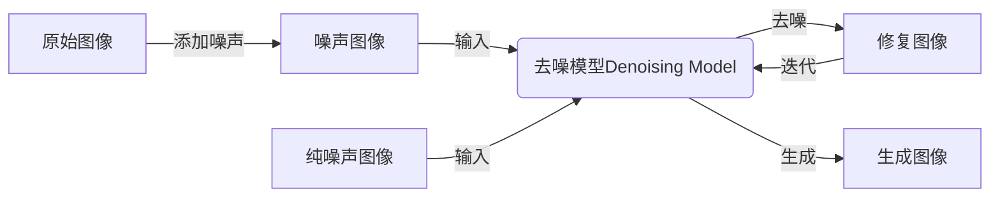

# 图像生成(Image Generation) - 原理与代码实例讲解

## 1.背景介绍

随着人工智能和深度学习技术的快速发展,图像生成(Image Generation)已经成为一个备受关注的热门领域。图像生成旨在利用算法从随机噪声或文本描述中生成逼真、高质量的图像。这项技术在多个行业都有广泛的应用前景,如广告设计、电影特效、医疗成像等。

传统的图像生成方法主要依赖于规则和模板,缺乏灵活性和创造力。而基于深度学习的图像生成模型则可以从大量数据中自主学习图像的分布和特征,生成具有多样性和创造性的图像。

## 2.核心概念与联系

图像生成涉及多个核心概念,包括生成对抗网络(Generative Adversarial Networks, GANs)、变分自编码器(Variational Autoencoders, VAEs)、扩散模型(Diffusion Models)等。这些概念虽然技术路线不同,但都旨在从低维潜在空间学习图像的高维分布。

### 2.1 生成对抗网络(GANs)

GANs是最早也是最成功的图像生成模型之一。它由一个生成器(Generator)网络和一个判别器(Discriminator)网络组成,两者相互对抗地训练。生成器从潜在空间采样,试图生成逼真的图像来欺骗判别器;而判别器则努力区分生成图像和真实图像。



### 2.2 变分自编码器(VAEs)

VAEs结合了生成模型和推理模型,能够同时学习数据的概率分布和潜在表示。它由一个编码器(Encoder)网络和一个解码器(Decoder)网络组成。编码器将输入图像编码为潜在向量,解码器则从潜在向量重构图像。通过最小化重构损失和KL散度损失,VAEs可以学习数据的潜在分布。



### 2.3 扩散模型(Diffusion Models)

扩散模型是一种新兴的生成模型,通过学习从噪声到数据的反向过程来生成图像。它包括一个正向扩散过程(添加噪声)和一个反向过程(去噪)。在训练时,模型学习从噪声图像中移除噪声并重构原始图像。在推理时,模型从纯噪声开始,逐步去噪并最终生成所需图像。



## 3.核心算法原理具体操作步骤

不同的图像生成模型采用不同的核心算法原理,下面将分别介绍GANs、VAEs和扩散模型的具体操作步骤。

### 3.1 生成对抗网络(GANs)

GANs的训练过程包括以下步骤:

1. **初始化生成器和判别器网络**,通常使用卷积神经网络(CNNs)或其变体。
2. **从噪声先验分布(如高斯分布)中采样潜在向量 z**,作为生成器的输入。
3. **生成器网络 G(z) 生成假图像**。
4. **从真实图像数据集中采样一批真实图像**。
5. **将生成的假图像和真实图像输入到判别器 D**,判别器输出每个图像为真或假的概率。
6. **计算判别器的损失函数**,例如二元交叉熵损失。
7. **反向传播,更新判别器的权重**,使其能更好地区分真实和假图像。
8. **计算生成器的损失函数**,例如 log(1 - D(G(z)))。
9. **反向传播,更新生成器的权重**,使其能生成更逼真的图像来欺骗判别器。
10. **重复步骤 2-9,直到模型收敛**。

### 3.2 变分自编码器(VAEs)

VAEs的训练过程包括以下步骤:

1. **初始化编码器和解码器网络**,通常使用全卷积网络。
2. **从训练数据集中采样一批图像输入编码器**。
3. **编码器将图像编码为均值 μ 和标准差 σ,表示潜在空间的分布参数**。
4. **从编码器输出的分布中采样潜在向量 z**。
5. **将潜在向量 z 输入解码器,生成重构图像**。
6. **计算重构损失**,例如均方误差或二值交叉熵损失。
7. **计算KL散度损失**,衡量编码器输出分布与标准高斯先验分布之间的差异。
8. **计算总损失**,即重构损失与KL散度损失的加权和。
9. **反向传播,更新编码器和解码器的权重**,以最小化总损失。
10. **重复步骤 2-9,直到模型收敛**。

### 3.3 扩散模型(Diffusion Models)

扩散模型的训练过程包括以下步骤:

1. **初始化去噪模型网络**,通常使用 U-Net 或其变体。
2. **从训练数据集中采样一批图像 x**。
3. **对图像 x 执行正向扩散过程**,添加不同程度的高斯噪声,生成一系列噪声图像 {x̃<sub>t</sub>}。
4. **将噪声图像 x̃<sub>t</sub> 和对应的噪声等级 t 输入去噪模型**。
5. **去噪模型预测图像 x<sub>t-1</sub>,即去除一部分噪声后的图像**。
6. **计算去噪模型的损失函数**,例如均方误差损失。
7. **反向传播,更新去噪模型的权重**,使其能更好地去除噪声。
8. **重复步骤 2-7,直到模型收敛**。

在推理时,扩散模型从纯噪声开始,逐步去噪并最终生成所需图像。

## 4.数学模型和公式详细讲解举例说明

### 4.1 生成对抗网络(GANs)

GANs的目标是训练生成器 G 生成的图像分布 p<sub>g</sub>(x) 逼近真实数据分布 p<sub>data</sub>(x)。生成器 G 将潜在向量 z 映射到图像空间,而判别器 D 试图区分生成图像和真实图像。可以将 GANs 形式化为一个二人零和博弈:

$$\min_{G}\max_{D}V(D,G) = \mathbb{E}_{x\sim p_{data}(x)}[\log D(x)] + \mathbb{E}_{z\sim p_{z}(z)}[\log(1-D(G(z)))]$$

其中,第一项是判别器对真实数据的期望输出,第二项是判别器对生成数据的期望输出的相反数。通过最小化 V(D,G),生成器 G 将学习生成逼真的图像以欺骗判别器 D。

在实践中,通常使用不同的损失函数来训练 GANs,例如最小二乘损失、Wasserstein 损失等。此外,还有许多 GANs 变体旨在提高训练稳定性和生成质量,如 WGAN、SAGAN、BigGAN 等。

### 4.2 变分自编码器(VAEs)

VAEs 试图最大化边缘对数似然 $\log p(x)$,其中 $x$ 是观测数据。由于直接最大化 $\log p(x)$ 是困难的,VAEs 引入了一个潜在变量 $z$,并使用变分推断(Variational Inference)来近似 $\log p(x)$:

$$\log p(x) \geq \mathbb{E}_{q(z|x)}[\log p(x|z)] - D_{KL}(q(z|x)||p(z))$$

其中,第一项是重构项,表示在给定潜在向量 $z$ 的情况下重构数据 $x$ 的对数似然;第二项是 KL 散度项,用于将编码器的输出分布 $q(z|x)$ 与先验分布 $p(z)$ 对齐。

在实现中,编码器 $q(z|x)$ 通常被参数化为一个对角高斯分布 $\mathcal{N}(\mu(x),\sigma^2(x))$,其中 $\mu(x)$ 和 $\sigma(x)$ 由神经网络输出。解码器 $p(x|z)$ 则被参数化为一个生成网络,用于从潜在向量 $z$ 重构数据 $x$。

训练目标是最小化重构损失和 KL 散度损失的加权和,通过随机梯度下降等优化算法来更新编码器和解码器的参数。

### 4.3 扩散模型(Diffusion Models)

扩散模型的核心思想是学习从噪声图像到原始图像的反向过程。具体来说,正向扩散过程可以表示为一个马尔可夫链:

$$q(x_t|x_{t-1}) = \mathcal{N}(x_t;\sqrt{1-\beta_t}x_{t-1},\beta_tI)$$

其中 $\beta_t$ 是一个预定义的噪声程度参数。经过 T 步扩散后,图像将变为纯噪声 $x_T \sim \mathcal{N}(0,I)$。

反向过程的目标是从噪声图像 $x_T$ 重构原始图像 $x_0$,可以通过学习条件概率 $p_\theta(x_{t-1}|x_t)$ 来实现。根据扩散过程的可逆性,有:

$$\begin{aligned}
p_\theta(x_0) &= \prod_{t=1}^Tp_\theta(x_{t-1}|x_t)p(x_T)\\
           &= \prod_{t=1}^Tp_\theta(x_{t-1}|x_t)\mathcal{N}(x_T;0,I)
\end{aligned}$$

因此,训练目标是最小化以下损失函数:

$$\mathbb{E}_{x_0,\epsilon}\left[\left\|x_0 - \alpha_t\left(x_t - \frac{\beta_t}{1-\overline{\beta}_t}\epsilon\right) - \sigma_t\epsilon\right\|^2\right]$$

其中 $\alpha_t$、$\sigma_t$ 和 $\overline{\beta}_t$ 是与 $\beta_t$ 相关的超参数。通过优化该损失函数,模型可以学习从噪声图像中移除噪声并重构原始图像。

在推理时,扩散模型从纯噪声 $x_T \sim \mathcal{N}(0,I)$ 开始,逐步去噪并最终生成所需图像 $\hat{x}_0$。

## 5.项目实践:代码实例和详细解释说明

为了更好地理解图像生成模型的原理和实现,我们将使用 PyTorch 提供一些代码示例。这些示例基于流行的开源库,如 PyTorch Lightning、Diffusers 等,旨在展示不同模型的核心组件。

### 5.1 生成对抗网络(GANs)

以下是一个简单的 DCGAN(Deep Convolutional GAN)实现,用于生成手写数字图像:

```python
import torch
import torch.nn as nn
from torchvision import transforms
from torchvision.datasets import MNIST

# 定义生成器网络
class Generator(nn.Module):
    def __init__(self, z_dim):
        super().__init__()
        self.net = nn.Sequential(
            nn.ConvTranspose2d(z_dim, 256, 4, 1, 0, bias=False),
            nn.BatchNorm2d(256),
            nn.ReLU(True),
            nn.ConvTranspose2d(256, 128, 4, 2, 1, bias=False),
            nn.BatchNorm2d(128),
            nn.ReLU(True),
            nn.ConvTranspose2d(128, 64