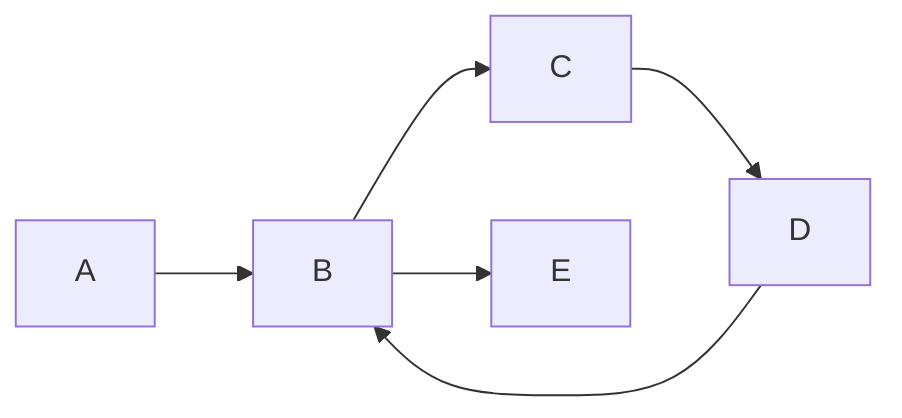

# 图的连通性：强连通分量、弱连通分量

## 1.背景介绍

在图论领域中,连通性是一个非常重要的概念。图的连通性描述了图中节点之间的可达性,对于理解和分析复杂网络具有重要意义。根据图的类型不同,连通性可以分为强连通分量和弱连通分量两种。

### 1.1 什么是图?

在计算机科学中,图是一种抽象的数据结构,用于表示对象之间的关联关系。图由一组节点(或称顶点)和连接这些节点的边组成。节点可以表示任何实体,如人、城市、计算机等,而边则表示节点之间的关系或连接。

### 1.2 有向图和无向图

根据边的方向性,图可以分为有向图和无向图两种类型:

- 有向图(Directed Graph):边具有方向性,表示节点之间的单向关系。
- 无向图(Undirected Graph):边没有方向性,表示节点之间的双向关系。

### 1.3 连通性的重要性

连通性是图论中的一个核心概念,它描述了图中节点之间的可达性。在许多实际应用中,如社交网络、交通网络、计算机网络等,连通性扮演着重要角色。通过分析连通性,我们可以了解网络的结构特征、发现关键节点、优化路径等。

## 2.核心概念与联系

### 2.1 强连通分量

在有向图中,如果对于任意两个节点 u 和 v,都存在从 u 到 v 和从 v 到 u 的路径,则称这些节点是强连通的。强连通分量是指一个有向图中所有强连通的节点的最大集合。

换句话说,一个强连通分量是一个子图,在这个子图中,任意两个节点之间都是强连通的,并且它是图中最大的具有这种性质的子图。

### 2.2 弱连通分量

在无向图或者将有向图视为无向图时,如果对于任意两个节点 u 和 v,都存在一条路径可以从 u 到达 v,则称这些节点是弱连通的。弱连通分量是指一个图中所有弱连通的节点的最大集合。

换句话说,一个弱连通分量是一个子图,在这个子图中,任意两个节点之间都是弱连通的,并且它是图中最大的具有这种性质的子图。

### 2.3 强连通分量与弱连通分量的关系

在有向图中,每个强连通分量都是一个弱连通分量,但反过来不一定成立。也就是说,强连通分量是弱连通分量的一个特例,它要求节点之间不仅可达,而且还要双向可达。

在无向图中,由于边没有方向性,所以强连通分量和弱连通分量是等价的概念。

## 3.核心算法原理具体操作步骤

### 3.1 深度优先搜索(DFS)

深度优先搜索(Depth-First Search, DFS)是一种常用的图遍历算法,它可以用于寻找强连通分量和弱连通分量。DFS的基本思想是从一个节点出发,沿着一条路径尽可能深入,直到无法继续为止,然后回溯到上一个节点,尝试另一条路径。

#### 3.1.1 寻找强连通分量的 Tarjan 算法

Tarjan 算法是一种高效的算法,可以在线性时间内找到有向图的强连通分量。它的核心思想是利用 DFS 遍历图,同时维护一个栈和两个数组:低链接值数组和访问顺序数组。

算法步骤如下:

1. 初始化栈和两个数组,将所有节点标记为未访问。
2. 对于每个未访问的节点,进行 DFS 遍历。
3. 在 DFS 遍历过程中,记录每个节点的访问顺序和低链接值。
4. 如果当前节点的低链接值等于访问顺序,则该节点是一个强连通分量的根节点。
5. 将栈中从根节点到当前节点的所有节点出栈,作为一个强连通分量。
6. 重复步骤 2-5,直到所有节点都被访问过。

#### 3.1.2 寻找弱连通分量

对于无向图,我们可以直接使用 DFS 遍历来找到弱连通分量。算法步骤如下:

1. 初始化一个集合,用于存储所有的弱连通分量。
2. 对于每个未访问的节点,进行 DFS 遍历。
3. 在 DFS 遍历过程中,将访问过的节点添加到当前的弱连通分量集合中。
4. 当 DFS 遍历结束时,将当前的弱连通分量集合添加到结果集合中。
5. 重复步骤 2-4,直到所有节点都被访问过。

对于有向图,我们可以先将其转换为无向图,然后使用上述算法找到弱连通分量。

### 3.2 时间复杂度分析

- Tarjan 算法的时间复杂度为 O(V+E),其中 V 是节点数,E 是边数。
- 寻找弱连通分量的算法时间复杂度也是 O(V+E)。

因此,这两种算法都是线性时间复杂度,对于大型图也具有良好的性能。

## 4.数学模型和公式详细讲解举例说明

在讨论强连通分量和弱连通分量的算法时,我们需要引入一些数学概念和公式。

### 4.1 低链接值(Low-Link Value)

低链接值是 Tarjan 算法中的一个关键概念,用于确定强连通分量的根节点。对于一个节点 u,它的低链接值 $low(u)$ 定义为:

$$low(u) = \min\begin{cases}
            访问顺序(u), & \text{如果 u 是根节点}\\
            \min\limits_{(u, v) \in E}(low(v)), & \text{否则}
            \end{cases}$$

其中,$(u, v) \in E$ 表示图中存在一条从 u 到 v 的边。

低链接值的物理意义是:对于一个节点 u,如果存在一条从 u 出发的路径,可以通过其他节点回到一个比 u 访问顺序更小的祖先节点,那么 $low(u)$ 就是这个祖先节点的访问顺序。

### 4.2 强连通分量的数学表示

设 G = (V, E) 是一个有向图,其中 V 是节点集合,E 是边集合。我们定义 $R(u, v)$ 为从节点 u 到节点 v 存在一条路径的关系。则强连通分量可以表示为:

$$C = \{u \in V | \forall v \in V, R(u, v) \land R(v, u)\}$$

也就是说,一个强连通分量 C 是节点集合 V 的一个子集,对于 C 中的任意两个节点 u 和 v,都存在从 u 到 v 和从 v 到 u 的路径。

### 4.3 弱连通分量的数学表示

对于无向图 G = (V, E),弱连通分量可以表示为:

$$C = \{u \in V | \forall v \in V, R(u, v)\}$$

其中,R(u, v) 表示从节点 u 到节点 v 存在一条路径的关系。

也就是说,一个弱连通分量 C 是节点集合 V 的一个子集,对于 C 中的任意两个节点 u 和 v,都存在一条路径可以从 u 到达 v。

### 4.4 示例

考虑下面这个有向图:



对于这个有向图,我们可以计算每个节点的低链接值:

- $low(A) = 1$
- $low(B) = 1$
- $low(C) = 2$
- $low(D) = 2$
- $low(E) = 5$

根据低链接值,我们可以确定这个有向图有两个强连通分量:

1. $\{A, B, C, D\}$
2. $\{E\}$

同时,这个有向图也有两个弱连通分量,与强连通分量相同。

## 5.项目实践:代码实例和详细解释说明

在这一部分,我们将提供一些代码实例,帮助读者更好地理解如何实现寻找强连通分量和弱连通分量的算法。

### 5.1 Python 实现 Tarjan 算法

下面是使用 Python 实现 Tarjan 算法的代码示例:

```python
from collections import defaultdict

class Graph:
    def __init__(self, vertices):
        self.vertices = vertices
        self.graph = defaultdict(list)
        self.time = 0

    def add_edge(self, u, v):
        self.graph[u].append(v)

    def tarjan(self, u, visited, stack, low, disc):
        visited[u] = True
        disc[u] = self.time
        low[u] = self.time
        self.time += 1
        stack.append(u)

        for v in self.graph[u]:
            if not visited[v]:
                self.tarjan(v, visited, stack, low, disc)
                low[u] = min(low[u], low[v])
            elif v in stack:
                low[u] = min(low[u], disc[v])

        component = []
        if low[u] == disc[u]:
            while stack:
                v = stack.pop()
                component.append(v)
                if v == u:
                    break
            print(component)

    def find_scc(self):
        visited = {u: False for u in self.vertices}
        disc = {u: None for u in self.vertices}
        low = {u: None for u in self.vertices}
        stack = []

        for u in self.vertices:
            if not visited[u]:
                self.tarjan(u, visited, stack, low, disc)

# 示例用法
vertices = [0, 1, 2, 3, 4]
g = Graph(vertices)
g.add_edge(0, 1)
g.add_edge(1, 2)
g.add_edge(2, 3)
g.add_edge(3, 1)
g.add_edge(1, 4)
g.find_scc()
```

在这个示例中,我们首先定义了一个 `Graph` 类,用于表示有向图。`add_edge` 方法用于添加边,`tarjan` 方法实现了 Tarjan 算法的核心逻辑,`find_scc` 方法则调用 `tarjan` 方法找到所有的强连通分量。

代码的关键点在于利用栈和低链接值数组来识别强连通分量的根节点。当发现一个节点的低链接值等于它的访问顺序时,该节点就是一个强连通分量的根节点,此时将栈中从根节点到当前节点的所有节点出栈,作为一个强连通分量输出。

### 5.2 Python 实现寻找弱连通分量

下面是使用 Python 实现寻找弱连通分量的代码示例:

```python
from collections import defaultdict

class Graph:
    def __init__(self, vertices):
        self.vertices = vertices
        self.graph = defaultdict(list)

    def add_edge(self, u, v):
        self.graph[u].append(v)
        self.graph[v].append(u)

    def dfs(self, u, visited, component):
        visited[u] = True
        component.append(u)

        for v in self.graph[u]:
            if not visited[v]:
                self.dfs(v, visited, component)

    def find_wcc(self):
        visited = {u: False for u in self.vertices}
        components = []

        for u in self.vertices:
            if not visited[u]:
                component = []
                self.dfs(u, visited, component)
                components.append(component)

        return components

# 示例用法
vertices = [0, 1, 2, 3, 4]
g = Graph(vertices)
g.add_edge(0, 1)
g.add_edge(1, 2)
g.add_edge(2, 3)
g.add_edge(3, 1)
g.add_edge(1, 4)
print(g.find_wcc())
```

在这个示例中,我们首先定义了一个 `Graph` 类,用于表示无向图。`add_edge` 方法用于添加边,需要注意无向图的边是双向的。`dfs` 方法实现了深度优先搜索的逻辑,用于遍历一个弱连通分量。`find_wcc` 方法则调用 `dfs` 方法找到所有的弱连通分量。

代码的关键点在于利用 DFS 遍历来识别弱连通分量。对于每个未访问的节点,我们进行 DFS 遍历,将访问过的节点添加到当前的弱连通分量中。当 DFS 遍历结束时,将当前的弱连通分量添加到结果集合中。

## 6.实际应用