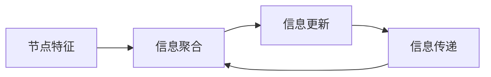

# 图神经网络原理与代码实战案例讲解

## 1.背景介绍

### 1.1 图数据的重要性

在现实世界中,许多复杂系统都可以用图的形式进行建模和表示。社交网络、交通网络、蛋白质相互作用网络、知识图谱等,都可以抽象成由节点(node)和边(edge)组成的图结构。图不仅能够自然地描述实体之间的关系,还能够反映整个系统的拓扑结构和层次信息。因此,对图数据进行高效的存储、处理和分析,对于科学研究和工业应用都具有重要意义。

### 1.2 传统图分析方法的局限性  

传统的图分析方法主要基于手工设计的特征工程,通过提取节点的度(degree)、聚类系数(clustering coefficient)、最短路径(shortest path)等统计量,来对图数据进行建模和分析。然而,这种方法存在以下几个主要缺陷:

1. 特征工程耗时耗力,需要领域专家的先验知识;
2. 设计的特征往往只能捕捉图的局部结构信息,难以表达全局拓扑;
3. 特征向量的维度通常较高,给后续的机器学习算法带来计算和存储压力。

### 1.3 图神经网络的兴起

为了克服传统方法的缺陷,近年来图神经网络(Graph Neural Networks, GNNs)应运而生,并在多个领域取得了令人瞩目的成就。图神经网络将深度学习的思想引入到图数据处理中,能够自动从原始图结构中学习出节点的表示向量(node representation),而无需人工设计特征。这种端到端(end-to-end)的处理方式,不仅降低了特征工程的工作量,还能够自动捕捉图数据的全局拓扑结构信息。

图神经网络的核心思想是通过信息传播(message passing)的方式,在图的邻域结构中传递和聚合节点特征,从而学习出节点的表示向量。根据不同的聚合方式和信息流动模式,图神经网络可以分为不同的类型,比如图卷积神经网络(GCN)、图注意力网络(GAT)、图同构网络(GIN)等。近年来,图神经网络在节点分类、链接预测、图生成、图表示学习等多个领域展现出了优异的性能。

## 2.核心概念与联系

### 2.1 图的表示

在介绍图神经网络之前,我们首先需要了解如何用数学语言来表示一个图。一个图 $\mathcal{G} = (\mathcal{V}, \mathcal{E})$ 由一个节点集合 $\mathcal{V}$ 和一个边集合 $\mathcal{E}$ 组成,其中 $\mathcal{V} = \{v_1, v_2, \cdots, v_N\}$ 表示图中包含 $N$ 个节点, $\mathcal{E} \subseteq \mathcal{V} \times \mathcal{V}$ 表示边集合,每一条边 $(v_i, v_j) \in \mathcal{E}$ 连接节点 $v_i$ 和 $v_j$。

对于有向图(directed graph),边 $(v_i, v_j)$ 表示从节点 $v_i$ 指向节点 $v_j$ 的单向连接;对于无向图(undirected graph),边 $(v_i, v_j)$ 等价于 $(v_j, v_i)$,表示节点 $v_i$ 和 $v_j$ 之间存在双向连接。此外,如果图中的边具有权重(weighted)信息,我们可以用一个权重函数 $w: \mathcal{E} \rightarrow \mathbb{R}$ 来表示每条边的权重值。

为了便于计算和建模,我们通常将图的拓扑结构用邻接矩阵(adjacency matrix) $\mathbf{A}$ 来表示,其中 $\mathbf{A}_{ij} = 1$ 当且仅当 $(v_i, v_j) \in \mathcal{E}$,否则 $\mathbf{A}_{ij} = 0$。对于加权图,邻接矩阵中的元素 $\mathbf{A}_{ij}$ 直接存储边 $(v_i, v_j)$ 的权重值。除了邻接矩阵,我们还可以使用邻接表(adjacency list)等其他数据结构来高效地存储图数据。

### 2.2 节点表示向量

在传统的图分析方法中,我们通常会为每个节点设计一个手工特征向量,用于描述节点的属性和结构信息。例如,对于一个社交网络,我们可以将用户的年龄、性别、地理位置等作为节点特征。然而,这种方法存在以下两个主要缺陷:

1. 特征工程耗时耗力,需要领域专家的先验知识;
2. 手工设计的特征往往只能捕捉局部信息,难以表达全局拓扑结构。

相比之下,图神经网络能够自动学习出节点的表示向量,克服了上述缺陷。具体来说,对于图 $\mathcal{G}$ 中的每个节点 $v_i$,我们希望学习出一个 $d$ 维的向量表示 $\mathbf{h}_i \in \mathbb{R}^d$,使得这个向量能够同时编码节点的属性信息和拓扑结构信息。这种由图神经网络自动学习出的节点表示向量,可以作为节点的特征输入,用于下游的机器学习任务,如节点分类、链接预测等。

### 2.3 信息传播机制

图神经网络的核心思想是在图的邻域结构中传递和聚合节点特征,从而学习出节点的表示向量。这个过程通常被称为信息传播(message passing)机制,包括以下三个主要步骤:

1. **信息聚合(Aggregation)**: 每个节点 $v_i$ 从它的邻居节点那里收集相关的特征信息,并将这些信息进行聚合,得到一个邻域信息向量 $\mathbf{m}_i$。

2. **信息更新(Update)**: 将聚合后的邻域信息向量 $\mathbf{m}_i$ 与节点 $v_i$ 自身的特征向量 $\mathbf{h}_i$ 进行融合,得到节点 $v_i$ 的新表示向量 $\mathbf{h}_i^{\prime}$。

3. **信息传递(Propagation)**: 将更新后的节点表示向量 $\mathbf{h}_i^{\prime}$ 传递给邻居节点,作为下一轮信息聚合的输入。

上述三个步骤在图神经网络中通常会被重复执行多次,以便在更大的邻域范围内传播和聚合信息。通过这种信息传播机制,每个节点的表示向量最终都能够融合整个图的全局拓扑结构信息。

图神经网络的具体实现方式有多种,主要区别在于信息聚合和信息更新的具体操作。比较经典的实现包括图卷积神经网络(GCN)、图注意力网络(GAT)等,我们将在后续章节中详细介绍。

## 3.核心算法原理具体操作步骤

### 3.1 图卷积神经网络(GCN)

图卷积神经网络(Graph Convolutional Network, GCN)是一种经典的图神经网络模型,由 Kipf 和 Welling 于 2017 年提出。GCN 的核心思想是将卷积操作从欧几里得数据(如图像、序列等)推广到了非欧几里得数据(如图)上,从而能够在图结构上进行特征提取和信息传播。

在 GCN 中,信息聚合步骤是通过一种特殊的卷积操作来实现的。具体来说,对于每个节点 $v_i$,我们将其邻居节点的表示向量进行加权求和,得到一个聚合向量:

$$
\mathbf{m}_i = \sum_{j \in \mathcal{N}(i)} \frac{1}{c_{ij}} \mathbf{W} \mathbf{h}_j
$$

其中 $\mathcal{N}(i)$ 表示节点 $v_i$ 的邻居节点集合, $c_{ij}$ 是一个归一化常数(通常取节点度的平方根), $\mathbf{W}$ 是一个可训练的权重矩阵,用于线性变换邻居节点的表示向量。

在信息更新步骤中,GCN 采用了一种简单而有效的方式,将聚合向量 $\mathbf{m}_i$ 与节点 $v_i$ 自身的表示向量 $\mathbf{h}_i$ 进行相加,并通过一个非线性激活函数(如 ReLU):

$$
\mathbf{h}_i^{\prime} = \sigma\left(\mathbf{m}_i + \mathbf{h}_i\right)
$$

其中 $\sigma(\cdot)$ 表示非线性激活函数。

上述信息聚合和更新过程可以被重复执行多次,每一次迭代都会扩大节点表示向量所包含的邻域范围。在实际应用中,GCN 通常会堆叠 2~3 层这样的卷积层,最后再接上一个预测层(如全连接层)来完成具体的下游任务(如节点分类、链接预测等)。

GCN 的一个重要优点是其卷积操作具有一定的空间局部性,能够很好地捕捉邻域结构信息。然而,由于采用了加权求和的方式进行信息聚合,GCN 难以有效地处理不同邻居节点的重要性差异。为了解决这个问题,后续研究者提出了基于注意力机制的图神经网络模型。

### 3.2 图注意力网络(GAT)

图注意力网络(Graph Attention Network, GAT)是另一种广为人知的图神经网络模型,由 Veličković 等人于 2018 年提出。GAT 的核心思想是在信息聚合过程中引入了注意力机制,使得模型能够自适应地为不同邻居节点分配不同的权重,从而更好地捕捉节点之间的重要性差异。

在 GAT 中,对于每个节点 $v_i$,其邻居节点的表示向量首先会通过一个共享的线性变换 $\mathbf{W}$ 进行投影,得到一个新的特征向量 $\mathbf{h}_j^{\prime} = \mathbf{W}\mathbf{h}_j$。然后,GAT 计算节点 $v_i$ 对每个邻居节点 $v_j$ 的注意力系数 $\alpha_{ij}$,并将所有邻居节点的特征向量进行加权求和,作为节点 $v_i$ 的聚合向量:

$$
\mathbf{m}_i = \sum_{j \in \mathcal{N}(i)} \alpha_{ij} \mathbf{h}_j^{\prime}
$$

其中,注意力系数 $\alpha_{ij}$ 是通过一个自注意力机制(self-attention)来计算的:

$$
\alpha_{ij} = \mathrm{softmax}_j\left(\mathrm{LeakyReLU}\left(\mathbf{a}^{\top}\left[\mathbf{W}\mathbf{h}_i \| \mathbf{W}\mathbf{h}_j\right]\right)\right)
$$

在上式中, $\mathbf{a}$ 是一个可训练的注意力向量, $\|$ 表示向量拼接操作, $\mathrm{LeakyReLU}$ 是一种特殊的非线性激活函数。通过这种自注意力机制,GAT 能够自适应地为每个邻居节点分配不同的权重,从而更好地捕捉节点之间的重要性差异。

在信息更新步骤中,GAT 采用了与 GCN 类似的方式,将聚合向量 $\mathbf{m}_i$ 与节点 $v_i$ 自身的表示向量 $\mathbf{h}_i$ 进行相加,并通过一个非线性激活函数:

$$
\mathbf{h}_i^{\prime} = \sigma\left(\mathbf{m}_i + \mathbf{h}_i\right)
$$

与 GCN 类似,GAT 也可以堆叠多层注意力层,并在最后接上一个预测层来完成下游任务。

GAT 的注意力机制使其能够更好地捕捉节点之间的重要性差异,从而在一些任务上取得了比 GCN 更好的性能。然而,GAT 的