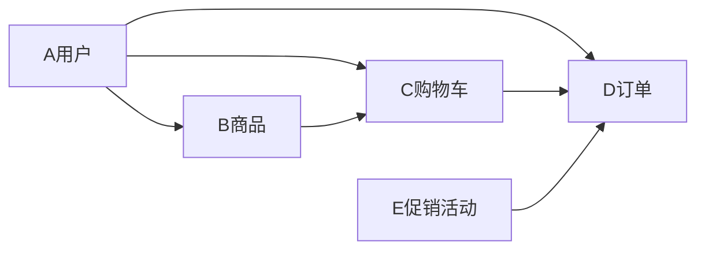

# 在线订餐系统详细设计与具体代码实现

## 1. 背景介绍

随着互联网和移动互联网的飞速发展,越来越多的人选择通过在线订餐平台来解决日常用餐问题。在线订餐系统不仅为消费者提供了极大的便利,也为餐饮企业开拓了新的商业模式和盈利渠道。本文将从需求分析、架构设计、关键技术、代码实现等方面,对在线订餐系统进行全面深入的探讨。

### 1.1 在线订餐的发展现状
#### 1.1.1 市场规模与用户数量
#### 1.1.2 主要参与企业
#### 1.1.3 盈利模式分析

### 1.2 在线订餐系统的价值
#### 1.2.1 对消费者的价值
#### 1.2.2 对餐饮企业的价值 
#### 1.2.3 对社会经济的价值

### 1.3 系统开发的目标和意义
#### 1.3.1 提升用户体验
#### 1.3.2 提高订单处理效率
#### 1.3.3 拓展商业模式

## 2. 核心概念与联系

在线订餐系统涉及到多个核心概念,本节将对这些概念进行介绍,并分析它们之间的关系。

### 2.1 用户
#### 2.1.1 消费者
#### 2.1.2 商家
#### 2.1.3 配送员

### 2.2 商品
#### 2.2.1 食品分类
#### 2.2.2 商品属性
#### 2.2.3 库存管理

### 2.3 订单 
#### 2.3.1 订单状态
#### 2.3.2 支付流程
#### 2.3.3 配送流程

### 2.4 购物车
#### 2.4.1 购物车的组成
#### 2.4.2 购物车的操作
#### 2.4.3 购物车与订单的关系

### 2.5 促销活动
#### 2.5.1 优惠券
#### 2.5.2 满减活动
#### 2.5.3 限时秒杀

下图展示了在线订餐系统中各个核心概念之间的关系:



## 3. 核心算法原理具体操作步骤

在线订餐系统中有几个关键的算法,下面将详细介绍其原理和实现步骤。

### 3.1 协同过滤推荐算法
#### 3.1.1 用户行为分析
#### 3.1.2 物品相似度计算
#### 3.1.3 生成推荐结果
#### 3.1.4 算法评估

### 3.2 订单调度算法
#### 3.2.1 订单池管理
#### 3.2.2 骑手位置追踪 
#### 3.2.3 订单匹配策略
#### 3.2.4 模拟测试

### 3.3 库存预测算法
#### 3.3.1 历史销量数据
#### 3.3.2 特征工程
#### 3.3.3 时间序列模型
#### 3.3.4 效果评估

## 4. 数学模型和公式详细讲解举例说明

上述算法都涉及到相关数学模型和公式,这里选取协同过滤推荐算法,对其中的一些关键公式进行详细讲解。

### 4.1 用户相似度
用户相似度采用余弦相似度来计算:

$$
sim(u,v) = \frac{\sum_{i \in I_{uv}} r_{ui}r_{vi}}{\sqrt{\sum_{i \in I_u} r_{ui}^2} \sqrt{\sum_{i \in I_v} r_{vi}^2}}
$$

其中$I_{uv}$表示用户$u$和用户$v$共同评分的物品集合,$r_{ui}$表示用户$u$对物品$i$的评分。

举例说明:

假设用户A和用户B都对商品X、Y、Z进行了评分,具体评分如下:

|   | X | Y | Z |
|---|---|---|---|
| A | 3 | 4 |   |
| B | 4 | 5 | 2 |

则用户A和B的相似度为:

$$
sim(A,B) = \frac{3*4+4*5}{\sqrt{3^2+4^2} \sqrt{4^2+5^2+2^2}} \approx 0.975 
$$

可见用户A和B的相似度很高。

### 4.2 物品相似度
物品相似度采用皮尔逊相关系数来计算:

$$
sim(i,j) = \frac{\sum_{u \in U_{ij}} (r_{ui}-\bar{r}_i)(r_{uj}-\bar{r}_j)}{\sqrt{\sum_{u \in U_{i}} (r_{ui}-\bar{r}_i)^2} \sqrt{\sum_{u \in U_{j}} (r_{uj}-\bar{r}_j)^2}}
$$

其中$U_{ij}$表示对物品$i$和物品$j$都有评分的用户集合,$\bar{r}_i$表示物品$i$的平均评分。

举例说明:

假设商品X和商品Y分别得到了4位用户的评分,具体如下:

|   | A | B | C | D |
|---|---|---|---|---|
| X | 3 | 4 | 2 | 5 |
| Y | 4 | 5 | 3 |   |

则商品X和Y的相似度为:

$$
\bar{r}_X = \frac{3+4+2+5}{4} = 3.5 \\
\bar{r}_Y = \frac{4+5+3}{3} = 4 \\
sim(X,Y) = \frac{(3-3.5)(4-4)+(4-3.5)(5-4)+(2-3.5)(3-4)}{\sqrt{(3-3.5)^2+(4-3.5)^2+(2-3.5)^2+(5-3.5)^2} \sqrt{(4-4)^2+(5-4)^2+(3-4)^2}} \approx 0.866
$$

可见商品X和Y的相关性也比较高。

### 4.3 生成推荐结果
根据用户相似度和物品相似度,可以预测用户对物品的评分:

$$
\hat{r}_{ui} = \bar{r}_u + \frac{\sum_{v \in S^k_u(i)} sim(u,v) (r_{vi}-\bar{r}_v)}{\sum_{v \in S^k_u(i)} sim(u,v)}
$$

其中$S^k_u(i)$表示与用户$u$最相似的$k$个用户中,对物品$i$有评分的用户集合。

最后根据预测评分的高低,选取Top N个物品推荐给用户。

## 5. 项目实践：代码实例和详细解释说明

下面以一个简单的购物车模块为例,展示在线订餐系统的部分代码实现。

### 5.1 购物车实体类

```java
public class Cart {
    private Long id;
    private Long userId;
    private List<CartItem> items = new ArrayList<>();
    
    // 总商品数量
    public int getProductCount() {
        int count = 0;
        for (CartItem item : items) {
            count += item.getCount();
        }
        return count;
    }
    
    // 总金额
    public BigDecimal getTotalPrice() {
        BigDecimal totalPrice = new BigDecimal(0);
        for (CartItem item : items) {
            totalPrice = totalPrice.add(item.getTotalPrice());
        }
        return totalPrice;
    }
    
    // getter/setter
}

public class CartItem {
    private Long id;
    private Long productId;
    private String productName;
    private String productImg;
    private BigDecimal price;
    private Integer count;
    
    // 小计
    public BigDecimal getTotalPrice() {
        return price.multiply(new BigDecimal(count));
    }
    
    // getter/setter
}
```

购物车由多个购物车项`CartItem`组成,每个`CartItem`包含了商品id、名称、图片、单价、数量等信息。在`Cart`类中还定义了计算商品总数和总金额的方法。

### 5.2 购物车的操作

```java
@Service
public class CartService {
    
    @Autowired
    private CartRepository cartRepository;
    
    // 添加商品到购物车
    public void addItem(Long userId, CartItem item) {
        Cart cart = cartRepository.findByUserId(userId);
        if (cart == null) {
            cart = new Cart();
            cart.setUserId(userId);
            cart.setItems(new ArrayList<>());
        }
        
        boolean found = false;
        for (CartItem it : cart.getItems()) {
            if (it.getProductId().equals(item.getProductId())) {
                it.setCount(it.getCount() + item.getCount());
                found = true;
                break;
            }
        }
        
        if (!found) {
            cart.getItems().add(item);
        }
        
        cartRepository.save(cart);
    }
    
    // 从购物车删除商品
    public void deleteItem(Long userId, Long productId) {
        Cart cart = cartRepository.findByUserId(userId);
        if (cart != null) {
            Iterator<CartItem> it = cart.getItems().iterator();
            while (it.hasNext()) {
                CartItem item = it.next();
                if (item.getProductId().equals(productId)) {
                    it.remove();
                    break;
                }
            }
            cartRepository.save(cart);
        }
    }
    
    // 清空购物车
    public void clear(Long userId) {
        Cart cart = cartRepository.findByUserId(userId);
        if (cart != null) {
            cart.getItems().clear();
            cartRepository.save(cart);
        }
    }
}
```

`CartService`中定义了向购物车添加商品、删除商品、清空购物车等操作,每个操作都是先根据用户id从数据库中查询购物车,然后对购物车中的商品进行增删改,最后再保存到数据库中。

### 5.3 购物车的存储
购物车数据通常存储在数据库中,这里以MySQL为例给出建表语句:

```sql
CREATE TABLE `cart` (
  `id` bigint(20) NOT NULL AUTO_INCREMENT COMMENT '主键',
  `user_id` bigint(20) NOT NULL COMMENT '用户id',
  PRIMARY KEY (`id`),
  UNIQUE KEY `user_id` (`user_id`)
) ENGINE=InnoDB DEFAULT CHARSET=utf8mb4;

CREATE TABLE `cart_item` (
  `id` bigint(20) NOT NULL AUTO_INCREMENT COMMENT '主键',
  `cart_id` bigint(20) NOT NULL COMMENT '购物车id',
  `product_id` bigint(20) NOT NULL COMMENT '商品id',
  `product_name` varchar(100) NOT NULL COMMENT '商品名称',
  `product_img` varchar(200) DEFAULT NULL COMMENT '商品图片',
  `price` decimal(10,2) NOT NULL COMMENT '商品单价',
  `count` int(11) NOT NULL DEFAULT '1' COMMENT '商品数量',
  PRIMARY KEY (`id`),
  KEY `cart_id` (`cart_id`)
) ENGINE=InnoDB DEFAULT CHARSET=utf8mb4;
```

在`cart`表中存储购物车的基本信息,在`cart_item`表中存储购物车中的商品信息,两张表通过`cart_id`关联。

## 6. 实际应用场景

在线订餐系统在生活中有广泛的应用,下面列举几个常见的应用场景。

### 6.1 连锁餐饮企业的统一管理
大型连锁餐饮企业通常在全国各地都有分店,使用在线订餐系统可以实现总部对各个分店的统一管理,包括菜品管理、订单管理、数据分析等。

### 6.2 外卖平台的入驻和运营
餐饮企业可以入驻像美团、饿了么这样的外卖平台,借助平台的流量获取订单。平台会提供一整套在线订餐系统,帮助商家进行店铺管理、订单处理、配送调度等。

### 6.3 企业内部的食堂管理
大型企业和高校的食堂也可以使用在线订餐系统,员工或学生可以通过手机App或小程序提前下单,到窗口取餐,减少排队等候时间,提高就餐效率。

### 6.4 社区团购的展示和下单
社区团购小程序如兴盛优选等也离不开在线订餐系统的支持,居民可以在小程序上浏览附近的团购商品,下单后由团长集中配送。

## 7. 工具和资源推荐

开发在线订餐系统需要用到各种工具和资源,下面推荐一些实用的资源。

### 7.1 开发工具
- IntelliJ IDEA:功能强大的Java IDE
- Navicat:数据库可视化工具
- Postman:API测试工具

### 7.2 开发框架
- Spring Boot:简化了Spring应用的初始搭建和开发过程
- MyBatis:优秀的持久层框架,支持定制化SQL
- Redis:高性能的key-value内存数据库

### 7.3 学习资源
- 《Spring Boot实战》:全面介绍Spring Boot的使用
- 《Redis设计与实现》:深入剖析Redis内部机制
-