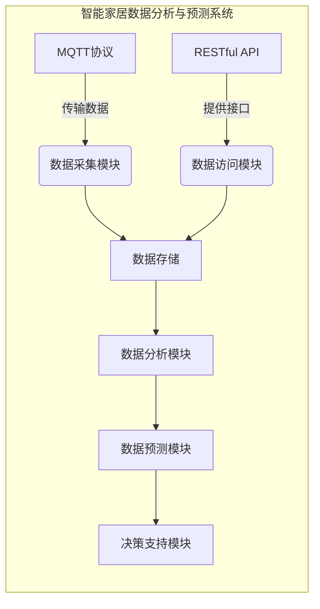

# 基于MQTT协议和RESTful API的智能家居数据分析与预测

## 1.背景介绍

### 1.1 智能家居概述

随着物联网技术的快速发展,智能家居应用已经逐渐走进千家万户。智能家居是指将各种信息传感设备、控制终端和智能家电等安装在家中,通过有线或无线网络相互连接,实现对家居环境的智能监测、控制和管理。

智能家居系统可以自动化控制家中的照明、空调、安防、影音娱乐等设备,为居民提供安全、舒适、节能和便利的生活环境。同时,通过收集和分析家居环境数据,智能家居系统还可以为用户提供个性化的生活方式建议。

### 1.2 智能家居数据分析的重要性

智能家居系统会产生大量的环境数据和设备运行数据,如何高效地收集、传输和分析这些数据,对于优化系统性能、提高用户体验至关重要。数据分析可以帮助我们:

- 发现家居环境和设备运行中的异常情况
- 分析用户的生活习惯,提供个性化建议
- 预测设备故障,提前进行维护
- 优化能源利用,降低能耗

因此,构建高效的数据采集、传输和分析系统是智能家居发展的关键。

## 2.核心概念与联系

智能家居数据分析与预测系统涉及以下几个核心概念:

### 2.1 MQTT协议

MQTT(Message Queuing Telemetry Transport)是一种轻量级的发布/订阅模式的消息传输协议,专为物联网应用设计。它的主要特点包括:

- 使用订阅模式,降低网络流量
- 支持QoS(服务质量等级),保证消息传输可靠性
- 占用资源小,适合受限环境下使用
- 支持最后一次消息传递,实现断线重连

在智能家居系统中,MQTT协议常被用于传感器数据采集和设备控制指令的传输。

### 2.2 RESTful API

RESTful API(Representational State Transfer API)是一种软件架构风格,它基于HTTP协议,利用HTTP方法(GET、POST、PUT、DELETE等)操作资源。RESTful API具有以下优点:

- 无状态,扩展性好
- 使用标准HTTP协议,跨平台兼容性强
- 资源表现层与数据操作相分离

在智能家居系统中,RESTful API常被用于:

- 提供Web和移动应用访问接口
- 与第三方系统集成
- 实现云端管理和控制

### 2.3 数据分析与预测

数据分析是从大量原始数据中发现内在模式和规律的过程。常用的数据分析方法包括:

- 统计分析
- 数据挖掘
- 机器学习算法

通过数据分析,我们可以对智能家居系统的运行状况、用户行为习惯等有更深入的了解。

数据预测是基于历史数据,利用数学模型预估未来可能发生的情况。在智能家居中,常用的预测任务包括:

- 预测能源消耗
- 预测设备故障
- 预测居民活动模式

数据分析与预测可以为智能家居系统的优化和决策提供依据。

### 2.4 Mermaid流程图



上图展示了基于MQTT协议和RESTful API的智能家居数据分析与预测系统的总体架构。MQTT协议负责传输传感器数据,RESTful API提供外部数据访问接口。数据采集模块和数据访问模块将数据存储在数据库中,然后由数据分析模块进行分析,数据预测模块基于分析结果做出预测,最后决策支持模块根据预测结果提供决策建议。

## 3.核心算法原理具体操作步骤  

### 3.1 MQTT协议原理

MQTT协议采用发布/订阅模式,消息的发布者和订阅者都通过连接代理服务器(Broker)来传递消息。具体流程如下:

1. 发布者连接MQTT代理服务器,并发布消息到指定主题(Topic)
2. 订阅者连接MQTT代理服务器,并订阅感兴趣的主题
3. 代理服务器将发布到订阅主题的消息转发给所有订阅者

MQTT协议定义了三种服务质量等级(QoS):

- QoS 0: 最多一次,消息可能会丢失
- QoS 1: 至少一次,消息可能会重复
- QoS 2: 只有一次,消息肯定不会重复

QoS等级越高,可靠性越好,但开销也越大。在智能家居系统中,可根据具体场景选择合适的QoS等级。

### 3.2 RESTful API设计原则

设计RESTful API时应该遵循以下原则:

1. 将API部署为Web服务
2. 使用URI表示资源
3. 利用HTTP方法表达操作
4. 使用无状态通信
5. 返回多种数据格式

一个符合RESTful风格的API示例:

```
GET /devices                   # 获取所有设备列表
GET /devices/123               # 获取ID为123的设备信息
POST /devices                  # 创建新设备
PUT /devices/123               # 更新ID为123的设备信息
DELETE /devices/123            # 删除ID为123的设备
```

### 3.3 数据分析算法

智能家居数据分析常用的算法包括:

- **聚类算法**:根据数据相似性对数据进行分组,如K-Means算法
- **关联规则挖掘**:发现数据集中的频繁模式,如Apriori算法
- **时序模式挖掘**:发现时序数据中的周期性模式
- **异常检测**:识别数据中的异常值,如基于统计的方法、基于聚类的方法等

这些算法可以应用于发现用户行为模式、检测异常情况等任务。

### 3.4 预测算法

常用于智能家居数据预测的算法有:

- **回归算法**:建立自变量和因变量之间的数学模型,如线性回归、决策树回归等
- **时序预测算法**:基于历史数据预测未来值,如ARIMA模型、指数平滑模型等
- **机器学习算法**:使用监督或非监督学习方法进行预测,如神经网络、支持向量机等

这些算法可用于预测能源消耗、设备故障等。

## 4.数学模型和公式详细讲解举例说明

### 4.1 线性回归

线性回归是一种常用的预测算法,试图找到自变量和因变量之间的线性关系。其数学模型为:

$$y = \theta_0 + \theta_1x_1 + \theta_2x_2 + ... + \theta_nx_n$$

其中:
- $y$是因变量
- $x_1, x_2, ..., x_n$是自变量 
- $\theta_0, \theta_1, ..., \theta_n$是待求参数

我们可以使用最小二乘法求解参数$\theta$:

$$\min_\theta \sum_{i=1}^m (y^{(i)} - h_\theta(x^{(i)}))^2$$

其中$h_\theta(x) = \theta_0 + \theta_1x_1 + ... + \theta_nx_n$是模型的假设函数。

**示例**:假设我们要预测某智能家居中的能源消耗量$y$,自变量包括室内温度$x_1$、人数$x_2$和时间$x_3$。我们可以建立如下线性回归模型:

$$y = \theta_0 + \theta_1x_1 + \theta_2x_2 + \theta_3x_3$$

使用历史数据训练模型,得到参数$\theta_0, \theta_1, \theta_2, \theta_3$后,就可以输入新的$x_1, x_2, x_3$值预测能源消耗量$y$了。

### 4.2 时序预测ARIMA模型

ARIMA(AutoRegressive Integrated Moving Average)模型是一种常用的时序预测模型,由三部分组成:

- AR(AutoRegressive):自回归部分
- I(Integrated): 差分部分 
- MA(Moving Average):移动平均部分

ARIMA模型的数学表达式为:

$$y_t = c + \phi_1y_{t-1} + ... + \phi_py_{t-p} + \theta_1\epsilon_{t-1} + ... + \theta_q\epsilon_{t-q} + \epsilon_t$$

其中:
- $y_t$是时刻$t$的观测值
- $\phi_1, ..., \phi_p$是自回归系数
- $\theta_1, ..., \theta_q$是移动平均系数
- $\epsilon_t$是时刻$t$的白噪声

使用ARIMA模型预测时序数据的步骤:

1. 对数据进行平稳性检验,必要时做差分处理
2. 确定模型阶数p、q
3. 使用历史数据估计参数$\phi$和$\theta$
4. 使用模型进行预测

**示例**:我们可以使用ARIMA模型预测某智能家居中的能源消耗时序数据。假设确定了ARIMA(2,1,1)模型,则模型表达式为:

$$y_t = c + \phi_1y_{t-1} + \phi_2y_{t-2} + \theta_1\epsilon_{t-1} + \epsilon_t$$

使用历史数据估计出$c, \phi_1, \phi_2, \theta_1$后,就可以预测未来的能源消耗值了。

## 5.项目实践:代码实例和详细解释说明

### 5.1 MQTT数据采集示例

以Python的Paho MQTT客户端库为例,实现一个简单的MQTT数据采集程序:

```python
import paho.mqtt.client as mqtt

# 定义MQTT回调函数
def on_connect(client, userdata, flags, rc):
    print("Connected with result code " + str(rc))
    client.subscribe("home/sensor/#")  # 订阅主题

def on_message(client, userdata, msg):
    payload = msg.payload.decode()
    print(f"Received {msg.topic} {payload}")
    # 处理接收到的数据...

# 创建MQTT客户端实例
client = mqtt.Client()
client.on_connect = on_connect
client.on_message = on_message

# 连接MQTT代理服务器
client.connect("mqtt.example.com", 1883, 60)

# 保持连接,处理网络事件
client.loop_forever()
```

1. 导入Paho MQTT库
2. 定义回调函数`on_connect`和`on_message`
3. 创建MQTT客户端实例,设置回调函数
4. 连接MQTT代理服务器
5. 调用`loop_forever()`保持连接,处理网络事件

该程序订阅了主题"home/sensor/#",当有新的传感器数据发布时,`on_message`函数会被调用,可以在其中处理接收到的数据。

### 5.2 RESTful API示例

使用Python的Flask框架实现一个简单的RESTful API:

```python
from flask import Flask, jsonify, request

app = Flask(__name__)

# 模拟设备数据
devices = [
    {"id": 1, "name": "温度计", "value": 25.6},
    {"id": 2, "name": "湿度计", "value": 42}
]

# 获取所有设备
@app.route('/devices', methods=['GET'])
def get_devices():
    return jsonify(devices)

# 获取指定设备
@app.route('/devices/<int:id>', methods=['GET'])
def get_device(id):
    device = next((d for d in devices if d['id'] == id), None)
    if device:
        return jsonify(device)
    else:
        return jsonify({"error": "Device not found"}), 404

# 新增设备
@app.route('/devices', methods=['POST'])
def create_device():
    new_device = request.get_json()
    devices.append(new_device)
    return jsonify(new_device), 201

if __name__ == '__main__':
    app.run(debug=True)
```

1. 导入Flask和jsonify
2. 创建Flask应用实例
3. 模拟设备数据
4. 定义API路由和处理函数
    - `GET /devices`获取所有设备
    - `GET /devices/<id>`获取指定设备
    - `POST /devices`新增设备
5. 运行Flask应用

该示例API提供了获取设备列表、获取单个设备和新增设备的功能。可以使用curl或其他HTTP客户端进行测试:

```
$ curl http://localhost:5000/devices
[{"id": 