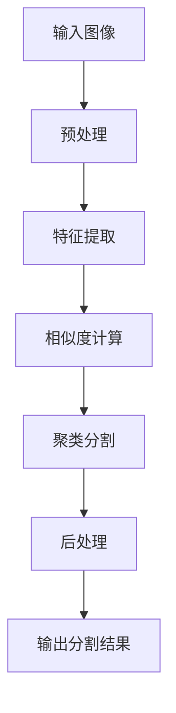

# 基于OpenCV的图像分割系统详细设计与具体代码实现

## 1.背景介绍

图像分割是计算机视觉和图像处理领域的一个核心问题,旨在将一幅数字图像划分为多个独立的区域,使得每个区域都具有相似的特征,如颜色、纹理或亮度等。图像分割广泛应用于目标检测、图像识别、医学图像分析等多个领域。

OpenCV(Open Source Computer Vision Library)是一个开源的计算机视觉库,提供了多种图像处理和计算机视觉算法。它使用C++语言编写,同时也提供了Python、Java等多种语言的接口,可跨平台运行。OpenCV拥有丰富的图像分割算法,可以满足不同场景下的需求。

本文将详细介绍基于OpenCV的图像分割系统的设计与实现,包括核心概念、算法原理、数学模型、代码实例、应用场景、工具推荐等多个方面,旨在为读者提供全面的理解和实践指导。

## 2.核心概念与联系

图像分割涉及以下几个核心概念:

### 2.1 图像表示

数字图像由像素阵列构成,每个像素用一个或多个数值表示其颜色或灰度值。常见的图像表示方式有RGB、HSV、灰度图等。

### 2.2 特征提取

特征提取是将图像中的原始像素数据转换为更易于分析的特征数据的过程。常用的特征包括颜色、纹理、边缘、形状等。

### 2.3 相似性度量

相似性度量用于衡量两个像素或区域之间的相似程度。常用的度量方法有欧氏距离、马哈拉诺比斯距离、直方图相交等。

### 2.4 聚类

聚类是根据相似性将像素或区域划分为多个簇的过程。常用的聚类算法有K-Means、均值漂移、谱聚类等。

### 2.5 分割评价

分割评价用于衡量分割结果的优劣,常用的评价指标有区域一致性、空间邻接性、人工标注相似度等。

上述概念相互关联,构成了图像分割的理论基础和实现框架。特征提取为相似性度量提供输入,相似性度量为聚类算法提供依据,聚类算法输出分割结果,分割评价用于优化算法参数。

## 3.核心算法原理具体操作步骤

OpenCV提供了多种图像分割算法,本节将介绍其中几种常用算法的原理和实现步骤。

### 3.1 基于阈值的分割

阈值分割是最简单的分割方法,根据像素值与预设阈值的大小关系将图像分为前景和背景两部分。算法步骤如下:

1. 选择合适的阈值,可以是全局固定阈值,也可以是自适应阈值。
2. 遍历图像每个像素,将像素值大于阈值的像素归为前景,小于阈值的像素归为背景。
3. 可选地对分割结果进行形态学开运算去除噪声。

```python
import cv2 as cv

# 全局阈值分割
_, thresh = cv.threshold(img, 127, 255, cv.THRESH_BINARY)

# 自适应阈值分割
thresh = cv.adaptiveThreshold(img, 255, cv.ADAPTIVE_THRESH_MEAN_C, cv.THRESH_BINARY, 11, 2)
```

### 3.2 基于区域生长的分割

区域生长是一种基于像素相似性的分割方法,从种子点出发,不断吸收相邻的相似像素,直至无相似像素可吸收。算法步骤如下:

1. 选择一个或多个种子点。
2. 计算种子点周围像素与种子点的相似度。
3. 将相似度高于阈值的像素合并到种子区域。
4. 对新加入的像素重复步骤2和3,直至无新像素加入。
5. 可选地对分割结果进行后处理,如区域合并等。

```python
import cv2 as cv
import numpy as np

# 定义相似度函数
def diffrence(x, y, seed):
    return np.sum((x - seed)**2)

# 区域生长分割
def region_growing(img, seed):
    height, weight = img.shape[:2]
    area = np.zeros((height, weight), np.uint8)
    thresh = 30  # 相似度阈值
    area[seed[1], seed[0]] = 255  # 种子点
    Q = [seed]  # 像素队列
    while Q:
        x, y = Q.pop(0)
        for x_, y_ in ((x+1, y), (x-1, y), (x, y+1), (x, y-1)):
            if (x_ >= 0 and x_ < height and y_ >= 0 and y_ < weight and
                diffrence(img[x_, y_], img[x, y], img[seed[1], seed[0]]) < thresh and
                area[x_, y_] == 0):
                area[x_, y_] = 255
                Q.append((x_, y_))
    return area
```

### 3.3 基于聚类的分割

聚类分割是将图像像素根据特征相似度划分为多个簇,每个簇对应一个分割区域。常用的聚类算法有K-Means、均值漂移等。以K-Means为例,算法步骤如下:

1. 选择K个初始聚类中心。
2. 计算每个像素到K个聚类中心的距离,将像素划分到最近的簇。
3. 重新计算每个簇的聚类中心。
4. 重复步骤2和3,直至聚类中心不再发生变化。

```python
import cv2 as cv

# K-Means聚类分割
img = cv.pyrMeanShiftFiltering(img, 21, 51)
cimg = cv.cvtColor(img, cv.COLOR_BGR2RGB)
codes = np.reshape(cimg, (-1, 3))
codes = np.float32(codes)
criteria = (cv.TERM_CRITERIA_EPS + cv.TERM_CRITERIA_MAX_ITER, 10, 1.0)
K = 4
ret, labels, centers = cv.kmeans(codes, K, None, criteria, 10, cv.KMEANS_RANDOM_CENTERS)
centers = np.uint8(centers)
res = centers[labels.flatten()]
dst = res.reshape((img.shape))
```

### 3.4 基于边缘的分割

边缘检测是图像分割的预处理步骤,用于提取图像中的边缘信息。OpenCV提供了多种边缘检测算子,如Canny、Sobel等。检测到的边缘可用于进一步的分割处理。

```python
import cv2 as cv

# Canny边缘检测
edges = cv.Canny(img, 100, 200)

# 使用HoughLines检测直线
lines = cv.HoughLines(edges, 1, np.pi/180, 200)
for line in lines:
    rho, theta = line[0]
    a = np.cos(theta)
    b = np.sin(theta)
    x0 = a*rho
    y0 = b*rho
    x1 = int(x0 + 1000*(-b))
    y1 = int(y0 + 1000*(a))
    x2 = int(x0 - 1000*(-b))
    y2 = int(y0 - 1000*(a))
    cv.line(img, (x1, y1), (x2, y2), (0, 0, 255), 2)
```

上述算法各有优缺点,在实际应用中需要根据具体场景选择合适的算法,或结合多种算法的优势。

## 4.数学模型和公式详细讲解举例说明

图像分割算法常常涉及到数学模型和公式,本节将对其中几种常见的模型和公式进行详细讲解。

### 4.1 相似度度量

相似度度量用于衡量两个像素或区域之间的相似程度,是图像分割的基础。常用的相似度度量有:

1. **欧氏距离**

欧氏距离是最常用的距离度量,定义为两个向量之间的直线距离。对于两个像素点$p_1(x_1, y_1)$和$p_2(x_2, y_2)$,其欧氏距离为:

$$d(p_1, p_2) = \sqrt{(x_1 - x_2)^2 + (y_1 - y_2)^2}$$

2. **马哈拉诺比斯距离**

马哈拉诺比斯距离考虑了像素在多个特征通道上的差异,常用于彩色图像。对于两个像素$p_1(r_1, g_1, b_1)$和$p_2(r_2, g_2, b_2)$,其马哈拉诺比斯距离为:

$$d(p_1, p_2) = \sqrt{(r_1 - r_2)^2 + (g_1 - g_2)^2 + (b_1 - b_2)^2}$$

3. **直方图相交**

直方图相交度量了两个直方图之间的重叠程度,常用于纹理相似度计算。对于两个直方图$H_1$和$H_2$,其相交度为:

$$d(H_1, H_2) = \sum_{i=1}^{n} \min(H_1(i), H_2(i))$$

其中$n$是直方图bin的数量。

相似度度量是许多聚类算法的基础,选择合适的度量方式对分割结果有重要影响。

### 4.2 K-Means聚类

K-Means是一种常用的聚类算法,其目标是将$N$个样本点划分为$K$个簇,使得簇内样本点之间的距离尽可能小,簇间样本点之间的距离尽可能大。

算法步骤如下:

1. 随机选取$K$个初始聚类中心$\mu_1, \mu_2, \dots, \mu_K$。
2. 对每个样本点$x_i$,计算其到$K$个聚类中心的距离$d(x_i, \mu_j)$,将其划分到最近的簇$C_j$。
3. 对每个簇$C_j$,重新计算其聚类中心$\mu_j$为该簇所有点的均值:

$$\mu_j = \frac{1}{|C_j|} \sum_{x_i \in C_j} x_i$$

4. 重复步骤2和3,直至聚类中心不再发生变化。

K-Means算法的优点是简单高效,但需要预先设定聚类数量K,且对初始聚类中心的选择敏感。在图像分割中,常将像素的RGB值或其他特征作为样本点输入K-Means算法。

### 4.3 均值漂移聚类

均值漂移(Mean Shift)是一种无监督聚类算法,不需要预先设定聚类数量,可自动发现数据的模式和簇的数量。

算法基于核密度估计,其核心思想是在数据空间中不断移动核窗口,直至收敛于某个模式(密度极大值点)。具体步骤如下:

1. 对于每个样本点$x_i$,计算其在带宽$h$下的核密度估计:

$$\hat{f}(x) = \frac{1}{nh^d} \sum_{i=1}^n K\left(\frac{x - x_i}{h}\right)$$

其中$K(\cdot)$是核函数,通常选用高斯核或均匀核。

2. 计算样本点$x_i$的平移向量$m(x_i)$:

$$m(x_i) = \frac{\sum_{j=1}^n x_j K\left(\frac{x_j - x_i}{h}\right)}{\sum_{j=1}^n K\left(\frac{x_j - x_i}{h}\right)} - x_i$$

3. 将$x_i$沿平移向量$m(x_i)$移动一小步,得到新的样本点$x_i^{new}$。
4. 对所有样本点重复步骤2和3,直至所有点收敛于某个模式。

均值漂移算法可自动发现数据的簇数和形状,但对带宽参数$h$较为敏感,且计算复杂度较高。在图像分割中,可将像素的RGB值或其他特征作为样本点输入均值漂移算法。

通过上述数学模型和公式,可以更深入地理解图像分割算法的原理,为算法的选择和参数调优提供理论指导。

## 5.项目实践:代码实例和详细解释说明

本节将提供基于OpenCV的图像分割系统的代码实例,并对关键部分进行详细解释说明。

### 5.1 系统框架

图像分割系统的总体框架如下所示:



各模块的功能如下:

- 预处理: 对输入图像进行