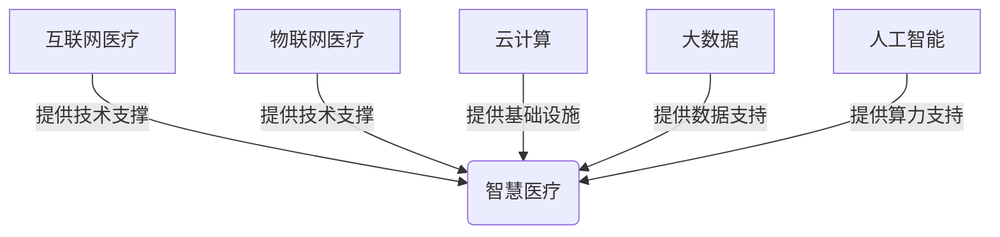
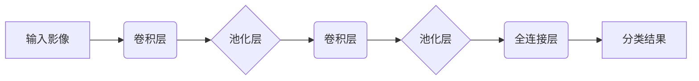

# 基于SpringBoot的社区智慧医疗系统

## 1.背景介绍

### 1.1 医疗卫生行业现状

随着人口老龄化和城镇化进程的加快,医疗卫生服务需求不断增长,传统的医疗服务模式已经难以满足人们日益增长的医疗需求。医疗资源总体供给不足,分布不均衡,优质医疗资源向大城市和大型医院集中,基层医疗机构服务能力较弱。此外,就医过程中存在诸多痛点,如就诊等候时间长、分级诊疗制度执行不力、重复检查等,给患者带来诸多不便。

### 1.2 智慧医疗的概念

为了解决上述问题,智慧医疗应运而生。智慧医疗是利用物联网、云计算、大数据、人工智能等新兴信息技术,将医疗卫生资源进行整合优化,提供智能化、精准化的医疗服务。它可以实现分级诊疗、双向转诊、远程医疗等,提高医疗资源的利用效率,缓解就医压力,提升医疗服务质量和患者就医体验。

### 1.3 社区智慧医疗的重要性

社区是智慧医疗的重要基础,是分级诊疗的基层单元。加强社区智慧医疗建设,可以为居民提供基本的医疗卫生服务,疏导大型医院的就医压力,促进分级诊疗制度的落实,提高基层医疗服务能力,为居民提供优质、便捷的医疗服务。

## 2.核心概念与联系

### 2.1 互联网医疗

互联网医疗是指利用互联网技术为患者提供在线问诊、电子病历、远程医疗等服务。它打破了时空限制,患者可以在任何时间任何地点获取医疗服务,提高了医疗资源的利用效率。

### 2.2 物联网医疗

物联网医疗是指将医疗设备与互联网相连,实现医疗数据的采集、传输和处理。通过可穿戴设备、医疗传感器等,可以实时监测患者的生理数据,为医生提供决策依据。

### 2.3 云计算在医疗领域的应用

云计算为医疗数据的存储、共享和计算提供了基础设施支持。通过云计算技术,可以构建统一的医疗数据中心,实现医疗数据的集中管理和共享,为智能诊疗决策提供数据支持。

### 2.4 大数据在医疗领域的应用

通过采集和整合各类医疗数据,可以构建医疗大数据平台。利用大数据分析技术,可以发现疾病发展规律、预测疾病风险、优化医疗资源配置等,为精准医疗和个性化治疗提供支持。

### 2.5 人工智能在医疗领域的应用

人工智能技术如机器学习、深度学习等,可以应用于医疗影像识别、智能辅助诊断、药物研发等领域,提高诊断精准度,加快新药研发进程。

上述概念相互关联、相辅相成,共同推动了智慧医疗的发展。互联网、物联网、云计算为数据采集和传输提供了技术支撑,大数据和人工智能则为数据处理和智能决策提供了算力支持。



## 3.核心算法原理具体操作步骤

社区智慧医疗系统涉及多种算法,如个性化推荐算法、智能辅助诊断算法等,这里以智能辅助诊断算法为例,介绍其核心原理和操作步骤。

### 3.1 智能辅助诊断算法原理

智能辅助诊断算法是基于机器学习和深度学习技术,通过对大量医疗影像数据进行训练,学习影像特征与疾病之间的映射关系,从而对新的影像数据进行智能识别和诊断。

该算法的核心是卷积神经网络(CNN),它可以自动学习影像的低级特征(如边缘、纹理等)和高级语义特征,并对影像进行分类。CNN由多个卷积层、池化层和全连接层组成。

1. **卷积层**:通过卷积核对输入数据(如CT影像)进行卷积操作,提取局部特征,得到特征映射。
2. **池化层**:对卷积层的输出进行下采样,减小数据量,提取主要特征,实现平移不变性。
3. **全连接层**:将前面层的特征映射展开,并与权重矩阵相乘,得到分类评分。
4. **损失函数**:比较预测结果与真实标签,计算损失,根据损失对网络参数进行反向传播更新。



### 3.2 算法操作步骤

1. **数据准备**:收集大量标注好的医疗影像数据,按比例划分为训练集、验证集和测试集。
2. **数据预处理**:对影像数据进行标准化、增强(如旋转、翻转等)等预处理,以提高模型的泛化能力。
3. **模型构建**:根据问题的复杂程度,选择合适的CNN网络结构,如AlexNet、VGGNet、ResNet等。
4. **模型训练**:将训练数据输入网络,通过反向传播算法不断调整网络参数,使模型在验证集上的性能最优。
5. **模型评估**:在测试集上评估模型的性能,计算指标如准确率、灵敏度、特异度等。
6. **模型部署**:将训练好的模型集成到智能诊断系统中,为医生提供辅助诊断建议。

上述算法需要大量的计算资源,可以利用GPU加速训练过程。在实际应用中,还需要考虑模型压缩、异常数据处理、持续模型更新等问题,以确保系统的鲁棒性和可用性。

## 4.数学模型和公式详细讲解举例说明

智能辅助诊断算法中涉及多种数学模型,如卷积运算、池化运算、损失函数等,下面对其中的核心模型进行详细讲解。

### 4.1 卷积运算

卷积运算是CNN的核心操作,它通过卷积核对输入数据进行特征提取。设输入数据为$I$,卷积核为$K$,卷积运算的数学表达式为:

$$
O(i,j) = \sum_{m}\sum_{n}I(i+m,j+n)K(m,n)
$$

其中,$O$为输出特征映射,$I$为输入数据,$K$为卷积核。卷积核在输入数据上滑动,在每个位置进行内积运算,得到该位置的特征响应值。

例如,对一个$5\times5$的输入数据使用一个$3\times3$的卷积核进行卷积运算,计算过程如下:

```
输入数据 I:
[1, 0, 1, 1, 0]
[0, 1, 1, 0, 0]
[1, 1, 1, 1, 1]
[0, 0, 1, 1, 1]
[1, 1, 0, 1, 0]

卷积核 K:
[1, 0, 1]
[0, 1, 0]
[1, 0, 1]

输出特征映射 O:
[3, 3, 5, 3, 1]
[2, 5, 6, 5, 3]
[5, 6, 8, 8, 5]
[3, 5, 6, 5, 3]
[1, 3, 5, 3, 1]
```

通过卷积操作,输入数据的局部特征被激活并映射到输出特征映射中。卷积核的权重在训练过程中不断调整,使得能够提取到对分类任务更加有意义的特征。

### 4.2 池化运算

池化运算是CNN中的下采样操作,它可以减小特征映射的维度,提取主要特征,实现平移不变性。常用的池化方法有最大池化和平均池化。

最大池化的数学表达式为:

$$
O(i,j) = \max\limits_{(m,n) \in R}I(i+m,j+n)
$$

其中,$O$为输出特征映射,$I$为输入特征映射,$R$为池化区域。最大池化取池化区域内的最大值作为输出。

例如,对一个$4\times4$的输入特征映射进行$2\times2$的最大池化运算,计算过程如下:

```
输入特征映射 I:
[1, 3, 2, 4]
[5, 6, 7, 8]
[9, 7, 5, 6]
[3, 2, 1, 4]

池化区域 R (2x2):
[[1, 3], [6, 8]]
 [5, 6]  [9, 7]
 
[[7, 8], [5, 6]]
 [9, 7]  [3, 4]

输出特征映射 O:
[6, 8]
[9, 7]
```

通过池化操作,特征映射的维度减小,同时保留了主要的特征信息,有利于提高模型的泛化能力和计算效率。

### 4.3 交叉熵损失函数

交叉熵损失函数是分类问题中常用的损失函数,它衡量了预测值与真实值之间的差异。设$y$为真实标签,$\hat{y}$为预测值,交叉熵损失函数的数学表达式为:

$$
L(y, \hat{y}) = -\sum_{i=1}^{C}y_i\log(\hat{y}_i)
$$

其中,$C$为类别数量。当$y_i=1$时,只有对应的$\log(\hat{y}_i)$项有贡献,其他项为0。

例如,在二分类问题中,真实标签为$y=[0, 1]$,预测值为$\hat{y}=[0.6, 0.4]$,则交叉熵损失为:

$$
L(y, \hat{y}) = -(0\log0.6 + 1\log0.4) = 0.916
$$

在训练过程中,通过反向传播算法,不断调整网络参数,使得交叉熵损失函数的值最小化,从而提高模型的分类精度。

上述数学模型是CNN中的核心组成部分,通过卷积运算提取特征,池化运算降维,交叉熵损失函数衡量预测误差,共同推动了智能辅助诊断算法的发展和应用。

## 5.项目实践:代码实例和详细解释说明

为了更好地理解智能辅助诊断算法的实现,下面给出一个基于PyTorch框架的代码示例,并对关键部分进行详细解释。

### 5.1 数据准备

```python
import torch
from torchvision import datasets, transforms

# 定义数据预处理操作
data_transform = transforms.Compose([
    transforms.Resize(256),
    transforms.CenterCrop(224),
    transforms.ToTensor(),
    transforms.Normalize([0.485, 0.456, 0.406], [0.229, 0.224, 0.225])
])

# 加载数据集
train_dataset = datasets.ImageFolder('data/train', transform=data_transform)
val_dataset = datasets.ImageFolder('data/val', transform=data_transform)

# 创建数据加载器
train_loader = torch.utils.data.DataLoader(train_dataset, batch_size=32, shuffle=True)
val_loader = torch.utils.data.DataLoader(val_dataset, batch_size=32, shuffle=False)
```

上述代码加载了一个图像分类数据集,并对图像进行了缩放、裁剪、标准化等预处理操作。`ImageFolder`类可以自动从文件夹路径中读取图像数据及其标签。最后,创建了训练集和验证集的数据加载器,方便后续的批量训练。

### 5.2 模型构建

```python
import torchvision.models as models

# 加载预训练模型
model = models.resnet18(pretrained=True)

# 修改最后一层全连接层
num_ftrs = model.fc.in_features
model.fc = nn.Linear(num_ftrs, 2)  # 2分类问题

# 迁移到GPU
device = torch.device("cuda:0" if torch