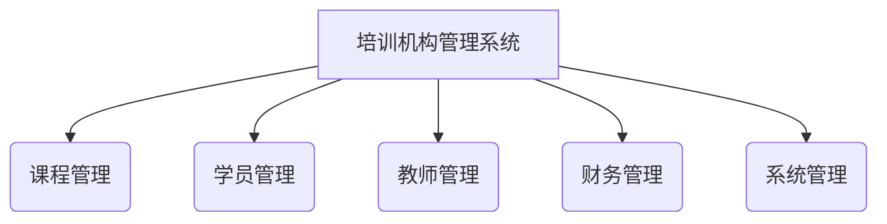
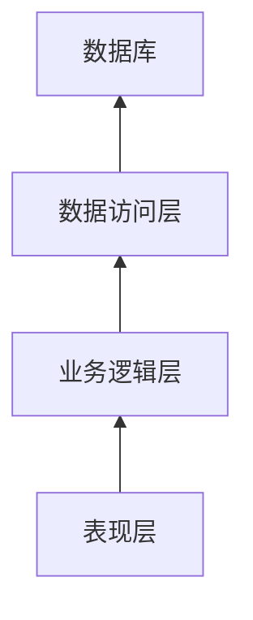

# 基于SSM的培训机构管理系统

## 1.背景介绍

随着社会的不断发展和知识经济时代的到来,培训行业正在蓬勃发展。培训机构作为传播知识和技能的重要场所,对于促进社会进步和个人发展具有重要意义。然而,传统的培训机构管理模式存在诸多弊端,如信息孤岛、数据管理混乱、流程效率低下等问题。因此,构建一个高效、智能的培训机构管理系统势在必行。

本文将介绍一种基于SSM(Spring、SpringMVC、MyBatis)框架的培训机构管理系统的设计与实现。该系统旨在解决传统培训机构管理中存在的痛点,提高管理效率,优化用户体验。

## 2.核心概念与联系

### 2.1 SSM框架

SSM框架是指Spring+SpringMVC+MyBatis框架的缩写,是目前Java企业级开发中最流行的技术架构之一。

- Spring: 提供了对象的生命周期管理、依赖注入等功能,是整个架构的基础。
- SpringMVC: 基于MVC设计模式,提供了请求分发、视图渲染等Web层功能。
- MyBatis: 一种优秀的持久层框架,支持定制化SQL、存储过程以及高级映射。

这三个框架相互协作,构建了高效、灵活的系统架构。

### 2.2 培训机构管理系统

培训机构管理系统是一个综合性的信息管理平台,涵盖了培训机构的各个方面,包括:

- 课程管理: 添加、修改、删除课程信息,安排课程计划等。
- 学员管理: 维护学员信息,管理学员报名、缴费等流程。
- 教师管理: 管理教师信息,安排授课计划。
- 财务管理: 记录收支情况,统计财务数据。
- 系统管理: 管理用户权限,维护系统设置。

这些模块有机结合,为培训机构的日常运营提供了强有力的支持。



## 3.核心算法原理具体操作步骤

### 3.1 系统架构设计

基于SSM框架的培训机构管理系统采用了经典的三层架构设计,包括表现层(View)、业务逻辑层(Controller)和数据访问层(DAO)。



1. **表现层(View)**: 负责与用户进行交互,接收用户请求并显示处理结果。通常采用JSP、Thymeleaf等模板技术实现。
2. **业务逻辑层(Controller)**: 处理用户请求,调用相应的业务逻辑方法,并将结果返回给表现层。由SpringMVC的控制器组件承担。
3. **数据访问层(DAO)**: 负责与数据库进行交互,执行数据持久化操作。MyBatis框架提供了强大的数据访问能力。

### 3.2 核心功能实现

#### 3.2.1 课程管理

课程管理模块是系统的核心部分之一,主要包括以下功能:

1. **课程信息维护**

   - 添加课程: 输入课程名称、课程介绍、课时、价格等信息,保存到数据库中。
   - 修改课程: 根据课程ID查询课程信息,修改相关字段后更新到数据库。
   - 删除课程: 根据课程ID删除对应的课程信息。

2. **课程安排**

   - 查看课程计划: 根据课程ID查询已安排的上课时间和教师信息。
   - 添加课程计划: 选择课程、教师和上课时间,保存到数据库中。
   - 修改课程计划: 根据计划ID修改上课时间或授课教师。

#### 3.2.2 学员管理

学员管理模块主要包括以下功能:

1. **学员信息维护**

   - 添加学员: 输入学员姓名、联系方式等信息,保存到数据库中。
   - 修改学员: 根据学员ID查询学员信息,修改相关字段后更新到数据库。
   - 删除学员: 根据学员ID删除对应的学员信息。

2. **报名管理**

   - 查看报名情况: 根据课程ID查询已报名的学员列表。
   - 学员报名: 选择学员和课程,保存报名信息到数据库中。
   - 取消报名: 根据报名ID删除对应的报名记录。

3. **缴费管理**

   - 查看缴费情况: 根据学员ID查询已缴费的课程列表。
   - 学员缴费: 选择学员和课程,记录缴费信息到数据库中。

#### 3.2.3 教师管理

教师管理模块主要包括以下功能:

1. **教师信息维护**

   - 添加教师: 输入教师姓名、简介、联系方式等信息,保存到数据库中。
   - 修改教师: 根据教师ID查询教师信息,修改相关字段后更新到数据库。
   - 删除教师: 根据教师ID删除对应的教师信息。

2. **授课安排**

   - 查看授课计划: 根据教师ID查询已安排的授课时间和课程信息。
   - 添加授课计划: 选择教师、课程和上课时间,保存到数据库中。
   - 修改授课计划: 根据计划ID修改上课时间或授课课程。

#### 3.2.4 财务管理

财务管理模块主要包括以下功能:

1. **收入管理**

   - 查看收入明细: 根据时间范围查询对应的收入记录。
   - 添加收入记录: 输入收入金额、来源等信息,保存到数据库中。

2. **支出管理**

   - 查看支出明细: 根据时间范围查询对应的支出记录。
   - 添加支出记录: 输入支出金额、用途等信息,保存到数据库中。

3. **财务统计**

   - 查看收支统计: 根据时间范围统计对应时间段的收入、支出和利润情况。
   - 导出财务报表: 将统计结果导出为Excel文件,方便查阅和存档。

#### 3.2.5 系统管理

系统管理模块主要包括以下功能:

1. **用户管理**

   - 添加用户: 输入用户名、密码、角色等信息,保存到数据库中。
   - 修改用户: 根据用户ID查询用户信息,修改相关字段后更新到数据库。
   - 删除用户: 根据用户ID删除对应的用户信息。

2. **角色管理**

   - 添加角色: 输入角色名称和对应的权限,保存到数据库中。
   - 修改角色: 根据角色ID查询角色信息,修改相关字段后更新到数据库。
   - 删除角色: 根据角色ID删除对应的角色信息。

3. **权限管理**

   - 查看权限列表: 列出系统中已定义的所有权限。
   - 添加权限: 输入权限名称和描述,保存到数据库中。
   - 修改权限: 根据权限ID查询权限信息,修改相关字段后更新到数据库。
   - 删除权限: 根据权限ID删除对应的权限信息。

4. **系统设置**

   - 修改系统参数: 修改系统的一些全局配置参数,如默认密码策略、缓存设置等。
   - 查看系统日志: 查看系统运行过程中的日志记录,用于问题排查和性能优化。

## 4.数学模型和公式详细讲解举例说明

在培训机构管理系统中,我们可以使用一些数学模型和公式来优化决策和管理效率。

### 4.1 课程安排优化

在安排课程计划时,我们需要考虑多个因素,如教室资源、教师时间、学员偏好等。这可以被建模为一个约束优化问题,目标是最大化资源利用率和满意度。

我们可以使用整数线性规划(Integer Linear Programming, ILP)模型来描述和求解这个问题。假设有$n$个课程$\{c_1, c_2, \dots, c_n\}$,需要安排在$m$个时间段$\{t_1, t_2, \dots, t_m\}$上。我们定义决策变量$x_{ij}$表示课程$c_i$是否安排在时间段$t_j$上,取值为0或1。

$$
\begin{aligned}
\max \quad & \sum_{i=1}^{n} \sum_{j=1}^{m} w_{ij} x_{ij} \\
\text{s.t.} \quad & \sum_{j=1}^{m} x_{ij} = 1, \quad \forall i \in \{1, 2, \dots, n\} \\
& \sum_{i=1}^{n} x_{ij} \leq 1, \quad \forall j \in \{1, 2, \dots, m\} \\
& x_{ij} \in \{0, 1\}, \quad \forall i \in \{1, 2, \dots, n\}, \forall j \in \{1, 2, \dots, m\}
\end{aligned}
$$

其中$w_{ij}$表示将课程$c_i$安排在时间段$t_j$的权重,可以根据教室资源、教师时间、学员偏好等因素计算得到。

第一个约束条件保证每个课程都被安排在一个时间段上;第二个约束条件保证每个时间段最多只有一个课程。通过求解这个ILP模型,我们可以得到一个最优的课程安排方案。

### 4.2 财务预测

在财务管理中,我们需要对未来的收入和支出进行预测,以便制定合理的财务策略。这可以使用时间序列分析和回归模型来实现。

假设我们有过去$n$个时间段的收入数据$\{y_1, y_2, \dots, y_n\}$,我们可以使用自回归移动平均模型(Autoregressive Moving Average, ARMA)来拟合和预测未来的收入趋势。ARMA模型由自回归(AR)部分和移动平均(MA)部分组成,可以表示为:

$$
y_t = \phi_1 y_{t-1} + \phi_2 y_{t-2} + \dots + \phi_p y_{t-p} + \epsilon_t + \theta_1 \epsilon_{t-1} + \theta_2 \epsilon_{t-2} + \dots + \theta_q \epsilon_{t-q}
$$

其中$\phi_i$是自回归系数,$\theta_j$是移动平均系数,$\epsilon_t$是白噪声项。通过对历史数据进行参数估计,我们可以得到ARMA模型的系数,并用于预测未来的收入值。

对于支出数据,我们可以使用多元线性回归模型,将支出金额作为因变量,将影响支出的因素(如人力成本、租金、广告费用等)作为自变量,建立回归方程:

$$
y = \beta_0 + \beta_1 x_1 + \beta_2 x_2 + \dots + \beta_k x_k + \epsilon
$$

其中$y$是支出金额,$x_i$是第$i$个影响因素,$\beta_i$是对应的回归系数,$\epsilon$是随机误差项。通过对历史数据进行回归分析,我们可以估计出回归系数,并用于预测未来的支出水平。

## 5.项目实践: 代码实例和详细解释说明

### 5.1 项目结构

```
training-management-system
├── src
│   ├── main
│   │   ├── java
│   │   │   └── com
│   │   │       └── example
│   │   │           └── training
│   │   │               ├── controller
│   │   │               ├── dao
│   │   │               ├── entity
│   │   │               ├── service
│   │   │               └── utils
│   │   └── resources
│   │       ├── mapper
│   │       ├── static
│   │       └── templates
│   └── test
│       └── java
│           └── com
│               └── example
│                   └── training
└── pom.xml
```

- `controller`: 处理HTTP请求,调用服务层方法
- `service`: 实现业务逻辑
- `dao`: 数据访问对象,执行数据库操作
- `entity`: 实体类,映射数据库表结构
- `utils`: 工具类
- `mapper`: MyBatis映射文件
- `static`: 静态资源文件(