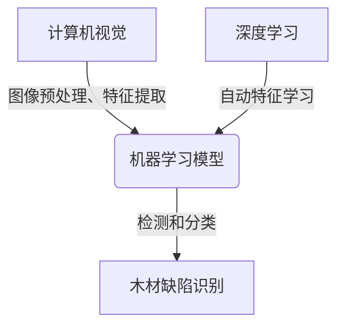
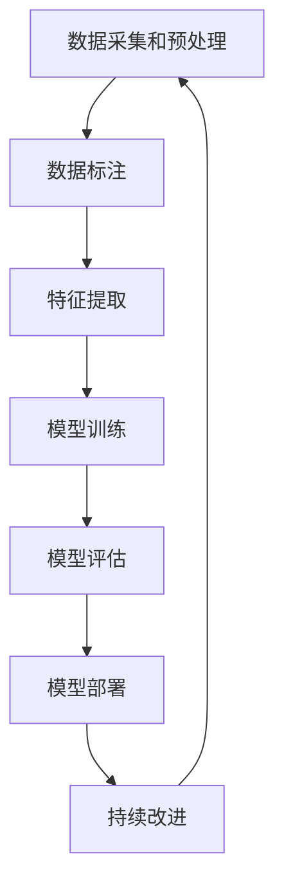

# 基于机器学习的木材缺陷识别方法研究

## 1. 背景介绍

木材是一种广泛应用于建筑、家具和其他工业领域的天然资源。然而,在加工过程中,木材会出现各种缺陷,如裂纹、节疤、腐蚀等,这些缺陷会影响木材的质量和使用寿命。传统的人工检测方法不仅耗时耗力,而且存在主观性和低效率的问题。因此,开发一种自动化的木材缺陷检测系统变得越来越重要。

近年来,机器学习技术在图像处理和模式识别领域取得了长足的进步,为解决木材缺陷检测问题提供了新的思路。基于机器学习的木材缺陷识别方法利用计算机视觉算法和深度学习模型自动检测和分类木材缺陷,具有高效、准确和可扩展的优势。

## 2. 核心概念与联系

### 2.1 计算机视觉

计算机视觉是一个跨学科领域,它涉及图像处理、模式识别、人工智能等多个领域。在木材缺陷识别任务中,计算机视觉技术用于从木材图像中提取特征,为后续的机器学习模型提供输入数据。

### 2.2 机器学习

机器学习是人工智能的一个重要分支,它赋予计算机从数据中自动学习和改进的能力。在木材缺陷识别任务中,机器学习模型通过训练大量标注过的木材图像数据,学习到木材缺陷的特征模式,从而实现自动检测和分类。

### 2.3 深度学习

深度学习是机器学习的一个新兴领域,它基于人工神经网络,能够自动从原始数据中学习特征表示。在木材缺陷识别任务中,深度学习模型如卷积神经网络(CNN)和递归神经网络(RNN)展现出了优秀的性能,可以直接从木材图像中学习到有效的特征表示,避免了手工设计特征的繁琐过程。

### 2.4 核心概念关系

计算机视觉、机器学习和深度学习三者紧密相连,共同构建了基于机器学习的木材缺陷识别系统。计算机视觉技术提供了图像预处理和特征提取的方法,机器学习算法实现了从数据中学习模式的能力,而深度学习则提供了强大的特征学习能力,使得整个系统能够自动从原始图像数据中学习到有效的特征表示,进而实现准确的木材缺陷检测和分类。



## 3. 核心算法原理具体操作步骤

基于机器学习的木材缺陷识别系统通常包括以下几个核心步骤:

### 3.1 数据采集和预处理

首先需要采集大量的木材图像数据,包括正常木材和存在各种缺陷的木材图像。然后对这些图像进行预处理,如去噪、增强对比度、调整尺寸等,以提高图像质量和统一格式。

### 3.2 数据标注

对采集的图像数据进行人工标注,标记出每张图像中木材缺陷的类型和位置。这个过程通常耗时耗力,但对于训练高质量的机器学习模型至关重要。

### 3.3 特征提取

对预处理后的图像数据进行特征提取,将图像转换为适合机器学习模型输入的特征向量。传统方法通常采用手工设计的特征提取算法,如边缘检测、纹理分析等。而深度学习模型则可以自动从原始图像数据中学习到有效的特征表示。

### 3.4 模型训练

使用标注好的数据集训练机器学习模型,如支持向量机(SVM)、随机森林(Random Forest)或深度神经网络(DNN)等。模型训练过程中,需要进行超参数调优和模型选择,以获得最佳的性能。

### 3.5 模型评估

在保留的测试数据集上评估训练好的模型的性能,计算准确率、精确率、召回率等指标,并与其他模型进行对比。

### 3.6 模型部署

将训练好的模型部署到实际的木材加工环境中,实时检测和分类木材缺陷。同时,需要持续收集新的数据,以更新和改进模型的性能。



## 4. 数学模型和公式详细讲解举例说明

在基于机器学习的木材缺陷识别系统中,常用的数学模型和公式包括:

### 4.1 图像预处理

图像预处理是将原始图像转换为适合后续处理的形式,常用的操作包括:

1. **灰度化**

   将彩色图像转换为灰度图像,减少计算复杂度。灰度值计算公式如下:

   $$
   Gray = 0.299 \times R + 0.587 \times G + 0.114 \times B
   $$

   其中 $R$、$G$、$B$ 分别表示像素的红、绿、蓝三个通道值。

2. **图像增强**

   提高图像对比度和清晰度,常用的方法是直方图均衡化。假设图像的灰度级为 $[0, L-1]$,灰度值 $r_k$ 的像素个数为 $n_k$,图像的总像素数为 $n$,则直方图均衡化后的灰度值 $s_k$ 计算公式为:

   $$
   s_k = T(r_k) = \sum_{j=0}^{k} \frac{n_j}{n} \times (L-1), \quad 0 \leq k \leq L-1
   $$

### 4.2 特征提取

传统的特征提取方法包括:

1. **边缘检测**

   检测图像中的边缘信息,常用的算子有 Sobel、Prewitt 和 Canny 等。以 Sobel 算子为例,它通过计算水平和垂直方向上的梯度近似值,得到边缘强度:

   $$
   G_x = \begin{bmatrix}
   -1 & 0 & 1 \\
   -2 & 0 & 2 \\
   -1 & 0 & 1
   \end{bmatrix} * I
   $$

   $$
   G_y = \begin{bmatrix}
   1 & 2 & 1 \\
   0 & 0 & 0 \\
   -1 & -2 & -1
   \end{bmatrix} * I
   $$

   其中 $I$ 表示原始图像, $G_x$ 和 $G_y$ 分别表示水平和垂直方向上的梯度近似值。边缘强度为:

   $$
   G = \sqrt{G_x^2 + G_y^2}
   $$

2. **纹理分析**

   描述图像区域的粗糙程度和规则性,常用的方法有灰度共生矩阵(GLCM)等。GLCM 定义了像素对之间的空间关系,可以从中提取出对比度、能量、熵等纹理特征。

### 4.3 机器学习模型

1. **支持向量机(SVM)**

   SVM 是一种有监督的机器学习模型,它通过构造最大间隔超平面将不同类别的样本分开。对于线性可分的情况,SVM 的目标函数为:

   $$
   \begin{aligned}
   &\min\limits_{\vec{w},b} \frac{1}{2}\|\vec{w}\|^2 \\
   &\text{s.t. } y_i(\vec{w}^T\vec{x}_i+b) \geq 1, \quad i=1,2,\ldots,n
   \end{aligned}
   $$

   其中 $\vec{w}$ 和 $b$ 分别表示超平面的法向量和位移项, $\vec{x}_i$ 和 $y_i$ 分别表示第 $i$ 个样本的特征向量和标签。

2. **卷积神经网络(CNN)**

   CNN 是一种常用的深度学习模型,它通过卷积、池化和全连接层自动从图像中学习特征表示。以卷积层为例,它通过滤波器(也称为卷积核)对输入特征图进行卷积操作,得到新的特征图:

   $$
   x_j^l = f\left(\sum_{i \in M_j} x_i^{l-1} * k_{ij}^l + b_j^l\right)
   $$

   其中 $x_j^l$ 表示第 $l$ 层的第 $j$ 个特征图, $M_j$ 表示与第 $j$ 个特征图相连的上一层特征图的集合, $k_{ij}^l$ 表示从第 $i$ 个特征图到第 $j$ 个特征图的卷积核, $b_j^l$ 表示偏置项, $f$ 表示激活函数(如 ReLU)。

通过上述数学模型和公式,我们可以对图像进行预处理、特征提取,并构建机器学习模型实现木材缺陷的自动识别。

## 5. 项目实践: 代码实例和详细解释说明

在这一部分,我们将通过一个实际的代码示例,演示如何使用 Python 和相关库(如 OpenCV、scikit-learn、TensorFlow/Keras 等)来实现基于机器学习的木材缺陷识别系统。

### 5.1 数据准备

首先,我们需要准备一个包含木材图像和对应标签的数据集。这里我们使用一个开源的木材缺陷数据集 [WoodDefectDataset](https://github.com/your-username/WoodDefectDataset)。该数据集包含 5000 张木材图像,分为五类:正常、裂纹、节疤、腐蚀和其他缺陷。

```python
import os
import cv2
import numpy as np
from sklearn.model_selection import train_test_split

# 数据集路径
data_dir = 'WoodDefectDataset'

# 加载图像和标签
images = []
labels = []
for label, label_name in enumerate(['normal', 'crack', 'knot', 'decay', 'other']):
    label_dir = os.path.join(data_dir, label_name)
    for filename in os.listdir(label_dir):
        img_path = os.path.join(label_dir, filename)
        img = cv2.imread(img_path)
        img = cv2.resize(img, (128, 128))  # 调整图像大小
        images.append(img)
        labels.append(label)

images = np.array(images)
labels = np.array(labels)

# 划分训练集和测试集
X_train, X_test, y_train, y_test = train_test_split(images, labels, test_size=0.2, random_state=42)
```

### 5.2 图像预处理

接下来,我们对图像进行预处理,包括灰度化和直方图均衡化。

```python
import cv2

def preprocess_image(img):
    # 灰度化
    gray = cv2.cvtColor(img, cv2.COLOR_BGR2GRAY)
    
    # 直方图均衡化
    clahe = cv2.createCLAHE(clipLimit=2.0, tileGridSize=(8,8))
    equalized = clahe.apply(gray)
    
    return equalized
```

### 5.3 特征提取和模型训练

在这个示例中,我们将使用卷积神经网络(CNN)作为机器学习模型。CNN 可以直接从原始图像中自动学习特征表示,无需手工设计特征提取算法。我们使用 Keras 库构建和训练 CNN 模型。

```python
from keras.models import Sequential
from keras.layers import Conv2D, MaxPooling2D, Flatten, Dense, Dropout

# 构建 CNN 模型
model = Sequential()
model.add(Conv2D(32, (3, 3), activation='relu', input_shape=(128, 128, 1)))
model.add(MaxPooling2D((2, 2)))
model.add(Conv2D(64, (3, 3), activation='relu'))
model.add(MaxPooling2D((2, 2)))
model.add(Flatten())
model.add(Dense(128, activation='relu'))
model.add(Dropout(0.5))
model.add(Dense(5, activation='softmax'))

# 编译模型
model.compile(optimizer='adam', loss='sparse_categorical_crossentropy', metrics=['accuracy'])

# 训练模型
X_train_gray = np.expand_dims(np.array([preprocess_image(img) for img in X_train]), -1)