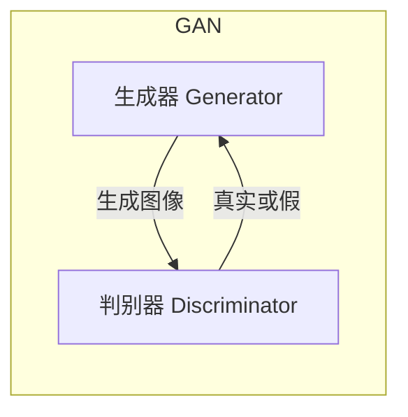
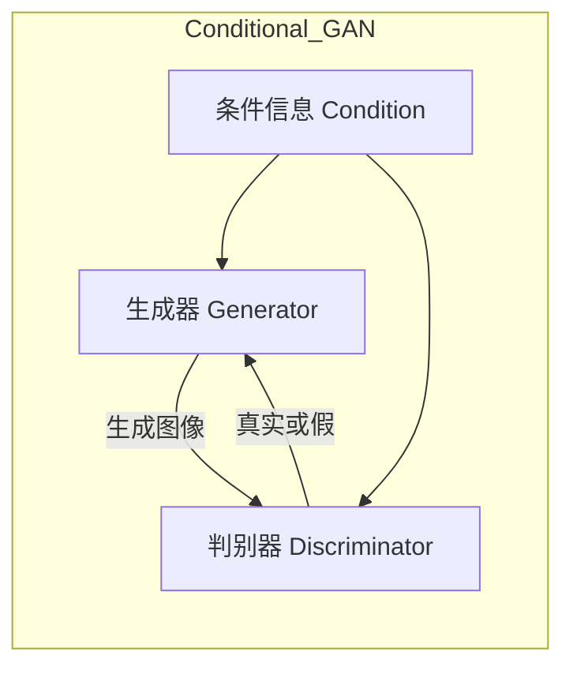
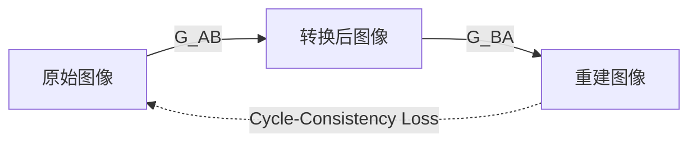

# 基于生成对抗网络的街景图像风格化和季节转换研究

## 1.背景介绍

### 1.1 计算机视觉与图像处理的重要性

在当今科技发展的浪潮中,计算机视觉和图像处理技术扮演着越来越重要的角色。这些技术不仅在学术研究领域备受关注,同时也广泛应用于多个行业,如安防监控、自动驾驶、医疗影像诊断等。其中,图像风格迁移和图像转换是计算机视觉和图像处理领域的热门研究方向之一。

### 1.2 图像风格迁移与图像转换概述

图像风格迁移指的是将一种风格迁移到另一幅图像上,使得输出图像不仅保留了原始图像的内容,同时也获得了新的风格特征。而图像转换则是指将一幅图像从一种状态(如季节、天气等)转换到另一种状态。这两种技术在多个领域都有广泛的应用前景,如数字艺术创作、视频特效制作、视觉增强等。

### 1.3 生成对抗网络在图像处理中的作用

近年来,生成对抗网络(Generative Adversarial Networks,GANs)作为一种全新的深度学习架构,在图像处理领域取得了卓越的成就。GANs能够学习数据分布,并生成逼真的图像,为图像风格迁移和图像转换任务提供了强大的工具。本文将重点探讨如何利用GANs来实现街景图像的风格化和季节转换。

## 2.核心概念与联系  

### 2.1 生成对抗网络(GANs)

生成对抗网络是一种由生成器(Generator)和判别器(Discriminator)组成的深度学习架构。生成器的目标是生成逼真的假数据(如图像),而判别器则旨在区分生成器生成的假数据和真实数据。两者相互对抗,最终达到生成器生成的数据无法被判别器识别的状态,即生成器生成的图像足够逼真。



### 2.2 条件生成对抗网络(Conditional GANs)

条件生成对抗网络(Conditional GANs)是GANs的一种变体,它在生成器和判别器中都引入了条件信息,使得生成的图像不仅逼真,而且能够满足特定的条件要求。在图像风格迁移和图像转换任务中,条件信息通常是指期望的风格或状态。



### 2.3 循环一致性损失(Cycle-Consistency Loss)

在图像转换任务中,我们希望将一幅图像从一种状态(如夏季)转换到另一种状态(如冬季),同时也能够将转换后的图像重新转换回原始状态。为了实现这一点,引入了循环一致性损失(Cycle-Consistency Loss),确保图像在经历两次转换后,能够尽可能地还原到原始状态。



### 2.4 注意力机制(Attention Mechanism)

在图像风格迁移和图像转换任务中,注意力机制(Attention Mechanism)可以帮助模型更好地关注图像中的重要区域,从而提高转换质量。注意力机制通常被应用于生成器或判别器的编码器-解码器结构中,以捕获图像的长程依赖关系。

## 3.核心算法原理具体操作步骤

### 3.1 基于条件GAN的图像风格迁移

1. **数据准备**:收集包含不同风格(如油画风格、素描风格等)的图像数据集,并进行适当的预处理(如裁剪、归一化等)。

2. **网络架构**:构建条件GAN架构,包括生成器G和判别器D。生成器的输入为原始图像和目标风格编码,输出为风格化后的图像。判别器的输入为真实图像或生成器生成的图像,以及目标风格编码,输出为真实/假的概率。

3. **损失函数**:定义生成器和判别器的损失函数。生成器损失包括对抗损失(让生成图像尽可能逼真)和像素损失(让生成图像尽可能接近目标风格)。判别器损失为二分类交叉熵损失。

4. **训练过程**:交替训练生成器和判别器,使用反向传播算法和优化器(如Adam)更新网络参数。生成器旨在最小化其损失函数,而判别器则旨在最大化其损失函数。

5. **推理阶段**:使用训练好的生成器,将原始图像和目标风格编码作为输入,即可生成风格化后的图像。

### 3.2 基于循环一致性的图像季节转换

1. **数据准备**:收集包含不同季节(如夏季、冬季等)的街景图像数据集,并进行适当的预处理。

2. **网络架构**:构建包含两个生成器(G_AB和G_BA)和两个判别器(D_A和D_B)的循环一致性GAN架构。G_AB将夏季图像转换为冬季图像,G_BA则执行相反的转换。

3. **损失函数**:定义生成器和判别器的损失函数。生成器损失包括对抗损失、像素损失和循环一致性损失。判别器损失为二分类交叉熵损失。

4. **训练过程**:交替训练生成器和判别器。生成器G_AB旨在最小化其损失函数,使得生成的冬季图像看起来逼真,同时也能够通过G_BA还原回原始夏季图像。类似地,G_BA也遵循相同的目标。

5. **推理阶段**:使用训练好的生成器G_AB,将夏季街景图像作为输入,即可生成对应的冬季街景图像。同理,也可以使用G_BA将冬季街景图像转换为夏季街景图像。

### 3.3 注意力机制的应用

在上述算法中,可以将注意力机制应用于生成器或判别器的编码器-解码器结构中,以提高模型的性能。具体操作如下:

1. **编码器**:将输入图像编码为特征向量。

2. **注意力模块**:计算特征向量中每个位置的注意力权重,权重越大表示该位置对最终结果的贡献越大。

3. **解码器**:将加权后的特征向量解码为输出图像。

通过注意力机制,模型可以更好地关注图像中的重要区域,从而提高转换质量。

## 4.数学模型和公式详细讲解举例说明

### 4.1 生成对抗网络损失函数

生成对抗网络的目标是训练生成器G生成逼真的假数据,使得判别器D无法区分真实数据和生成数据。这可以通过最小化以下损失函数来实现:

$$\min_G \max_D V(D,G) = \mathbb{E}_{x\sim p_\text{data}(x)}[\log D(x)] + \mathbb{E}_{z\sim p_z(z)}[\log(1-D(G(z)))]$$

其中,$p_\text{data}(x)$是真实数据的分布,$p_z(z)$是生成器输入噪声的先验分布。判别器D旨在最大化上式,即最大化对真实数据的正确分类概率,并最大化对生成数据的错误分类概率。而生成器G则旨在最小化上式,即生成足够逼真的数据,使得判别器无法将其与真实数据区分开。

在条件生成对抗网络中,损失函数还需要考虑条件信息c:

$$\min_G \max_D V(D,G) = \mathbb{E}_{x\sim p_\text{data}(x)}[\log D(x|c)] + \mathbb{E}_{z\sim p_z(z)}[\log(1-D(G(z|c)))]$$

### 4.2 循环一致性损失

在图像转换任务中,我们希望将一幅图像从一种状态转换到另一种状态,同时也能够将转换后的图像重新转换回原始状态。为了实现这一点,引入了循环一致性损失(Cycle-Consistency Loss)。

假设我们有两个生成器G_AB和G_BA,分别用于将图像从A状态转换到B状态,以及从B状态转换回A状态。则循环一致性损失可以定义为:

$$\mathcal{L}_\text{cyc}(G_\text{AB}, G_\text{BA}) = \mathbb{E}_{x\sim p_\text{data}(x)}[\|G_\text{BA}(G_\text{AB}(x)) - x\|_1] + \mathbb{E}_{y\sim p_\text{data}(y)}[\|G_\text{AB}(G_\text{BA}(y)) - y\|_1]$$

其中,$\|G_\text{BA}(G_\text{AB}(x)) - x\|_1$表示将图像x从A状态转换到B状态,再从B状态转换回A状态,与原始图像x之间的$L_1$距离。同理,$\|G_\text{AB}(G_\text{BA}(y)) - y\|_1$表示将图像y从B状态转换到A状态,再从A状态转换回B状态,与原始图像y之间的$L_1$距离。

通过最小化循环一致性损失,我们可以确保图像在经历两次转换后,能够尽可能地还原到原始状态,从而提高转换质量。

### 4.3 注意力机制

注意力机制(Attention Mechanism)是一种计算模型,它可以自适应地分配不同输入部分的权重,从而更好地关注重要的输入信息。在图像处理任务中,注意力机制通常被应用于编码器-解码器结构中。

假设我们有一个编码器-解码器结构,其中编码器将输入图像X编码为特征向量$\mathbf{f} = \{f_1, f_2, \dots, f_n\}$,解码器则根据特征向量生成输出图像$\hat{Y}$。注意力机制可以计算每个特征$f_i$对输出$\hat{Y}$的重要性权重$\alpha_i$,从而得到加权特征向量$\mathbf{f'} = \{\alpha_1f_1, \alpha_2f_2, \dots, \alpha_nf_n\}$。

注意力权重$\alpha_i$通常通过以下公式计算:

$$\alpha_i = \text{softmax}(e_i) = \frac{\exp(e_i)}{\sum_{j=1}^n \exp(e_j)}$$

其中,$e_i$是特征$f_i$的重要性评分,可以通过各种方式计算,如与查询向量(query vector)的相似度。softmax函数用于将评分归一化为概率值。

通过注意力机制,模型可以自适应地分配不同特征的权重,从而更好地关注图像中的重要区域,提高转换质量。

## 5.项目实践:代码实例和详细解释说明

在这一部分,我们将提供一个基于PyTorch的代码示例,实现基于条件GAN的图像风格迁移。代码包括生成器、判别器、训练循环和推理过程。

### 5.1 导入必要的库

```python
import torch
import torch.nn as nn
import torchvision.transforms as transforms
```

### 5.2 定义生成器

生成器是一个编码器-解码器结构,它将原始图像和目标风格编码作为输入,输出风格化后的图像。

```python
class Generator(nn.Module):
    def __init__(self, in_channels, out_channels, style_dim):
        super(Generator, self).__init__()
        
        # 编码器
        self.encoder = nn.Sequential(
            nn.Conv2d(in_channels, 64, 4, 2, 1, padding_mode='reflect'),
            nn.LeakyReLU(0.2, inplace=True),
            nn.Conv2d(64, 128, 4, 2, 1, padding_mode='reflect'),
            nn.BatchNorm2d(128),
            nn.LeakyReLU(0.2, inplace=True),
            nn.Conv2d(128, 256, 4, 2, 1, padding_mode='reflect'),
            nn.BatchNorm2d(256),
            nn.LeakyReLU(0.2, inplace=True),
        