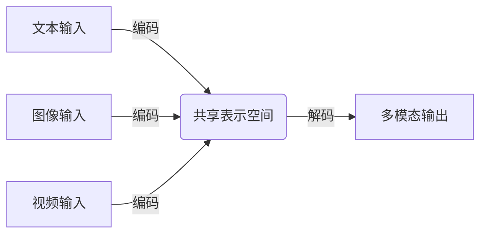
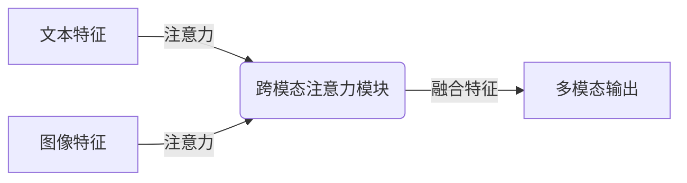
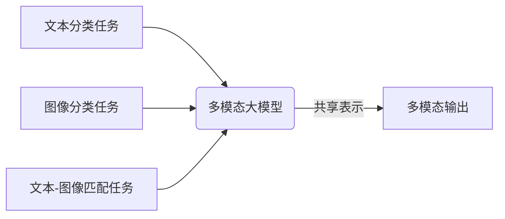
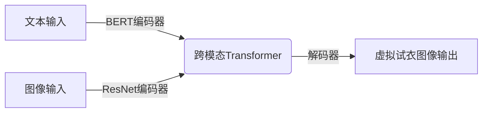

# 多模态大模型：技术原理与实战 智能试穿

## 1.背景介绍

近年来,人工智能领域取得了长足的进步,尤其是自然语言处理和计算机视觉等领域的突破。随着数据和计算能力的不断增长,大型神经网络模型的训练成为可能。传统的单一模态模型,如自然语言处理中的BERT或计算机视觉中的ResNet,已经展现出卓越的性能。然而,真实世界中的数据通常是多模态的,包括文本、图像、视频和音频等多种形式。为了更好地理解和处理这种多模态数据,多模态大模型(Multimodal Large Model)应运而生。

多模态大模型旨在融合不同模态的信息,捕捉不同模态之间的关联,从而实现更精确的理解和生成能力。它们可以同时处理文本、图像、视频等不同模态的输入,并生成相应的多模态输出。这种跨模态的能力使多模态大模型在诸多领域具有广阔的应用前景,如智能问答系统、内容生成、多媒体分析等。

## 2.核心概念与联系

### 2.1 多模态表示学习 (Multimodal Representation Learning)

多模态表示学习是多模态大模型的核心概念之一。它旨在从不同模态的输入数据中学习一个共享的表示空间,使得不同模态的数据可以映射到同一个表示空间中,从而捕捉不同模态之间的关联。

这种共享表示空间通常是一个高维的向量空间,不同模态的输入数据经过编码后都可以映射到这个空间中。在这个空间中,相似的概念或实体,无论是文本、图像还是其他模态,都会被映射到相近的位置。这种表示方式使得模型能够更好地理解和关联不同模态之间的信息。

### 2.2 跨模态注意力机制 (Cross-Modality Attention)

跨模态注意力机制是多模态大模型中另一个关键概念。它允许模型在不同模态之间建立关联,并选择性地聚焦于相关的模态特征。

在传统的单模态模型中,注意力机制通常用于同一模态内部的特征选择。而在多模态模型中,跨模态注意力机制则能够在不同模态之间建立联系,使模型能够关注不同模态之间相关的部分。

例如,在处理一个包含文本和图像的输入时,跨模态注意力机制可以让模型关注与文本相关的图像区域,或者反过来关注与图像相关的文本部分。这种机制有助于模型更好地融合不同模态的信息,提高理解和生成的准确性。

### 2.3 多任务学习 (Multi-Task Learning)

多任务学习是多模态大模型中常用的一种训练范式。它允许模型同时学习多个不同但相关的任务,从而提高模型的泛化能力和鲁棒性。

在多模态场景下,不同的任务可能涉及不同的模态或模态组合。例如,一个多模态模型可能需要同时完成文本分类、图像分类和文本-图像匹配等任务。通过在这些相关任务上进行联合训练,模型可以学习到更加通用和鲁棒的表示,从而提高在各个任务上的性能。

多任务学习不仅可以提高模型的性能,还能够减少训练不同任务所需的计算资源和数据量。此外,它还有助于缓解过拟合问题,提高模型的泛化能力。

## 3.核心算法原理具体操作步骤

多模态大模型的核心算法原理可以概括为以下几个主要步骤:

1. **模态编码 (Modal Encoding)**

   不同模态的输入数据首先需要通过相应的编码器进行编码,将其映射到一个共享的表示空间中。常用的编码器包括:
   - 文本编码器(如BERT、RoBERTa等)
   - 图像编码器(如ResNet、VGG等)
   - 视频编码器(如3D卷积网络、Transformer等)
   - 音频编码器(如CNN、RNN等)

2. **跨模态融合 (Cross-Modal Fusion)**

   经过编码后的不同模态特征需要进行融合,以捕捉不同模态之间的关联。常用的融合方法包括:
   - 跨模态注意力机制
   - 张量融合(如外积、内积等)
   - 多层感知机融合
   - 自注意力融合(如Transformer)

3. **多任务学习 (Multi-Task Learning)**

   为了提高模型的泛化能力和鲁棒性,多模态大模型通常采用多任务学习范式。模型需要在多个相关任务上进行联合训练,例如文本分类、图像分类、文本-图像匹配等。这些任务共享底层的表示,但在顶层有专门的任务头进行预测。

4. **端到端训练 (End-to-End Training)**

   多模态大模型通常采用端到端的训练方式,将编码器、融合模块和任务头统一训练。常用的优化算法包括随机梯度下降(SGD)、Adam等。

5. **预训练与微调 (Pre-training and Fine-tuning)**

   为了加速训练并提高性能,多模态大模型通常采用预训练与微调的范式。首先在大规模无监督数据上进行预训练,获得一个良好的初始化;然后在特定任务的有监督数据上进行微调,进一步提高任务性能。

以上是多模态大模型的核心算法原理和具体操作步骤。在实际应用中,还需要根据具体任务和数据特点进行调整和优化。

## 4.数学模型和公式详细讲解举例说明

多模态大模型中涉及到多种数学模型和公式,下面将详细讲解其中几个核心部分。

### 4.1 跨模态注意力机制

跨模态注意力机制是多模态模型中一个关键的组件,它允许模型在不同模态之间建立关联,并选择性地聚焦于相关的模态特征。

设有两个模态的特征序列 $X = \{x_1, x_2, \dots, x_n\}$ 和 $Y = \{y_1, y_2, \dots, y_m\}$,我们希望计算 $X$ 对 $Y$ 的注意力权重。首先,我们需要计算两个特征序列之间的相似性矩阵 $S$:

$$S_{ij} = f(x_i, y_j)$$

其中 $f$ 是一个相似性函数,可以是点积、余弦相似度等。

然后,我们对 $S$ 的每一行进行 softmax 操作,得到 $X$ 对 $Y$ 的注意力权重矩阵 $A$:

$$A_{ij} = \frac{\exp(S_{ij})}{\sum_{k=1}^m \exp(S_{ik})}$$

最后,我们使用注意力权重矩阵 $A$ 对 $Y$ 进行加权求和,得到 $X$ 对 $Y$ 的注意力表示 $C$:

$$C_i = \sum_{j=1}^m A_{ij} y_j$$

通过这种方式,模型可以自适应地聚焦于与当前模态相关的另一模态的特征,从而更好地融合不同模态的信息。

### 4.2 多任务学习

多任务学习是一种常见的训练范式,它允许模型同时学习多个相关任务,从而提高泛化能力和鲁棒性。在多模态场景下,多任务学习可以帮助模型捕捉不同模态之间的关联,并提高在各个任务上的性能。

设有 $K$ 个任务,每个任务的损失函数为 $\mathcal{L}_k$,我们可以将多任务学习的目标函数定义为所有任务损失的加权和:

$$\mathcal{L} = \sum_{k=1}^K \lambda_k \mathcal{L}_k$$

其中 $\lambda_k$ 是第 $k$ 个任务的权重系数,用于平衡不同任务的重要性。

在实际训练中,我们可以采用反向传播算法,计算每个任务损失对模型参数的梯度,并将它们相加作为总梯度进行参数更新。这种方式允许模型共享底层的表示,同时在顶层有专门的任务头进行预测。

### 4.3 对比学习

对比学习是一种无监督的表示学习方法,它通过最大化相似样本之间的相似度,最小化不相似样本之间的相似度,来学习出良好的数据表示。在多模态场景下,对比学习可以用于学习一个共享的跨模态表示空间。

设有一个正样本对 $(x, y)$,其中 $x$ 和 $y$ 分别来自不同的模态,我们希望最大化它们在表示空间中的相似度。同时,我们也希望最小化正样本与其他负样本之间的相似度。这可以通过下面的对比损失函数来实现:

$$\mathcal{L} = -\log \frac{\exp(\text{sim}(x, y) / \tau)}{\sum_{x' \in X} \exp(\text{sim}(x, x') / \tau)}$$

其中 $\text{sim}(\cdot, \cdot)$ 是一个相似性函数(如点积或余弦相似度), $\tau$ 是一个温度超参数, $X$ 是负样本集合。

通过最小化这个对比损失函数,模型可以学习到一个良好的跨模态表示空间,在这个空间中,相似的样本会被映射到相近的位置,而不相似的样本会被映射到远离的位置。这种表示空间对于多模态模型理解和融合不同模态的信息是非常有帮助的。

以上是多模态大模型中几个核心数学模型和公式的详细讲解。在实际应用中,还可能涉及到其他模型和公式,需要根据具体任务和数据特点进行选择和调整。

## 5.项目实践:代码实例和详细解释说明

为了更好地理解多模态大模型的原理和实现,我们将通过一个具体的项目实践来进行说明。这个项目是一个基于多模态大模型的智能试衣系统,它可以根据用户输入的文本描述和上传的人体图像,生成一个穿着相应服装的虚拟试衣效果图。

### 5.1 数据准备

我们需要准备两种类型的数据:

1. **文本数据**:包含服装描述的文本数据集,例如"一件蓝色的牛仔裤"、"一件红色的长袖衬衫"等。

2. **图像数据**:包含人体图像的数据集,最好是只有人体而没有穿着任何服装的图像。

### 5.2 模型架构

我们将使用一个基于Transformer的多模态大模型,其架构如下所示:

- **文本编码器**:我们使用预训练的BERT模型作为文本编码器,将文本描述编码为向量表示。
- **图像编码器**:我们使用预训练的ResNet模型作为图像编码器,将人体图像编码为向量表示。
- **跨模态Transformer**:这是模型的核心部分,它将文本和图像的编码表示作为输入,并通过多头注意力机制和跨模态注意力机制来融合不同模态的信息。
- **解码器**:解码器模块将融合后的表示解码为虚拟试衣图像的像素值。

### 5.3 训练过程

我们将采用多任务学习的范式来训练模型。具体来说,我们将同时优化以下三个任务:

1. **文本-图像匹配任务**