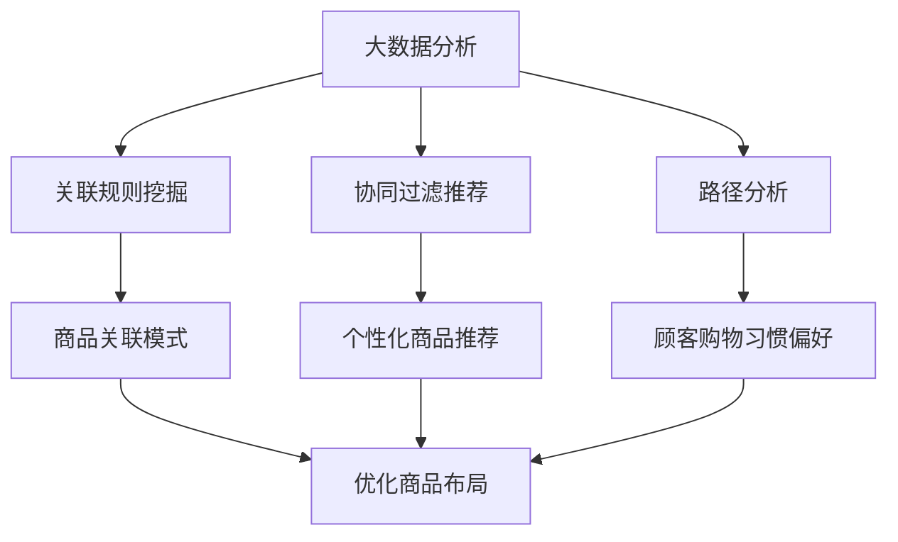

# 大数据下优化大型超市商品布局的分析研究

## 1.背景介绍

### 1.1 大型超市商品布局的重要性

在当今快节奏的生活方式中,大型超市已经成为人们日常生活中不可或缺的一部分。顾客在超市购物时,商品的布局和陈列方式直接影响着他们的购物体验和购买决策。合理的商品布局不仅可以提高顾客的满意度,还能够增加销售额和利润。因此,优化大型超市的商品布局对于提升顾客体验和商业绩效至关重要。

### 1.2 大数据在优化商品布局中的作用

随着信息技术的快速发展,大数据分析已经成为优化商品布局的有力工具。通过收集和分析顾客的购买记录、行为轨迹等海量数据,可以深入了解顾客的购买习惯和偏好,从而为商品布局的优化提供有价值的见解和依据。

### 1.3 研究目的和意义

本文旨在探讨如何利用大数据分析技术,优化大型超市的商品布局,提高顾客满意度和销售绩效。通过对相关理论、算法和实践案例的分析,为超市商品布局优化提供参考和指导。

## 2.核心概念与联系

### 2.1 关联规则挖掘

关联规则挖掘是数据挖掘中一种重要的技术,用于发现数据集中存在的有趣关联或相关性。在超市商品布局优化中,可以通过关联规则挖掘发现顾客购买商品之间的关联模式,从而优化商品的陈列位置,提高交叉销售。

### 2.2 协同过滤推荐

协同过滤推荐是一种基于用户行为的推荐算法,通过分析用户之间的相似度,为目标用户推荐其他相似用户喜欢的商品。在超市商品布局优化中,可以利用协同过滤推荐算法,根据顾客的购买历史,推荐相关商品并优化其布局。

### 2.3 路径分析

路径分析是研究顾客在超市中的行走路径和停留位置的技术,可以揭示顾客的购物习惯和偏好。通过分析顾客的行为轨迹数据,可以优化商品的陈列位置,提高商品的曝光率和销售机会。

### 2.4 核心概念关系

上述三种核心概念相互关联,共同为优化大型超市商品布局提供了理论基础和技术支持。关联规则挖掘发现顾客购买商品之间的关联模式,协同过滤推荐算法根据顾客历史推荐相关商品,路径分析揭示顾客的购物习惯和偏好,三者相辅相成,为商品布局优化提供了全面的数据支持。



## 3.核心算法原理具体操作步骤

### 3.1 关联规则挖掘算法

关联规则挖掘算法通常包括两个步骤:频繁项集挖掘和规则生成。

#### 3.1.1 频繁项集挖掘

频繁项集挖掘的目标是发现数据集中出现频率高于给定阈值的项集。常用的算法有Apriori算法、FP-Growth算法等。

1. **Apriori算法**

Apriori算法是一种经典的关联规则挖掘算法,它采用迭代方法逐层生成频繁项集。具体步骤如下:

- 第一次扫描数据集,统计每个项的支持度,过滤掉不满足最小支持度的项。
- 利用剩下的频繁1-项集生成候选2-项集。
- 扫描数据集,统计每个候选2-项集的支持度,过滤掉不满足最小支持度的项集。
- 重复上述步骤,直到无法生成新的候选项集。

2. **FP-Growth算法**

FP-Growth算法采用FP-Tree数据结构来存储频繁项集,避免了Apriori算法的多次扫描数据集的缺陷。具体步骤如下:

- 扫描数据集,构建FP-Tree。
- 从FP-Tree中挖掘频繁项集。
- 根据频繁项集生成关联规则。

#### 3.1.2 规则生成

在获得频繁项集后,需要根据支持度和置信度阈值生成关联规则。支持度表示项集在数据集中出现的频率,置信度表示条件概率,即前件发生时后件发生的概率。

对于频繁项集 $\{A, B\}$,可以生成两条关联规则:

$$
\begin{aligned}
& R_1: A \Rightarrow B \\
& \text{支持度} = \frac{sup(A \cup B)}{N} \\
& \text{置信度} = \frac{sup(A \cup B)}{sup(A)}
\end{aligned}
$$

$$
\begin{aligned}
& R_2: B \Rightarrow A \\
& \text{支持度} = \frac{sup(A \cup B)}{N} \\
& \text{置信度} = \frac{sup(A \cup B)}{sup(B)}
\end{aligned}
$$

其中,N为数据集的总记录数。

### 3.2 协同过滤推荐算法

协同过滤推荐算法主要分为两类:基于用户的协同过滤和基于项目的协同过滤。

#### 3.2.1 基于用户的协同过滤

基于用户的协同过滤算法通过计算用户之间的相似度,为目标用户推荐与其相似的其他用户喜欢的商品。具体步骤如下:

1. 计算用户之间的相似度,常用的相似度度量方法有皮尔逊相关系数、余弦相似度等。
2. 根据相似度,找到与目标用户最相似的K个邻居用户。
3. 基于邻居用户的评分,预测目标用户对未评分项目的评分,并推荐评分较高的项目。

#### 3.2.2 基于项目的协同过滤

基于项目的协同过滤算法通过计算项目之间的相似度,为目标用户推荐与其历史喜欢的项目相似的其他项目。具体步骤如下:

1. 计算项目之间的相似度,常用的相似度度量方法有修正的余弦相似度、Tanimoto系数等。
2. 根据目标用户历史喜欢的项目,找到与这些项目最相似的K个项目。
3. 将这K个相似项目推荐给目标用户。

### 3.3 路径分析算法

路径分析算法通常包括以下步骤:

1. **数据预处理**

对顾客的行为轨迹数据进行清洗和格式化,提取有效的轨迹数据。

2. **轨迹模式挖掘**

利用频繁序列挖掘算法(如PrefixSpan算法)或者聚类算法(如OPTICS算法)发现顾客的常见行走路径模式。

3. **热点区域识别**

根据轨迹模式和停留时间,识别超市中的热点区域,即顾客经常停留和购物的区域。

4. **路径可视化**

将挖掘出的轨迹模式和热点区域在超市平面图上进行可视化,直观展示顾客的购物行为。

5. **优化建议**

结合路径分析结果,为商品布局优化提出建议,如将畅销商品放置在热点区域,将相关商品放置在临近位置等。

## 4.数学模型和公式详细讲解举例说明

### 4.1 关联规则挖掘中的支持度和置信度

在关联规则挖掘中,支持度和置信度是两个重要的度量指标。

**支持度**表示项集在数据集中出现的频率,定义如下:

$$
\text{支持度}(X \Rightarrow Y) = P(X \cup Y) = \frac{sup(X \cup Y)}{N}
$$

其中,N为数据集的总记录数,sup(X ∪ Y)表示包含项集X和Y的记录数。

**置信度**表示条件概率,即前件发生时后件发生的概率,定义如下:

$$
\text{置信度}(X \Rightarrow Y) = P(Y|X) = \frac{sup(X \cup Y)}{sup(X)}
$$

其中,sup(X)表示包含项集X的记录数。

例如,在一个超市交易数据集中,有以下关联规则:

$$
\text{面包} \Rightarrow \text{牛奶}
$$

支持度 = 0.05,置信度 = 0.8。这表示5%的顾客同时购买了面包和牛奶,而购买面包的顾客中有80%也购买了牛奶。

通过设置合适的支持度和置信度阈值,可以过滤掉不重要的关联规则,提取有价值的规则用于优化商品布局。

### 4.2 协同过滤推荐算法中的相似度计算

在协同过滤推荐算法中,相似度计算是一个关键步骤。常用的相似度度量方法包括:

1. **皮尔逊相关系数**

皮尔逊相关系数用于计算两个向量之间的相似度,取值范围为[-1,1],值越接近1表示越相似。对于用户u和v,皮尔逊相关系数定义如下:

$$
\text{sim}(u, v) = \frac{\sum_{i \in I}(r_{u,i} - \overline{r_u})(r_{v,i} - \overline{r_v})}{\sqrt{\sum_{i \in I}(r_{u,i} - \overline{r_u})^2}\sqrt{\sum_{i \in I}(r_{v,i} - \overline{r_v})^2}}
$$

其中,I表示两个用户都评分过的项目集合,r_{u,i}和r_{v,i}分别表示用户u和v对项目i的评分,\overline{r_u}和\overline{r_v}分别表示用户u和v的平均评分。

2. **余弦相似度**

余弦相似度用于计算两个向量之间的夹角余弦值,取值范围为[0,1],值越接近1表示越相似。对于项目i和j,余弦相似度定义如下:

$$
\text{sim}(i, j) = \frac{\vec{i} \cdot \vec{j}}{||\vec{i}|| \times ||\vec{j}||} = \frac{\sum_{u \in U}r_{u,i}r_{u,j}}{\sqrt{\sum_{u \in U}r_{u,i}^2}\sqrt{\sum_{u \in U}r_{u,j}^2}}
$$

其中,U表示对项目i和j都有评分的用户集合,r_{u,i}和r_{u,j}分别表示用户u对项目i和j的评分。

通过计算相似度,协同过滤推荐算法可以为目标用户推荐与其历史喜好相似的商品,优化商品布局。

## 5.项目实践:代码实例和详细解释说明

### 5.1 关联规则挖掘示例

以下是使用Python中的Apriori算法进行关联规则挖掘的示例代码:

```python
import pandas as pd
from mlxtend.frequent_patterns import apriori
from mlxtend.frequent_patterns import association_rules

# 加载数据
data = pd.read_csv('supermarket_transactions.csv', header=None)

# 关联规则挖掘
frequent_itemsets = apriori(data, min_support=0.01, use_colnames=True)
rules = association_rules(frequent_itemsets, metric='confidence', min_threshold=0.6)

# 查看结果
print(rules.head())
```

代码解释:

1. 导入相关库,包括pandas用于数据处理,mlxtend.frequent_patterns用于关联规则挖掘。
2. 加载超市交易数据,每行表示一次交易,包含购买的商品列表。
3. 使用apriori函数进行频繁项集挖掘,设置最小支持度为0.01。
4. 使用association_rules函数从频繁项集生成关联规则,设置最小置信度为0.6。
5. 打印部分关联规则结果。

输出结果示例:

```
   antecedents                 consequents  antecedent support  consequent support   support  confidence
0        (Eggs)                    (Butter)               0.0575               0.0725   0.0325       0.565
1  (Chicken, Eggs)                  (Butter)               0