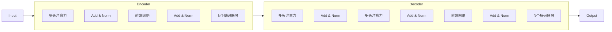

# 大规模语言模型从理论到实践 专业数据

## 1.背景介绍

### 1.1 语言模型的重要性

语言模型在自然语言处理(NLP)领域扮演着至关重要的角色。它们是许多下游任务(如机器翻译、问答系统、文本摘要等)的基础组件。近年来,随着深度学习技术的快速发展,基于神经网络的大规模语言模型取得了令人瞩目的成就,显著推进了 NLP 领域的发展。

### 1.2 大规模语言模型的兴起

传统的语言模型通常基于 n-gram 统计方法,但存在参数空间有限、难以捕捉长距离依赖等缺陷。2018年,Transformer 结构被提出,通过自注意力机制有效地捕捉长距离依赖,为构建大规模语言模型奠定了基础。此后,以 BERT、GPT 为代表的大规模预训练语言模型相继问世,展现出强大的语言理解和生成能力。

### 1.3 大规模语言模型的影响

大规模语言模型的出现,不仅推动了 NLP 技术的飞速进步,也对整个人工智能领域产生了深远影响。它们在诸多任务上表现出超越人类的能力,引发了人们对人工智能的重新思考和探讨。同时,大规模模型也带来了一些新的挑战,如对计算资源的巨大需求、隐私和安全风险等,需要研究人员持续关注和解决。

## 2.核心概念与联系

### 2.1 语言模型的基本概念

语言模型的本质是估计一个句子或文本序列的概率分布,即 $P(w_1, w_2, ..., w_n)$,其中 $w_i$ 表示序列中的第 i 个词。根据链式法则,该概率可分解为:

$$P(w_1, w_2, ..., w_n) = \prod_{i=1}^{n}P(w_i|w_1, ..., w_{i-1})$$

语言模型的目标是学习这些条件概率,以便能够预测下一个词是什么。

### 2.2 神经网络语言模型

神经网络语言模型(Neural Language Model, NLM)利用神经网络来建模条件概率分布。与传统的 n-gram 模型相比,NLM 具有更强的表示能力,可以捕捉更复杂的语言结构和长距离依赖。

常见的 NLM 架构包括:

- 前馈神经网络语言模型
- 循环神经网络语言模型(RNN-LM)
- 门控循环单元语言模型(GRU-LM)
- 长短期记忆网络语言模型(LSTM-LM)

### 2.3 自注意力机制与 Transformer

2017年,Transformer 架构被提出,它完全基于注意力机制,不再使用循环或卷积结构。自注意力机制使得 Transformer 能够有效地捕捉长距离依赖,并通过并行计算大幅提高了训练效率。这为构建大规模语言模型奠定了基础。

### 2.4 预训练语言模型

预训练语言模型(Pre-trained Language Model, PLM)是一种新型的 NLM 范式。它们首先在大规模无标注语料库上进行预训练,获得通用的语言表示能力,然后可以通过微调(fine-tuning)的方式迁移到下游任务。

著名的 PLM 包括:

- BERT: 基于 Transformer 的双向编码器
- GPT: 基于 Transformer 的单向解码器
- XLNet: 融合了自回归和自编码的双向语言模型

这些模型在多项 NLP 任务上取得了领先的表现,推动了语言模型的发展。

## 3.核心算法原理具体操作步骤

### 3.1 Transformer 模型架构

Transformer 是一种全新的基于注意力机制的序列到序列模型架构,主要由编码器(Encoder)和解码器(Decoder)两个部分组成。

编码器的主要作用是映射输入序列到一个连续的表示空间。解码器则根据编码器的输出和输入序列生成目标序列。

#### 3.1.1 编码器(Encoder)

编码器由 N 个相同的层组成,每一层包含两个子层:

1. **Multi-Head Attention 层**:对输入序列进行自注意力计算,捕捉序列中的长距离依赖关系。
2. **前馈全连接网络层**:对每个位置的向量进行非线性变换,增强表示能力。

#### 3.1.2 解码器(Decoder)

解码器也由 N 个相同的层组成,每一层包含三个子层:

1. **Masked Multi-Head Attention 层**:对输入序列进行自注意力计算,但遮掩住未来位置的信息,以保证自回归属性。
2. **Multi-Head Attention 层**:对编码器输出进行注意力计算,融合编码器的信息。
3. **前馈全连接网络层**:同编码器,对每个位置的向量进行非线性变换。

### 3.2 注意力机制(Attention Mechanism)

注意力机制是 Transformer 的核心,它能够自动捕捉输入序列中任意两个位置之间的依赖关系。

对于一个长度为 $n$ 的输入序列 $X = (x_1, x_2, ..., x_n)$,注意力机制首先计算出一个 $n \times n$ 的注意力分数矩阵 $A$,其中 $A_{ij}$ 表示 $x_i$ 对 $x_j$ 的注意力分数。然后根据注意力分数对输入序列进行加权求和,得到注意力输出向量。

$$\text{Attention}(Q, K, V) = \text{softmax}(\frac{QK^T}{\sqrt{d_k}})V$$

其中 $Q$、$K$、$V$ 分别表示查询(Query)、键(Key)和值(Value)向量。

### 3.3 多头注意力机制(Multi-Head Attention)

为了捕捉不同的子空间表示,Transformer 采用了多头注意力机制。具体来说,将查询 $Q$、键 $K$ 和值 $V$ 分别线性投影到 $h$ 个子空间,对每个子空间分别计算注意力,最后将所有子空间的注意力输出进行拼接:

$$\text{MultiHead}(Q, K, V) = \text{Concat}(\text{head}_1, ..., \text{head}_h)W^O$$
$$\text{where, head}_i = \text{Attention}(QW_i^Q, KW_i^K, VW_i^V)$$

其中 $W_i^Q \in \mathbb{R}^{d_{\text{model}} \times d_k}$、$W_i^K \in \mathbb{R}^{d_{\text{model}} \times d_k}$、$W_i^V \in \mathbb{R}^{d_{\text{model}} \times d_v}$ 和 $W^O \in \mathbb{R}^{hd_v \times d_{\text{model}}}$ 是可学习的线性投影参数。

### 3.4 位置编码(Positional Encoding)

由于 Transformer 完全基于注意力机制,没有像 RNN 或 CNN 那样的顺序结构,因此需要一种方式来注入序列的位置信息。Transformer 使用位置编码将位置信息编码到输入的嵌入向量中。

对于序列中的第 $i$ 个位置,其位置编码向量 $PE_{(pos, 2i)}$ 和 $PE_{(pos, 2i+1)}$ 定义如下:

$$PE_{(pos, 2i)} = \sin(pos / 10000^{2i / d_{\text{model}}})$$
$$PE_{(pos, 2i+1)} = \cos(pos / 10000^{2i / d_{\text{model}}})$$

其中 $pos$ 是位置索引,而 $d_{\text{model}}$ 是模型的隐藏层大小。位置编码向量直接加到输入的嵌入向量上,从而将位置信息融入到模型中。

## 4.数学模型和公式详细讲解举例说明

### 4.1 语言模型的概率计算

语言模型的目标是计算一个文本序列 $X = (x_1, x_2, ..., x_n)$ 的概率 $P(X)$。根据链式法则,我们可以将其分解为:

$$P(X) = P(x_1, x_2, ..., x_n) = \prod_{i=1}^{n}P(x_i|x_1, ..., x_{i-1})$$

其中 $P(x_i|x_1, ..., x_{i-1})$ 表示在给定前 $i-1$ 个词的条件下,第 $i$ 个词的条件概率。

例如,对于一个句子 "the cat sat on the mat",我们有:

$$\begin{align*}
P(\text{the cat sat on the mat}) &= P(\text{the}) \times P(\text{cat} | \text{the}) \times P(\text{sat} | \text{the, cat}) \\
&\quad \times P(\text{on} | \text{the, cat, sat}) \times P(\text{the} | \text{the, cat, sat, on}) \\
&\quad \times P(\text{mat} | \text{the, cat, sat, on, the})
\end{align*}$$

语言模型的任务就是学习这些条件概率分布。

### 4.2 交叉熵损失函数

在训练语言模型时,通常采用交叉熵(Cross Entropy)作为损失函数。对于一个长度为 $n$ 的目标序列 $Y = (y_1, y_2, ..., y_n)$,交叉熵损失定义为:

$$\mathcal{L}(\theta) = -\frac{1}{n}\sum_{i=1}^{n}\log P_\theta(y_i|y_1, ..., y_{i-1}, X)$$

其中 $\theta$ 表示模型参数,而 $X$ 是输入序列。交叉熵损失函数衡量了模型预测的概率分布与真实分布之间的差异,目标是最小化这一损失。

在实践中,我们通常在损失函数中加入一个权重系数 $\lambda$,对低频词进行上采样,从而缓解训练数据中的不平衡问题。修改后的损失函数为:

$$\mathcal{L}(\theta) = -\frac{1}{n}\sum_{i=1}^{n}\lambda_{y_i}\log P_\theta(y_i|y_1, ..., y_{i-1}, X)$$

其中 $\lambda_{y_i}$ 是与词 $y_i$ 相关的权重系数。

### 4.3 注意力分数计算

在 Transformer 的注意力机制中,注意力分数矩阵 $A$ 的计算方式如下:

$$A = \text{softmax}(\frac{QK^T}{\sqrt{d_k}})$$

其中 $Q$ 是查询向量,而 $K$ 是键向量。$d_k$ 是每个键向量的维度。

softmax 函数用于将原始分数转换为概率分布:

$$\text{softmax}(x_i) = \frac{e^{x_i}}{\sum_j e^{x_j}}$$

$\sqrt{d_k}$ 的作用是对分数进行缩放,避免较大的值导致 softmax 函数的梯度较小。

例如,假设我们有一个长度为 3 的序列 $X = (x_1, x_2, x_3)$,其查询向量为 $Q = (q_1, q_2, q_3)$,键向量为 $K = (k_1, k_2, k_3)$,则注意力分数矩阵为:

$$A = \begin{bmatrix}
\frac{q_1k_1^T}{\sqrt{d_k}} & \frac{q_1k_2^T}{\sqrt{d_k}} & \frac{q_1k_3^T}{\sqrt{d_k}} \\
\frac{q_2k_1^T}{\sqrt{d_k}} & \frac{q_2k_2^T}{\sqrt{d_k}} & \frac{q_2k_3^T}{\sqrt{d_k}} \\
\frac{q_3k_1^T}{\sqrt{d_k}} & \frac{q_3k_2^T}{\sqrt{d_k}} & \frac{q_3k_3^T}{\sqrt{d_k}}
\end{bmatrix}$$

对每