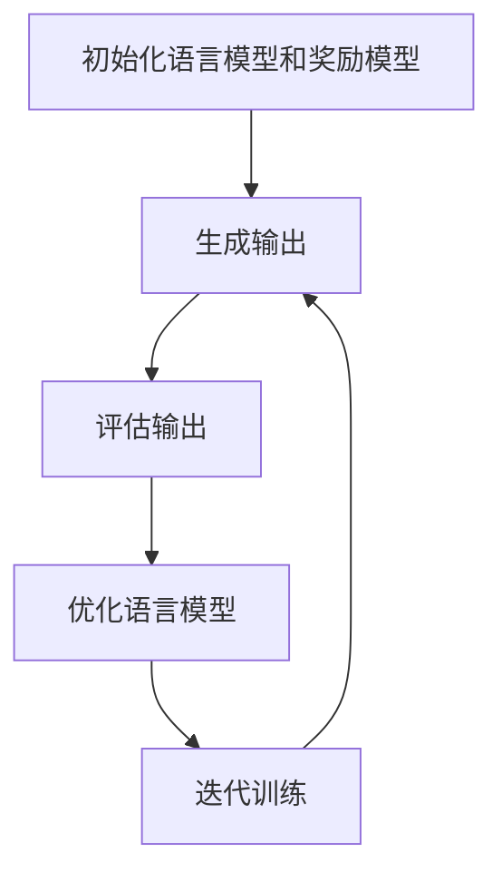

# 大规模语言模型从理论到实践 奖励模型

## 1. 背景介绍

随着深度学习和人工智能技术的不断发展,大规模语言模型已经成为自然语言处理领域的关键技术之一。这些模型通过在大量文本数据上进行预训练,学习到了丰富的语言知识和上下文表示,从而可以在各种自然语言处理任务上取得出色的表现。

然而,训练这种大规模语言模型需要消耗大量的计算资源,并且存在一些潜在的风险和挑战,例如模型偏差、数据隐私和安全性问题等。为了解决这些问题,研究人员提出了奖励模型(Reward Model)的概念,旨在引导语言模型生成更加准确、相关和有益的输出。

### 1.1 大规模语言模型的发展历程

大规模语言模型的发展可以追溯到 2018 年,当时 OpenAI 发布了 GPT(Generative Pre-trained Transformer)模型,这是第一个基于 Transformer 架构的大规模语言模型。随后,谷歌推出了 BERT(Bidirectional Encoder Representations from Transformers)模型,引入了双向编码器,显著提高了语言理解能力。

2020 年,OpenAI 发布了 GPT-3 模型,这是一个拥有 1750 亿个参数的超大规模语言模型,在各种自然语言处理任务上表现出色,引起了广泛关注。同年,谷歌也推出了更大规模的语言模型 GShard。

随着模型规模的不断扩大,训练和部署这些模型的计算成本也在不断增加。因此,如何高效地训练和优化这些大规模语言模型,并解决潜在的风险和挑战,成为了一个重要的研究课题。

### 1.2 奖励模型的提出

为了解决大规模语言模型存在的问题,研究人员提出了奖励模型(Reward Model)的概念。奖励模型是一种辅助模型,旨在为语言模型生成的输出提供奖励或惩罚信号,从而引导模型生成更加准确、相关和有益的输出。

奖励模型通常是一个独立的模型,被训练用于评估语言模型生成的输出的质量。它可以考虑多种因素,如语义一致性、事实准确性、相关性、多样性等。通过将奖励模型的评分作为反馈,语言模型可以在训练过程中不断优化和调整,以生成更加优质的输出。

奖励模型的引入为大规模语言模型的训练和优化提供了新的思路和方法,有望解决一些长期存在的挑战,如模型偏差、数据隐私和安全性问题等。同时,它也为语言模型的应用开辟了新的可能性,如自动写作、对话系统、内容生成等领域。

## 2. 核心概念与联系

### 2.1 奖励模型的核心概念

奖励模型的核心概念是基于强化学习的思想,将语言模型生成的输出视为一种行为,并通过奖励或惩罚来引导模型朝着期望的方向优化。具体来说,奖励模型包括以下几个关键概念:

1. **状态(State)**: 表示语言模型在生成输出时的当前状态,包括已生成的文本、上下文信息等。

2. **行为(Action)**: 指语言模型在当前状态下生成的下一个词或标记。

3. **奖励函数(Reward Function)**: 用于评估语言模型生成的输出的质量,给出相应的奖励或惩罚分数。奖励函数可以考虑多种因素,如语义一致性、事实准确性、相关性、多样性等。

4. **策略(Policy)**: 指语言模型根据当前状态选择下一个行为的策略,即生成下一个词或标记的概率分布。

5. **强化学习算法(Reinforcement Learning Algorithm)**: 用于根据奖励函数的反馈,不断优化和调整语言模型的策略,以生成更加优质的输出。常用的算法包括策略梯度(Policy Gradient)、Q-Learning 等。

### 2.2 奖励模型与其他技术的联系

奖励模型与其他一些技术和概念存在密切的联系,如下所示:

1. **对抗训练(Adversarial Training)**: 奖励模型可以被视为一种对抗训练的形式,其中奖励模型扮演对手的角色,评估语言模型生成的输出,并提供反馈信号。

2. **元学习(Meta-Learning)**: 奖励模型的训练过程可以被视为一种元学习,即学习如何评估和优化语言模型的输出。

3. **多任务学习(Multi-Task Learning)**: 奖励模型可以被设计为一个多任务模型,同时考虑多种评估标准,如语义一致性、事实准确性、相关性等。

4. **知识蒸馏(Knowledge Distillation)**: 奖励模型可以被用于知识蒸馏,将大型语言模型的知识转移到小型模型中,以提高小型模型的性能。

5. **人类反馈(Human Feedback)**: 奖励模型可以利用人类的反馈和评分,作为训练目标之一,从而更好地符合人类的期望和偏好。

通过将奖励模型与其他技术相结合,可以进一步提高语言模型的性能和应用范围。

## 3. 核心算法原理具体操作步骤

奖励模型的核心算法原理基于强化学习,主要分为以下几个步骤:

1. **初始化语言模型和奖励模型**

   - 初始化一个预训练的语言模型,作为生成器(Generator)
   - 初始化一个奖励模型,作为评估器(Evaluator)

2. **生成输出**

   - 语言模型根据当前状态(上下文、已生成的文本等)生成下一个词或标记,得到一个候选输出序列

3. **评估输出**

   - 将候选输出序列输入到奖励模型中
   - 奖励模型根据预设的评估标准(如语义一致性、事实准确性、相关性等)对输出进行评分,得到一个奖励值

4. **优化语言模型**

   - 根据奖励值,使用强化学习算法(如策略梯度)计算语言模型的策略梯度
   - 更新语言模型的参数,使其生成的输出获得更高的奖励值

5. **迭代训练**

   - 重复步骤 2-4,不断优化语言模型的策略
   - 可以采用curriculum learning等策略,逐步增加训练难度

这个过程可以用以下 Mermaid 流程图来表示:

在实际操作中,还需要注意以下几个方面:

1. **奖励函数的设计**: 奖励函数的设计对模型性能有重大影响,需要综合考虑多种评估标准,并根据具体任务进行调整和优化。

2. **探索与利用的平衡**: 在训练过程中,需要平衡探索(生成新的输出)和利用(利用已知的高奖励输出)之间的关系,以避免陷入局部最优解。

3. **样本效率**: 由于语言模型生成的输出空间非常大,需要提高样本效率,例如通过重要性采样等技术。

4. **稳定性和鲁棒性**: 需要确保算法的稳定性和鲁棒性,避免出现梯度爆炸、模型崩溃等问题。

5. **计算资源**: 训练大规模语言模型和奖励模型需要消耗大量的计算资源,可以考虑分布式训练、模型压缩等技术来提高效率。

## 4. 数学模型和公式详细讲解举例说明

在奖励模型的训练过程中,涉及到一些重要的数学模型和公式,下面将对其进行详细讲解和举例说明。

### 4.1 强化学习基础

奖励模型的核心算法基于强化学习,因此需要先了解一些强化学习的基本概念和公式。

在强化学习中,我们定义了一个马尔可夫决策过程(Markov Decision Process, MDP),由一个元组 $(S, A, P, R, \gamma)$ 表示,其中:

- $S$ 是状态集合
- $A$ 是行为集合
- $P(s'|s,a)$ 是状态转移概率,表示在状态 $s$ 下执行行为 $a$ 后转移到状态 $s'$ 的概率
- $R(s,a)$ 是奖励函数,表示在状态 $s$ 下执行行为 $a$ 所获得的即时奖励
- $\gamma \in [0, 1)$ 是折现因子,用于平衡即时奖励和长期奖励的权重

在强化学习中,我们的目标是找到一个策略 $\pi(a|s)$,表示在状态 $s$ 下选择行为 $a$ 的概率,使得期望的累积奖励最大化:

$$J(\pi) = \mathbb{E}_\pi \left[ \sum_{t=0}^\infty \gamma^t R(s_t, a_t) \right]$$

其中 $s_t$ 和 $a_t$ 分别表示第 $t$ 个时间步的状态和行为。

### 4.2 策略梯度算法

在奖励模型中,我们通常采用策略梯度(Policy Gradient)算法来优化语言模型的策略。策略梯度算法的基本思想是直接优化策略参数,使期望的累积奖励最大化。

对于一个参数化的策略 $\pi_\theta(a|s)$,其梯度可以表示为:

$$\nabla_\theta J(\theta) = \mathbb{E}_{\pi_\theta} \left[ \sum_{t=0}^\infty \nabla_\theta \log \pi_\theta(a_t|s_t) Q^{\pi_\theta}(s_t, a_t) \right]$$

其中 $Q^{\pi_\theta}(s_t, a_t)$ 是在策略 $\pi_\theta$ 下,从状态 $s_t$ 执行行为 $a_t$ 开始的期望累积奖励,也称为状态-行为值函数。

在实际操作中,我们通常采用蒙特卡罗估计或者时序差分(Temporal Difference)方法来估计 $Q^{\pi_\theta}(s_t, a_t)$,然后根据梯度更新策略参数 $\theta$。

### 4.3 奖励模型中的状态、行为和奖励

在将强化学习应用于奖励模型时,我们需要定义状态、行为和奖励的具体含义。

- **状态(State)**: 表示语言模型在生成输出时的当前状态,包括已生成的文本、上下文信息等。可以将它表示为一个向量 $s_t$。

- **行为(Action)**: 指语言模型在当前状态下生成的下一个词或标记。可以将它表示为一个离散的变量 $a_t$。

- **奖励函数(Reward Function)**: 用于评估语言模型生成的输出的质量,给出相应的奖励或惩罚分数。奖励函数可以考虑多种因素,如语义一致性、事实准确性、相关性、多样性等。可以将它表示为一个函数 $R(s_t, a_t)$。

在训练过程中,语言模型会根据当前状态 $s_t$ 生成下一个词或标记 $a_t$,然后将生成的输出序列输入到奖励模型中,获得相应的奖励值 $R(s_t, a_t)$。根据这个奖励值,我们可以使用策略梯度算法优化语言模型的策略参数,使其生成的输出获得更高的奖励值。

### 4.4 示例:基于 REINFORCE 算法的奖励模型训练

下面以 REINFORCE 算法为例,展示如何在奖励模型中应用策略梯度算法进行训练。

REINFORCE 算法是一种基于蒙特卡罗估计的策略梯度算法,其梯度估计公式如下:

$$\nabla_\theta J(\theta) \approx \frac{1}{N} \sum_{i=1}^N \left( \sum_{t=0}^{T_i} R_i(t) \right) \nabla_\theta \log \pi_\theta(a_t^i|s_t^i)$$

其中 $N$ 是样本数量, $T_i$ 是第 $i$ 个轨迹的长度