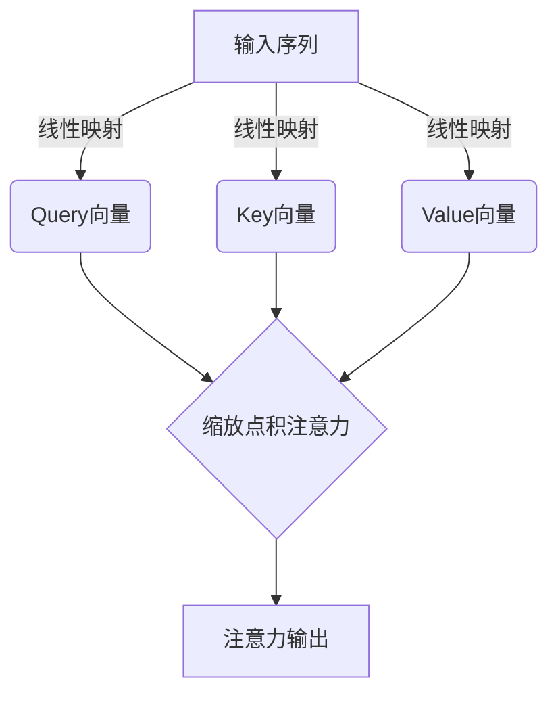
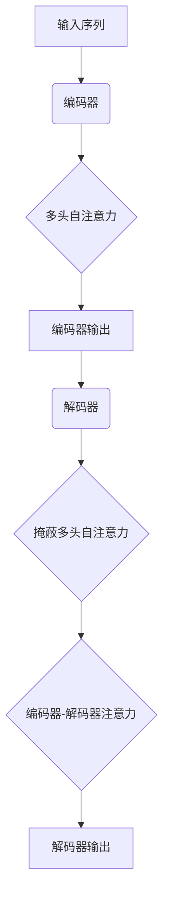
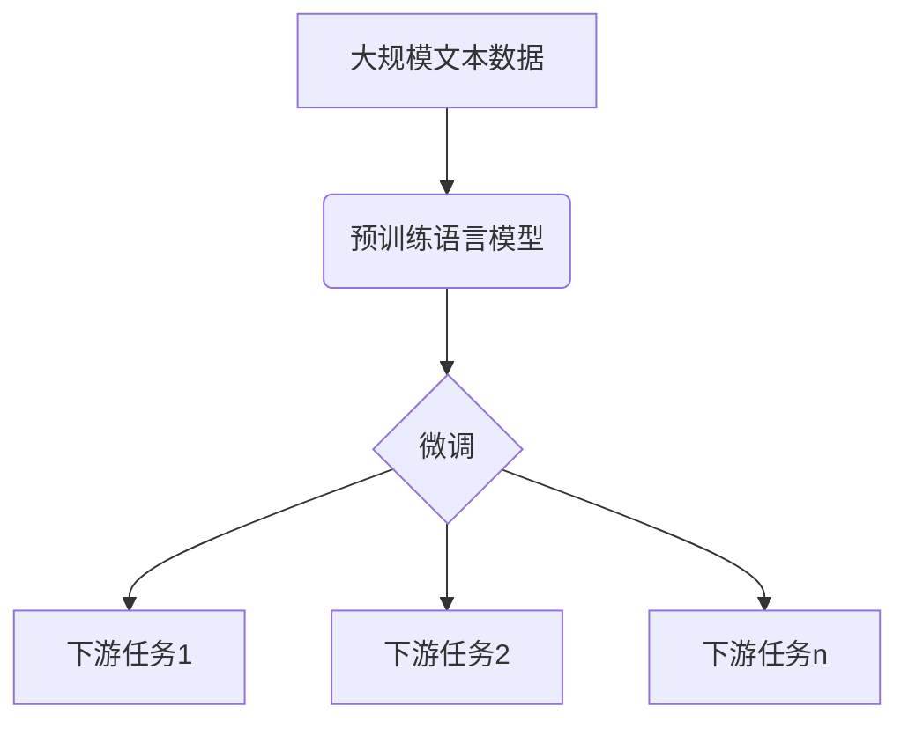
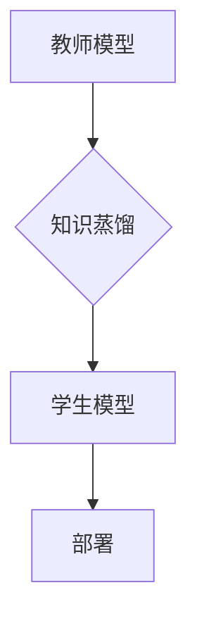

# 大规模语言模型从理论到实践 实践思考

## 1.背景介绍

### 1.1 语言模型的重要性

语言模型是自然语言处理领域的核心技术之一,在机器翻译、语音识别、文本生成等多个任务中扮演着关键角色。随着深度学习技术的快速发展,基于神经网络的语言模型取得了巨大的进步,尤其是近年来出现的大规模语言模型,展现出了令人惊叹的语言理解和生成能力。

### 1.2 大规模语言模型的兴起

传统的语言模型通常基于 N-gram 统计方法,只能捕捉有限的上下文信息。而大规模语言模型利用了深度神经网络的强大表达能力,能够从海量文本数据中学习到丰富的语义和上下文知识。代表性的大规模语言模型包括 GPT、BERT、XLNet、T5 等,它们在自然语言理解和生成任务上取得了突破性的成绩。

### 1.3 大规模语言模型的挑战

尽管大规模语言模型展现出了强大的能力,但在实际应用中仍面临诸多挑战,例如:

- 模型训练成本高昂,需要大量计算资源和海量数据
- 存在安全隐患,模型可能生成有害或不当内容
- 缺乏解释性,模型的内部工作机制"黑箱"操作
- 公平性和偏见问题,模型可能继承训练数据中的偏见
- 对话一致性和多轮交互能力有待提高

## 2.核心概念与联系

### 2.1 自注意力机制 (Self-Attention)

自注意力机制是大规模语言模型的核心基础,它能够捕捉输入序列中任意两个位置之间的关系。与传统的RNN和CNN相比,自注意力机制并行计算,更易于捕捉长距离依赖关系,并且具有更好的计算效率。



### 2.2 Transformer 架构

Transformer 是第一个完全基于自注意力机制的序列到序列模型,它抛弃了 RNN 结构,使用多头自注意力层和前馈神经网络层构建编码器和解码器。Transformer 架构在机器翻译等任务上表现出色,为后续大规模语言模型奠定了基础。



### 2.3 预训练与微调 (Pre-training & Fine-tuning)

大规模语言模型通常采用两阶段策略:首先在大量无监督文本数据上进行预训练,学习通用的语言表示;然后将预训练模型在特定的下游任务上进行微调,使其适应任务需求。这种预训练-微调范式大幅提升了模型的泛化能力和性能表现。



### 2.4 模型压缩与知识蒸馏

由于大规模语言模型通常包含数十亿甚至上百亿参数,导致模型体积庞大、推理效率低下。因此,模型压缩和知识蒸馏技术应运而生,旨在缩小模型尺寸、加速推理速度,同时保持模型性能。常见方法包括量化、剪枝、知识蒸馏等。



## 3.核心算法原理具体操作步骤

### 3.1 Transformer 自注意力机制

1) 线性映射输入,得到 Query、Key 和 Value 向量

$$Q = XW^Q$$
$$K = XW^K$$ 
$$V = XW^V$$

其中 $X$ 为输入序列, $W^Q$、$W^K$、$W^V$ 为可训练的权重矩阵。

2) 计算 Query 与 Key 的缩放点积注意力权重

$$\text{Attention}(Q, K, V) = \text{softmax}(\frac{QK^T}{\sqrt{d_k}})V$$

其中 $d_k$ 为 Query 和 Key 向量的维度,用于缩放点积结果。

3) 多头注意力机制,将多个注意力头的结果拼接

$$\text{MultiHead}(Q, K, V) = \text{Concat}(head_1, ..., head_h)W^O$$
$$\text{where } head_i = \text{Attention}(QW_i^Q, KW_i^K, VW_i^V)$$

$W_i^Q$、$W_i^K$、$W_i^V$ 和 $W^O$ 为可训练参数。

4) 残差连接和层归一化,构建 Transformer 编码器/解码器层

### 3.2 BERT 预训练

BERT 采用 Masked Language Modeling (MLM) 和 Next Sentence Prediction (NSP) 两个预训练任务:

1) MLM: 随机掩码输入序列的部分 token,模型需要预测被掩码的 token

2) NSP: 判断两个句子是否相邻

BERT 预训练过程中,模型需要在掩码和句子级别同时建模,从而学习到双向的上下文表示。

### 3.3 GPT 预训练

GPT 采用 Casual Language Modeling 预训练任务,即给定前文,预测下一个 token:

$$P(x_t|x_1, ..., x_{t-1}) = \text{Transformer}_\theta(x_1, ..., x_{t-1})$$

其中 $\theta$ 为 Transformer 解码器的参数。GPT 预训练过程中,模型学习到了强大的语言生成能力。

## 4.数学模型和公式详细讲解举例说明

### 4.1 Transformer 注意力计算

考虑一个长度为 $T$ 的输入序列 $X = (x_1, x_2, ..., x_T)$,我们的目标是计算每个位置 $t$ 的注意力输出 $z_t$。

1) 线性映射得到 Query、Key 和 Value 向量:

$$Q = XW^Q, \quad K = XW^K, \quad V = XW^V$$

其中 $W^Q \in \mathbb{R}^{d \times d_q}$、$W^K \in \mathbb{R}^{d \times d_k}$、$W^V \in \mathbb{R}^{d \times d_v}$ 为可训练参数。

2) 计算 Query 与 Key 的缩放点积注意力权重:

$$e_{ij} = \frac{q_i^Tk_j}{\sqrt{d_k}}$$
$$a_{ij} = \text{softmax}(e_{ij}) = \frac{\exp(e_{ij})}{\sum_{l=1}^T \exp(e_{il})}$$

其中 $q_i$ 和 $k_j$ 分别为 Query 和 Key 向量的第 $i$ 和第 $j$ 个向量。$\sqrt{d_k}$ 用于缩放点积结果,防止过大或过小的值。

3) 计算加权 Value 向量之和,得到注意力输出:

$$z_i = \sum_{j=1}^T a_{ij}v_j$$

其中 $v_j$ 为 Value 向量的第 $j$ 个向量。

4) 多头注意力机制,将多个注意力头的结果拼接:

$$\text{head}_i = \text{Attention}(QW_i^Q, KW_i^K, VW_i^V)$$
$$\text{MultiHead}(Q, K, V) = \text{Concat}(\text{head}_1, ..., \text{head}_h)W^O$$

其中 $W_i^Q \in \mathbb{R}^{d_q \times d_q}$、$W_i^K \in \mathbb{R}^{d_k \times d_k}$、$W_i^V \in \mathbb{R}^{d_v \times d_v}$ 和 $W^O \in \mathbb{R}^{hd_v \times d}$ 为可训练参数。

通过自注意力机制,Transformer 能够捕捉输入序列中任意两个位置之间的关系,从而学习到更好的上下文表示。

### 4.2 BERT 掩码语言模型

BERT 的掩码语言模型 (MLM) 任务是在输入序列中随机掩码 15% 的 token,然后让模型预测被掩码的 token。具体来说,对于每个被掩码的 token $x_i$,我们有:

1) 80% 的情况下,用特殊的 [MASK] token 替换 $x_i$
2) 10% 的情况下,用随机 token 替换 $x_i$  
3) 10% 的情况下,保留 $x_i$ 不变

设被掩码的 token 集合为 $\mathcal{M}$,BERT 的 MLM 损失函数为:

$$\mathcal{L}_\text{MLM} = -\sum_{i \in \mathcal{M}} \log P(x_i|\mathbf{x}_\mathcal{\neg M})$$

其中 $\mathbf{x}_\mathcal{\neg M}$ 表示除掉被掩码 token 的输入序列。通过最小化 MLM 损失函数,BERT 可以学习到双向的上下文表示。

## 5.项目实践：代码实例和详细解释说明

以下是使用 PyTorch 实现 Transformer 模型的简化代码示例:

```python
import torch
import torch.nn as nn

class MultiHeadAttention(nn.Module):
    def __init__(self, d_model, num_heads):
        super().__init__()
        self.num_heads = num_heads
        self.d_model = d_model
        
        self.W_q = nn.Linear(d_model, d_model)
        self.W_k = nn.Linear(d_model, d_model)
        self.W_v = nn.Linear(d_model, d_model)
        self.W_o = nn.Linear(d_model, d_model)
        
    def forward(self, x):
        batch_size = x.size(0)
        
        q = self.W_q(x)
        k = self.W_k(x)
        v = self.W_v(x)
        
        q = q.view(batch_size, -1, self.num_heads, self.d_model // self.num_heads).permute(0, 2, 1, 3)
        k = k.view(batch_size, -1, self.num_heads, self.d_model // self.num_heads).permute(0, 2, 1, 3)
        v = v.view(batch_size, -1, self.num_heads, self.d_model // self.num_heads).permute(0, 2, 1, 3)
        
        scores = torch.matmul(q, k.transpose(-2, -1)) / math.sqrt(self.d_model // self.num_heads)
        scores = torch.softmax(scores, dim=-1)
        
        out = torch.matmul(scores, v).permute(0, 2, 1, 3).contiguous().view(batch_size, -1, self.d_model)
        out = self.W_o(out)
        
        return out
```

上述代码实现了 Transformer 的多头自注意力机制。主要步骤如下:

1. 通过线性映射将输入 `x` 分别映射到 Query、Key 和 Value 向量。
2. 将 Query、Key 和 Value 分别分割成多头,并计算每一头的注意力权重和加权和。
3. 将所有头的结果拼接,并通过另一个线性映射得到最终的注意力输出。

在实际应用中,我们还需要实现其他模块,如位置编码、前馈网络、层归一化等,并将它们组合成完整的 Transformer 编码器或解码器模型。

## 6.实际应用场景

大规模语言模型在自然语言处理的多个领域都有广泛的应用,包括但不限于:

### 6.1 机器翻译

机器翻译是大规模语言模型最早也是最成功的应用场景之一。像 Google 的 GNMT 和 Transformer 模型,以及 OpenAI 的 GPT 模型,都展现出了出色的翻译质量。

### 6.2 文本生成

大规模语言模型擅长捕捉语言的结构和语义,因此可以用于各种文本生成任务,如新闻摘要、故事创作、对话系