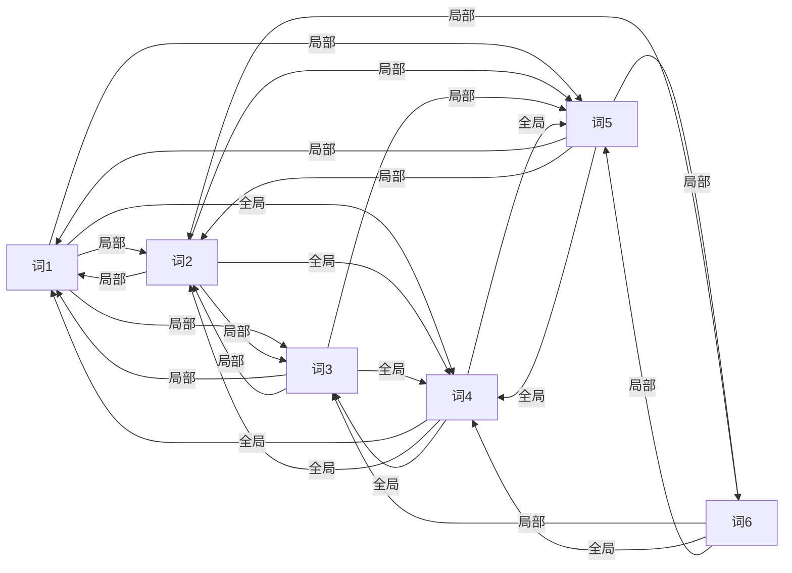

# 大规模语言模型从理论到实践 模型上下文窗口扩展

## 1. 背景介绍

近年来,随着深度学习技术的快速发展,大规模语言模型(Large Language Models,LLMs)取得了突破性进展。LLMs 通过在海量文本数据上进行预训练,能够学习到丰富的语言知识和常识,在自然语言处理(NLP)领域展现出强大的性能。然而,LLMs 在实际应用中仍然面临一些挑战,其中一个关键问题就是模型的上下文窗口(Context Window)大小有限。

上下文窗口指的是模型在生成或预测下一个词时,能够参考的历史信息的长度。传统的 LLMs 如 GPT-2、BERT 等,其上下文窗口通常在数百到一千多个 token 的量级。这对于一些需要更长依赖的任务,如长文本生成、多轮对话等,还存在局限性。因此,如何扩展 LLMs 的上下文窗口,成为了一个亟待解决的研究课题。

本文将深入探讨大规模语言模型中上下文窗口扩展的理论基础和实践方法。我们首先介绍 LLMs 的核心概念,分析上下文窗口受限的原因。然后重点阐述几种有前景的窗口扩展技术,包括稀疏注意力机制、记忆增强等。接着通过数学推导和代码实例,详细讲解这些方法的原理和实现。最后,我们总结上下文窗口扩展的研究现状与未来挑战,并提供相关资源供读者进一步学习。

## 2. 核心概念与联系

### 2.1 大规模语言模型(LLMs) 

大规模语言模型是指参数量巨大(通常在数亿到上千亿量级)、在大规模文本语料上预训练得到的深度学习模型。代表性的 LLMs 包括 GPT 系列、BERT、XLNet、T5 等。它们基于 Transformer 架构,采用自注意力(Self-attention)机制来建模文本序列内和序列间的依赖关系。

LLMs 的预训练通常采用自监督学习范式,即利用无标注的海量文本数据,构建预测型的训练任务,让模型自主学习语言的统计规律和隐含知识。常见的预训练任务有:
- 语言模型:给定前面的词,预测下一个最可能的词。代表模型如 GPT 系列。 
- 掩码语言模型:随机遮掩一些词,预测被遮掩的词。代表模型如 BERT。
- 排列语言模型:随机打乱句子的顺序,预测正确的顺序。代表模型如 XLNet。

经过预训练的 LLMs 蕴含了丰富的语言知识,可以通过微调(fine-tuning)的方式应用到下游的 NLP 任务中,在文本分类、阅读理解、机器翻译等众多任务上取得了 SOTA 的表现。

### 2.2 上下文窗口(Context Window)

上下文窗口是指语言模型在生成或预测当前词时,能够"看到"的历史信息的长度。形式化地,假设语言模型要计算第 t 个词的概率分布 $p(x_t|x_1,\ldots,x_{t-1})$,其中 $x_1,\ldots,x_{t-1}$ 就构成了上下文窗口。窗口的大小决定了模型能够建模的最长依赖的长度。

传统的 LLMs 受限于 Transformer 的计算复杂度(正比于序列长度的平方),其上下文窗口难以突破 1000 个 token。以 GPT-2 为例,其窗口大小为 1024。这意味着在生成较长文本时,模型只能参考前 1024 个词的信息,对于更早的历史则无法建模。

上下文窗口受限制约了 LLMs 对长距离依赖的学习,在一些需要全局理解的任务上表现欠佳,如:
- 长文本生成:难以保持主题一致性和逻辑连贯性
- 多轮对话:难以记住之前的对话历史
- 长文档分类:难以捕捉全局的语义信息
- 长篇章阅读理解:难以回答跨越多个段落的问题

因此,扩展 LLMs 的上下文窗口,让其能够建模更长距离的依赖,是非常有必要和紧迫的。这不仅能提升模型在长文本任务上的性能,也有利于其学习到更加全面和深刻的语言知识。

### 2.3 Transformer 架构 

Transformer 是当前大规模语言模型的主流架构,其核心是自注意力机制。在 Transformer 中,每个词的表示都通过注意力加权其他所有词的表示来更新。

形式化地,假设输入序列的词嵌入为 $X\in\mathbb{R}^{n\times d}$,其中 $n$ 为序列长度,$d$ 为嵌入维度。Transformer 首先将 $X$ 线性变换为 query 矩阵 $Q$、key 矩阵 $K$ 和 value 矩阵 $V$:

$$
\begin{aligned}
Q &= XW_Q \\
K &= XW_K \\ 
V &= XW_V
\end{aligned}
$$

其中 $W_Q,W_K,W_V \in \mathbb{R}^{d\times d_k}$ 为可学习的权重矩阵。

然后通过 query 和 key 的点积计算注意力分布:

$$A = \text{softmax}(\frac{QK^T}{\sqrt{d_k}}) \in \mathbb{R}^{n\times n}$$

其中 $A_{ij}$ 表示第 i 个词对第 j 个词的注意力权重。除以 $\sqrt{d_k}$ 是为了缓解点积结果过大的问题。

最后将注意力分布与 value 矩阵相乘,得到更新后的序列表示:

$$\text{Attention}(Q,K,V) = AV \in \mathbb{R}^{n\times d_k}$$

多头注意力(Multi-head Attention)进一步增强了模型的表达能力,即并行计算多个注意力,然后拼接:

$$
\begin{aligned}
\text{head}_i &= \text{Attention}(XW_Q^i, XW_K^i, XW_V^i) \\
\text{MultiHead}(X) &= \text{Concat}(\text{head}_1,\ldots,\text{head}_h)W_O
\end{aligned}
$$

其中 $W_Q^i,W_K^i,W_V^i \in \mathbb{R}^{d\times d_k}, W_O \in \mathbb{R}^{hd_k\times d}$ 为可学习的权重矩阵,$h$ 为注意力头数。

自注意力的计算复杂度与序列长度 $n$ 的平方成正比,即 $O(n^2d)$。当序列长度较大时,计算和内存开销会急剧增加,导致 Transformer 难以处理长序列。这也是传统 LLMs 上下文窗口受限的根本原因。

## 3. 核心算法原理与具体操作步骤

针对 Transformer 在长序列上的局限性,研究者提出了多种扩展上下文窗口的算法。本节重点介绍其中两类有前景的方法:基于稀疏注意力的算法和基于记忆增强的算法。

### 3.1 基于稀疏注意力的算法

稀疏注意力的核心思想是,每个词只专注于少数几个重要的词,而不是等价地注意所有词。这样可以大幅降低注意力计算的复杂度,从而支持更长的上下文。

#### 3.1.1 Longformer

Longformer (Beltagy et al., 2020) 引入了局部窗口注意力和全局注意力的组合,如下图所示:



具体来说,Longformer 中每个词的注意力计算分为两部分:
1. 局部注意力:每个词只关注其前后窗口内的词,窗口大小为超参数 $w$。这部分注意力的计算复杂度为 $O(nwd)$。
2. 全局注意力:预先指定少数几个重要的词(如 [CLS] 标记、段落首词等),让序列中每个词都关注这些全局词。设全局词的数量为 $g$,则这部分注意力的计算复杂度为 $O(ngd)$。

综合起来,Longformer 的总体计算复杂度为 $O(n(w+g)d)$,远低于传统 Transformer 的 $O(n^2d)$。在序列长度 $n$ 很大时,通过调节 $w$ 和 $g$ 可以控制计算开销,实现更长的上下文窗口。

Longformer 的核心代码如下(以 PyTorch 为例):

```python
class Longformer(nn.Module):
    def __init__(self, hidden_size, num_heads, window_size, global_indices):
        super().__init__()
        self.hidden_size = hidden_size
        self.num_heads = num_heads
        self.head_dim = hidden_size // num_heads
        self.window_size = window_size
        self.global_indices = global_indices
        
        self.query = nn.Linear(hidden_size, hidden_size)
        self.key = nn.Linear(hidden_size, hidden_size)
        self.value = nn.Linear(hidden_size, hidden_size)
        
    def forward(self, hidden_states, attention_mask):
        batch_size, seq_len, _ = hidden_states.size()
        
        query = self.query(hidden_states).view(batch_size, seq_len, self.num_heads, self.head_dim).transpose(1, 2)
        key = self.key(hidden_states).view(batch_size, seq_len, self.num_heads, self.head_dim).transpose(1, 2)
        value = self.value(hidden_states).view(batch_size, seq_len, self.num_heads, self.head_dim).transpose(1, 2)
        
        # 局部注意力
        local_attention_scores = self._sliding_chunks_query_key_matmul(
            query, key, self.window_size
        )
        local_attention_probs = nn.functional.softmax(local_attention_scores, dim=-1)
        local_attention_probs = local_attention_probs * attention_mask.unsqueeze(1).unsqueeze(2)
        local_attention_output = torch.matmul(local_attention_probs, value)
        
        # 全局注意力
        global_attention_scores = torch.einsum("bhqd,bhkd->bhqk", query[:, :, self.global_indices], key)
        global_attention_probs = nn.functional.softmax(global_attention_scores, dim=-1)
        global_attention_output = torch.einsum("bhqk,bhkd->bhqd", global_attention_probs, value[:, :, self.global_indices])
        
        # 合并局部和全局注意力
        attention_output = local_attention_output.transpose(1, 2).reshape(batch_size, seq_len, self.hidden_size)
        attention_output[:, self.global_indices] = global_attention_output.transpose(1, 2).reshape(batch_size, -1, self.hidden_size)
        
        return attention_output
        
    def _sliding_chunks_query_key_matmul(self, query, key, window_size):
        batch_size, num_heads, seq_len, head_dim = query.size()
        
        query = query.transpose(2, 3)  # [batch_size, num_heads, head_dim, seq_len]
        key = key.transpose(2, 3)  # [batch_size, num_heads, head_dim, seq_len]
        
        # 将序列按窗口大小分块
        chunks_count = seq_len // window_size
        query = query.reshape(batch_size, num_heads, head_dim, chunks_count, window_size)
        key = key.reshape(batch_size, num_heads, head_dim, chunks_count, window_size)
        
        # 滑动窗口矩阵乘法
        diagonal_attention_scores = torch.einsum("bhqrc,bhkrc->bhqk", query, key)  # [batch_size, num_heads, chunks_count, window_size, window_size]
        diagonal_attention_scores = diagonal_attention_scores.reshape(batch_size, num_heads, seq_len, window_size)
        
        # 计算上三角和下三角注意力
        attention_scores = self._pad_and_transpose_last_two