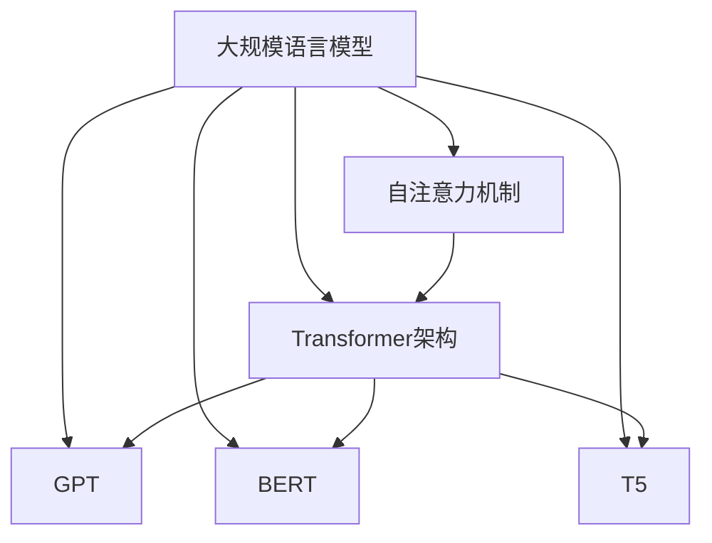

# 大规模语言模型从理论到实践 知识与能力

## 1.背景介绍

### 1.1 什么是大规模语言模型?

大规模语言模型(Large Language Model, LLM)是一种利用深度学习技术训练出的巨大神经网络模型,能够理解和生成人类语言。这些模型通过在大量文本数据上进行训练,学习语言的模式和语义关系,从而获得广博的知识和强大的语言生成能力。

LLM的出现是基于以下几个关键因素:

1. **大规模计算能力**:训练大规模神经网络需要巨大的计算资源,近年来GPU和TPU等硬件的飞速发展为此提供了基础。
2. **海量训练数据**:互联网时代使得可用于训练的文本数据呈爆炸式增长,为模型提供了丰富的语料。
3. **新型神经网络架构**:Transformer等全新架构的提出,大幅提升了序列数据的建模能力。
4. **算法优化与模型压缩**:各种优化算法和模型压缩技术的出现,使得大规模模型的训练和部署变得可行。

### 1.2 大规模语言模型的重要性

大规模语言模型在自然语言处理领域引起了革命性的变化,其重要性主要体现在以下几个方面:

1. **通用知识表示**:LLM能够从海量文本中学习到广博的知识,成为知识的通用表示形式。
2. **多任务泛化能力**:同一个LLM可以通过指令微调等方式,快速适配多种不同的NLP任务。
3. **语言理解和生成**:LLM展现出了接近人类的语言理解和生成能力,推动了人机交互的发展。
4. **下游应用支撑**:LLM为诸多NLP应用领域提供了强有力的支撑,如对话系统、文本摘要、机器翻译等。

## 2.核心概念与联系

### 2.1 自然语言处理(NLP)基础

自然语言处理是人工智能的一个重要分支,旨在使计算机能够理解和生成人类语言。NLP涉及多个核心概念:

1. **语言建模(Language Modeling)**:学习语言的统计规律,用概率模型描述语言。
2. **词向量(Word Embedding)**:将词映射到连续的向量空间,捕捉词与词之间的语义关系。
3. **序列建模(Sequence Modeling)**:处理序列数据(如文本)的模型,如RNN、LSTM等。
4. **注意力机制(Attention Mechanism)**:动态关注序列中不同位置的信息,提高模型性能。

大规模语言模型是基于这些基础概念发展而来,但在模型规模、训练数据和建模能力上都有了质的飞跃。

### 2.2 大规模语言模型核心架构

目前主流的大规模语言模型架构主要有:

1. **Transformer**:使用自注意力机制的全新序列建模架构,是大规模语言模型的基石。
2. **GPT**:生成式预训练Transformer(Generative Pre-trained Transformer),代表作GPT-3。 
3. **BERT**:双向编码表示从Transformer(Bidirectional Encoder Representations from Transformers)。
4. **T5**:Text-to-Text Transfer Transformer,将所有NLP任务统一为序列到序列的形式。

这些架构在编码器-解码器结构、注意力机制、位置编码等方面有所创新,显著提高了语言建模能力。

## 3.核心算法原理具体操作步骤  

### 3.1 Transformer及自注意力机制

Transformer是大规模语言模型的核心架构,其自注意力机制是关键。自注意力的计算过程如下:

1. 线性投影:将输入序列X分别投影到查询(Query)、键(Key)和值(Value)的向量空间。

$$Q=XW_Q,K=XW_K,V=XW_V$$

2. 注意力得分计算:通过查询和键的点积得到注意力分数矩阵。

$$\text{Attention}(Q,K,V)=\text{softmax}(\frac{QK^T}{\sqrt{d_k}})V$$

3. 加权求和:对值向量加权求和,得到注意力表示。

4. 多头注意力:将注意力机制并行运行多次,融合不同注意力表示。

Transformer的编码器-解码器结构通过层层堆叠自注意力和前馈网络,形成了强大的序列建模能力。

### 3.2 GPT模型

GPT(Generative Pre-trained Transformer)是一种生成式预训练的Transformer语言模型。其预训练过程包括:

1. **语料构建**:收集大量高质量文本语料,如网页、书籍等。
2. **词元化**:将文本切分为词元(token)序列。
3. **掩码语言模型**:随机掩码部分词元,模型需预测被掩码的词元。
4. **下一句预测**:判断两个句子是否为连续句子。

通过上述无监督训练,GPT学习到了语言的知识。GPT-3等大规模GPT模型展现出了惊人的语言生成能力。

### 3.3 BERT模型

BERT(Bidirectional Encoder Representations from Transformers)是一种双向编码的Transformer语言模型。其预训练过程包括:

1. **掩码语言模型**:与GPT类似,需预测被掩码的词元。
2. **下一句预测**:判断两个句子是否为连续句子。

与GPT不同的是,BERT通过特殊的位置编码,实现了双向编码,即同时利用上下文的信息。这使得BERT在语义理解任务上表现优异。

BERT的预训练过程中还引入了两个关键技术:

1. **全词掩码(Whole Word Masking)**:以词为单位掩码,而非单个词元。
2. **下三角矩阵注意力(Triangular Matrix Attention)**:确保注意力只能关注当前及之前的位置。

### 3.4 T5模型

T5(Text-to-Text Transfer Transformer)将所有NLP任务统一转化为序列到序列的形式,使用编码器-解码器的Transformer架构进行建模。

在T5的预训练过程中,各种NLP任务的输入都被转化为"输入:任务描述 输入数据"的形式,模型需生成"输出:任务结果"的序列。这种统一的文本到文本的形式,使T5能够在预训练时学习到各种NLP任务的知识。

T5在BERT的掩码语言模型基础上,引入了另一种无监督训练任务——跨跨度语言模型(Span Corruption),即随机采样并替换输入序列中的跨度片段。这种方式能够更好地学习句子级别的语义关系。

## 4.数学模型和公式详细讲解举例说明

### 4.1 Transformer模型数学原理

Transformer模型的核心是自注意力机制,我们用数学语言对其进行详细说明。

给定一个长度为n的输入序列$\boldsymbol{x}=\left(x_{1}, x_{2}, \ldots, x_{n}\right)$,我们首先通过三个线性投影将其映射到查询(Query)、键(Key)和值(Value)空间:

$$
\begin{aligned}
\boldsymbol{q}_{i} &=\boldsymbol{x}_{i} \boldsymbol{W}^{Q} \\
\boldsymbol{k}_{i} &=\boldsymbol{x}_{i} \boldsymbol{W}^{K} \\
\boldsymbol{v}_{i} &=\boldsymbol{x}_{i} \boldsymbol{W}^{V}
\end{aligned}
$$

其中$\boldsymbol{W}^{Q} \in \mathbb{R}^{d \times d_{q}}, \boldsymbol{W}^{K} \in \mathbb{R}^{d \times d_{k}}, \boldsymbol{W}^{V} \in \mathbb{R}^{d \times d_{v}}$分别是查询、键和值的线性变换矩阵。

然后,我们计算查询和所有键之间的点积,得到注意力分数:

$$
e_{i j}=\frac{\boldsymbol{q}_{i}^{\top} \boldsymbol{k}_{j}}{\sqrt{d_{k}}}
$$

其中$\sqrt{d_{k}}$是一个缩放因子,用于防止点积值过大导致梯度消失或爆炸。

接着,我们通过softmax函数将注意力分数归一化为概率分布:

$$
\alpha_{i j}=\operatorname{softmax}\left(e_{i j}\right)=\frac{\exp \left(e_{i j}\right)}{\sum_{l=1}^{n} \exp \left(e_{i l}\right)}
$$

最后,我们对值向量加权求和,得到注意力表示:

$$
\operatorname{Attention}(\boldsymbol{q}, \boldsymbol{K}, \boldsymbol{V})=\sum_{j=1}^{n} \alpha_{i j} \boldsymbol{v}_{j}
$$

在实际应用中,我们通常会使用多头注意力机制,将注意力机制并行运行多次,然后将不同注意力表示拼接起来,从而捕捉更丰富的依赖关系。

### 4.2 GPT语言模型数学表示

GPT模型是一种基于Transformer的自回归(Autoregressive)语言模型,旨在最大化下一个词元的条件概率。给定一个长度为n的序列$\boldsymbol{x}=\left(x_{1}, x_{2}, \ldots, x_{n}\right)$,GPT模型的目标是最大化该序列的概率:

$$
P(\boldsymbol{x})=\prod_{t=1}^{n} P\left(x_{t} | x_{1}, \ldots, x_{t-1}\right)
$$

其中,每一项$P\left(x_{t} | x_{1}, \ldots, x_{t-1}\right)$表示基于前面的词元预测当前词元的条件概率。

在GPT模型中,这个条件概率由Transformer解码器计算得到:

$$
P\left(x_{t} | x_{1}, \ldots, x_{t-1}\right)=\operatorname{Decoder}\left(\left[x_{1}, \ldots, x_{t-1}\right]\right)
$$

解码器的输入是前缀序列$\left[x_{1}, \ldots, x_{t-1}\right]$,输出是一个概率分布,表示当前词元的预测概率。

在训练过程中,GPT模型的目标是最小化该序列的负对数似然损失:

$$
\mathcal{L}=-\sum_{t=1}^{n} \log P\left(x_{t} | x_{1}, \ldots, x_{t-1}\right)
$$

通过梯度下降等优化算法,我们可以不断调整模型参数,使得损失函数最小化,从而获得一个能够很好地预测下一个词元的语言模型。

### 4.3 BERT模型掩码语言模型任务

BERT模型的掩码语言模型(Masked Language Model, MLM)任务是其预训练的核心部分之一。该任务的目标是基于上下文预测被掩码的词元。

给定一个长度为n的序列$\boldsymbol{x}=\left(x_{1}, x_{2}, \ldots, x_{n}\right)$,我们随机选择其中的一些位置进行掩码,得到掩码后的序列$\boldsymbol{x}^{\prime}=\left(x_{1}^{\prime}, x_{2}^{\prime}, \ldots, x_{n}^{\prime}\right)$,其中$x_{i}^{\prime}$可能是原始词元、被掩码的特殊标记[MASK]或随机替换的词元。

BERT模型的目标是最大化掩码位置的词元概率:

$$
\max _{\theta} \sum_{i: x_{i}^{\prime}=\operatorname{MASK}} \log P\left(x_{i} | \boldsymbol{x}^{\prime} ; \theta\right)
$$

其中$\theta$是BERT模型的参数,目标是通过最大化该对数似然来学习模型参数。

在BERT中,该条件概率由编码器Transformer计算得到:

$$
P\left(x_{i} | \boldsymbol{x}^{\prime} ; \theta\right)=\operatorname{Encoder}\left(\boldsymbol{x}^{\prime}\right)_{i}
$$

编码器的输入是掩码后的序列$\boldsymbol{x}^{\prime}$,输出是一个概率分布,表示每个位置被掩码词元的预测概率。

通过最小化该损失函数,BERT模型可以学习到利用双向上下文信息预测被掩码词