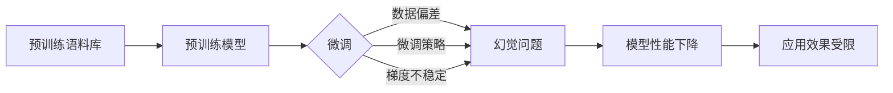

# 大语言模型原理与工程实践：大语言模型微调的幻觉问题

## 1. 背景介绍
### 1.1 大语言模型的发展历程
#### 1.1.1 早期的语言模型
#### 1.1.2 Transformer模型的出现
#### 1.1.3 预训练语言模型的崛起

### 1.2 大语言模型的应用现状
#### 1.2.1 自然语言处理任务的广泛应用
#### 1.2.2 对话系统和问答系统的突破
#### 1.2.3 知识图谱构建和推理

### 1.3 大语言模型面临的挑战
#### 1.3.1 计算资源和训练数据的限制
#### 1.3.2 模型泛化能力和鲁棒性不足
#### 1.3.3 幻觉问题的出现

## 2. 核心概念与联系
### 2.1 大语言模型的定义和特点
#### 2.1.1 语言模型的基本概念
#### 2.1.2 大语言模型的规模和性能
#### 2.1.3 预训练和微调的过程

### 2.2 幻觉问题的定义和表现
#### 2.2.1 幻觉问题的概念界定
#### 2.2.2 幻觉问题的具体表现形式
#### 2.2.3 幻觉问题对模型性能的影响

### 2.3 微调过程与幻觉问题的关系
#### 2.3.1 微调过程中的数据偏差
#### 2.3.2 微调策略的选择对幻觉的影响
#### 2.3.3 微调过程中的梯度不稳定性

## 3. 核心算法原理具体操作步骤
### 3.1 大语言模型的预训练算法
#### 3.1.1 基于Transformer的预训练模型结构
#### 3.1.2 Masked Language Modeling(MLM)
#### 3.1.3 Next Sentence Prediction(NSP)

### 3.2 大语言模型的微调算法
#### 3.2.1 Fine-tuning的基本流程
#### 3.2.2 不同任务的微调策略
#### 3.2.3 Few-shot Learning的微调方法

### 3.3 应对幻觉问题的算法改进
#### 3.3.1 数据增强和数据清洗技术
#### 3.3.2 正则化和对抗训练方法
#### 3.3.3 基于知识蒸馏的模型压缩方法

## 4. 数学模型和公式详细讲解举例说明
### 4.1 Transformer模型的数学原理
#### 4.1.1 Self-Attention机制的数学推导
$Attention(Q,K,V) = softmax(\frac{QK^T}{\sqrt{d_k}})V$
#### 4.1.2 Multi-Head Attention的并行计算
$$MultiHead(Q,K,V) = Concat(head_1, ..., head_h)W^O$$
$$head_i = Attention(QW_i^Q, KW_i^K, VW_i^V)$$
#### 4.1.3 Position-wise Feed-Forward Networks

### 4.2 语言模型的概率建模
#### 4.2.1 N-gram语言模型
$P(w_1, w_2, ..., w_n) = \prod_{i=1}^n P(w_i | w_1, ..., w_{i-1}) \approx \prod_{i=1}^n P(w_i | w_{i-(n-1)}, ..., w_{i-1})$
#### 4.2.2 神经网络语言模型
$P(w_1, w_2, ..., w_n) = \prod_{i=1}^n P(w_i | w_1, ..., w_{i-1}) = \prod_{i=1}^n \frac{exp(score(w_i))}{\sum_{j=1}^V exp(score(w_j))}$
#### 4.2.3 Transformer语言模型

### 4.3 微调过程的损失函数设计
#### 4.3.1 交叉熵损失函数
$L = -\frac{1}{N}\sum_{i=1}^N \sum_{j=1}^M y_{ij} log(p_{ij})$
#### 4.3.2 平方损失函数
$L = \frac{1}{N}\sum_{i=1}^N \sum_{j=1}^M (y_{ij} - p_{ij})^2$
#### 4.3.3 知识蒸馏的损失函数
$L_{KD} = \alpha L_{CE}(y, p) + (1-\alpha) L_{CE}(p_t, p)$

## 5. 项目实践：代码实例和详细解释说明
### 5.1 使用Hugging Face的Transformers库进行预训练
```python
from transformers import BertForMaskedLM, BertTokenizer

model = BertForMaskedLM.from_pretrained('bert-base-uncased')
tokenizer = BertTokenizer.from_pretrained('bert-base-uncased')

input_text = "The quick brown [MASK] jumps over the lazy dog."
input_ids = tokenizer.encode(input_text, return_tensors='pt')

outputs = model(input_ids)
predictions = outputs[0]
```

### 5.2 使用PyTorch进行微调
```python
from transformers import BertForSequenceClassification, AdamW

model = BertForSequenceClassification.from_pretrained('bert-base-uncased', num_labels=2)

optimizer = AdamW(model.parameters(), lr=2e-5)

for epoch in range(num_epochs):
    for batch in train_dataloader:
        optimizer.zero_grad()
        
        inputs = {
            'input_ids': batch['input_ids'],
            'attention_mask': batch['attention_mask'],
            'labels': batch['labels']
        }
        
        outputs = model(**inputs)
        loss = outputs.loss
        loss.backward()
        optimizer.step()
```

### 5.3 应用知识蒸馏进行模型压缩
```python
from transformers import BertForSequenceClassification, DistilBertForSequenceClassification

teacher_model = BertForSequenceClassification.from_pretrained('bert-base-uncased', num_labels=2)
student_model = DistilBertForSequenceClassification.from_pretrained('distilbert-base-uncased', num_labels=2)

def distillation_loss(outputs, labels, teacher_outputs, alpha):
    student_loss = nn.CrossEntropyLoss()(outputs.logits, labels)
    distillation_loss = nn.KLDivLoss()(F.log_softmax(outputs.logits / temperature, dim=1),
                                       F.softmax(teacher_outputs.logits / temperature, dim=1))
    loss = alpha * student_loss + (1 - alpha) * distillation_loss
    return loss

for epoch in range(num_epochs):
    for batch in train_dataloader:
        inputs = {
            'input_ids': batch['input_ids'],
            'attention_mask': batch['attention_mask'],
            'labels': batch['labels']
        }
        
        with torch.no_grad():
            teacher_outputs = teacher_model(**inputs)
        
        student_outputs = student_model(**inputs)
        loss = distillation_loss(student_outputs, inputs['labels'], teacher_outputs, alpha=0.5)
        
        loss.backward()
        optimizer.step()
        optimizer.zero_grad()
```

## 6. 实际应用场景
### 6.1 智能客服系统
#### 6.1.1 客户意图识别和问题分类
#### 6.1.2 基于知识库的问题回答生成
#### 6.1.3 多轮对话状态跟踪

### 6.2 个性化推荐系统
#### 6.2.1 用户画像构建
#### 6.2.2 基于文本的商品属性提取
#### 6.2.3 跨领域推荐

### 6.3 智能写作助手
#### 6.3.1 文本自动补全和生成
#### 6.3.2 语法和拼写纠错
#### 6.3.3 文章质量评估和优化建议

## 7. 工具和资源推荐
### 7.1 开源工具包
#### 7.1.1 Hugging Face的Transformers库
#### 7.1.2 Google的BERT和T5模型
#### 7.1.3 Facebook的RoBERTa和XLM模型

### 7.2 预训练模型资源
#### 7.2.1 BERT家族模型
#### 7.2.2 GPT系列模型
#### 7.2.3 XLNet和ELECTRA模型

### 7.3 数据集资源
#### 7.3.1 GLUE和SuperGLUE基准测试集
#### 7.3.2 SQuAD和CoQA问答数据集
#### 7.3.3 CommonCrawl和Wikipedia语料库

## 8. 总结：未来发展趋势与挑战
### 8.1 大语言模型的发展趋势
#### 8.1.1 模型规模的持续增长
#### 8.1.2 多模态语言模型的兴起
#### 8.1.3 语言模型的通用化和普适性

### 8.2 幻觉问题的应对策略
#### 8.2.1 数据质量和多样性的提升
#### 8.2.2 模型架构和训练方法的创新
#### 8.2.3 引入外部知识和推理能力

### 8.3 未来研究方向和挑战
#### 8.3.1 可解释性和可控性
#### 8.3.2 公平性和隐私保护
#### 8.3.3 模型的高效部署和实时推理

## 9. 附录：常见问题与解答
### 9.1 大语言模型和传统语言模型有何区别？
### 9.2 微调过程中需要注意哪些问题？
### 9.3 如何评估大语言模型的性能表现？
### 9.4 幻觉问题有哪些常见的表现形式？
### 9.5 如何在实际应用中避免或减轻幻觉问题的影响？



大语言模型的发展历程可以追溯到早期的N-gram语言模型和神经网络语言模型。随着Transformer模型的出现和预训练技术的发展，大语言模型在自然语言处理领域取得了显著的进步。预训练模型如BERT、GPT等在各种下游任务上表现出色，极大地推动了自然语言理解和生成的发展。

然而，大语言模型在带来巨大性能提升的同时，也面临着一些挑战和问题。其中，幻觉问题是微调过程中常见的一个问题。幻觉问题是指模型生成的文本与事实不符或者出现逻辑错误、自相矛盾的现象。这种问题的产生与微调过程中的数据偏差、微调策略选择以及梯度不稳定性等因素有关。

为了应对幻觉问题，研究者提出了多种改进方法。数据增强和数据清洗技术可以提高训练数据的质量和多样性，减少数据偏差的影响。正则化和对抗训练方法可以提高模型的鲁棒性和泛化能力。知识蒸馏等模型压缩技术可以在保持性能的同时降低模型复杂度，减轻过拟合风险。

大语言模型在智能客服、个性化推荐、智能写作助手等领域有广泛的应用前景。然而，在实际应用中，我们需要权衡模型性能和效率，并采取适当的策略来避免或减轻幻觉问题的影响。

未来，大语言模型的发展趋势包括模型规模的持续增长、多模态语言模型的兴起以及语言模型的通用化和普适性。同时，可解释性、可控性、公平性和隐私保护等问题也将成为研究的重点。

总之，大语言模型为自然语言处理领域带来了巨大的变革，但同时也面临着幻觉问题等挑战。通过深入理解大语言模型的原理，采取有效的优化策略，我们可以更好地发挥大语言模型的潜力，推动自然语言理解和生成技术的进一步发展。

作者：禅与计算机程序设计艺术 / Zen and the Art of Computer Programming