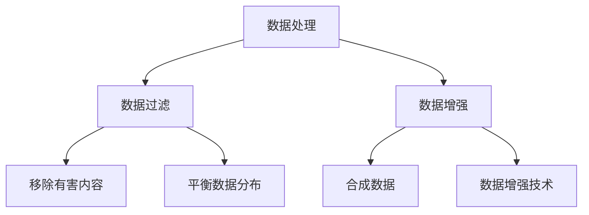
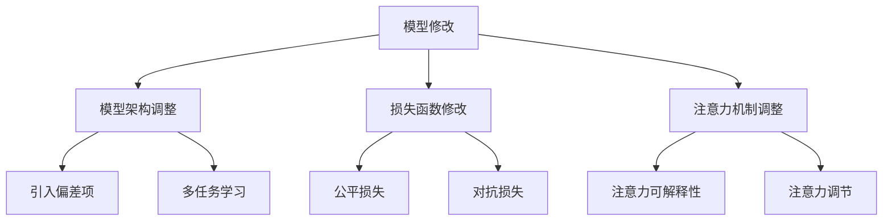
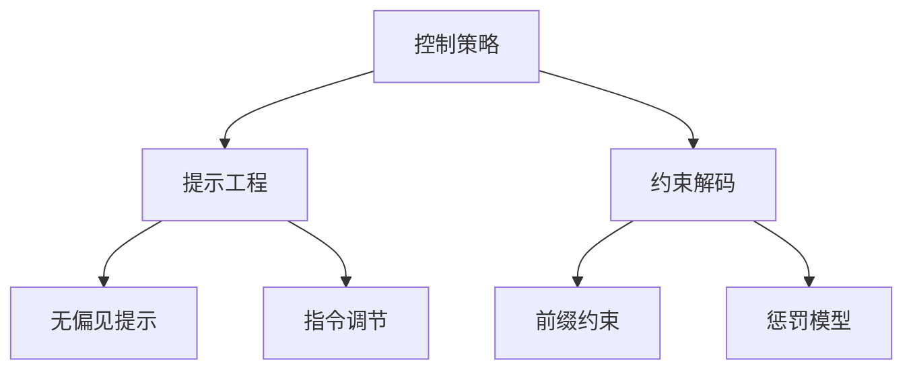
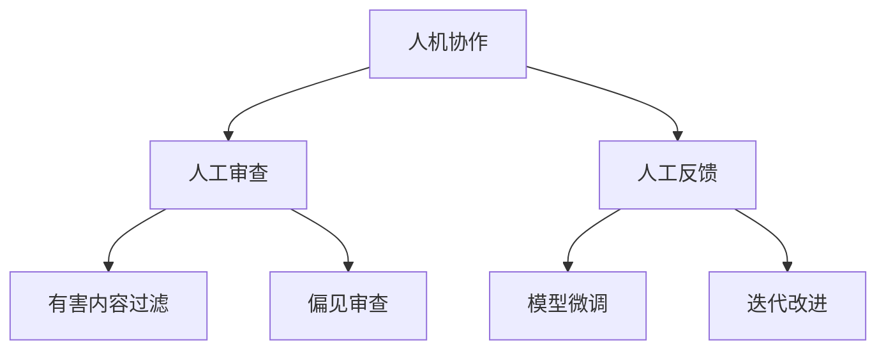

# 大语言模型原理基础与前沿 减少偏见和有害性

## 1.背景介绍

### 1.1 大语言模型的兴起

近年来,大型语言模型(Large Language Models, LLMs)在自然语言处理领域取得了令人瞩目的成就。这些模型通过在大规模语料库上进行预训练,学习了丰富的语言知识和上下文信息,从而能够生成高质量、连贯的文本输出。

GPT(Generative Pre-trained Transformer)、BERT(Bidirectional Encoder Representations from Transformers)、XLNet、T5等模型的出现,标志着大语言模型时代的到来,为各种自然语言处理任务带来了突破性的性能提升。

### 1.2 偏见和有害性问题

然而,随着大语言模型在各领域的广泛应用,一个日益引起关注的问题是:这些模型在训练数据和算法中潜在的偏见和有害性。由于训练语料库中存在的社会偏见、有害内容和不当表达,大语言模型可能会学习并放大这些有问题的模式,从而在生成的文本中体现出种族歧视、性别偏见、仇恨言论等不当内容。

这不仅会影响模型的公平性和包容性,也可能对社会产生负面影响,加剧已有的偏见和不当观念。因此,探索减少大语言模型偏见和有害性的方法,已经成为当前研究的一个重要课题。

## 2.核心概念与联系

### 2.1 偏见的类型

在讨论大语言模型的偏见和有害性问题之前,我们需要了解偏见的不同类型。常见的偏见类型包括但不限于:

1. **社会偏见**:源于社会中根深蒂固的观念和刻板印象,如种族主义、性别歧视等。
2. **内容偏见**:训练数据中存在的不当内容,如仇恨言论、暴力内容等。
3. **表达偏见**:使用了带有贬低、侮辱或不当的语言表达。
4. **代表性偏见**:训练数据中缺乏对某些群体的充分代表性。

这些偏见可能会交织在一起,导致模型产生复杂的有害输出。

### 2.2 偏见与有害性的关系

偏见和有害性是密切相关的概念。偏见往往会导致有害的输出,而有害的输出也可能源于潜在的偏见。然而,它们并不是完全等同的。

有些情况下,模型可能会生成没有明显偏见但仍然有害的内容,如暴力描述或低俗语言。另一方面,模型也可能表现出某种偏见,但并不一定产生有害的输出。

因此,在解决大语言模型的偏见和有害性问题时,需要同时考虑这两个方面,并采取相应的缓解策略。

## 3.核心算法原理具体操作步骤

减少大语言模型偏见和有害性的核心算法原理和具体操作步骤主要包括以下几个方面:

### 3.1 数据处理

1. **数据过滤**:通过自动或人工的方式,从训练数据中识别和移除包含有害内容或明显偏见的样本。
   - 移除有害内容:使用关键词匹配、语义分析等方法检测和删除包含仇恨言论、暴力内容等有害内容的样本。
   - 平衡数据分布:分析训练数据中不同群体的代表性,通过过采样或欠采样等方法,平衡数据分布,减少代表性偏差。

2. **数据增强**:通过合成或增强现有数据,丰富训练数据的多样性,减少偏见和有害性。
   - 合成数据:使用生成对抗网络(GAN)等技术,合成新的、无偏见的训练样本。
   - 数据增强技术:如文本背景知识增强、样本插值等,生成新的无偏见样本。

### 3.2 模型修改

1. **模型架构调整**:修改模型的基本架构,以减少偏见和有害性。
   - 引入偏差项:在模型中引入专门的偏差项,用于捕获和减少偏见。
   - 多任务学习:将偏见检测或有害性检测作为辅助任务,共同训练模型。

2. **损失函数修改**:设计新的损失函数,鼓励模型学习无偏见的表示。
   - 公平损失:设计公平损失函数,惩罚模型对不同群体的偏差表现。
   - 对抗损失:引入对抗训练,使模型的表示对于敏感属性是不变的。

3. **注意力机制调整**:调整模型的注意力机制,提高其对偏见和有害性的鲁棒性。
   - 注意力可解释性:通过可解释性技术分析注意力分布,发现潜在的偏见模式。
   - 注意力调节:调节注意力分布,减少对潜在偏见信号的关注。

### 3.3 控制策略

1. **提示工程**:通过设计合适的提示,引导模型生成无偏见和无害的输出。
   - 无偏见提示:设计包含反偏见信息的提示,引导模型关注无偏见的方面。
   - 指令调节:使用指令调节模型的行为,避免生成有害内容。

2. **约束解码**:在模型解码过程中施加约束,过滤或惩罚有偏见和有害的输出。
   - 前缀约束:设置无偏见的前缀,约束模型的生成方向。
   - 惩罚模型:对于生成的有害内容,给予模型惩罚,使其学习避免此类输出。

### 3.4 人机协作

1. **人工审查**:利用人工审查的方式,识别和过滤模型生成的有害内容和偏见内容。
   - 有害内容过滤:人工审查模型输出,过滤掉包含仇恨言论、暴力内容等有害内容。
   - 偏见审查:人工审查模型输出,识别和标注存在的偏见类型。

2. **人工反馈**:基于人工审查的结果,对模型进行反馈和改进。
   - 模型微调:使用标注的无偏见数据,对模型进行进一步的微调训练。
   - 迭代改进:根据人工反馈,不断优化模型和控制策略,迭代改进模型的表现。

通过上述多种策略的综合应用,我们可以从数据、模型和控制三个层面,有效地减少大语言模型中的偏见和有害性问题。

## 4.数学模型和公式详细讲解举例说明

在减少大语言模型偏见和有害性的过程中,一些重要的数学模型和公式值得详细讲解和举例说明。

### 4.1 公平损失函数

公平损失函数旨在惩罚模型对不同群体的偏差表现,鼓励模型学习公平的表示。常见的公平损失函数包括:

1. **统计率差异损失(Statistical Parity Difference Loss)**:

$$
\mathcal{L}_{\text{SPD}} = \left|\mathbb{E}_{x \sim P(X|Y=0)}[f(x)] - \mathbb{E}_{x \sim P(X|Y=1)}[f(x)]\right|
$$

其中,$f(x)$表示模型对输入$x$的预测结果,$Y$是敏感属性(如性别或种族)。该损失函数惩罚了不同群体之间预测结果的统计差异。

2. **等机会损失(Equal Opportunity Loss)**:

$$
\mathcal{L}_{\text{EO}} = \left|\mathbb{E}_{x \sim P(X|Y=0,Z=1)}[f(x)] - \mathbb{E}_{x \sim P(X|Y=1,Z=1)}[f(x)]\right|
$$

其中,$Z$表示真实标签。该损失函数惩罚了在真实标签为正例时,不同群体之间预测结果的差异。

通过将公平损失函数与原始损失函数相结合,可以在优化模型性能的同时,也考虑了模型对不同群体的公平性。

### 4.2 对抗训练

对抗训练是一种常用的减少偏见的技术,其基本思想是:使模型的表示对于敏感属性(如性别或种族)是不变的,从而达到去偏见的目的。

对抗训练的目标函数可以表示为:

$$
\min_{\theta_f} \max_{\theta_d} \mathcal{L}_f(\theta_f, \theta_d) + \lambda \mathcal{L}_d(\theta_f, \theta_d)
$$

其中:

- $\theta_f$是模型的参数
- $\theta_d$是判别器的参数
- $\mathcal{L}_f$是模型的原始损失函数
- $\mathcal{L}_d$是对抗损失函数,旨在使模型的表示对敏感属性不变
- $\lambda$是平衡两个损失函数的系数

对抗损失函数$\mathcal{L}_d$可以采用多种形式,例如:

$$
\mathcal{L}_d(\theta_f, \theta_d) = \max_{\theta_d} \mathbb{E}_{x,y}[\log D_{\theta_d}(y|f_{\theta_f}(x))]
$$

其中,$D_{\theta_d}$是判别器,试图从模型的表示$f_{\theta_f}(x)$中预测敏感属性$y$。通过最小化这个损失函数,模型被迫学习对敏感属性不变的表示。

对抗训练可以有效地减少模型的偏见,但也存在一些挑战,如训练不稳定、计算代价高等。研究人员正在探索各种改进方法,以提高对抗训练的效率和鲁棒性。

### 4.3 注意力可解释性

注意力机制是大语言模型中的一个关键组件,它决定了模型如何分配注意力权重,关注输入序列中的不同部分。通过分析注意力分布,我们可以发现潜在的偏见模式,从而采取相应的调节策略。

一种常用的注意力可解释性方法是注意力权重可视化。给定一个输入序列$X = (x_1, x_2, \dots, x_n)$和注意力权重矩阵$A \in \mathbb{R}^{n \times n}$,我们可以将$A$可视化为一个热力图,直观地观察模型关注的区域。

例如,在机器翻译任务中,如果模型在处理包含种族相关词语的句子时,注意力权重集中在这些词语上,就可能暗示存在潜在的种族偏见。

除了可视化,还有一些量化指标可以用于评估注意力分布的偏差程度,如注意力权重分布的熵、注意力权重与敏感属性的相关性等。

通过注意力可解释性技术,我们可以发现模型中存在的偏见模式,为后续的调节策略提供依据。

## 5.项目实践:代码实例和详细解释说明

为了更好地理解减少大语言模型偏见和有害性的实践,我们将提供一个基于Python和Hugging Face Transformers库的代码示例。

### 5.1 数据准备

首先,我们需要准备训练数据和测试数据。这里我们使用一个包含新闻文本的数据集,其中包含了一些有偏见和有害