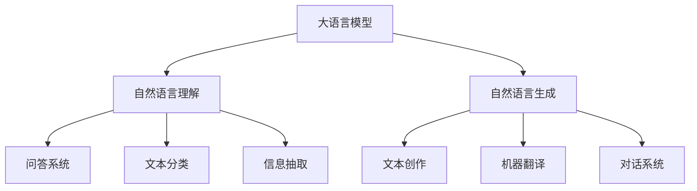
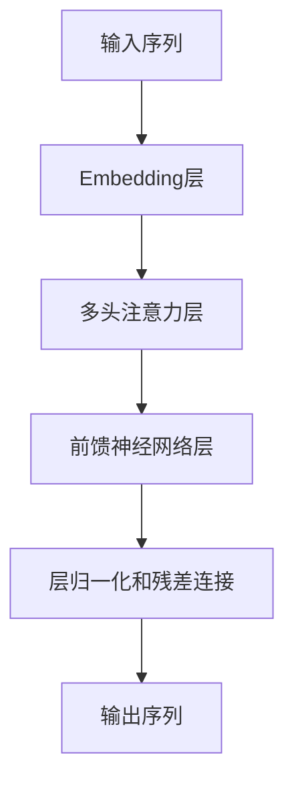
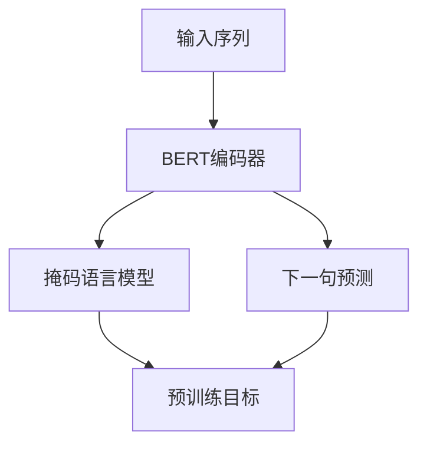

# 大语言模型原理基础与前沿 基于人类反馈进行微调

## 1.背景介绍

### 1.1 人工智能的发展历程

人工智能(Artificial Intelligence, AI)是当代科技发展的前沿领域,自20世纪50年代问世以来,已经经历了几个重要的发展阶段。早期的人工智能系统主要采用符号主义方法,基于规则和逻辑推理,但在处理复杂问题时往往效果有限。

### 1.2 深度学习的兴起

21世纪初,深度学习(Deep Learning)技术的出现,使得人工智能迎来了新的发展机遇。深度学习是机器学习的一种技术,它模仿人脑的神经网络结构,通过对大量数据的训练,自动学习特征模式,解决复杂的识别和预测问题。

### 1.3 大语言模型的重要性

随着数据量的激增和计算能力的提高,深度学习模型也变得越来越大。特别是在自然语言处理领域,大型的语言模型展现出了强大的能力,可以理解和生成人类语言,为各种应用场景提供支持。大语言模型成为人工智能发展的重要方向。

## 2.核心概念与联系

### 2.1 大语言模型的定义

大语言模型(Large Language Model, LLM)是一种基于深度学习的人工智能模型,专门用于处理自然语言数据。它通过对大量文本数据进行训练,学习语言的语法、语义和上下文信息,从而获得理解和生成语言的能力。



### 2.2 大语言模型的核心技术

大语言模型的核心技术包括:

1. **神经网络模型**: 采用深度神经网络结构,如Transformer、BERT等,对文本数据进行建模。
2. **自注意力机制**: 通过计算输入序列中每个元素与其他元素的关系,捕捉长距离依赖关系。
3. **预训练和微调**: 首先在大规模语料库上进行预训练,获得通用语言表示;然后在特定任务数据上进行微调,实现迁移学习。
4. **并行计算**: 利用GPU和TPU等硬件加速训练过程,支持大规模模型的高效训练。

## 3.核心算法原理具体操作步骤

### 3.1 Transformer模型

Transformer是大语言模型中广泛使用的一种神经网络模型,它完全基于注意力机制,不需要循环或卷积结构,可以高效地并行计算,适合处理长序列输入。

Transformer模型的核心组件包括:

1. **Embedding层**: 将输入的单词映射为向量表示。
2. **多头注意力层**: 计算输入序列中每个元素与其他元素的关系,捕捉长距离依赖关系。
3. **前馈神经网络层**: 对注意力输出进行非线性变换,提取高级特征。
4. **层归一化和残差连接**: 保持梯度稳定,防止梯度消失或爆炸。

Transformer模型的训练过程包括:

1. **预训练阶段**: 在大规模语料库上进行无监督学习,获得通用语言表示。常用预训练目标包括掩码语言模型(Masked Language Model)和下一句预测(Next Sentence Prediction)。
2. **微调阶段**: 在特定任务数据上进行有监督微调,通过梯度下降算法优化模型参数,实现迁移学习。



### 3.2 BERT模型

BERT(Bidirectional Encoder Representations from Transformers)是一种基于Transformer的预训练语言模型,它采用双向编码器结构,可以同时捕捉输入序列中每个单词的左右上下文信息。

BERT模型的预训练过程包括两个任务:

1. **掩码语言模型(Masked Language Model, MLM)**: 随机掩码输入序列中的部分单词,模型需要根据上下文预测被掩码的单词。
2. **下一句预测(Next Sentence Prediction, NSP)**: 判断两个句子是否相邻,以捕捉句子之间的关系。

BERT模型在预训练后,可以通过在特定任务数据上进行微调,实现迁移学习,应用于各种自然语言处理任务,如文本分类、问答系统、信息抽取等。



## 4.数学模型和公式详细讲解举例说明

### 4.1 注意力机制

注意力机制(Attention Mechanism)是大语言模型中的关键技术,它允许模型在处理序列数据时,动态地关注输入序列中的不同部分,捕捉长距离依赖关系。

给定一个查询向量 $q$ 和一组键值对 $(k_i, v_i)$,注意力机制计算查询与每个键的相关性得分,然后根据相关性得分对值向量进行加权求和,得到注意力输出:

$$\mathrm{Attention}(q, K, V) = \mathrm{softmax}\left(\frac{qK^T}{\sqrt{d_k}}\right)V$$

其中, $K = [k_1, k_2, \dots, k_n]$ 是键矩阵, $V = [v_1, v_2, \dots, v_n]$ 是值矩阵, $d_k$ 是键的维度。

多头注意力机制(Multi-Head Attention)是将多个注意力输出进行拼接,以捕捉不同的子空间表示:

$$\mathrm{MultiHead}(Q, K, V) = \mathrm{Concat}(\mathrm{head}_1, \dots, \mathrm{head}_h)W^O$$
$$\mathrm{head}_i = \mathrm{Attention}(QW_i^Q, KW_i^K, VW_i^V)$$

其中, $W_i^Q \in \mathbb{R}^{d_\mathrm{model} \times d_k}$, $W_i^K \in \mathbb{R}^{d_\mathrm{model} \times d_k}$, $W_i^V \in \mathbb{R}^{d_\mathrm{model} \times d_v}$, $W^O \in \mathbb{R}^{hd_v \times d_\mathrm{model}}$ 是可学习的线性变换矩阵。

### 4.2 掩码语言模型

掩码语言模型(Masked Language Model, MLM)是BERT预训练的一个重要目标,它要求模型根据上下文预测被掩码的单词。

给定一个输入序列 $X = (x_1, x_2, \dots, x_n)$,我们随机选择一些位置进行掩码,得到掩码序列 $X^m = (x_1^m, x_2^m, \dots, x_n^m)$,其中 $x_i^m$ 可能是原始单词、掩码标记[MASK]或随机单词。模型的目标是最大化掩码位置的条件概率:

$$\mathcal{L}_\mathrm{MLM} = -\mathbb{E}_{X, X^m} \left[ \sum_{i=1}^n \mathbb{1}(x_i^m = \mathrm{[MASK]}) \log P(x_i | X^m) \right]$$

其中, $P(x_i | X^m)$ 是模型预测的第 $i$ 个位置为 $x_i$ 的条件概率。

通过最小化掩码语言模型的损失函数,模型可以学习到捕捉上下文信息的能力,从而更好地理解和生成自然语言。

## 5.项目实践:代码实例和详细解释说明

以下是使用Python和Hugging Face Transformers库实现BERT模型微调的示例代码:

```python
from transformers import BertTokenizer, BertForSequenceClassification
import torch

# 加载预训练模型和分词器
model_name = "bert-base-uncased"
tokenizer = BertTokenizer.from_pretrained(model_name)
model = BertForSequenceClassification.from_pretrained(model_name)

# 准备训练数据
train_texts = ["This is a positive review.", "This movie is terrible."]
train_labels = [1, 0]  # 1表示正面评论,0表示负面评论

# 对文本进行分词和编码
encoded_inputs = tokenizer(train_texts, padding=True, truncation=True, return_tensors="pt")
labels = torch.tensor(train_labels)

# 定义优化器和损失函数
optimizer = torch.optim.AdamW(model.parameters(), lr=2e-5)
loss_fn = torch.nn.CrossEntropyLoss()

# 模型训练
model.train()
for epoch in range(3):
    outputs = model(**encoded_inputs, labels=labels)
    loss = outputs.loss
    loss.backward()
    optimizer.step()
    optimizer.zero_grad()
    print(f"Epoch {epoch+1}, Loss: {loss.item()}")

# 模型评估
model.eval()
test_text = "This is an amazing movie!"
encoded_input = tokenizer(test_text, return_tensors="pt")
output = model(**encoded_input)
predicted_label = torch.argmax(output.logits, dim=1)
print(f"Predicted label: {predicted_label.item()}")  # 1表示正面评论
```

在这个示例中,我们首先加载预训练的BERT模型和分词器。然后,我们准备了一个简单的文本分类任务的训练数据,包括正面和负面的评论文本及对应的标签。

接下来,我们使用分词器对文本进行分词和编码,得到模型可以处理的输入张量。我们定义了优化器和损失函数,并进行几个epoch的模型训练。

在训练过程中,我们将编码后的输入文本和标签输入到模型中,计算损失值,并通过反向传播和优化器更新模型参数。

最后,我们对一个新的测试文本进行预测,输出预测的标签。这个示例展示了如何使用Hugging Face Transformers库对BERT模型进行微调,并应用于文本分类任务。

## 6.实际应用场景

大语言模型在自然语言处理领域有广泛的应用场景,包括但不限于:

1. **文本生成**: 根据给定的上下文或提示,生成连贯、流畅的文本内容,如新闻报道、小说创作、广告文案等。
2. **机器翻译**: 将一种语言的文本翻译成另一种语言,提高翻译质量和效率。
3. **问答系统**: 理解用户的自然语言问题,从知识库中检索相关信息,生成准确的答复。
4. **对话系统**: 模拟人类对话,与用户进行自然语言交互,应用于客服、教育、娱乐等场景。
5. **文本分类**: 根据文本内容,将其归类到预定义的类别中,如新闻分类、垃圾邮件过滤等。
6. **信息抽取**: 从非结构化文本中提取关键信息,如实体、关系、事件等,构建知识图谱。
7. **文本摘要**: 自动生成文本的摘要,捕捉核心内容,方便快速浏览和理解。
8. **情感分析**: 分析文本中的情感倾向,如正面、负面或中性,应用于品牌监测、社交媒体分析等。
9. **语音识别**: 将语音信号转换为文本,实现人机语音交互。
10. **内容审核**: 自动检测文本中的不当内容,如垃圾信息、违规言论等,维护网络环境健康有序。

随着大语言模型技术的不断发展,它们在更多领域将发挥重要作用,为人类生活和工作带来便利。

## 7.工具和资源推荐

在大语言模型的研究和应用中,有许多优秀的工具和资源可供使用:

1. **Hugging Face Transformers**: 一个面向Transformer模型的开源Python库,提供了预训练模型、数据集、训练和评估工具等,支持多种自然语言处理任务。
2. **PyTorch Lightning**: 一个基于PyTorch的高级别深度学习库,简化了模型训练和部署的过程,提高了代码的可读性和可维护性。
3. **TensorFlow Text**: TensorFlow官方的自然语言处理库,包含了文本预处理、编码