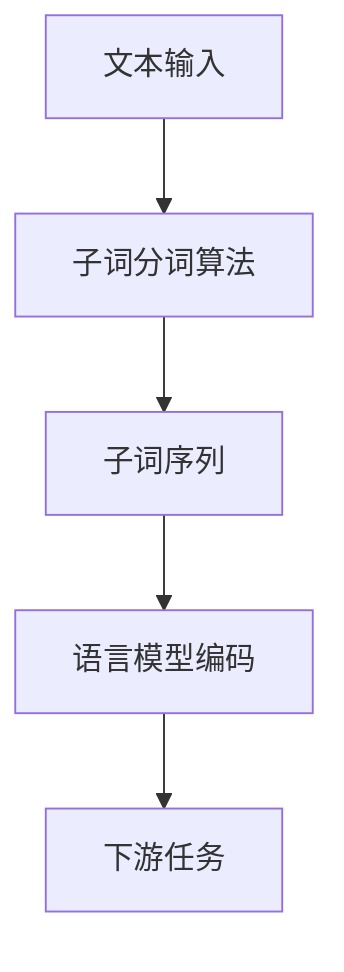
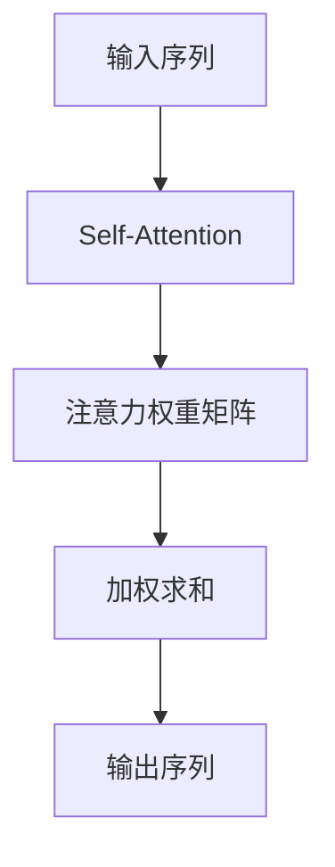
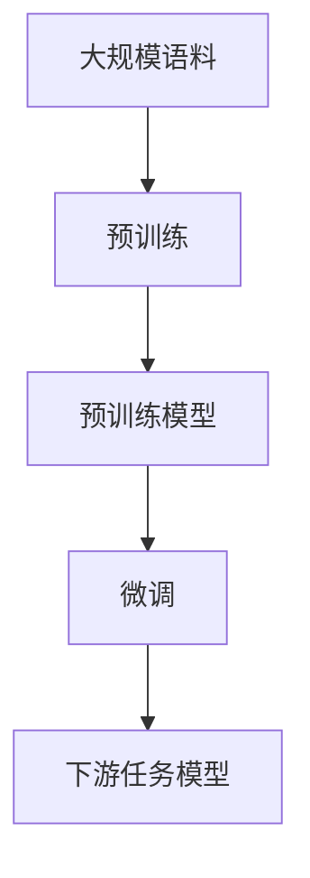

# 大语言模型原理基础与前沿 子词分词

## 1.背景介绍

### 1.1 自然语言处理的重要性

在当今信息时代,自然语言处理(NLP)已经成为人工智能领域中最重要和最具挑战性的研究方向之一。它旨在使计算机能够理解和生成人类语言,实现人机自然交互。自然语言处理广泛应用于机器翻译、智能问答、信息检索、情感分析等诸多领域,对提高人类生活质量和工作效率具有重要意义。

### 1.2 语言模型在NLP中的作用

语言模型是自然语言处理的核心部分,它能够捕捉语言的统计规律,为下游任务提供有价值的语义和语法信息。传统的基于统计的语言模型已经不能满足当前需求,而基于深度学习的神经网络语言模型则展现出了强大的语言理解和生成能力。

### 1.3 大语言模型的兴起

近年来,benefriting from 大规模语料库和强大的计算能力,大型预训练语言模型取得了突破性进展,例如GPT、BERT、XLNet等。这些模型能够从海量无标注数据中学习丰富的语义和语法知识,为下游任务提供强大的迁移能力,推动了NLP技术的飞速发展。

## 2.核心概念与联系

### 2.1 子词分词(Subword Tokenization)

子词分词是大语言模型中一种常用的词元化(Tokenization)技术。与基于空格或词典的传统分词方法不同,子词分词将单词拆分为多个子词元素,例如"playing"可以拆分为"play"和"ing"。这种方法能够有效减少词表大小,缓解稀有词和未见词的问题。常用的子词分词算法包括字节对编码(BPE)、WordPiece、UnigremLanguage Model等。



### 2.2 自注意力机制(Self-Attention)

自注意力机制是变革性的神经网络架构,它能够捕捉输入序列中任意两个位置之间的依赖关系,而不受序列长度的限制。相比循环神经网络(RNN)和卷积神经网络(CNN),自注意力机制具有并行计算和长期依赖建模的优势,成为了大语言模型的核心组件。



### 2.3 预训练与微调(Pre-training & Fine-tuning)

大语言模型通常采用预训练与微调的范式。在预训练阶段,模型从大规模无标注语料中学习通用的语言知识;在微调阶段,模型在特定的下游任务上进行少量参数调整,以获得针对性的性能提升。这种范式能够有效利用大量无标注数据,并将通用知识迁移到特定任务上,大大提高了模型的泛化能力。



## 3.核心算法原理具体操作步骤

### 3.1 字节对编码(Byte-Pair Encoding, BPE)

BPE是一种基于数据驱动的子词分词算法,它通过迭代地合并最频繁的连续字节对,从而构建出一个有限的子词词表。BPE算法的具体步骤如下:

1. 初始化:将所有单词拆分为单个字符序列,并统计字符对的频率。
2. 合并:找到频率最高的字符对,将它们合并为一个新的子词元素,并在语料库中替换所有出现的该字符对。
3. 重复步骤2,直到达到预设的词表大小或满足其他停止条件。
4. 对新的语料进行子词分词,将单词拆分为子词序列。

例如,对于单词"unrefrigerated",BPE可能会得到子词序列"un@@ re@@ frig@@ er@@ ated"。

### 3.2 WordPiece

WordPiece是另一种常用的子词分词算法,它基于语言模型的概率来确定子词边界。WordPiece算法的步骤如下:

1. 初始化:将所有单词拆分为单个字符序列,并构建一个包含所有字符的词表。
2. 学习:基于语料库,训练一个语言模型,学习每个子词序列的概率分布。
3. 合并:对于每个单词,找到能够最大化语言模型概率的子词序列。
4. 更新词表:将高频子词序列添加到词表中,并从词表中移除低频单字符。
5. 重复步骤3和4,直到达到预设的词表大小或满足其他停止条件。

WordPiece算法通常会产生更自然的子词分割,但计算复杂度较高。

### 3.3 UnigremLanguage Model

UnigremLanguage Model是一种基于统计语言模型的子词分词算法,它试图最小化语料库中所有子词序列的交叉熵。算法步骤如下:

1. 初始化:将所有单词拆分为单个字符序列,并构建一个包含所有字符的词表。
2. 计算:对于每个可能的子词边界,计算将单词拆分为子词序列后的交叉熵。
3. 合并:选择能够最小化交叉熵的子词分割方式。
4. 更新词表:将高频子词添加到词表中,并从词表中移除低频单字符。
5. 重复步骤2到4,直到达到预设的词表大小或满足其他停止条件。

UnigremLanguage Model算法通常会产生较短的子词序列,但可能会引入一些不自然的分割。

## 4.数学模型和公式详细讲解举例说明

### 4.1 子词分词的数学表示

假设我们有一个单词序列 $X = (x_1, x_2, \ldots, x_n)$,其中 $x_i$ 表示第 $i$ 个单词。我们的目标是将每个单词 $x_i$ 拆分为一个子词序列 $\overline{x}_i = (y_1^{(i)}, y_2^{(i)}, \ldots, y_{m_i}^{(i)})$,其中 $y_j^{(i)}$ 表示第 $j$ 个子词,而 $m_i$ 则是该单词的子词数量。

对于整个语料库,我们可以定义一个词表 $\mathcal{V}$,它包含了所有可能的子词元素。我们的目标是找到一个子词分词函数 $\text{tokenize}(x)$,将单词 $x$ 映射到一个子词序列 $\overline{x}$,使得 $\overline{x} \in \mathcal{V}^*$,其中 $\mathcal{V}^*$ 表示 $\mathcal{V}$ 的克林闭包(Kleene closure),即所有可能的子词序列的集合。

### 4.2 字节对编码(BPE)的数学模型

在 BPE 算法中,我们定义一个合并操作 $\oplus$,它将两个连续的子词 $y_1$ 和 $y_2$ 合并为一个新的子词 $y_1 \oplus y_2$。我们的目标是找到一系列合并操作,使得最终的词表大小满足预设的要求。

具体来说,我们可以定义一个损失函数 $\mathcal{L}$,它衡量了当前词表下语料库的编码长度。对于每一对候选子词 $(y_1, y_2)$,我们计算将它们合并后的新损失函数值 $\mathcal{L}(y_1 \oplus y_2)$。我们选择能够最小化损失函数的子词对进行合并,即:

$$\arg\min_{y_1, y_2} \mathcal{L}(y_1 \oplus y_2)$$

这个过程重复进行,直到词表达到预设的大小或满足其他停止条件。

### 4.3 WordPiece的数学模型

在 WordPiece 算法中,我们定义一个概率模型 $P(y_1, y_2, \ldots, y_m | x)$,它表示将单词 $x$ 拆分为子词序列 $(y_1, y_2, \ldots, y_m)$ 的概率。我们的目标是找到一个子词分词函数 $\text{tokenize}(x)$,使得该概率最大化:

$$\text{tokenize}(x) = \arg\max_{y_1, y_2, \ldots, y_m} P(y_1, y_2, \ldots, y_m | x)$$

在实践中,我们通常使用一个基于 n-gram 语言模型的近似,将上式改写为:

$$\text{tokenize}(x) = \arg\max_{y_1, y_2, \ldots, y_m} \prod_{i=1}^m P(y_i | y_{i-n+1}, \ldots, y_{i-1})$$

其中 $P(y_i| y_{i-n+1}, \ldots, y_{i-1})$ 表示给定前 $n-1$ 个子词的情况下,当前子词 $y_i$ 的条件概率。

### 4.4 UnigremLanguage Model的数学模型

UnigremLanguage Model 算法基于交叉熵(cross-entropy)损失函数,它衡量了将单词拆分为子词序列后的编码长度。具体来说,对于一个单词 $x$,我们定义它被拆分为子词序列 $(y_1, y_2, \ldots, y_m)$ 的交叉熵损失为:

$$H(x, y_1, y_2, \ldots, y_m) = -\log P(y_1, y_2, \ldots, y_m | x)$$

我们的目标是找到一个子词分词函数 $\text{tokenize}(x)$,使得整个语料库的交叉熵损失最小化:

$$\text{tokenize}(x) = \arg\min_{y_1, y_2, \ldots, y_m} \sum_{x \in \mathcal{X}} H(x, y_1, y_2, \ldots, y_m)$$

其中 $\mathcal{X}$ 表示整个语料库。在实践中,我们通常使用一个基于 n-gram 语言模型的近似,将交叉熵损失改写为:

$$H(x, y_1, y_2, \ldots, y_m) \approx -\sum_{i=1}^m \log P(y_i| y_{i-n+1}, \ldots, y_{i-1})$$

## 5.项目实践:代码实例和详细解释说明

在这一部分,我们将提供一个使用 Python 和 Hugging Face 库实现 BPE 算法的示例代码,并对其进行详细解释。

```python
from tokenizers import ByteLevelBPETokenizer

# 初始化 BPE 分词器
tokenizer = ByteLevelBPETokenizer()

# 训练数据
data = ["This is a test", "That is also a test"]

# 训练 BPE 模型
tokenizer.train_from_iterator(data, vocab_size=100, min_frequency=2, special_tokens=[
    "<s>",
    "<pad>",
    "</s>",
    "<unk>",
    "<mask>",
])

# 保存模型
tokenizer.save("bpe-tokenizer.json")

# 加载模型
tokenizer = ByteLevelBPETokenizer("bpe-tokenizer.json")

# 对新数据进行分词
text = "This is another test"
tokens = tokenizer.encode(text).ids
print(tokens)
```

让我们逐步解释这段代码:

1. 首先,我们从 Hugging Face 的 `tokenizers` 库中导入 `ByteLevelBPETokenizer` 类,用于实现 BPE 算法。

2. 接下来,我们初始化一个 `ByteLevelBPETokenizer` 对象。

3. 我们准备了一些训练数据,包含两个简单的句子。

4. 然后,我们调用 `train_from_iterator` 方法,使用训练数据来训练 BPE 模型。在这个例子中,我们设置了词表大小为 100,最小频率为 2,并添加了一些特殊标记。

5. 一旦训练完成,我们将模型保存到磁盘上的 `bpe-tokenizer.json` 文件中。

6. 为了测试模型,我们加载之前保存的 `bpe-tokenizer.json` 文件,重新创建一个 `ByteLevelBPETokenizer` 对象。

7. 最后,我们使用 `encode` 方法对一个新的句子进行分词,并打印出