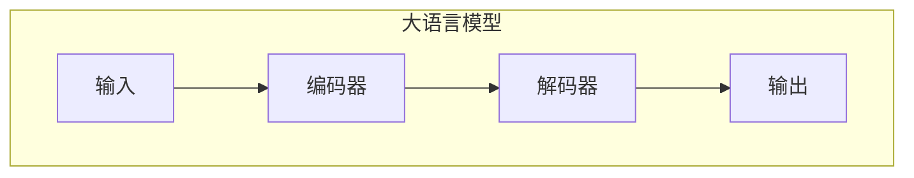
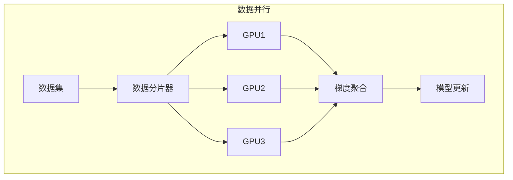
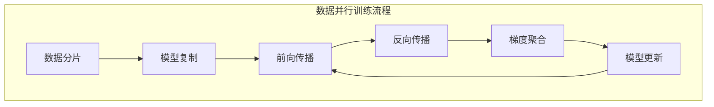
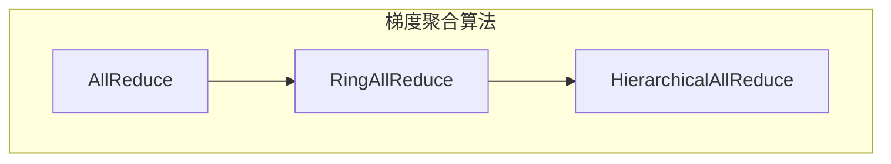
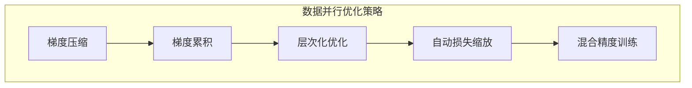

# 大语言模型原理基础与前沿 数据并行

## 1. 背景介绍

### 1.1 人工智能的发展历程

人工智能(Artificial Intelligence, AI)是一个跨学科领域,旨在研究和开发能够模拟人类智能行为的理论、方法、技术及应用系统。自20世纪50年代问世以来,人工智能经历了几个重要的发展阶段。

### 1.2 大语言模型的兴起

近年来,benefitting from大规模数据和强大计算能力,基于深度学习的大语言模型取得了突破性进展,在自然语言处理、机器翻译、问答系统等领域展现出卓越的性能。大语言模型通过在海量文本数据上预训练,学习捕获语言的深层次语义和逻辑关系,为下游任务提供通用的语言表示和强大的迁移能力。

### 1.3 数据并行在大语言模型中的作用

训练大规模语言模型面临着巨大的计算和存储开销。数据并行是一种有效的策略,通过在多个加速器(如GPU)上并行处理训练数据的不同子集,从而提高训练效率。数据并行不仅能够加速训练过程,还能够支持更大规模的模型和数据集。本文将重点探讨数据并行在大语言模型训练中的原理、实现方法及相关前沿技术。

## 2. 核心概念与联系

### 2.1 大语言模型

大语言模型(Large Language Model, LLM)是一种基于自然语言的深度学习模型,通常具有数十亿甚至上万亿个参数。常见的大语言模型架构包括Transformer、BERT、GPT等。这些模型通过在海量文本数据上进行无监督预训练,学习捕获语言的深层次语义和逻辑关系,为下游任务提供通用的语言表示和强大的迁移能力。



### 2.2 数据并行

数据并行(Data Parallelism)是一种并行计算策略,通过将训练数据划分为多个子集,并在多个计算设备(如GPU)上并行处理这些子集,从而加速训练过程。在数据并行中,每个计算设备都维护一份完整的模型参数副本,并根据本地数据子集计算梯度,然后通过通信机制(如AllReduce)汇总所有设备的梯度,最后更新模型参数。



### 2.3 数据并行与大语言模型的联系

大语言模型由于其巨大的参数规模和训练数据量,训练过程通常需要消耗大量的计算资源和时间。数据并行为大语言模型的高效训练提供了一种可行的解决方案,通过在多个GPU上并行处理训练数据,可以显著提高训练速度,支持更大规模的模型和数据集。同时,数据并行也带来了一些挑战,如通信开销、梯度更新一致性等,需要采用适当的策略和优化方法来解决。

## 3. 核心算法原理具体操作步骤

### 3.1 数据并行训练流程

数据并行训练的核心步骤如下:

1. **数据分片**: 将训练数据划分为多个子集,每个计算设备处理一个子集。
2. **模型复制**: 在每个计算设备上复制一份完整的模型参数副本。
3. **前向传播**: 每个设备基于本地数据子集进行前向传播,计算损失函数。
4. **反向传播**: 每个设备基于本地数据子集计算梯度。
5. **梯度聚合**: 使用通信原语(如AllReduce)将所有设备的梯度汇总。
6. **模型更新**: 使用聚合后的梯度更新每个设备上的模型参数副本。
7. **重复步骤3-6**: 重复上述过程,直到模型收敛或达到预定的训练轮次。



### 3.2 梯度聚合算法

梯度聚合是数据并行训练中的关键步骤,它需要在多个计算设备之间高效地交换和汇总梯度信息。常见的梯度聚合算法包括:

1. **AllReduce**: 一种广泛使用的通信原语,将所有设备的梯度求和,并将结果分发给每个设备。
2. **Ring AllReduce**: 在AllReduce的基础上进行了优化,将设备组织成一个环形拓扑结构,通过分块传输和重叠计算来降低通信开销。
3. **Hierarchical AllReduce**: 针对大规模集群设计的分层梯度聚合算法,通过构建多级树状拓扑结构来减少通信冲突和开销。



### 3.3 数据并行优化策略

为了提高数据并行训练的效率和稳定性,可以采用以下优化策略:

1. **梯度压缩**: 通过量化、稀疏化等方法压缩梯度数据,减少通信开销。
2. **梯度累积**: 在多个小批次上累积梯度,然后进行一次更新,降低通信频率。
3. **层次化优化**: 根据层次结构对不同层的参数进行不同的优化策略,如低精度更新、延迟更新等。
4. **自动损失缩放**: 自动调整损失函数的缩放系数,避免数值下溢或上溢。
5. **混合精度训练**: 在部分计算中使用低精度(如FP16)来加速运算,同时保持高精度(如FP32)的参数存储和更新。



## 4. 数学模型和公式详细讲解举例说明

### 4.1 数据并行梯度计算

在数据并行训练中,每个设备基于本地数据子集计算梯度,然后通过梯度聚合算法汇总所有设备的梯度。假设有$N$个设备,每个设备处理$\frac{1}{N}$的训练数据,则第$i$个设备计算的梯度为:

$$\nabla_i = \frac{1}{N} \sum_{x \in \mathcal{D}_i} \nabla_\theta \mathcal{L}(x, \theta)$$

其中$\mathcal{D}_i$表示第$i$个设备的数据子集,$\mathcal{L}(x, \theta)$是损失函数,关于模型参数$\theta$的梯度。

通过梯度聚合算法(如AllReduce),我们可以得到全局梯度:

$$\nabla = \sum_{i=1}^N \nabla_i = \sum_{i=1}^N \frac{1}{N} \sum_{x \in \mathcal{D}_i} \nabla_\theta \mathcal{L}(x, \theta) = \frac{1}{N} \sum_{x \in \mathcal{D}} \nabla_\theta \mathcal{L}(x, \theta)$$

其中$\mathcal{D}$是完整的训练数据集。可以看出,通过数据并行和梯度聚合,我们可以获得与单机训练相同的全局梯度,从而保证模型收敛性和准确性。

### 4.2 梯度压缩

为了减少通信开销,可以采用梯度压缩技术。常见的梯度压缩方法包括:

1. **梯度量化**: 将梯度值映射到一个有限的离散集合,从而减小数据表示所需的位数。例如,可以使用$k$位量化:

$$\mathrm{quantize}(g, k) = \frac{\mathrm{clip}(g, l, u)}{s} \times s$$

其中$g$是原始梯度值,$l$和$u$分别是下限和上限,$s$是量化步长。

2. **梯度稀疏化**: 通过设置阈值,将小于该阈值的梯度元素设置为0,从而增加梯度的稀疏性。例如,可以使用顶$k$稀疏化:

$$\mathrm{topk}(g, k) = \begin{cases}
g_i, & \text{if } |g_i| \text{ is among the } k \text{ largest values} \\
0, & \text{otherwise}
\end{cases}$$

其中$g$是原始梯度向量,$k$是保留的最大梯度元素数量。

通过梯度压缩,我们可以显著减小梯度数据的大小,从而降低通信开销。但同时也需要权衡压缩带来的精度损失。

## 5. 项目实践: 代码实例和详细解释说明

以下是使用PyTorch实现数据并行训练的代码示例,基于BERT模型进行掩码语言模型(Masked Language Modeling, MLM)任务的训练。

### 5.1 导入必要的库

```python
import torch
import torch.nn as nn
from torch.utils.data import DataLoader
from transformers import BertForMaskedLM, BertTokenizer
```

### 5.2 准备数据

```python
# 加载数据集
train_dataset = ...

# 创建数据加载器
train_dataloader = DataLoader(train_dataset, batch_size=batch_size, shuffle=True)
```

### 5.3 定义模型和损失函数

```python
# 初始化BERT模型
model = BertForMaskedLM.from_pretrained('bert-base-uncased')

# 将模型移动到GPU
model = model.cuda()

# 定义损失函数
loss_fn = nn.CrossEntropyLoss()
```

### 5.4 数据并行训练

```python
# 初始化数据并行
model = torch.nn.parallel.DistributedDataParallel(model, device_ids=[args.gpu])

# 训练循环
for epoch in range(num_epochs):
    for batch in train_dataloader:
        # 准备输入数据
        input_ids = batch['input_ids'].cuda()
        attention_mask = batch['attention_mask'].cuda()
        labels = batch['labels'].cuda()

        # 前向传播
        outputs = model(input_ids, attention_mask=attention_mask, labels=labels)
        loss = outputs.loss

        # 反向传播
        loss.backward()

        # 梯度聚合和模型更新
        optimizer.step()
        optimizer.zero_grad()
```

在这个示例中,我们首先导入必要的库,然后准备训练数据集和数据加载器。接下来,我们定义了BERT模型和交叉熵损失函数。

在训练循环中,我们使用`torch.nn.parallel.DistributedDataParallel`将模型封装为数据并行模型,并在每个批次中执行前向传播、反向传播和梯度更新。PyTorch会自动处理梯度聚合和模型参数同步。

需要注意的是,在实际应用中,还需要进行一些额外的设置,如初始化分布式环境、设置种子以确保结果可复现等。此外,也可以根据需要应用一些优化策略,如梯度压缩、梯度累积等。

## 6. 实际应用场景

数据并行技术在大语言模型的训练中发挥着关键作用,支持了许多重要的应用场景:

1. **开源语言模型**: 像GPT-3、PanGu-Alpha、BLOOM等知名的大规模语言模型,都采用了数据并行训练策略,利用了数百甚至数千个GPU的计算力。
2. **商业语言服务**: 科技公司如Google、Meta、Microsoft等,广泛应用大语言模型提供自然语言处理、机器翻译、对话系统等商业语言服务。
3. **科研前沿探索**: 数据并行技术为探索更大规模的语言模型架构提供了计算基础,推动了相关领域的科研进展。
4. **行业应用**: 大语言模型在法律、医疗、金融等行业得到了广泛应