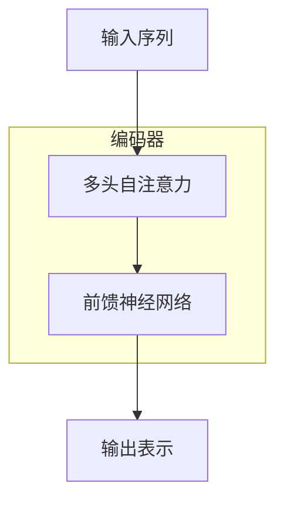
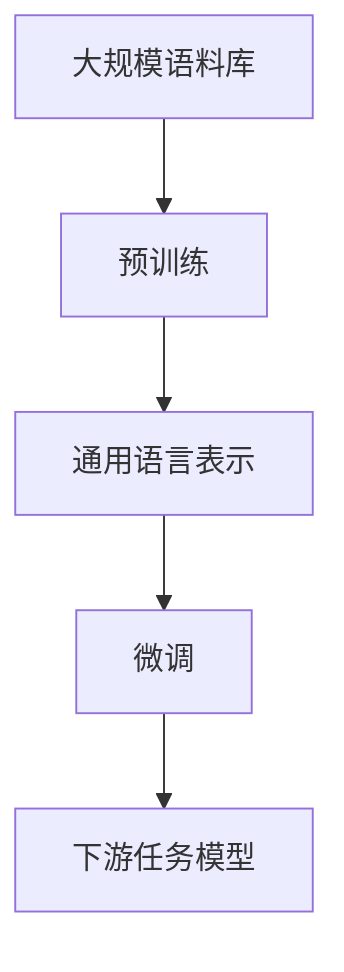
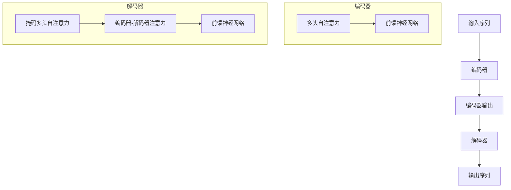

# 大语言模型原理基础与前沿 更长的上下文

## 1. 背景介绍

### 1.1 大语言模型的兴起

近年来,大型语言模型(Large Language Models, LLMs)在自然语言处理领域掀起了一场革命。这些模型通过在海量文本数据上进行预训练,学习了丰富的语言知识和上下文信息,从而在各种自然语言处理任务上展现出了令人惊叹的性能。

GPT(Generative Pre-trained Transformer)是开启这一时代的先驱模型。2018年,OpenAI发布了GPT,这是第一个展示了通过在大规模语料库上进行无监督预训练,可以学习到有用的语言表示的大型语言模型。随后,谷歌推出了BERT(Bidirectional Encoder Representations from Transformers),它采用了双向编码器的架构,进一步提高了语言理解能力。

### 1.2 大语言模型的影响

大语言模型的出现为自然语言处理领域带来了革命性的进展。它们在广泛的任务上展现出了强大的性能,包括机器翻译、问答系统、文本生成、文本摘要等。这些模型不仅能够理解和生成流畅的自然语言,还能捕捉上下文和语义信息,从而更好地完成复杂的语言理解和生成任务。

大语言模型的影响不仅局限于自然语言处理领域,它们还为人工智能的其他领域带来了新的机遇。例如,在信息检索、知识图谱构建、对话系统等领域,大语言模型都展现出了巨大的潜力。

## 2. 核心概念与联系

### 2.1 自注意力机制(Self-Attention)

自注意力机制是大语言模型的核心组成部分之一。与传统的循环神经网络(RNN)和卷积神经网络(CNN)不同,自注意力机制允许模型直接捕捉输入序列中任意两个位置之间的关系,从而更好地建模长期依赖关系。

在自注意力机制中,每个输入位置都会与其他所有位置进行关联,计算出一个注意力分数,用于衡量该位置与其他位置的关联程度。通过这种方式,模型可以自适应地聚焦于最相关的上下文信息,从而提高了语言理解和生成的能力。

### 2.2 transformer架构

Transformer是一种全新的基于自注意力机制的神经网络架构,它被广泛应用于大语言模型中。Transformer由编码器(Encoder)和解码器(Decoder)组成,两者都采用了多头自注意力机制和前馈神经网络。

编码器的作用是将输入序列映射为一系列连续的表示,而解码器则根据编码器的输出和前一步的预测结果,生成下一个token。Transformer架构通过并行计算和残差连接,显著提高了训练效率和性能。

### 2.3 预训练与微调(Pre-training & Fine-tuning)

大语言模型通常采用两阶段的训练策略:预训练(Pre-training)和微调(Fine-tuning)。

在预训练阶段,模型会在大规模的未标注语料库上进行自监督学习,目标是学习通用的语言表示。常见的预训练目标包括掩码语言模型(Masked Language Modeling)和下一句预测(Next Sentence Prediction)等。

在微调阶段,预训练好的模型会在特定的下游任务上进行进一步的训练,以适应该任务的特征和目标。通过微调,模型可以将预训练得到的通用语言知识转移到特定任务上,从而显著提高性能。

## 3. 核心算法原理具体操作步骤

### 3.1 自注意力机制的计算过程

自注意力机制的核心思想是允许每个输入位置都与其他所有位置进行关联,从而捕捉长期依赖关系。具体来说,自注意力机制的计算过程包括以下几个步骤:

1. **查询(Query)、键(Key)和值(Value)的计算**

   给定一个输入序列 $X = (x_1, x_2, \dots, x_n)$,我们首先将其映射为查询(Query)、键(Key)和值(Value)矩阵,分别记为 $Q$、$K$ 和 $V$。这通常是通过线性变换实现的:

   $$Q = XW^Q, K = XW^K, V = XW^V$$

   其中 $W^Q$、$W^K$ 和 $W^V$ 是可学习的权重矩阵。

2. **计算注意力分数**

   对于每个查询向量 $q_i$,我们计算它与所有键向量 $k_j$ 的点积,得到一个注意力分数矩阵 $S$:

   $$S_{ij} = q_i^T k_j$$

   注意力分数矩阵 $S$ 反映了每个查询向量与所有键向量之间的相关性。

3. **计算注意力权重**

   为了得到更加合理的注意力分布,我们对注意力分数矩阵 $S$ 进行缩放和软化处理,得到注意力权重矩阵 $A$:

   $$A_{ij} = \text{softmax}\left(\frac{S_{ij}}{\sqrt{d_k}}\right)$$

   其中 $d_k$ 是键向量的维度,用于缩放注意力分数,防止过大或过小的值。softmax函数用于将注意力分数转换为概率分布。

4. **计算加权和**

   最后,我们将注意力权重矩阵 $A$ 与值矩阵 $V$ 相乘,得到自注意力的输出:

   $$\text{Attention}(Q, K, V) = \text{softmax}\left(\frac{QK^T}{\sqrt{d_k}}\right)V$$

   这个加权和表示了每个位置关注其他位置的程度,从而捕捉了长期依赖关系。

### 3.2 多头自注意力机制

为了进一步提高模型的表示能力,transformer架构采用了多头自注意力机制。多头自注意力机制将输入序列分别输入到多个独立的自注意力子层中,每个子层学习不同的表示,最后将这些表示进行拼接,形成最终的输出表示。

具体来说,给定一个查询矩阵 $Q$、键矩阵 $K$ 和值矩阵 $V$,多头自注意力机制的计算过程如下:

1. 将 $Q$、$K$ 和 $V$ 分别线性映射为 $h$ 组查询、键和值:

   $$\begin{aligned}
   Q^{(1)}, \dots, Q^{(h)} &= QW_Q^{(1)}, \dots, QW_Q^{(h)} \\
   K^{(1)}, \dots, K^{(h)} &= KW_K^{(1)}, \dots, KW_K^{(h)} \\
   V^{(1)}, \dots, V^{(h)} &= VW_V^{(1)}, \dots, VW_V^{(h)}
   \end{aligned}$$

   其中 $W_Q^{(i)}$、$W_K^{(i)}$ 和 $W_V^{(i)}$ 是可学习的权重矩阵。

2. 对于每个头 $i$,计算自注意力输出:

   $$\text{head}_i = \text{Attention}\left(Q^{(i)}, K^{(i)}, V^{(i)}\right)$$

3. 将所有头的输出拼接起来,得到多头自注意力的最终输出:

   $$\text{MultiHead}(Q, K, V) = \text{Concat}(\text{head}_1, \dots, \text{head}_h)W^O$$

   其中 $W^O$ 是另一个可学习的权重矩阵,用于将拼接后的向量映射回模型的维度空间。

通过多头自注意力机制,模型可以从不同的子空间中捕捉不同的依赖关系,从而提高了表示能力和性能。

### 3.3 transformer编码器和解码器

transformer架构由编码器(Encoder)和解码器(Decoder)两个主要部分组成。

**编码器(Encoder)**

编码器的主要作用是将输入序列映射为一系列连续的表示。它由多个相同的层组成,每一层都包含两个子层:多头自注意力子层和前馈神经网络子层。

1. 多头自注意力子层:捕捉输入序列中不同位置之间的依赖关系,生成序列的表示。
2. 前馈神经网络子层:对每个位置的表示进行独立的非线性变换,提供额外的表示能力。

编码器的输出是输入序列在不同位置的表示,它将被送入解码器进行进一步处理。

**解码器(Decoder)**

解码器的主要作用是根据编码器的输出和前一步的预测结果,生成下一个token。它也由多个相同的层组成,每一层包含三个子层:

1. 掩码多头自注意力子层:捕捉已生成序列中不同位置之间的依赖关系,生成序列的表示。由于未来的token在生成时是未知的,因此需要使用掩码机制,只允许每个位置关注之前的位置。
2. 编码器-解码器注意力子层:将解码器的表示与编码器的输出进行关联,获取输入序列的上下文信息。
3. 前馈神经网络子层:对每个位置的表示进行独立的非线性变换,提供额外的表示能力。

解码器的输出是生成序列的概率分布,用于预测下一个token。

## 4. 数学模型和公式详细讲解举例说明

### 4.1 掩码语言模型(Masked Language Modeling)

掩码语言模型是大语言模型预训练的一种常用目标。它的基本思想是在输入序列中随机掩码一些token,并让模型根据上下文预测这些被掩码的token。通过这种方式,模型可以学习到丰富的语言知识和上下文信息。

具体来说,给定一个输入序列 $X = (x_1, x_2, \dots, x_n)$,我们随机选择一些位置进行掩码,得到掩码后的序列 $\tilde{X}$。模型的目标是最大化被掩码位置的条件概率:

$$\mathcal{L}_{\text{MLM}} = -\mathbb{E}_{X}\left[\sum_{i \in \text{masked}} \log P(x_i | \tilde{X})\right]$$

其中 $P(x_i | \tilde{X})$ 是模型预测被掩码位置 $i$ 的token $x_i$ 的概率。

为了计算这个条件概率,我们可以使用transformer编码器和解码器。编码器将掩码后的序列 $\tilde{X}$ 映射为一系列表示,解码器则根据这些表示和前一步的预测结果,生成被掩码位置的token概率分布。

例如,假设输入序列是 "我爱学习自然语言处理",我们将第三个token "学习"进行掩码,得到 $\tilde{X} = ($"我", "爱", "<mask>", "自然语言处理")。模型的目标是最大化 $P($"学习" $| \tilde{X})$,也就是正确预测被掩码的token "学习"。

通过在大规模语料库上优化掩码语言模型目标,模型可以学习到丰富的语言知识和上下文信息,从而提高在各种下游任务上的性能。

### 4.2 transformer的自注意力计算

transformer架构中自注意力机制的计算过程涉及到了一些重要的数学运算,包括缩放点积注意力(Scaled Dot-Product Attention)和多头注意力机制(Multi-Head Attention)。

**缩放点积注意力**

给定一个查询向量 $