# 大语言模型原理基础与前沿 神经语言模型

## 1. 背景介绍

### 1.1 自然语言处理的重要性

自然语言处理(Natural Language Processing, NLP)是人工智能领域的一个重要分支,旨在使计算机能够理解和生成人类语言。随着人机交互需求的不断增长,NLP技术在各个领域都有广泛的应用,如机器翻译、智能问答、文本摘要、情感分析等。

### 1.2 语言模型在NLP中的作用

语言模型是NLP中一个基础且关键的组成部分,它的目标是量化一个句子或文本序列的概率,从而为下游任务提供有价值的语义和语法信息。传统的语言模型主要基于n-gram统计方法,但存在数据稀疏、难以捕捉长距离依赖等问题。

### 1.3 神经网络语言模型的兴起

近年来,随着深度学习技术的快速发展,神经网络语言模型(Neural Network Language Model, NNLM)逐渐取代了传统的n-gram模型,成为主流方法。神经网络语言模型能够有效地捕捉语言的深层次语义和结构信息,显著提高了语言模型的性能。

## 2. 核心概念与联系

### 2.1 词向量(Word Embedding)

词向量是神经网络语言模型的基础,它将词汇映射到一个连续的向量空间中,使得语义相似的词在向量空间中彼此靠近。常用的词向量表示方法包括Word2Vec、GloVe等。

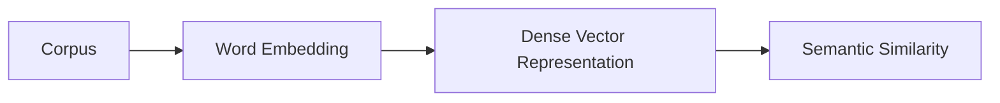

### 2.2 神经网络语言模型架构

神经网络语言模型的基本架构通常包括输入层、隐藏层和输出层。输入层接收词向量表示的词序列,隐藏层捕捉上下文信息,输出层预测下一个词的概率分布。

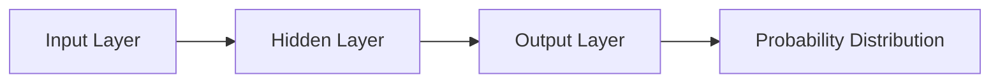

### 2.3 长短期记忆网络(LSTM)

LSTM是一种特殊的递归神经网络,能够有效地捕捉长距离依赖关系,在序列建模任务中表现出色。LSTM广泛应用于神经网络语言模型中,用于编码上下文信息。

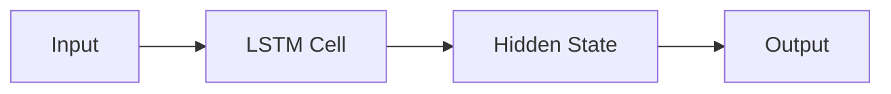

### 2.4 注意力机制(Attention Mechanism)

注意力机制允许模型在编码序列时,动态地关注不同位置的信息,从而提高模型的表现能力。自注意力(Self-Attention)是一种特殊的注意力机制,在Transformer模型中发挥了关键作用。

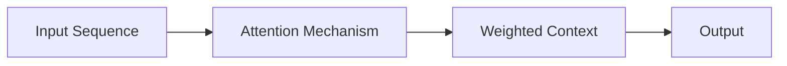

### 2.5 Transformer

Transformer是一种全新的基于自注意力机制的序列建模架构,不依赖递归结构,能够并行计算,在长序列任务中表现优异。Transformer在机器翻译、语言模型等任务中取得了突破性进展。

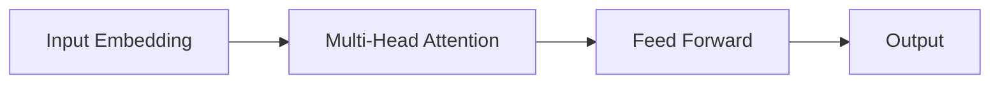

### 2.6 预训练语言模型(Pre-trained Language Model)

预训练语言模型是一种新兴的范式,通过在大规模无监督语料库上预训练一个通用的语言模型,然后在下游任务上进行微调,从而获得显著的性能提升。代表性模型包括BERT、GPT、XLNet等。

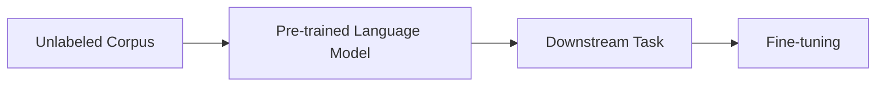

## 3. 核心算法原理具体操作步骤

### 3.1 Word2Vec

Word2Vec是一种高效的词向量表示方法,包括两种模型:连续词袋模型(CBOW)和Skip-Gram模型。

#### 3.1.1 CBOW模型

CBOW模型的目标是根据上下文词预测目标词。具体步骤如下:

1. 获取目标词的上下文窗口
2. 将上下文词的词向量求和,作为输入
3. 使用softmax函数预测目标词的概率分布
4. 使用负采样或层序softmax优化目标函数

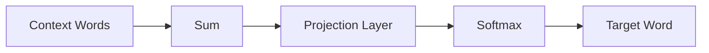

#### 3.1.2 Skip-Gram模型

Skip-Gram模型的目标是根据目标词预测上下文词。具体步骤如下:

1. 获取目标词的上下文窗口
2. 使用目标词的词向量作为输入
3. 使用softmax函数预测每个上下文词的概率分布
4. 使用负采样或层序softmax优化目标函数

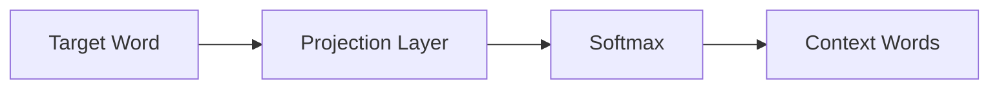

### 3.2 LSTM语言模型

LSTM语言模型利用LSTM网络捕捉长距离依赖关系,提高语言模型的性能。具体步骤如下:

1. 将输入词序列转换为词向量表示
2. 将词向量序列输入LSTM网络
3. LSTM网络编码上下文信息,得到隐藏状态序列
4. 使用softmax函数预测下一个词的概率分布
5. 使用交叉熵损失函数优化模型参数

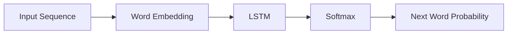

### 3.3 Transformer语言模型

Transformer语言模型基于自注意力机制,能够并行计算,在长序列任务中表现优异。具体步骤如下:

1. 将输入词序列转换为词向量表示
2. 使用位置编码为词向量增加位置信息
3. 使用多头自注意力机制捕捉上下文信息
4. 使用前馈神经网络进一步处理
5. 使用softmax函数预测下一个词的概率分布
6. 使用交叉熵损失函数优化模型参数

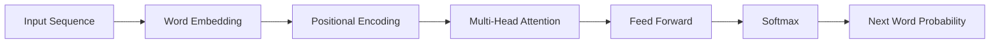

### 3.4 BERT预训练语言模型

BERT是一种基于Transformer的预训练语言模型,通过掩蔽语言模型(Masked Language Model)和下一句预测(Next Sentence Prediction)两个任务进行预训练。具体步骤如下:

1. 构建掩蔽语言模型任务:随机掩蔽部分输入词,要求模型预测被掩蔽的词
2. 构建下一句预测任务:给定两个句子,要求模型预测它们是否相邻
3. 使用Transformer编码器模型进行预训练
4. 在下游任务上进行微调,获得优秀的性能

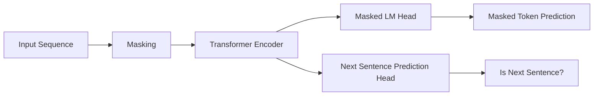

## 4. 数学模型和公式详细讲解举例说明

### 4.1 词向量训练目标函数

Word2Vec使用负采样或层序softmax来优化目标函数,避免计算复杂度过高的softmax函数。

#### 4.1.1 负采样(Negative Sampling)

负采样的目标函数如下:

$$J_\text{neg}(\theta) = \log Q_\theta(D=1|w_t, h) + \sum_{i=1}^k \mathbb{E}_{w_i \sim P_n(w)}[\log Q_\theta(D=0|w_i, h)]$$

其中,$Q_\theta(D=1|w_t, h)$表示目标词$w_t$出现在上下文$h$的概率,$Q_\theta(D=0|w_i, h)$表示负采样词$w_i$不出现在上下文$h$的概率。

#### 4.1.2 层序softmax(Hierarchical Softmax)

层序softmax使用一个二叉树结构来计算softmax概率,降低了计算复杂度。对于一个词$w$,它的概率计算如下:

$$P(w|h) = \prod_{j=1}^{\ell(w)-1} \sigma\left(\begin{array}{ll}
n(w,j)=\text{ch}(n(w,j-1)) & \log(1+\exp(-v_{n(w,j)}^{\top}v_h))\\
n(w,j)\neq\text{ch}(n(w,j-1)) & \log(1+\exp(v_{n(w,j)}^{\top}v_h))
\end{array}\right)$$

其中,$\ell(w)$表示从根节点到词$w$的路径长度,$n(w,j)$表示路径上的第$j$个节点,$\text{ch}(n)$表示节点$n$的子节点,$v_n$和$v_h$分别表示节点$n$和上下文$h$的向量表示。

### 4.2 LSTM网络

LSTM网络通过门控机制来控制信息的流动,避免了梯度消失和梯度爆炸问题。LSTM单元的计算公式如下:

$$\begin{aligned}
f_t &= \sigma(W_f \cdot [h_{t-1}, x_t] + b_f) & \text{(遗忘门)} \\
i_t &= \sigma(W_i \cdot [h_{t-1}, x_t] + b_i) & \text{(输入门)} \\
\tilde{C}_t &= \tanh(W_C \cdot [h_{t-1}, x_t] + b_C) & \text{(候选细胞状态)} \\
C_t &= f_t \odot C_{t-1} + i_t \odot \tilde{C}_t & \text{(细胞状态)} \\
o_t &= \sigma(W_o \cdot [h_{t-1}, x_t] + b_o) & \text{(输出门)} \\
h_t &= o_t \odot \tanh(C_t) & \text{(隐藏状态)}
\end{aligned}$$

其中,$\sigma$表示sigmoid函数,$\odot$表示元素wise乘积,各个门控和状态由不同的权重矩阵$W$和偏置向量$b$计算得到。

### 4.3 注意力机制(Attention Mechanism)

注意力机制能够动态地为输入序列中的每个元素分配不同的权重,从而获得更有针对性的表示。注意力分数的计算公式如下:

$$\text{Attention}(Q, K, V) = \text{softmax}\left(\frac{QK^T}{\sqrt{d_k}}\right)V$$

其中,$Q$表示查询向量(Query),$K$表示键向量(Key),$V$表示值向量(Value),$d_k$是缩放因子,用于防止内积过大导致梯度消失。

多头注意力(Multi-Head Attention)通过并行计算多个注意力,再将结果拼接,从而捕捉不同的关系:

$$\text{MultiHead}(Q, K, V) = \text{Concat}(head_1, ..., head_h)W^O$$
$$\text{where } head_i = \text{Attention}(QW_i^Q, KW_i^K, VW_i^V)$$

### 4.4 BERT掩蔽语言模型(Masked Language Model)

BERT的掩蔽语言模型任务要求模型预测被掩蔽的词。具体来说,对于一个输入序列$\mathbf{x} = (x_1, x_2, ..., x_n)$,我们随机选择15%的词进行掩蔽,得到掩蔽后的序列$\mathbf{\hat{x}}$。模型的目标是最大化掩蔽词的条件概率:

$$\mathcal{L}_\text{MLM} = -\mathbb{E}_{\mathbf{x}, \mathbf{\hat{x}}} \left[ \sum_{i=1}^n \mathbb{1}(x_i = \text{[MASK]}) \log P(x_i|\mathbf{\hat{x}}) \right]$$

其中,$\mathbb{1}$是指示函数,当$x_i$被掩蔽时取值为1,否则为0。

## 5. 项目实践:代码实例和详细解释说明

### 5.1 Word2Vec实现

以下是使用PyTorch实现Word2Vec的简化代码示例:

```python
import torch
import torch.nn as nn
import torch.optim as optim

class Word2Vec(nn.Module):
    