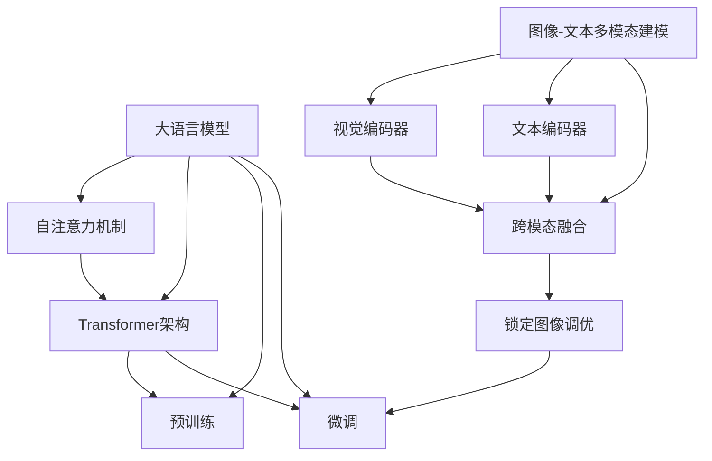

# 大语言模型原理基础与前沿 锁定图像调优

## 1. 背景介绍

### 1.1 大语言模型的兴起

近年来,大型语言模型(Large Language Models, LLMs)在自然语言处理(Natural Language Processing, NLP)领域掀起了一股革命浪潮。这些模型通过在海量文本数据上进行预训练,学习到了丰富的语言知识和上下文理解能力,从而在广泛的NLP任务中展现出卓越的性能表现。

代表性的大语言模型包括GPT(Generative Pre-trained Transformer)系列、BERT(Bidirectional Encoder Representations from Transformers)、XLNet、T5等,它们凭借强大的语言生成和理解能力,在机器翻译、文本摘要、问答系统、语义分析等领域取得了突破性进展。

### 1.2 图像-文本多模态建模的重要性

尽管大语言模型在处理纯文本任务方面表现出色,但在涉及图像等其他模态数据时,它们的性能往往会受到限制。为了充分利用图像和文本之间的互补信息,图像-文本多模态建模(Image-Text Multimodal Modeling)应运而生,旨在将视觉和语言信息融合,实现更加全面和准确的理解和生成。

图像-文本多模态建模在诸多领域具有广泛的应用前景,如视觉问答(Visual Question Answering)、图像描述生成(Image Captioning)、视觉对话(Visual Dialogue)、多模态检索(Multimodal Retrieval)等。通过有效融合图像和文本信息,这些应用可以为用户提供更加智能和人性化的交互体验。

### 1.3 锁定图像调优的重要性

然而,在实际应用中,大语言模型对于图像理解和生成的能力仍然存在一定局限性。这主要是由于预训练过程中缺乏足够的图像-文本对齐数据,导致模型难以充分捕捉两种模态之间的关联。为了解决这一问题,锁定图像调优(Image Grounding)技术应运而生。

锁定图像调优旨在利用图像-文本对齐数据对预训练的大语言模型进行进一步微调,强化模型对图像和文本之间关联的理解能力。通过这一过程,模型可以更好地将语言信息与图像内容相关联,从而提高图像理解和生成的准确性和一致性。

锁定图像调优不仅可以增强大语言模型在图像-文本任务上的性能表现,还能促进模型在更广泛的多模态场景下的应用,为智能系统带来更加丰富和人性化的交互体验。

## 2. 核心概念与联系

在探讨大语言模型锁定图像调优的原理和方法之前,我们需要先了解一些核心概念及其之间的联系。

### 2.1 大语言模型

大语言模型是一种基于深度学习的自然语言处理模型,通过在大规模文本语料库上进行预训练,学习到丰富的语言知识和上下文理解能力。这些模型具有强大的语言生成和理解能力,可以应用于广泛的NLP任务。

### 2.2 自注意力机制

自注意力机制是大语言模型的核心组成部分之一,它允许模型在处理序列数据时,充分捕捉不同位置之间的长程依赖关系。通过计算输入序列中每个元素与其他元素的相关性,自注意力机制可以动态地分配注意力权重,从而更好地建模序列数据的上下文信息。

### 2.3 Transformer架构

Transformer是一种基于自注意力机制的序列到序列模型架构,被广泛应用于大语言模型的构建。它完全依赖于自注意力机制来捕捉输入和输出序列之间的依赖关系,避免了传统循环神经网络中的递归计算,从而提高了并行计算能力和训练效率。

### 2.4 预训练

预训练是大语言模型训练过程的关键步骤。在预训练阶段,模型会在海量的文本语料库上进行无监督学习,通过自监督学习目标(如掩码语言模型和下一句预测)来捕捉语言的统计规律和上下文信息。预训练过程可以让模型学习到丰富的语言知识,为后续的微调和下游任务奠定基础。

### 2.5 微调

微调是将预训练的大语言模型应用于特定下游任务的过程。在这一阶段,模型会在相关的任务数据集上进行有监督的微调训练,以适应目标任务的特征和要求。微调可以有效地将预训练模型中学习到的通用语言知识迁移到特定任务,从而提高模型在该任务上的性能表现。

### 2.6 图像-文本多模态建模

图像-文本多模态建模旨在将视觉和语言信息融合,实现更加全面和准确的理解和生成。它通常包括三个核心组件:视觉编码器、文本编码器和跨模态融合模块。

- **视觉编码器**负责从图像中提取视觉特征,通常采用卷积神经网络(CNN)或视觉Transformer等模型。
- **文本编码器**则负责对文本序列进行编码,捕捉语言信息,通常采用大语言模型作为基础。
- **跨模态融合模块**将视觉和语言特征进行融合,建立两种模态之间的关联,实现多模态理解和生成。

### 2.7 锁定图像调优

锁定图像调优是一种针对大语言模型的微调方法,旨在增强模型对图像和文本之间关联的理解能力。通过利用图像-文本对齐数据,锁定图像调优可以进一步优化预训练的大语言模型,使其更好地捕捉视觉和语言信息之间的关联,从而提高图像理解和生成的准确性和一致性。

这些核心概念相互关联,共同构建了大语言模型锁定图像调优的理论基础和技术框架。下面,我们将深入探讨锁定图像调优的核心算法原理和具体操作步骤。

## 3. 核心算法原理具体操作步骤

锁定图像调优的核心算法原理可以概括为以下几个关键步骤:

1. **预训练大语言模型**
2. **构建图像-文本多模态编码器**
3. **设计锁定图像调优目标**
4. **微调模型参数**

### 3.1 预训练大语言模型

锁定图像调优的第一步是预训练一个大型语言模型,如BERT、GPT等。这个过程通常在海量的文本语料库上进行无监督学习,使用自监督学习目标(如掩码语言模型和下一句预测)来捕捉语言的统计规律和上下文信息。预训练过程可以让模型学习到丰富的语言知识,为后续的微调和下游任务奠定基础。

### 3.2 构建图像-文本多模态编码器

在预训练大语言模型的基础上,我们需要构建一个图像-文本多模态编码器,用于融合视觉和语言信息。这个编码器通常包括以下三个核心组件:

1. **视觉编码器**:负责从图像中提取视觉特征,通常采用卷积神经网络(CNN)或视觉Transformer等模型。
2. **文本编码器**:利用预训练的大语言模型作为基础,对文本序列进行编码,捕捉语言信息。
3. **跨模态融合模块**:将视觉和语言特征进行融合,建立两种模态之间的关联。常见的融合方式包括简单的特征拼接、注意力机制、交互式编码器等。

### 3.3 设计锁定图像调优目标

为了增强模型对图像和文本之间关联的理解能力,我们需要设计合适的锁定图像调优目标。常见的调优目标包括:

1. **图像-文本对比(Image-Text Contrastive)**:这种目标旨在最大化正确的图像-文本对之间的相似性,同时最小化错误的图像-文本对之间的相似性。通过这种方式,模型可以学习到视觉和语言信息之间的关联。
2. **文本-图像生成(Text-to-Image Generation)**:给定一段文本描述,模型需要生成与之相符的图像。这种目标可以促使模型更好地理解语言和视觉信息之间的映射关系。
3. **图像-文本生成(Image-to-Text Generation)**:给定一幅图像,模型需要生成与之相符的文本描述。这种目标可以增强模型对图像内容的理解能力。
4. **视觉问答(Visual Question Answering)**:给定一幅图像和一个相关的问题,模型需要根据图像内容回答该问题。这种目标综合了图像理解和语言推理的能力。

根据具体的应用场景和需求,我们可以选择一种或多种调优目标,并将它们组合到损失函数中进行优化。

### 3.4 微调模型参数

在设计好锁定图像调优目标之后,我们可以利用图像-文本对齐数据对模型进行微调训练。这个过程通常包括以下步骤:

1. **准备图像-文本对齐数据集**:收集一个包含图像和相关文本描述的数据集,用于模型微调。
2. **计算锁定图像调优损失**:将图像和文本输入到多模态编码器中,根据设计的调优目标计算损失函数。
3. **反向传播和参数更新**:利用优化算法(如Adam)对模型参数进行反向传播和更新,最小化锁定图像调优损失。
4. **模型评估**:在验证集上评估微调后的模型性能,根据需要进行多次迭代训练。

通过上述步骤,我们可以逐步优化模型参数,增强其对图像和文本之间关联的理解能力,从而提高图像理解和生成的准确性和一致性。

## 4. 数学模型和公式详细讲解举例说明

在锁定图像调优的过程中,涉及到一些重要的数学模型和公式,我们将详细地讲解和举例说明。

### 4.1 自注意力机制

自注意力机制是大语言模型的核心组成部分之一,它允许模型在处理序列数据时,充分捕捉不同位置之间的长程依赖关系。自注意力机制的计算过程可以表示为:

$$
\begin{aligned}
\text{Attention}(Q, K, V) &= \text{softmax}\left(\frac{QK^T}{\sqrt{d_k}}\right)V \\
\text{MultiHead}(Q, K, V) &= \text{Concat}(\text{head}_1, \ldots, \text{head}_h)W^O \\
\text{where } \text{head}_i &= \text{Attention}(QW_i^Q, KW_i^K, VW_i^V)
\end{aligned}
$$

其中:

- $Q$、$K$和$V$分别表示查询(Query)、键(Key)和值(Value)矩阵。
- $d_k$是缩放因子,用于防止较深层次的注意力值过大或过小。
- $W_i^Q$、$W_i^K$和$W_i^V$是投影矩阵,用于将$Q$、$K$和$V$映射到不同的子空间。
- $W^O$是一个可学习的权重矩阵,用于将多头注意力的输出拼接并映射回原始空间。

自注意力机制通过计算查询和键之间的相似性,动态地分配注意力权重,从而捕捉序列数据中不同位置之间的依赖关系。这种机制在大语言模型中发挥着关键作用,帮助模型更好地建模语言的上下文信息。

### 4.2 图像-文本对比损失

图像-文本对比损失是锁定图像调优中常用的一种目标函数,旨在最大化正确的图像-文本对之间的相似性,同时最小化错误的图像-文本对之间的相似性。这种损失函数可以