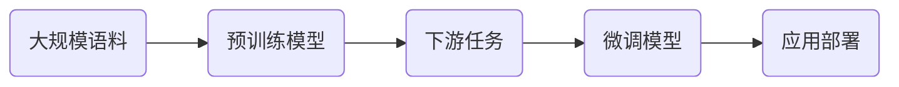
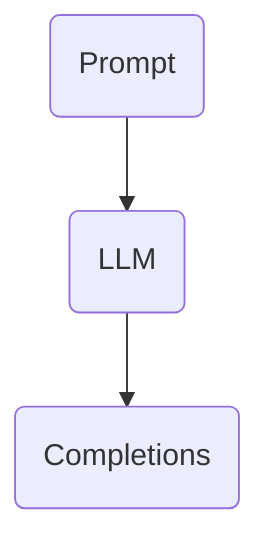
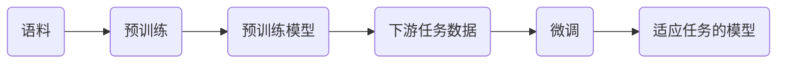

# 大语言模型应用指南：Assistants API

## 1. 背景介绍
### 1.1 大语言模型的兴起
近年来,自然语言处理(NLP)领域取得了长足的进步,尤其是随着Transformer架构的提出和预训练模型的广泛应用,大语言模型(Large Language Models, LLMs)逐渐成为NLP领域的研究热点。从GPT、BERT到GPT-3,再到最新的GPT-4、PaLM等模型,LLMs展现出了惊人的语言理解和生成能力,在许多NLP任务上取得了超越人类的表现。

### 1.2 LLMs的应用潜力
LLMs强大的语言能力使其在许多领域都有广阔的应用前景,例如:

- 对话系统:LLMs可以用于构建更加智能、自然的对话系统,如客服聊天机器人、智能助手等。
- 内容生成:LLMs可以自动生成高质量的文本内容,如新闻报道、产品描述、文学创作等。  
- 语言翻译:LLMs可以实现高质量的机器翻译,甚至处理一些低资源语言。
- 信息抽取:LLMs可以从非结构化文本中准确抽取关键信息,用于知识图谱构建等任务。
- 语义搜索:基于LLMs的语义理解能力,可以实现更加智能、精准的搜索引擎。

### 1.3 Assistants API的推出
为了让更多开发者能够便捷地使用LLMs的能力,一些科技巨头和AI公司都推出了基于LLMs的API服务。其中最具代表性的就是OpenAI推出的Assistants API。通过Assistants API,开发者无需训练和部署自己的模型,就可以方便地将LLMs集成到自己的应用中,极大降低了应用LLMs的门槛。

## 2. 核心概念与联系
### 2.1 LLMs的核心概念
要理解Assistants API,首先需要了解LLMs的一些核心概念:

- Transformer架构:一种基于Self-Attention机制的神经网络架构,是当前LLMs的主流架构。
- 预训练:在大规模无标注语料上进行自监督学习,让模型习得语言的基本规律和知识。
- 微调:在下游任务的标注数据上对预训练模型进行supervised fine-tuning,使其适应特定任务。
- 推理:应用训练好的模型进行预测或生成。
- Tokenization:将文本转化为模型可以处理的token序列的过程。
- Prompt:输入给模型的初始文本序列,引导模型进行特定任务。



### 2.2 Assistants API的核心概念
在了解LLMs的基础上,我们再来看Assistants API的一些核心概念:

- Model:Assistants API提供了不同的LLMs模型供选择,如GPT-3的不同规模版本(ada、babbage、curie、davinci)。
- Prompt:通过设计Prompt模板,可以引导模型执行不同的任务,如问答、写作、代码生成等。
- Completions:给定一个Prompt,模型会生成对应的完成(Completion),即模型的输出文本。
- Tokens:Assistants API对输入输出的文本进行分词,并计算其token数量,作为API调用的费用依据。  
- Stop Sequence:可以设置一个停止符,当模型生成的文本遇到停止符时就停止生成。
- Temperature:一个控制采样过程中随机性的参数。Temperature越高,生成的文本越发散创新;越低则越保守。
- Top P:另一种控制采样多样性的参数,限制累积概率大于P的token被采样。



## 3. 核心算法原理与操作步骤
### 3.1 Transformer架构原理
Transformer是LLMs的核心架构,其最大特点是采用了Self-Attention机制来建模文本序列内和序列间的依赖关系。具体来说:

1. 将输入文本转化为token embedding向量序列。
2. 对embedding序列进行Position Encoding,引入位置信息。
3. 将embedding序列输入到若干个Transformer Block中:
   - Multi-head Self-Attention:捕捉序列内和序列间的关联。
   - Feed Forward Network:对特征进行非线性变换。  
4. 最后使用Linear Layer+Softmax进行预测。

$$
\begin{aligned}
\mathrm{Attention}(Q, K, V) &= \mathrm{softmax}(\frac{QK^T}{\sqrt{d_k}})V \\
\mathrm{MultiHead}(Q, K, V) &= \mathrm{Concat}(\mathrm{head_1}, ..., \mathrm{head_h})W^O \\
\mathrm{FFN}(x) &= \mathrm{max}(0, xW_1 + b_1) W_2 + b_2
\end{aligned}
$$

其中$Q$、$K$、$V$分别是query、key、value向量,$d_k$是$K$的维度,$h$是attention head的数量。

### 3.2 预训练和微调流程
预训练和微调是LLMs的两个关键流程:

1. 预训练阶段:
   - 准备大规模无标注语料
   - 设计预训练任务,如MLM、NSP等
   - 在语料上训练Transformer模型
   - 得到预训练模型权重
2. 微调阶段:
   - 准备下游任务的标注数据
   - 根据任务设计输入输出格式
   - 加载预训练权重
   - 在下游任务数据上进行梯度下降
   - 得到适应下游任务的模型权重



### 3.3 Prompt设计与模型推理
有了训练好的模型,如何进行推理生成呢?这就需要设计合适的Prompt:

1. 根据具体任务设计Prompt模板,如"问题:xxx 回答:"。 
2. 将Prompt模板与输入文本拼接,得到完整的输入序列。
3. 对输入序列进行tokenize,转化为模型输入。
4. 将token输入到模型中,进行推理生成。
5. 对生成的token解码,得到最终的文本输出。
6. 根据需要进行后处理,如过滤、纠错等。

在生成过程中,可以通过调节temperature、top p等参数来控制生成的多样性和质量。

## 4. 数学模型和公式详解
### 4.1 Transformer的数学形式
Transformer可以用数学公式来精确刻画。假设输入序列为$\mathbf{x} = (x_1, \ldots, x_n)$,则Transformer的数学形式为:

$$
\begin{aligned}
\mathbf{h}_0 &= \mathrm{Embedding}(\mathbf{x}) + \mathrm{PositionEncoding}(\mathbf{x}) \\
\mathbf{h}_l &= \mathrm{TransformerBlock}_l(\mathbf{h}_{l-1}), l = 1,\ldots,L \\
\mathbf{y} &= \mathrm{Softmax}(\mathrm{Linear}(\mathbf{h}_L))
\end{aligned}
$$

其中$\mathbf{h}_l$是第$l$层Transformer Block的输出,$\mathbf{y}$是最终的预测概率分布。

TransformerBlock可以进一步展开为:

$$
\begin{aligned}
\mathbf{a}_l &= \mathrm{MultiHead}(\mathbf{h}_{l-1}, \mathbf{h}_{l-1}, \mathbf{h}_{l-1}) \\
\mathbf{h}_l &= \mathrm{FFN}(\mathbf{a}_l)
\end{aligned}
$$

$\mathbf{a}_l$是Self-Attention的输出。

### 4.2 Self-Attention的计算过程
Self-Attention是Transformer的核心,其计算过程可以用数学公式详细刻画:

1. 将输入序列$\mathbf{h}_{l-1}$通过三个线性变换得到$\mathbf{Q}$、$\mathbf{K}$、$\mathbf{V}$矩阵:

$$
\begin{aligned}
\mathbf{Q} &= \mathbf{h}_{l-1} \mathbf{W}^Q \\
\mathbf{K} &= \mathbf{h}_{l-1} \mathbf{W}^K \\
\mathbf{V} &= \mathbf{h}_{l-1} \mathbf{W}^V
\end{aligned}
$$

2. 计算Attention Scores矩阵$\mathbf{A}$:

$$
\mathbf{A} = \frac{\mathbf{Q}\mathbf{K}^T}{\sqrt{d_k}}
$$

3. 对Scores矩阵进行Softmax归一化:

$$
\mathbf{P} = \mathrm{Softmax}(\mathbf{A})
$$

4. 用Scores矩阵加权$\mathbf{V}$得到输出:

$$
\mathrm{Attention}(\mathbf{Q}, \mathbf{K}, \mathbf{V}) = \mathbf{P}\mathbf{V}
$$

Multi-head Attention则是将$\mathbf{Q}$、$\mathbf{K}$、$\mathbf{V}$分别切分为多个head,分别进行Attention计算,最后concat起来再线性变换:

$$
\mathrm{MultiHead}(\mathbf{Q}, \mathbf{K}, \mathbf{V}) = \mathrm{Concat}(\mathrm{head_1}, \ldots, \mathrm{head_h}) \mathbf{W}^O
$$

其中

$$
\mathrm{head_i} = \mathrm{Attention}(\mathbf{Q}_i, \mathbf{K}_i, \mathbf{V}_i)
$$

### 4.3 模型训练的目标函数
LLMs的训练本质上是一个极其复杂的优化问题,目标是最小化模型在训练集上的损失函数。以语言模型任务为例,其目标函数可以定义为:

$$
\mathcal{L}(\theta) = -\sum_{i=1}^N \log P_\theta(x_i|x_{<i})
$$

其中$\theta$是模型参数,$x_i$是第$i$个token,$x_{<i}$是$x_i$之前的所有token,$N$是训练样本总token数。$P_\theta(x_i|x_{<i})$是模型预测第$i$个token为$x_i$的概率。

目标是找到最优的参数$\theta^*$使损失函数最小化:

$$
\theta^* = \arg\min_\theta \mathcal{L}(\theta)
$$

这个优化问题通常使用随机梯度下降及其变种来求解,即:

$$
\theta \leftarrow \theta - \eta \nabla_\theta \mathcal{L}(\theta)
$$

其中$\eta$是学习率。

## 5. 项目实践:代码实例与详解
下面我们通过一个简单的例子来演示如何使用Assistants API进行文本生成。我们使用Python和`openai`库来调用API。

```python
import openai

openai.api_key = "your_api_key"  # 替换为你的API Key

prompt = "用一句话描述地球为什么是独一无二的。"

completion = openai.Completion.create(
    engine="text-davinci-003",  # 选择模型
    prompt=prompt,              # 输入prompt
    max_tokens=50,              # 最大生成长度
    n=1,                        # 生成几个句子
    stop=None,                  # 遇到停止词就停止生成
    temperature=0.5,            # 控制生成的多样性
)

print(completion.choices[0].text)
```

这段代码的关键步骤是:

1. 设置`openai.api_key`为你的API Key。
2. 定义prompt,即我们想要模型完成的任务描述。
3. 调用`openai.Completion.create()`方法,传入相关参数:
   - `engine`:选择使用的模型,这里用`text-davinci-003`。
   - `prompt`:输入的文本prompt。
   - `max_tokens`:控制最大生成长度,避免生成过长。
   - `n`:控制生成几个结果。
   - `stop`:定义停止词,遇到该词就停止生成。
   - `temperature`:控制生成的随机性,值越大生成越发散。
4. 从返回的`completion`对象中取出生成结果并打印。

运行这段代码,我们可能会得到如下输出:

```
地球是太阳系中唯一已知存在生命的行星,拥有适宜生命存在的独特条件,如液态水、大气层和磁场等,使其成为人类和众多物种赖以生存的家