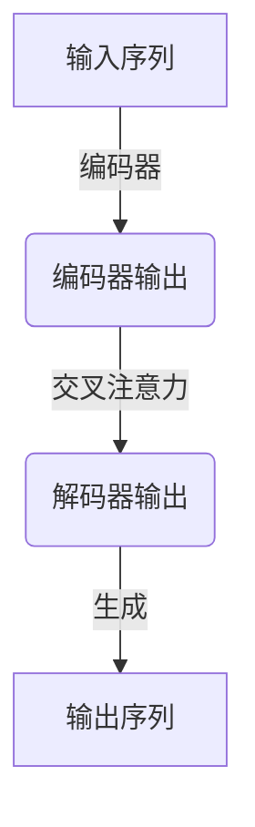

# 大语言模型应用指南：Open Interpreter

## 1.背景介绍

### 1.1 人工智能的发展历程

人工智能(Artificial Intelligence, AI)是当代科技发展的重要领域之一。自20世纪50年代AI概念被正式提出以来,经历了几个重要的发展阶段。

- 早期阶段(1950s-1960s):AI研究主要集中在逻辑推理、机器证明和博弈问题等领域。这一时期诞生了诸如A*算法、Alpha-Beta剪枝算法等经典算法。

- 知识阶段(1970s-1980s):研究重心转向知识表示和专家系统。这一时期出现了框架理论、语义网络等知识表示方法,以及基于规则的专家系统。

- 统计学习阶段(1990s-2000s):机器学习和数据挖掘技术逐渐成为AI研究的核心。神经网络、支持向量机、决策树等算法得到广泛应用。

- 深度学习阶段(2010s-至今):受硬件计算能力飞速提升和大数据时代的推动,深度学习技术取得突破性进展,在计算机视觉、自然语言处理等领域表现卓越。

### 1.2 大语言模型的兴起

近年来,以Transformer为核心架构的大型神经语言模型(Large Language Model, LLM)成为AI领域的研究热点。这些模型通过在海量文本数据上进行预训练,学习丰富的语义和世界知识,展现出惊人的泛化能力。

一些具有里程碑意义的大语言模型包括:

- GPT系列(OpenAI):GPT-3拥有1750亿个参数,是目前最大的语言模型之一。
- BERT系列(Google):基于Transformer编码器的BERT模型在多项NLP任务上取得领先成绩。  
- PanGu系列(华为):PanGu-Alpha是国内首个超过200亿参数的大型语言模型。
- 文心系列(清华):文心大模型在多项中文NLP任务上表现优异。

大语言模型在自然语言理解、生成、问答等领域展现出强大的能力,为语言智能应用开辟了新的可能性。

## 2.核心概念与联系

### 2.1 大语言模型的核心架构

大语言模型通常基于Transformer编码器-解码器架构,如下图所示:



其中:

- 编码器将输入序列(如文本)映射为连续的向量表示
- 解码器基于编码器输出,通过自注意力和交叉注意力机制生成目标序列

### 2.2 预训练与微调

大语言模型采用两阶段训练范式:

1. **预训练(Pretraining)**: 在大规模无标注语料库上进行自监督训练,学习通用的语言知识。常用的预训练目标包括:
   - 遮蔽语言模型(Masked LM): 预测被遮蔽的词元
   - 下一句预测(Next Sentence Prediction): 判断两个句子是否相邻
   - 序列到序列(Seq2Seq): 学习输入和输出序列之间的条件概率

2. **微调(Finetuning)**: 在有标注的特定任务数据上进行进一步训练,将通用语言知识转移到下游任务。微调通常只需更新模型的部分参数。

通过巨量数据预训练和任务微调的两阶段训练范式,大语言模型能够学习丰富的语义和世界知识,并将其泛化应用于不同的下游任务。

### 2.3 注意力机制

注意力机制是Transformer架构的核心,使模型能够自适应地捕获输入序列中不同位置的信息。

给定查询向量$q$、键向量$k$和值向量$v$,注意力机制的计算过程为:

$$\mathrm{Attention}(q, k, v) = \mathrm{softmax}(\frac{qk^T}{\sqrt{d_k}})v$$

其中$d_k$为缩放因子,用于防止点积过大导致梯度消失。

自注意力机制允许序列中的每个位置关注其他所有位置,从而捕获长程依赖关系。交叉注意力则使解码器能够选择性地关注编码器输出中的不同表示。

## 3.核心算法原理具体操作步骤 

### 3.1 Transformer编码器

Transformer编码器将输入序列映射为连续的向量表示,主要包括以下步骤:

1. **词嵌入(Word Embedding)**: 将输入词元(如单词或子词)映射为对应的嵌入向量。
2. **位置编码(Positional Encoding)**: 为每个位置添加位置信息,使模型能够捕获序列的顺序结构。
3. **多头自注意力(Multi-Head Self-Attention)**: 序列中的每个位置通过自注意力机制关注其他所有位置,捕获长程依赖关系。
4. **前馈网络(Feed-Forward Network)**: 对注意力输出进行非线性变换,提取更高层次的特征表示。
5. **归一化和残差连接(Normalization & Residual)**: 使用层归一化和残差连接来促进梯度传播和模型收敛。

编码器通过堆叠多个相同的子层,对输入序列进行了深层次的特征提取和表示学习。

### 3.2 Transformer解码器

解码器的主要任务是根据编码器输出生成目标序列,具体步骤如下:

1. **遮蔽自注意力(Masked Self-Attention)**: 解码器中的自注意力被掩蔽,每个位置只能关注之前的位置,以保持自回归属性。
2. **交叉注意力(Cross-Attention)**: 解码器通过交叉注意力机制关注编码器输出的不同表示,融合输入序列的信息。
3. **前馈网络(Feed-Forward Network)**: 与编码器类似,对注意力输出进行非线性变换。
4. **输出投影(Output Projection)**: 将解码器输出映射到词汇表,生成下一个词元的概率分布。
5. **梯度下降(Gradient Descent)**: 在训练阶段,利用生成的词元概率分布和真实标签计算损失,通过梯度下降优化模型参数。

解码器一次生成一个词元,并将其作为下一步的输入,重复上述步骤直至生成完整序列。

## 4.数学模型和公式详细讲解举例说明

### 4.1 注意力机制数学原理

注意力机制是Transformer架构的核心,它使模型能够自适应地捕获输入序列中不同位置的信息。我们将详细解释注意力机制背后的数学原理。

给定查询向量$\boldsymbol{q} \in \mathbb{R}^{d_q}$、键向量$\boldsymbol{k} \in \mathbb{R}^{d_k}$和值向量$\boldsymbol{v} \in \mathbb{R}^{d_v}$,注意力机制的计算过程为:

$$\mathrm{Attention}(\boldsymbol{q}, \boldsymbol{K}, \boldsymbol{V}) = \mathrm{softmax}(\frac{\boldsymbol{q}\boldsymbol{K}^T}{\sqrt{d_k}})\boldsymbol{V}$$

其中$\boldsymbol{K} \in \mathbb{R}^{n \times d_k}$和$\boldsymbol{V} \in \mathbb{R}^{n \times d_v}$分别表示键矩阵和值矩阵,包含了$n$个键向量和值向量。

1. **缩放点积注意力(Scaled Dot-Product Attention)**: 首先计算查询向量与所有键向量的点积,得到未缩放的注意力分数$\boldsymbol{e} \in \mathbb{R}^n$:

   $$\boldsymbol{e} = \boldsymbol{q}\boldsymbol{K}^T$$

   为了防止点积过大导致梯度消失,我们对注意力分数进行缩放:

   $$\boldsymbol{e'} = \frac{\boldsymbol{e}}{\sqrt{d_k}}$$

2. **Softmax**: 对缩放后的注意力分数应用Softmax函数,得到注意力权重$\boldsymbol{\alpha} \in \mathbb{R}^n$:

   $$\boldsymbol{\alpha} = \mathrm{softmax}(\boldsymbol{e'}) = \frac{\exp(\boldsymbol{e'})}{\sum_i \exp(e'_i)}$$

   注意力权重$\boldsymbol{\alpha}$表示查询向量对不同键向量的关注程度。

3. **加权求和**: 最后,将注意力权重与值向量相乘并求和,得到注意力输出$\boldsymbol{z} \in \mathbb{R}^{d_v}$:

   $$\boldsymbol{z} = \boldsymbol{\alpha}\boldsymbol{V}^T = \sum_{i=1}^n \alpha_i \boldsymbol{v}_i$$

   注意力输出$\boldsymbol{z}$是值向量的加权和,权重由注意力机制自适应地分配。

通过上述计算过程,注意力机制能够自动学习对输入序列中不同位置的关注程度,从而捕获长程依赖关系和重要信息。

### 4.2 多头注意力机制

在实践中,我们通常使用多头注意力机制(Multi-Head Attention),它允许模型从不同的表示子空间捕获不同的注意力模式。

给定查询矩阵$\boldsymbol{Q} \in \mathbb{R}^{n \times d_q}$、键矩阵$\boldsymbol{K} \in \mathbb{R}^{n \times d_k}$和值矩阵$\boldsymbol{V} \in \mathbb{R}^{n \times d_v}$,多头注意力机制的计算过程如下:

1. 线性投影: 将查询、键和值矩阵分别投影到$h$个注意力头的子空间:

   $$\begin{aligned}
   \boldsymbol{Q}^{(i)} &= \boldsymbol{Q}\boldsymbol{W}_Q^{(i)} & \boldsymbol{Q}^{(i)} \in \mathbb{R}^{n \times d_q'} \\
   \boldsymbol{K}^{(i)} &= \boldsymbol{K}\boldsymbol{W}_K^{(i)} & \boldsymbol{K}^{(i)} \in \mathbb{R}^{n \times d_k'} \\
   \boldsymbol{V}^{(i)} &= \boldsymbol{V}\boldsymbol{W}_V^{(i)} & \boldsymbol{V}^{(i)} \in \mathbb{R}^{n \times d_v'}
   \end{aligned}$$

   其中$\boldsymbol{W}_Q^{(i)} \in \mathbb{R}^{d_q \times d_q'}$、$\boldsymbol{W}_K^{(i)} \in \mathbb{R}^{d_k \times d_k'}$和$\boldsymbol{W}_V^{(i)} \in \mathbb{R}^{d_v \times d_v'}$为可学习的线性投影矩阵。

2. 注意力计算: 对于每个注意力头$i$,计算缩放点积注意力:

   $$\boldsymbol{Z}^{(i)} = \mathrm{Attention}(\boldsymbol{Q}^{(i)}, \boldsymbol{K}^{(i)}, \boldsymbol{V}^{(i)}) = \mathrm{softmax}(\frac{\boldsymbol{Q}^{(i)}{\boldsymbol{K}^{(i)}}^T}{\sqrt{d_k'}})\boldsymbol{V}^{(i)}$$

3. 多头拼接: 将所有注意力头的输出拼接起来,得到最终的多头注意力输出:

   $$\boldsymbol{Z} = \mathrm{Concat}(\boldsymbol{Z}^{(1)}, \boldsymbol{Z}^{(2)}, \ldots, \boldsymbol{Z}^{(h)})\boldsymbol{W}^O$$

   其中$\boldsymbol{W}^O \in \mathbb{R}^{hd_v' \times d_v}$为可学习的线性投影矩阵,用于将拼接后的向量投影回原始值向量空间。

通过多头注意力机制,模型能够从不同的子空间捕获不同的注意力模式,提高了模型的表示能力和泛化性能。

## 5.项目实践:代码实例和详细解释说明

在本节中,我们将提供一个基于PyTorch实现的Transformer模型代码示例,并详细解释每个模块的功能和实现细节。

### 5.1 导入所需库

```python
import math