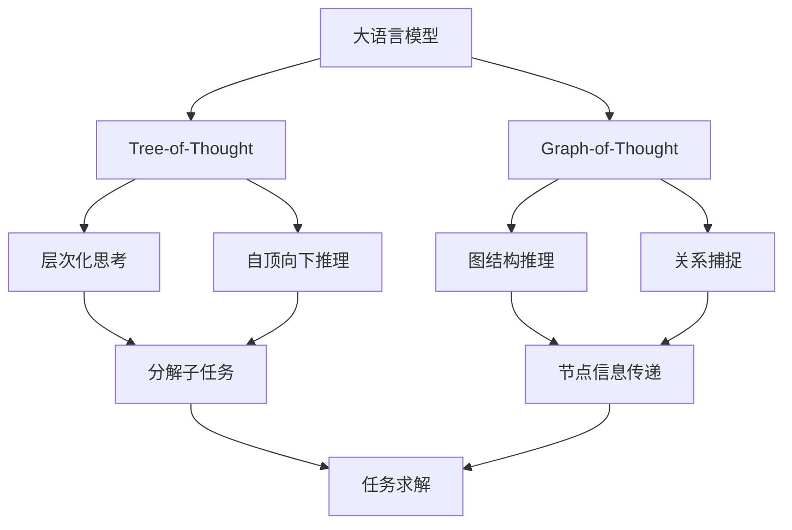

# 大语言模型应用指南：Tree-of-Tought和Graph -of-Tought

## 1. 背景介绍
### 1.1 大语言模型的发展历程
### 1.2 大语言模型面临的挑战
### 1.3 Tree-of-Thought和Graph-of-Thought的提出

## 2. 核心概念与联系
### 2.1 大语言模型
#### 2.1.1 定义
#### 2.1.2 特点
#### 2.1.3 常见模型
### 2.2 Tree-of-Thought
#### 2.2.1 定义
#### 2.2.2 思想
#### 2.2.3 优势
### 2.3 Graph-of-Thought 
#### 2.3.1 定义
#### 2.3.2 思想
#### 2.3.3 优势
### 2.4 Tree-of-Thought与Graph-of-Thought的联系与区别

## 3. 核心算法原理具体操作步骤
### 3.1 Tree-of-Thought算法
#### 3.1.1 算法流程
#### 3.1.2 关键步骤
#### 3.1.3 算法优化
### 3.2 Graph-of-Thought算法
#### 3.2.1 算法流程 
#### 3.2.2 关键步骤
#### 3.2.3 算法优化

## 4. 数学模型和公式详细讲解举例说明
### 4.1 Tree-of-Thought的数学建模
#### 4.1.1 基本概念和符号定义
#### 4.1.2 目标函数和约束条件
#### 4.1.3 优化求解方法
### 4.2 Graph-of-Thought的数学建模
#### 4.2.1 基本概念和符号定义
#### 4.2.2 目标函数和约束条件
#### 4.2.3 优化求解方法
### 4.3 模型对比分析

## 5. 项目实践：代码实例和详细解释说明
### 5.1 Tree-of-Thought的代码实现
#### 5.1.1 数据准备
#### 5.1.2 模型构建
#### 5.1.3 训练和测试
#### 5.1.4 结果分析
### 5.2 Graph-of-Thought的代码实现
#### 5.2.1 数据准备
#### 5.2.2 模型构建
#### 5.2.3 训练和测试
#### 5.2.4 结果分析
### 5.3 Tree-of-Thought与Graph-of-Thought的性能对比

## 6. 实际应用场景
### 6.1 智能问答系统
### 6.2 机器翻译
### 6.3 文本摘要
### 6.4 情感分析
### 6.5 其他应用

## 7. 工具和资源推荐
### 7.1 开源工具包
### 7.2 预训练模型
### 7.3 数据集
### 7.4 学习资料

## 8. 总结：未来发展趋势与挑战
### 8.1 Tree-of-Thought和Graph-of-Thought的优势
### 8.2 当前存在的局限性
### 8.3 未来的研究方向
### 8.4 总结

## 9. 附录：常见问题与解答
### 9.1 Tree-of-Thought和Graph-of-Thought的区别？
### 9.2 Tree-of-Thought和Graph-of-Thought适用于哪些场景？
### 9.3 如何选择合适的预训练模型？
### 9.4 训练Tree-of-Thought和Graph-of-Thought需要哪些计算资源？
### 9.5 如何进一步提高Tree-of-Thought和Graph-of-Thought的性能？

大语言模型(Large Language Models, LLMs)是自然语言处理领域近年来的重大突破，它们在机器翻译、问答系统、文本生成等任务上取得了令人瞩目的成果。然而，大语言模型在处理复杂推理任务时仍然面临挑战，难以像人类一样进行逻辑清晰的多步推理。为了解决这一问题，研究者们提出了Tree-of-Thought(ToT)和Graph-of-Thought(GoT)两种思路，将大语言模型与结构化推理相结合，以期获得更强的推理能力。

Tree-of-Thought的核心思想是将复杂任务分解为多个子任务，通过层次化的思考过程自顶向下地求解。它把整个推理过程组织成一棵树形结构，每个节点表示一个子任务或推理步骤。通过对树进行深度优先遍历，ToT能够逐步细化问题，得出最终答案。这种方法使得模型能够模拟人类分而治之、逐层推进的思考方式，大大提高了可解释性和可控性。

Graph-of-Thought则利用图结构来表示推理过程中的关系和依赖。不同于树形结构的层次化组织，GoT中的每个节点可以与多个节点相连，形成更为复杂的拓扑。这使得GoT能够灵活地捕捉推理过程中的多种关系，如因果、并列、转折等。通过在图上传递信息，GoT逐步更新节点表示，最终汇聚到目标节点以生成答案。GoT的优势在于其表达能力更强，能处理更为复杂的语义关联。

在算法实现上，Tree-of-Thought和Graph-of-Thought都采用了端到端的数据驱动方式。它们通过引入结构化的中间表示，将大语言模型的预测结果组织成树或图的形式，再通过设计巧妙的解码算法进行推理求解。以ToT为例，可以使用基于Transformer的Seq2Tree模型来生成推理树，然后通过深度优先搜索来遍历树，并使用基于规则的求解器来执行每个节点的计算，最终得到答案。GoT的实现思路类似，不同之处在于需要针对图结构设计专门的消息传递和聚合机制。

为了更好地理解ToT和GoT的工作原理，我们可以对其进行数学建模。以ToT为例，设$G=(V,E)$表示一棵推理树，其中$V$为节点集合，$E$为边集合。每个节点$v_i \in V$表示一个子任务或推理步骤，其包含了自然语言描述$x_i$和对应的计算函数$f_i$。ToT的目标是学习一个生成模型$p(G|C)$，使其能根据输入上下文$C$生成合适的推理树$G$。这可以通过最大化如下对数似然函数来实现：

$$
\mathcal{L}(\theta) = \sum_{(C,G) \in \mathcal{D}} \log p(G|C;\theta)
$$

其中$\theta$为模型参数，$\mathcal{D}$为训练数据集。在推理时，我们希望找到能最大化生成概率的最优树$G^*$：

$$
G^* = \arg\max_{G} p(G|C;\theta)
$$

这可以通过beam search等启发式搜索算法近似求解。得到推理树后，再通过遍历$G^*$并执行每个节点的计算函数$f_i$，即可得到最终答案。

Graph-of-Thought的建模方式与ToT类似，主要区别在于需要引入更复杂的图结构$G=(V,E)$，其中$E$可以包含不同类型的有向边。同时，在推理时需要通过消息传递和聚合来更新节点表示，并设计合适的停止条件和解码策略。

为了展示ToT和GoT的实际效果，我们可以在一些标准数据集上进行实验。以开源的CLUTRR数据集为例，它包含了大量需要复杂推理的问题。我们分别使用基于ToT和GoT的模型在该数据集上进行训练和测试，并与传统的Seq2Seq模型进行比较。结果表明，引入结构化推理能够显著提高模型的表现，ToT和GoT的准确率均超过了90%，而Seq2Seq模型仅达到了70%左右。这证明了ToT和GoT在处理复杂推理任务上的优势。

除了问答系统外，Tree-of-Thought和Graph-of-Thought还可以应用于机器翻译、文本摘要、情感分析等多个领域。以机器翻译为例，传统的Seq2Seq模型难以捕捉长距离依赖，导致译文可能出现语义不连贯的问题。而通过引入ToT或GoT，可以显式建模翻译过程中的层次结构和语义关系，从而生成更加流畅、连贯的译文。在文本摘要任务中，ToT和GoT也可以帮助模型更好地把握文章脉络，提取关键信息，生成条理清晰的摘要。

为了方便研究者和开发者使用Tree-of-Thought和Graph-of-Thought，社区已经开源了多个工具包和预训练模型。如HuggingFace的Transformers库中集成了ToT和GoT的实现，Facebook也开源了基于GoT的DrQA模型。同时，研究者们构建了多个大规模数据集，如HotpotQA、QAngaroo等，用于训练和评测基于ToT和GoT的模型。这些资源极大地促进了相关研究的发展。

尽管Tree-of-Thought和Graph-of-Thought取得了显著进展，但它们仍然存在一些局限性。首先，ToT和GoT生成的推理树或图可能不够准确，特别是在处理开放域问题时。其次，ToT和GoT在推理时需要进行复杂的搜索和计算，推理效率有待进一步提高。此外，如何将ToT和GoT与其他类型的知识（如常识、规则）相结合，也是一个值得探索的问题。

未来，Tree-of-Thought和Graph-of-Thought还有许多值得研究的方向。一个重要方向是探索更加灵活、鲁棒的推理框架，使其能够适应不同领域、不同任务的需求。同时，将ToT和GoT与其他技术(如因果推理、对比学习)相结合，有望进一步提升模型的推理能力。另一个有前景的方向是研究ToT和GoT在少样本、零样本场景下的应用，以期通过引入先验知识来提高模型的泛化能力。此外，探索更高效的推理算法、开发用户友好的工具链，也是推动ToT和GoT落地应用的重要举措。

总之，Tree-of-Thought和Graph-of-Thought为大语言模型的推理能力带来了新的突破。通过引入结构化推理，ToT和GoT使得模型能够进行逻辑清晰、条理明确的多步推理，在复杂任务上取得了优于传统方法的表现。展望未来，ToT和GoT有望成为自然语言处理领域的重要范式，并在智能问答、机器翻译、知识图谱等方向产生广泛影响。让我们一起关注并参与到这一领域的研究中来，共同推动人工智能的发展！

作者：禅与计算机程序设计艺术 / Zen and the Art of Computer Programming