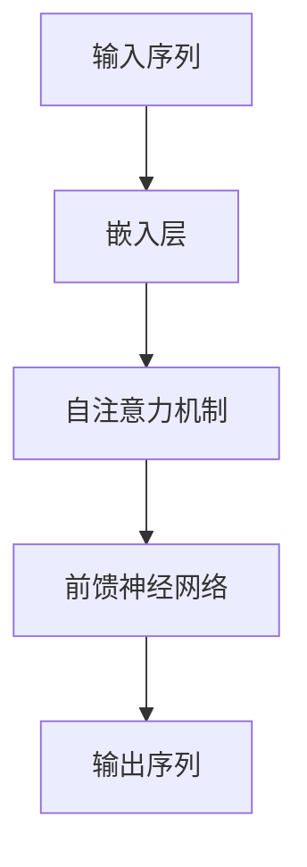
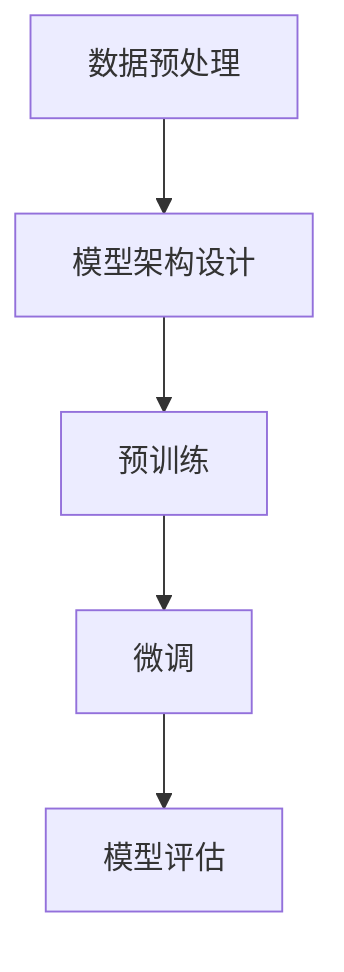

# 大语言模型应用指南：什么是大语言模型

## 1.背景介绍

大语言模型（Large Language Model, LLM）是近年来人工智能领域的一个重要突破。它们通过大量的文本数据进行训练，能够生成高质量的自然语言文本，完成各种复杂的语言任务。大语言模型的出现不仅改变了自然语言处理（NLP）的研究方向，也在实际应用中展现了巨大的潜力。

### 1.1 大语言模型的起源

大语言模型的概念并不是突然出现的，而是自然语言处理技术不断发展的结果。从最早的基于规则的系统，到统计语言模型，再到神经网络模型，NLP技术经历了多次变革。大语言模型的出现可以追溯到深度学习技术的普及，特别是Transformer架构的提出。

### 1.2 发展历程

大语言模型的发展可以分为几个重要阶段：

- **早期阶段**：基于规则和统计的方法，如n-gram模型。
- **神经网络阶段**：引入RNN和LSTM等神经网络模型。
- **Transformer阶段**：Transformer架构的提出，使得大规模训练成为可能。
- **预训练和微调阶段**：BERT、GPT等模型的出现，预训练和微调成为主流方法。

### 1.3 重要性和影响

大语言模型在多个领域展现了其强大的能力，包括但不限于：

- **文本生成**：生成高质量的文章、对话等。
- **机器翻译**：提高翻译的准确性和流畅性。
- **信息检索**：改进搜索引擎的性能。
- **问答系统**：提供更准确和自然的回答。

## 2.核心概念与联系

理解大语言模型需要掌握一些核心概念和它们之间的联系。

### 2.1 语言模型

语言模型是指能够预测一个句子中下一个词的概率分布的模型。传统的语言模型包括n-gram模型和基于统计的方法。

### 2.2 神经网络

神经网络是大语言模型的基础。特别是深度神经网络（DNN）和递归神经网络（RNN）在早期的语言模型中起到了重要作用。

### 2.3 Transformer架构

Transformer是大语言模型的核心架构。它通过自注意力机制（Self-Attention）和多头注意力机制（Multi-Head Attention）实现了高效的并行计算。



### 2.4 预训练和微调

预训练和微调是大语言模型训练的两个重要阶段。预训练阶段，模型在大规模无标签数据上进行训练；微调阶段，模型在特定任务的数据上进行训练。

### 2.5 GPT和BERT

GPT（Generative Pre-trained Transformer）和BERT（Bidirectional Encoder Representations from Transformers）是两种典型的大语言模型。GPT主要用于生成任务，而BERT主要用于理解任务。

## 3.核心算法原理具体操作步骤

大语言模型的核心算法主要包括以下几个步骤：

### 3.1 数据预处理

数据预处理是训练大语言模型的第一步。包括文本清洗、分词、去停用词等。

### 3.2 模型架构设计

选择合适的模型架构，如Transformer，并设计相应的层数、隐藏单元数等。

### 3.3 预训练

在大规模无标签数据上进行预训练。常用的方法包括自回归模型（如GPT）和自编码模型（如BERT）。

### 3.4 微调

在特定任务的数据上进行微调。通过调整模型参数，使其在特定任务上表现更好。

### 3.5 模型评估

使用标准的评估指标，如准确率、F1分数等，对模型进行评估。



## 4.数学模型和公式详细讲解举例说明

大语言模型的数学基础主要包括概率论、线性代数和微积分。以下是一些关键的数学公式和概念。

### 4.1 语言模型的概率公式

语言模型的目标是计算一个句子的概率 $P(w_1, w_2, ..., w_n)$。根据链式法则，这个概率可以分解为：

$$
P(w_1, w_2, ..., w_n) = P(w_1) \cdot P(w_2|w_1) \cdot P(w_3|w_1, w_2) \cdot ... \cdot P(w_n|w_1, w_2, ..., w_{n-1})
$$

### 4.2 自注意力机制

自注意力机制的核心是计算输入序列中每个词对其他词的注意力权重。具体公式如下：

$$
Attention(Q, K, V) = softmax\left(\frac{QK^T}{\sqrt{d_k}}\right)V
$$

其中，$Q$、$K$、$V$分别是查询矩阵、键矩阵和值矩阵，$d_k$是键矩阵的维度。

### 4.3 损失函数

大语言模型的训练目标是最小化损失函数。常用的损失函数是交叉熵损失：

$$
L = -\sum_{i=1}^{N} y_i \log(\hat{y}_i)
$$

其中，$y_i$是实际标签，$\hat{y}_i$是预测概率。

## 5.项目实践：代码实例和详细解释说明

为了更好地理解大语言模型的实际应用，我们将通过一个简单的代码实例来展示如何训练和使用一个大语言模型。

### 5.1 数据准备

首先，我们需要准备训练数据。这里我们使用一个简单的文本数据集。

```python
import torch
from transformers import GPT2Tokenizer, GPT2LMHeadModel

# 加载预训练的GPT-2模型和分词器
tokenizer = GPT2Tokenizer.from_pretrained('gpt2')
model = GPT2LMHeadModel.from_pretrained('gpt2')

# 准备训练数据
text = "这是一个简单的文本数据集。"
inputs = tokenizer(text, return_tensors='pt')
```

### 5.2 模型训练

接下来，我们进行模型训练。这里我们使用简单的训练循环。

```python
# 定义优化器
optimizer = torch.optim.Adam(model.parameters(), lr=1e-5)

# 训练循环
for epoch in range(10):
    outputs = model(**inputs, labels=inputs['input_ids'])
    loss = outputs.loss
    loss.backward()
    optimizer.step()
    optimizer.zero_grad()
    print(f'Epoch {epoch}, Loss: {loss.item()}')
```

### 5.3 模型评估

最后，我们对模型进行评估。

```python
# 生成文本
input_text = "这是一个"
input_ids = tokenizer.encode(input_text, return_tensors='pt')
output = model.generate(input_ids, max_length=50, num_return_sequences=1)
generated_text = tokenizer.decode(output[0], skip_special_tokens=True)
print(generated_text)
```

## 6.实际应用场景

大语言模型在多个实际应用场景中展现了其强大的能力。

### 6.1 文本生成

大语言模型可以生成高质量的文本，用于写作辅助、新闻生成等。

### 6.2 机器翻译

通过大语言模型，可以实现高准确性的机器翻译，特别是在低资源语言对的翻译中表现尤为突出。

### 6.3 问答系统

大语言模型可以用于构建智能问答系统，提供更自然和准确的回答。

### 6.4 情感分析

通过大语言模型，可以对文本进行情感分析，应用于市场分析、用户反馈等领域。

## 7.工具和资源推荐

为了更好地使用和理解大语言模型，以下是一些推荐的工具和资源。

### 7.1 工具

- **Transformers库**：由Hugging Face提供的开源库，支持多种大语言模型。
- **TensorFlow和PyTorch**：两大主流的深度学习框架，支持大语言模型的训练和部署。

### 7.2 资源

- **论文**：阅读相关的学术论文，如《Attention is All You Need》、《BERT: Pre-training of Deep Bidirectional Transformers for Language Understanding》等。
- **教程**：Hugging Face和其他社区提供的在线教程和文档。

## 8.总结：未来发展趋势与挑战

大语言模型在未来有着广阔的发展前景，但也面临一些挑战。

### 8.1 发展趋势

- **模型规模**：模型规模将继续扩大，带来更强的能力。
- **多模态融合**：将语言模型与图像、音频等多模态数据结合，提升模型的综合能力。
- **个性化定制**：根据用户需求，定制化训练模型，提供更个性化的服务。

### 8.2 挑战

- **计算资源**：训练大语言模型需要大量的计算资源，成本高昂。
- **数据隐私**：大规模数据的使用带来了数据隐私和安全的问题。
- **伦理问题**：模型生成的内容可能存在偏见和不准确，需要进行伦理审查。

## 9.附录：常见问题与解答

### 9.1 大语言模型的训练需要多长时间？

训练时间取决于模型的规模和计算资源。一般来说，训练一个大型模型可能需要数周甚至数月的时间。

### 9.2 如何选择合适的大语言模型？

选择模型时需要考虑任务的具体需求、计算资源和数据量。对于生成任务，可以选择GPT；对于理解任务，可以选择BERT。

### 9.3 大语言模型是否可以用于实时应用？

大语言模型的推理速度较慢，但通过优化和量化技术，可以在一定程度上实现实时应用。

### 9.4 如何处理大语言模型的偏见问题？

可以通过多样化训练数据、引入公平性约束等方法来减轻模型的偏见问题。

### 9.5 大语言模型的未来发展方向是什么？

未来，大语言模型将朝着更大规模、更高性能、更低成本和更高伦理标准的方向发展。

---

作者：禅与计算机程序设计艺术 / Zen and the Art of Computer Programming