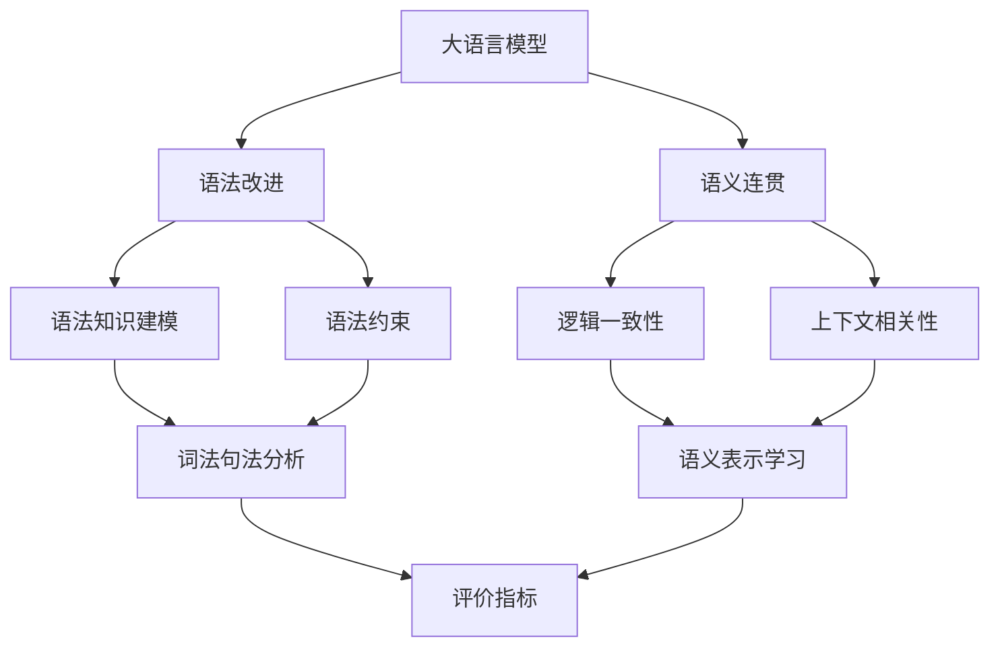

# 大语言模型应用指南：使用更清晰的语法

## 1.背景介绍

大语言模型(Large Language Models, LLMs)是自然语言处理(NLP)领域近年来取得突破性进展的关键技术之一。它们是在海量文本数据上训练的深度神经网络模型,能够学习和理解自然语言,并生成连贯、流畅的文本。代表性的大语言模型包括GPT系列、BERT、XLNet等。

随着模型规模和训练数据的不断增长,大语言模型展现出了惊人的能力,在机器翻译、文本摘要、问答系统、对话生成等多个NLP任务上取得了显著的性能提升。同时,它们也为NLP技术在更广泛领域的应用带来了新的机遇。

然而,大语言模型在实际应用中仍面临诸多挑战。其中一个重要问题是,尽管模型生成的文本通顺流畅,但有时会出现语法错误、逻辑混乱等问题,影响了应用效果。因此,如何提高大语言模型生成文本的语法正确性和逻辑清晰度,成为了业界关注的热点问题。

本文将围绕这一主题,深入探讨大语言模型的语法改进方法。我们将从核心概念出发,阐述语法改进的重要性和面临的挑战,介绍相关的算法原理和实践案例,并展望未来的发展趋势。通过本文,读者可以全面了解大语言模型语法改进的前沿进展,掌握实用的优化技巧,为开发高质量的NLP应用提供参考。

## 2.核心概念与联系

要理解大语言模型的语法改进,首先需要明确几个核心概念:

### 2.1 大语言模型(Large Language Models)

大语言模型是基于深度学习的自然语言处理模型,通过在大规模文本数据上进行预训练,学习语言的统计规律和潜在语义。它们通常采用Transformer等神经网络架构,具有海量的参数和强大的表征能力。预训练后的模型可以应用于下游的各种NLP任务,并通过微调进一步提升性能。

### 2.2 语法(Grammar)

语法是语言的规则系统,规定了词语和句子的组合方式。它包括词法、句法等多个层面,涉及词性、句型、语态、时态等诸多要素。语法的正确性是自然语言表达的基础,对于理解和生成都至关重要。

### 2.3 语义(Semantics)  

语义指语言表达的意义。相比语法的结构规则,语义更关注内容的逻辑、连贯性和合理性。清晰、连贯的语义是高质量文本的重要特征。

### 2.4 评价指标(Evaluation Metrics)

评价指标用于衡量语言模型生成文本的质量。常见的指标包括语言模型困惑度(Perplexity)、BLEU、ROUGE等。针对语法改进,则需要设计专门的评价指标,如语法错误率、可读性评分等。

大语言模型的语法改进需要在语法和语义两个层面同时发力。一方面,要加强对语法知识的建模和约束,确保生成符合语法规则的句子;另一方面,也要兼顾语义的连贯性,避免过度追求语法而损害了语义表达。评价指标的设计和应用,可以客观衡量改进效果,指导算法优化。

下图展示了这些核心概念之间的关联:



## 3.核心算法原理具体操作步骤

大语言模型的语法改进可以分为两大类方法:基于规则的方法和基于学习的方法。

### 3.1 基于规则的语法改进

基于规则的方法利用预定义的语法规则和模板,对模型生成的文本进行修正。具体步骤如下:

1. 定义语法规则库,包括词法、句法等多个层面的规则。
2. 对生成的文本进行词法和句法分析,识别出语法成分。
3. 利用规则库检查语法错误,如单复数不一致、主谓不一致等。
4. 根据错误类型,利用预定义的修正模板进行改写。
5. 迭代执行步骤2-4,直到无法继续修正。

基于规则的方法实现简单,可解释性强,但泛化能力有限,难以覆盖所有的语法现象。

### 3.2 基于学习的语法改进

基于学习的方法通过构建额外的语法改进模型,对原始模型的输出进行修正。常见的思路包括:

1. 语法纠错模型:训练一个序列到序列模型,将有语法错误的句子映射为修正后的句子。
2. 语法感知的文本生成:在原始模型的生成过程中,引入语法相关的目标函数,如语法树概率、句法距离等,引导模型生成符合语法的文本。
3. 迭代修正:交替使用原始模型和语法改进模型,迭代生成和修正,不断提升文本质量。

以语法纠错模型为例,主要步骤如下:

1. 准备训练数据,包括平行的含错句子和修正句子。
2. 选择合适的序列到序列模型,如Transformer、BART等。
3. 在训练数据上进行微调,学习错误到修正的映射。
4. 利用训练好的模型对原始模型的输出进行修正。

基于学习的方法可以自动学习语法知识,具有更好的泛化能力。但它们需要额外的训练数据和计算资源,且有可能引入新的错误。

## 4.数学模型和公式详细讲解举例说明

大语言模型的语法改进可以用数学模型来形式化描述。以语法纠错模型为例,我们可以将其定义为一个条件概率分布:

$$P(y|x;\theta)$$

其中,$x$表示含有语法错误的源句子,$y$表示修正后的目标句子,$\theta$为模型参数。模型的目标是学习这个条件概率分布,即给定源句子的情况下,生成正确的目标句子的概率。

在训练过程中,我们希望最大化正确修正的概率。因此,可以定义如下的损失函数:

$$L(\theta)=-\sum_{(x,y)\in D}\log P(y|x;\theta)$$

其中,$D$为训练数据集,包含多对源句子和目标句子。模型通过最小化该损失函数来学习最优的参数$\theta$。

以Transformer为例,其中的关键结构是自注意力机制(Self-Attention)。对于输入序列$x=(x_1,\dots,x_n)$,自注意力的计算过程如下:

$$\mathrm{Attention}(Q,K,V)=\mathrm{softmax}(\frac{QK^T}{\sqrt{d_k}})V$$

其中,$Q,K,V$分别为查询(Query)、键(Key)、值(Value)矩阵,通过输入序列的线性变换得到:

$$Q=XW_Q, K=XW_K, V=XW_V$$

$W_Q,W_K,W_V$为可学习的参数矩阵,$d_k$为键向量的维度。

在解码阶段,模型根据编码器的输出和已生成的目标序列,预测下一个目标词的概率:

$$P(y_t|y_{<t},x)=\mathrm{softmax}(W_o h_t)$$

其中,$h_t$为解码器第$t$步的隐状态,$W_o$为输出层的参数矩阵。

通过这些公式,我们可以看到,语法纠错模型本质上是在学习源句子到目标句子的映射关系,并利用自注意力机制捕捉句子中的长距离依赖,从而实现对语法错误的识别和修正。

## 5.项目实践：代码实例和详细解释说明

下面我们通过一个简单的PyTorch代码实例,来说明如何实现基于Transformer的语法纠错模型。

```python
import torch
import torch.nn as nn

class TransformerCorrector(nn.Module):
    def __init__(self, vocab_size, d_model, nhead, num_layers):
        super(TransformerCorrector, self).__init__()
        
        self.embedding = nn.Embedding(vocab_size, d_model)
        self.transformer = nn.Transformer(d_model, nhead, num_layers)
        self.fc = nn.Linear(d_model, vocab_size)
        
    def forward(self, src, tgt):
        src_mask = self.transformer.generate_square_subsequent_mask(src.size(0)).to(src.device)
        tgt_mask = self.transformer.generate_square_subsequent_mask(tgt.size(0)).to(tgt.device)
        
        src_embed = self.embedding(src)
        tgt_embed = self.embedding(tgt)
        
        out = self.transformer(src_embed, tgt_embed, src_mask, tgt_mask)
        out = self.fc(out)
        
        return out
```

这个代码定义了一个名为`TransformerCorrector`的PyTorch模型类,实现了基于Transformer的语法纠错功能。让我们详细解释一下其中的关键部分:

- `__init__`方法定义了模型的架构。它包含三个主要组件:
  - `self.embedding`:输入词嵌入层,将词表中的每个词映射为d_model维的稠密向量。
  - `self.transformer`:Transformer模型,用于对源句子和目标句子进行编码和解码。
  - `self.fc`:全连接输出层,将Transformer的输出转换为词表大小的概率分布。

- `forward`方法定义了模型的前向传播过程。它接受两个输入:
  - `src`:源句子的词表索引序列。
  - `tgt`:目标句子的词表索引序列。

  在前向传播中,我们首先为源句子和目标句子生成掩码矩阵,用于控制Transformer的注意力计算。然后,将源句子和目标句子通过嵌入层映射为稠密向量。接着,将嵌入向量输入到Transformer模型中进行编码和解码。最后,将Transformer的输出通过全连接层转换为词表上的概率分布。

在实际使用时,我们需要准备好训练数据,包括含有语法错误的源句子和对应的修正句子。然后,通过定义损失函数和优化器,利用反向传播算法训练模型的参数。在推理阶段,我们可以将待纠错的句子输入到训练好的模型中,获得修正后的句子。

以上就是一个简单的语法纠错模型的PyTorch实现。实际项目中,我们可以在此基础上进行扩展和优化,如引入更大规模的预训练模型、设计更细粒度的语法特征等,以进一步提升模型的性能。

## 6.实际应用场景

大语言模型的语法改进技术可以应用于多个实际场景,包括:

### 6.1 写作辅助工具

语法改进技术可以集成到写作辅助工具中,帮助用户检查和修正语法错误。例如,常见的Microsoft Word、Grammarly等写作软件都内置了语法纠错功能,可以实时标记出错误并提供修改建议,大大提高了用户的写作效率和质量。

### 6.2 语言学习平台

对于第二语言学习者来说,语法是一大难点。将语法改进技术应用于语言学习平台,可以为学习者提供个性化的语法反馈和纠错服务。例如,在写作练习中,平台可以自动诊断学习者的语法错误,并给出针对性的修改意见,帮助学习者更好地掌握语言规则。

### 6.3 机器翻译后编辑

机器翻译技术虽然取得了长足进步,但翻译结果仍然可能存在语法错误。语法改进技术可以用于机器翻译的后编辑阶段,对翻译结果进行自动纠错和优化,提高翻译的流畅度和可读性。这对于大规模的翻译任务尤为重要,可以显著降低人工编辑的成本。

### 6.4 智能客服系统

在智能客服系统中,机器需要自动生成回复来与用户交互。语法改进技术可以确保生成的回复语法正确、表达清晰,提升用户体验。同时,它还可以帮助规范