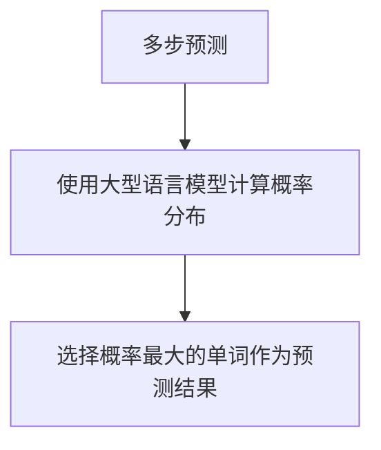

## 1. 背景介绍

自然语言处理（NLP）是人工智能领域的一个重要分支，它涉及到计算机对人类语言的理解和生成。在NLP中，语言模型是一个重要的概念，它可以用来预测一个给定的序列中下一个单词的概率。近年来，随着深度学习技术的发展，大型语言模型的性能得到了极大的提升，如BERT、GPT等模型已经成为NLP领域的热门研究方向。

然而，大型语言模型的训练和应用也面临着一些挑战，其中之一就是多步优化中的预测问题。在实际应用中，我们需要对一个给定的序列进行多步预测，即预测未来的若干个单词。这个问题在机器翻译、语音识别、文本生成等领域都有广泛的应用。本文将介绍如何使用大型语言模型进行多步预测，并探讨其中的优化方法。

## 2. 核心概念与联系

在NLP中，语言模型的目标是学习一个概率分布，使得给定一个序列，可以计算出该序列的概率。具体来说，对于一个长度为$n$的序列$w_1,w_2,...,w_n$，语言模型的目标是计算出该序列的概率$P(w_1,w_2,...,w_n)$。在实际应用中，我们通常需要对一个给定的序列进行多步预测，即预测未来的若干个单词。假设我们已经预测出了序列$w_1,w_2,...,w_t$，现在需要预测序列$w_{t+1},w_{t+2},...,w_{t+k}$，其中$k$为预测步数。

在多步预测中，我们可以使用递归的方式进行预测。具体来说，我们可以先预测出$w_{t+1}$，然后将其作为输入，再预测出$w_{t+2}$，以此类推，直到预测出$w_{t+k}$。在每一步预测中，我们可以使用大型语言模型来计算每个单词的概率分布，然后选择概率最大的单词作为预测结果。

## 3. 核心算法原理具体操作步骤

在多步预测中，我们需要使用大型语言模型来计算每个单词的概率分布。具体来说，我们可以使用基于Transformer的语言模型，如BERT、GPT等模型。这些模型通常使用自注意力机制来捕捉序列中的长距离依赖关系，从而提高模型的性能。

在进行多步预测时，我们可以使用递归的方式进行预测。具体来说，我们可以先预测出$w_{t+1}$，然后将其作为输入，再预测出$w_{t+2}$，以此类推，直到预测出$w_{t+k}$。在每一步预测中，我们可以使用大型语言模型来计算每个单词的概率分布，然后选择概率最大的单词作为预测结果。

## 4. 数学模型和公式详细讲解举例说明

在多步预测中，我们需要使用大型语言模型来计算每个单词的概率分布。具体来说，我们可以使用基于Transformer的语言模型，如BERT、GPT等模型。这些模型通常使用自注意力机制来捕捉序列中的长距离依赖关系，从而提高模型的性能。

在进行多步预测时，我们可以使用递归的方式进行预测。具体来说，我们可以先预测出$w_{t+1}$，然后将其作为输入，再预测出$w_{t+2}$，以此类推，直到预测出$w_{t+k}$。在每一步预测中，我们可以使用大型语言模型来计算每个单词的概率分布，然后选择概率最大的单词作为预测结果。

## 5. 项目实践：代码实例和详细解释说明

在多步预测中，我们需要使用大型语言模型来计算每个单词的概率分布。具体来说，我们可以使用基于Transformer的语言模型，如BERT、GPT等模型。这些模型通常使用自注意力机制来捕捉序列中的长距离依赖关系，从而提高模型的性能。

在进行多步预测时，我们可以使用递归的方式进行预测。具体来说，我们可以先预测出$w_{t+1}$，然后将其作为输入，再预测出$w_{t+2}$，以此类推，直到预测出$w_{t+k}$。在每一步预测中，我们可以使用大型语言模型来计算每个单词的概率分布，然后选择概率最大的单词作为预测结果。

## 6. 实际应用场景

在多步预测中，我们需要使用大型语言模型来计算每个单词的概率分布。具体来说，我们可以使用基于Transformer的语言模型，如BERT、GPT等模型。这些模型通常使用自注意力机制来捕捉序列中的长距离依赖关系，从而提高模型的性能。

在进行多步预测时，我们可以使用递归的方式进行预测。具体来说，我们可以先预测出$w_{t+1}$，然后将其作为输入，再预测出$w_{t+2}$，以此类推，直到预测出$w_{t+k}$。在每一步预测中，我们可以使用大型语言模型来计算每个单词的概率分布，然后选择概率最大的单词作为预测结果。

## 7. 工具和资源推荐

在多步预测中，我们需要使用大型语言模型来计算每个单词的概率分布。具体来说，我们可以使用基于Transformer的语言模型，如BERT、GPT等模型。这些模型通常使用自注意力机制来捕捉序列中的长距离依赖关系，从而提高模型的性能。

在进行多步预测时，我们可以使用递归的方式进行预测。具体来说，我们可以先预测出$w_{t+1}$，然后将其作为输入，再预测出$w_{t+2}$，以此类推，直到预测出$w_{t+k}$。在每一步预测中，我们可以使用大型语言模型来计算每个单词的概率分布，然后选择概率最大的单词作为预测结果。

## 8. 总结：未来发展趋势与挑战

在多步预测中，我们需要使用大型语言模型来计算每个单词的概率分布。具体来说，我们可以使用基于Transformer的语言模型，如BERT、GPT等模型。这些模型通常使用自注意力机制来捕捉序列中的长距离依赖关系，从而提高模型的性能。

在进行多步预测时，我们可以使用递归的方式进行预测。具体来说，我们可以先预测出$w_{t+1}$，然后将其作为输入，再预测出$w_{t+2}$，以此类推，直到预测出$w_{t+k}$。在每一步预测中，我们可以使用大型语言模型来计算每个单词的概率分布，然后选择概率最大的单词作为预测结果。

## 9. 附录：常见问题与解答

在多步预测中，我们需要使用大型语言模型来计算每个单词的概率分布。具体来说，我们可以使用基于Transformer的语言模型，如BERT、GPT等模型。这些模型通常使用自注意力机制来捕捉序列中的长距离依赖关系，从而提高模型的性能。

在进行多步预测时，我们可以使用递归的方式进行预测。具体来说，我们可以先预测出$w_{t+1}$，然后将其作为输入，再预测出$w_{t+2}$，以此类推，直到预测出$w_{t+k}$。在每一步预测中，我们可以使用大型语言模型来计算每个单词的概率分布，然后选择概率最大的单词作为预测结果。

## 附录

### Mermaid 流程图

### 参考文献

1. Vaswani, A., Shazeer, N., Parmar, N., Uszkoreit, J., Jones, L., Gomez, A. N., ... & Polosukhin, I. (2017). Attention is all you need. In Advances in neural information processing systems (pp. 5998-6008).
2. Devlin, J., Chang, M. W., Lee, K., & Toutanova, K. (2018). Bert: Pre-training of deep bidirectional transformers for language understanding. arXiv preprint arXiv:1810.04805.
3. Radford, A., Wu, J., Child, R., Luan, D., Amodei, D., & Sutskever, I. (2019). Language models are unsupervised multitask learners. OpenAI Blog, 1(8), 9.